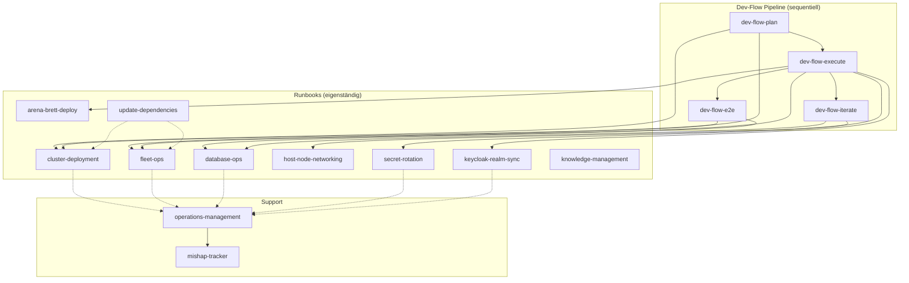

# Skills Overview

11 core project-local skills (plus dev-flow pipeline) grouped by domain. Each skill has its own `SKILL.md` with full runbook details. Invoke any skill by its name.

> **Für Agenten:** Schnelle Routing-Karten (Intention → Weg → Tier → Guardrails) unter `docs/agent-guide/maps/` — `goals-map.md`, `tools-map.md`, `danger-map.md`. Generiert aus `docs/agent-guide/registry/`.

---

## Development Flow (sequential pipeline)

| Skill | When to use |
|---|---|
| `dev-flow-plan` | **Entry point** for all repo changes — determines feature/fix/chore path, runs brainstorming, creates spec + plan, commits to branch. Chores finish inline. |
| `dev-flow-execute` | After `dev-flow-plan` has pushed a staged plan — implements, verifies, opens PR, merges, deploys. |
| `dev-flow-iterate` | Deploys a surface, browses with Playwright MCP, tails logs, applies fixes, and loops until dev cluster is clean (used standalone or within `dev-flow-execute`). |
| `dev-flow-e2e` | After `dev-flow-execute` has merged and deployed — writes + runs Playwright E2E tests against live environment. |

---

## Infrastructure & Networking

| Skill | When to use |
|---|---|
| `host-node-networking` | Host server provisioning (Hetzner, cloud-init, Rescue Mode resets), WireGuard mesh network topology ("netplan"), host UFW firewall ports, LiveKit WebRTC networking, and WSL OpenClaw local gateway setup. |
| `cluster-deployment` | Stand up a brand-new Kubernetes environment, deploy resources, diagnose cluster degraded state (gap analysis), or operate the dev.mentolder.de stack. |
| `fleet-ops` | Cross-cluster fan-out operations: `task feature:*`, schema changes, Keycloak sync, and the **push-based deploy model** (no GitOps reconciler) across both brands on the fleet cluster. |

---

## Secret & Auth Management

| Skill | When to use |
|---|---|
| `secret-rotation` | Rotate DB passwords, API keys, SealedSecrets keypair (post-reset), Claude Code tokens, or service credentials across both brands on the fleet cluster. |
| `keycloak-realm-sync` | Reconcile Keycloak realm JSON → push OIDC client changes, group mappings, mappers, SSO login fixes. |

---

## Service-Specific Operations

| Skill | When to use |
|---|---|
| `arena-brett-deploy` | Build, push, and deploy arena-server (korczewski brand on fleet only) or brett (both brands on the fleet cluster). Covers proto-drift copy step. |

---

## Knowledge & Database Operations

| Skill | When to use |
|---|---|
| `knowledge-management` | Manage knowledge base ingestion (PDF/EPUB books), classifier LLMs, general indexing (`prs`, `markdown`, `bugs`), web crawling, and vector space isolation rules. |
| `database-ops` | PostgreSQL schema migrations, default permission grants, automated backups audit, and safe restore verification. |

---

## Operations & Life-Cycle Management

| Skill | When to use |
|---|---|
| `operations-management` | Production incident response triage (scope, diagnose, rollback/fix), DB ticket management (triage, AI-fixes, routing), repository hygiene (pruning stale worktrees/branches), PR reviews, and mishap tracking. |
| `update-dependencies` | Update workspace packages, fix deprecation warnings, and handle security audits/Major version bumps across all directories. |

---

## Skill-Beziehungen & Abfolge

**Legende:**
- Durchgezogene Pfeile: explizite Aufrufe / Delegation
- Gestrichelte Pfeile: typische Folge-Operation (z.B. Mishap-Report nach Runbook)

**Typische Workflows:**

| Start | Verlauf | Ergebnis |
|-------|---------|----------|
| Feature entwickeln | `dev-flow-plan` → `dev-flow-execute` → `dev-flow-e2e` | Gemergetes + getestetes Feature |
| Cluster aufsetzen | `cluster-deployment` → `fleet-ops` → `secret-rotation` | Produktions-Cluster |
| DB-Migration | `database-ops` → `dev-flow-execute` (Schema-Change) | Gemergte Migration |
| Secret rotieren | `secret-rotation` → `fleet-ops` (Deploy) | Rotierte Secrets |
| Abhängigkeiten updaten | `update-dependencies` → `cluster-deployment` (Test-Deploy) | Aktualisierte Packages |
