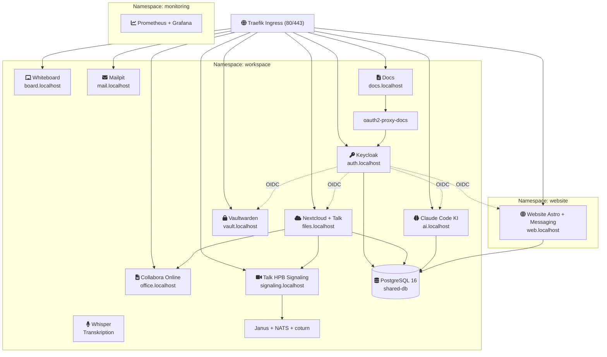

# CLAUDE.md

This file provides guidance to Claude Code (claude.ai/code) when working with code in this repository.

## Project Overview

**Workspace MVP** -- a Kubernetes-based self-hosted collaboration platform for small teams (bachelor thesis). Integrates a custom messaging system (chat, built into the Astro website), Nextcloud (files + video via Talk), Keycloak (SSO/OIDC), Collabora (office suite), Claude Code (AI), Invoice Ninja (billing), Vaultwarden (passwords), and supporting services. All data stays on-premises (DSGVO/GDPR by design).

Prerequisites: Docker, k3d, kubectl, `task` (go-task).

## Common Commands

### Cluster & Deployment
```bash
task cluster:create              # Create k3d cluster (k3d-config.yaml)
task cluster:delete              # Destroy cluster
task cluster:start               # Start stopped cluster
task cluster:stop                # Stop cluster (preserves state)
task cluster:status              # Show cluster status, nodes, resource usage
task workspace:up                # Full automated setup (Cluster + MVP + MCP + Monitoring + Billing)
task workspace:deploy            # Deploy all workspace services (Kustomize)
task workspace:validate          # Dry-run manifest validation
task workspace:teardown          # Remove all services
task workspace:prod:deploy       # Deploy to k3s-production
```

### Daily Operations
```bash
task workspace:status            # Show pod status, services, ingress, PVCs
task workspace:logs -- <svc>     # Tail logs (e.g., keycloak, mattermost)
task workspace:restart -- <svc>  # Restart a specific service
task workspace:psql -- <db>      # Open psql shell to shared-db
task workspace:port-forward      # Forward shared-db to localhost:5432
```

### Post-Deploy Setup
```bash
task workspace:post-setup        # Enable Nextcloud apps (calendar, contacts, OIDC, Collabora)
task workspace:stripe-setup      # Register Stripe as payment gateway in Invoice Ninja
task workspace:vaultwarden:seed  # Seed Vaultwarden with production secret templates
task workspace:monitoring        # Install Prometheus + Grafana + DSGVO dashboard (NFA-02)
task workspace:dsgvo-check       # Run DSGVO compliance verification (NFA-01)
task workspace:claude-code:setup    # Register MCP servers in Claude Code database
```

### Claude Code MCP Servers
```bash
task mcp:deploy                  # Deploy all MCP pods (core + apps + auth)
task mcp:status                  # Show MCP pod and container status
task mcp:logs -- <pod>/<ctr>     # Tail MCP container logs
task mcp:restart -- core|apps|auth  # Restart an MCP pod
task mcp:select                  # Interactive MCP server selector
task mcp:set-github-pat -- <tok> # Update GitHub PAT in claude-code-secrets
```

### Website (Astro + Svelte)
```bash
task website:deploy              # Build, import, and deploy website
task website:dev                 # Astro dev server (hot-reload)
task website:redeploy            # Rebuild and restart
task website:status              # Show website deployment status
task website:teardown            # Remove website namespace
```

### ArgoCD — GitOps Multi-Cluster Federation
```bash
task argocd:setup                # Full setup: install → login → register clusters → apply apps (run once)
task argocd:install              # Install ArgoCD on hetzner hub cluster
task argocd:password             # Print initial admin password
task argocd:ui                   # Port-forward ArgoCD UI to http://localhost:8090
task argocd:login                # Log in with argocd CLI
task argocd:cluster:register     # Register hetzner + korczewski clusters with workspace labels
task argocd:apps:apply           # Apply AppProject and ApplicationSet
task argocd:status               # Show sync/health status of all apps across all clusters
task argocd:sync -- <app>        # Manually trigger sync (e.g. workspace-hetzner)
task argocd:diff -- <app>        # Show diff between git and live state
```
ArgoCD files: `argocd/install/` (CMP sidecar, Ingress), `argocd/project.yaml`, `argocd/applicationset.yaml`.
Cluster config lives as annotations on ArgoCD cluster Secrets — set via `task argocd:cluster:register`.

### Optional Services
```bash
task whisper:deploy              # Deploy faster-whisper transcription service
```

### TLS & DNS (Production)
```bash
task cert:install                # Install cert-manager + lego DNS-01 webhook
task cert:secret -- <key>        # Store ipv64 API key as Secret
task cert:status                 # Show wildcard cert and ClusterIssuer status
task ddns:deploy -- <key>        # Deploy DDNS updater CronJob (dynamic IP)
task ddns:trigger                # Manually trigger DDNS update
task ddns:status                 # Show DDNS status and last known IP
task ddns:teardown               # Remove DDNS updater
```

### Configuration
```bash
task domain:set -- <domain>      # Change production domain in .env
task brand:set -- <name>         # Change branding name in .env
task email:set -- <email>        # Change contact email in .env
task config:show                 # Show current config variables
```

### Testing
```bash
./tests/runner.sh local              # All tests against k3d
./tests/runner.sh local <TEST-ID>    # Single test (e.g., SA-08, FA-03)
./tests/runner.sh local --verbose    # Verbose output
./tests/runner.sh report             # Generate Markdown report
```

Test IDs: `FA-01`--`FA-25` (functional), `SA-01`--`SA-10` (security), `NFA-01`--`NFA-09` (non-functional), `AK-03`, `AK-04` (acceptance).

## Architecture

All services run as Kubernetes Deployments in the `workspace` namespace, fronted by Traefik (built-in k3s ingress). There is no docker-compose.



### Key components
- **`k3d/`** -- All base Kubernetes manifests (Kustomize). This is the only deployment path.
- **`prod/`** -- Production overlays/patches (TLS, resource limits, replicas, DDNS).
- **`deploy/`** -- Alternative Skaffold-based deploy path (hot-reload for dev iteration). Contains `mcp/` for MCP server overlays.
- **`claude-code/`** -- Claude Code configuration and system prompt.
- **`scripts/`** -- Bash utility scripts for migration, user import, DSGVO checks, MCP registration, Stripe setup, etc.
- **`tests/`** -- Bash + Playwright test framework. `runner.sh` orchestrates all test categories.
- **`website/`** -- Astro + Svelte website.
- **`docs-site/`** -- Docsify index.html for the docs service.
- **`grafana/`** -- DSGVO Compliance Dashboard JSON.

### Configuration patterns
- **Centralized domains**: All hostnames defined in `k3d/configmap-domains.yaml`. Never hardcode hostnames elsewhere.
- **Parameterized branding**: `PROD_DOMAIN`, `BRAND_NAME`, `CONTACT_EMAIL` in `.env`, injected via `envsubst`.
- **Dev secrets**: `k3d/secrets.yaml` (dev values only -- never commit real credentials).
- **Keycloak realm**: `k3d/realm-workspace-dev.json` (exported realm config loaded as ConfigMap).
- **Nextcloud OIDC**: `k3d/nextcloud-oidc-dev.php` (loaded as ConfigMap).
- **SSO flow**: Keycloak is the OIDC provider; Nextcloud, Invoice Ninja, and Claude Code all authenticate through it.

## CI/CD

GitHub Actions (`.github/workflows/ci.yml`) runs on every PR:
- Manifest validation: `kustomize build` + `kubeconform` (K8s 1.31.0)
- YAML linting: `yamllint` (200-char line limit)
- Shell linting: `shellcheck` on all scripts
- Config validation: JSON (realm), PHP (OIDC), secret detection, image pinning checks

## Development Rules

1. Only deploy via k3d/k3s with Kustomize (`k3d/` is the base).
2. All changes via Pull Requests -- no direct pushes to `main`.
3. Use **squash-and-merge** to keep `main` history clean.
4. CI must be green before merge.
5. Validate manifests before committing: `task workspace:validate`.
6. After modifying Kubernetes manifests, run the relevant test(s): `./tests/runner.sh local <TEST-ID>`.
7. Branch naming: `feature/*`, `fix/*`, `chore/*`.
