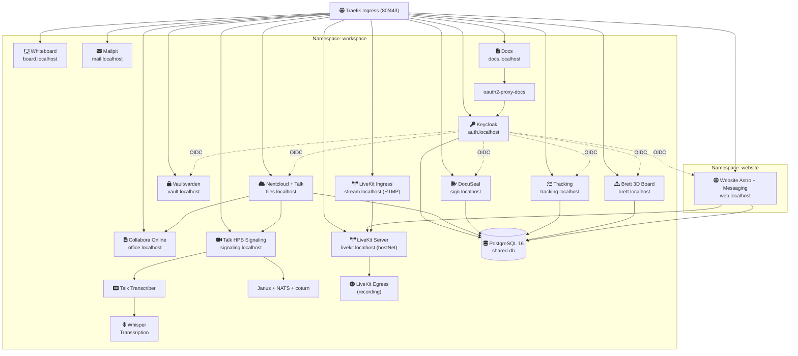

# CLAUDE.md

This file provides guidance to Claude Code (claude.ai/code) when working with code in this repository.

## Project Overview

**Workspace MVP** -- a Kubernetes-based self-hosted collaboration platform for small teams (bachelor thesis). Integrates a custom messaging system (chat, built into the Astro website), Nextcloud (files + video via Talk), Keycloak (SSO/OIDC), Collabora (office suite), Claude Code (AI), Vaultwarden (passwords), and supporting services. All data stays on-premises (DSGVO/GDPR by design).

Prerequisites: Docker, k3d, kubectl, `task` (go-task).

## Common Commands

### Cluster & Deployment
```bash
task cluster:create                        # Create k3d cluster (k3d-config.yaml)
task cluster:delete                        # Destroy cluster
task cluster:start                         # Start stopped cluster
task cluster:stop                          # Stop cluster (preserves state)
task cluster:status                        # Show cluster status, nodes, resource usage
task workspace:up                          # Full automated setup (Cluster + MVP + Office + MCP + Billing + post-config)
task workspace:deploy                      # Deploy workspace (default ENV=dev)
task workspace:deploy ENV=mentolder        # Deploy to mentolder prod cluster
task workspace:deploy ENV=korczewski       # Deploy to korczewski prod cluster
task workspace:validate                    # Dry-run manifest validation
task workspace:teardown                    # Remove all services
task sealed-secrets:install                # Install Sealed Secrets controller via Helm
task sealed-secrets:status                 # Show Sealed Secrets controller status
```

### Daily Operations
```bash
task workspace:status            # Show pod status, services, ingress, PVCs
task workspace:logs -- <svc>     # Tail logs (e.g., keycloak, nextcloud)
task workspace:restart -- <svc>  # Restart a specific service
task workspace:psql -- <db>      # Open psql shell to shared-db
task workspace:port-forward      # Forward shared-db to localhost:5432
# Env-specific shorthands (equivalent to workspace:* with the matching ENV=)
task mentolder:status            # Show mentolder cluster status
task mentolder:logs -- <svc>     # Tail mentolder logs
task mentolder:restart -- <svc>  # Restart mentolder service
task korczewski:status           # Show korczewski cluster status
task korczewski:logs -- <svc>    # Tail korczewski logs
task korczewski:restart -- <svc> # Restart korczewski service
task clusters:status             # Show status of all clusters at once
```

### Backup & Restore
```bash
task workspace:backup                                    # Trigger immediate backup
task workspace:backup:list                               # List available backup timestamps
task workspace:restore -- <db> <timestamp>               # Restore one DB (keycloak|nextcloud|vaultwarden|website|docuseal)
task workspace:restore -- all <timestamp>                # Restore all DBs from one snapshot
# Prod: append -- --context mentolder|korczewski to any of the above
```

### Database Management
```bash
task workspace:db:start ENV=<env>                        # Start or restart shared-db (scale up if at 0)
task workspace:db:drop -- <dbname> ENV=<env>             # Drop a database (asks for confirmation)
task workspace:db:restore -- <db> <timestamp> ENV=<env>  # List backups then restore (db: keycloak|nextcloud|vaultwarden|website|docuseal|all)
```

### Post-Deploy Setup
```bash
task workspace:office:deploy ENV=<env>    # Deploy Collabora (separate overlay — required for full bring-up)
task workspace:post-setup                 # Enable Nextcloud apps (calendar, contacts, OIDC, Collabora)
task workspace:talk-setup                 # Configure Nextcloud Talk HPB signaling + coturn
task workspace:recording-setup            # Configure Talk recording backend
task workspace:whiteboard-setup           # Install + configure Nextcloud Whiteboard app
task workspace:systembrett-setup          # Set up Brett (Systembrett) integration in Nextcloud
task workspace:admin-users-setup          # Create default admin users
task workspace:transcriber-setup          # Set up talk-transcriber bot + Whisper
task workspace:transcriber-build          # Build talk-transcriber Docker image
task workspace:stripe-setup               # Configure Stripe payment gateway
task workspace:vaultwarden:seed           # Seed Vaultwarden with production secret templates
task workspace:dsgvo-check                # Run DSGVO compliance verification (NFA-01)
task claude-code:setup -- cluster         # Generate Claude Code settings.json for platform admin
task claude-code:setup -- business        # Generate Claude Code settings.json for business user
task gemini:setup -- cluster|business     # Generate Gemini CLI settings.json (parallel to claude-code:setup)
```

### Docs
```bash
task docs:deploy ENV=<env>               # Deploy docs ConfigMap to both prod clusters
task docs:restart ENV=<env>              # Force-restart docs pod after ConfigMap update
```

### Claude Code MCP Servers
```bash
task mcp:deploy                       # Deploy MCP monolith pod + auth proxy
task mcp:status                       # Show MCP pod and container status
task mcp:logs -- <container>          # Tail logs (e.g., postgres|browser|github|keycloak|kubernetes)
task mcp:restart                      # Restart the MCP monolith pod
task mcp:select                       # Interactive MCP server selector
task mcp:set-github-pat -- <tok>      # Update GitHub PAT in claude-code-secrets
```

### Website (Astro + Svelte)
```bash
task website:deploy              # Build, import, and deploy website
task website:dev                 # Astro dev server (hot-reload)
task website:redeploy            # Rebuild and restart
task website:status              # Show website deployment status
task website:teardown            # Remove website namespace
```

### Livestream (LiveKit — WebRTC + OBS)
Admin-Steuerseite `/admin/stream`, Zuschauer-Seite `/portal/stream`.
`livekit-server` läuft auf `hostNetwork` und ist via `nodeAffinity` auf eine Pin-Node fixiert (mentolder: `gekko-hetzner-3`/`46.225.125.59`).
```bash
task livekit:status ENV=<env>            # Pods, Services, Ingress, Recording-Anzahl
task livekit:logs ENV=<env>              # Tail livekit-server logs (default)
task livekit:logs ENV=<env> -- ingress   # Tail livekit-ingress (RTMP)
task livekit:logs ENV=<env> -- egress    # Tail livekit-egress (Recording)
task livekit:recordings ENV=<env>        # MP4-Liste im egress PVC
task livekit:end-stream ENV=<env>        # Notfall: livekit-server neu starten (Raum schließen)
task livekit:dns-pin ENV=<env>           # Druckt ipv64-API-Calls für DNS-Pinning (APPLY=true zum Ausführen)
task livekit:firewall-open NODE=<ip>     # Öffnet ufw 7880/7881/tcp + 50000-60000/udp + 30000-40000/udp via SSH
```

### ArgoCD — GitOps Multi-Cluster Federation
**HUB-ONLY**: ALL `argocd:*` tasks run exclusively against `--context mentolder`.
`ENV=korczewski` is silently ignored — it does NOT redirect kubectl to korczewski.
Tasks live in `Taskfile.argocd.yml` (included under the `argocd` namespace).
```bash
task argocd:setup                # Full setup: install → login → register clusters → apply apps (run once on fresh hub)
task argocd:install              # Install ArgoCD on mentolder hub cluster
task argocd:password             # Print initial admin password
task argocd:ui                   # Port-forward ArgoCD UI to http://localhost:8090
task argocd:login                # Log in with argocd CLI
task argocd:cluster:register     # Register hetzner + korczewski clusters with workspace labels
task argocd:apps:apply           # Apply AppProject and ApplicationSet
task argocd:status               # Show sync/health status of all apps across all clusters
task argocd:sync -- <app>        # Manually trigger sync (e.g. workspace-hetzner)
task argocd:diff -- <app>        # Show diff between git and live state
```
ArgoCD files: `argocd/install/` (CMP sidecar, Ingress), `argocd/project.yaml`, `argocd/applicationset.yaml`.
Cluster config lives as annotations on ArgoCD cluster Secrets — set via `task argocd:cluster:register`.

### Optional Services
```bash
task whisper:deploy              # Deploy faster-whisper transcription service (in-cluster)
task whisper:status              # Show Whisper pod status
task whisper:logs                # Tail Whisper logs
task gpu-worker:start            # Start GPU-accelerated Whisper on local workstation
task gpu-worker:stop             # Stop the GPU worker
task gpu-worker:status           # Show GPU worker status
task gpu-worker:logs             # Tail GPU worker logs
task gpu-worker:switch-dev       # Switch dev cluster to use local GPU worker
task gpu-worker:switch-prod      # Switch prod cluster to use local GPU worker
```

### Brett (Systembrett)
```bash
task brett:build                 # Build Brett image (and import into k3d in dev)
task brett:push                  # Push Brett image to registry
task brett:deploy ENV=<env>      # Build, import/push, and roll out Brett
task brett:bot-setup ENV=<env>   # Register /brett slash command in Nextcloud Talk
task brett:logs ENV=<env>        # Tail Brett logs
```

### HA Cluster (High Availability)
```bash
task ha:setup                    # Bootstrap 3-node k3s HA cluster on Hetzner (run once)
task ha:import-image -- <path> <image:tag>  # Build and import image to all HA nodes
task ha:cert-renew               # Renew HA cluster certificates
task ha:status                   # Show HA cluster status
```

### TLS & DNS (Production)
```bash
task cert:install                # Install cert-manager + lego DNS-01 webhook
task cert:secret -- <key>        # Store ipv64 API key as Secret
task cert:status                 # Show wildcard cert and ClusterIssuer status
```

### Environments & Secrets
```bash
task env:validate ENV=<env>      # Validate an env file against environments/schema.yaml
task env:validate:all            # Validate all env files
task env:show ENV=<env>          # Print resolved environments/<env>.yaml
task env:init ENV=<new>          # Scaffold a new environments/<new>.yaml from schema
task env:generate ENV=<env>      # Generate fresh secrets into environments/.secrets/<env>.yaml
task env:seal ENV=<env>          # Encrypt .secrets/<env>.yaml → environments/sealed-secrets/<env>.yaml
task env:fetch-cert ENV=<env>    # Fetch a cluster's sealing cert into environments/certs/<env>.pem
task config:show ENV=<env>       # Show resolved PROD_DOMAIN/BRAND_NAME/CONTACT_EMAIL for an env
```

### Testing
```bash
./tests/runner.sh local              # All tests against k3d
./tests/runner.sh local <TEST-ID>    # Single test (e.g., SA-08, FA-03)
./tests/runner.sh local --verbose    # Verbose output
./tests/runner.sh report             # Generate Markdown report
task test:unit                        # Run BATS unit tests (assertion lib, scripts, configs)
task test:manifests                   # Validate kustomize output structure (no cluster needed)
task test:all                         # Run all offline tests: unit + manifests + dry-run
```

Test IDs: `FA-01`--`FA-29` (functional), `SA-01`--`SA-10` (security), `NFA-01`--`NFA-09` (non-functional), `AK-03`, `AK-04` (acceptance).
Note: FA-01..FA-08, FA-09 (InvoiceNinja bucket), FA-22, SA-06, SA-09 are fully skipped (Mattermost/InvoiceNinja removed from stack). Many other tests have individual test cases conditionally skipped.

## Architecture

All services run as Kubernetes Deployments in the `workspace` namespace, fronted by Traefik (built-in k3s ingress). There is no docker-compose.



### Key components
- **`k3d/`** -- All base Kubernetes manifests (Kustomize). This is the only deployment path.
- **`prod/`** -- Shared production patches (TLS, resource limits, replicas, DDNS) consumed by the env-specific overlays. Never apply directly.
- **`prod-mentolder/`, `prod-korczewski/`** -- Per-env overlays referenced by `ENV_OVERLAY` in `environments/<env>.yaml`. This is what `workspace:deploy` actually applies in prod.
- **`environments/`** -- Config & secrets registry:
  - `environments/<env>.yaml` -- per-env config (domain, context, env_vars, setup_vars), read by `scripts/env-resolve.sh`.
  - `environments/.secrets/<env>.yaml` -- plaintext secrets (gitignored; only used as input to `env:seal`).
  - `environments/sealed-secrets/<env>.yaml` -- encrypted SealedSecret (committed; applied before manifests).
  - `environments/schema.yaml` -- authoritative list of every env/setup var; validated by `env:validate`.
  - `environments/certs/` -- per-cluster sealing certs fetched via `env:fetch-cert`.
- **`deploy/`** -- Kustomize overlays for dev iteration. Contains `mcp/` for MCP server overlays.
- **`argocd/`** -- ArgoCD AppProject + three ApplicationSets (`applicationset.yaml`, `applicationset-office.yaml`, `applicationset-coturn.yaml`) and the `install/` CMP sidecar.
- **`brett/`** -- Node.js 3D systemic-constellation board (Systembrett) at `brett.localhost`; deployed as `k3d/brett.yaml`.
- **`claude-code/`** -- Claude Code configuration and system prompt.
- **`scripts/`** -- Bash utility scripts for migration, user import, DSGVO checks, MCP registration, Stripe setup, env resolution/generation/sealing, etc.
- **`tests/`** -- Bash + Playwright test framework. `runner.sh` orchestrates all test categories.
- **`website/`** -- Astro + Svelte website.
- **`docs-site/`** -- Docsify index.html for the docs service.

### Configuration patterns
- **Centralized domains**: All hostnames defined in `k3d/configmap-domains.yaml`. Never hardcode hostnames elsewhere.
- **Per-env config**: `PROD_DOMAIN`, `BRAND_NAME`, `CONTACT_EMAIL`, `ENV_CONTEXT`, `ENV_OVERLAY`, SMTP, etc. live in `environments/<env>.yaml`. `scripts/env-resolve.sh` exports them; tasks then `envsubst` them into manifests.
- **Prod secrets**: plaintext in `environments/.secrets/<env>.yaml` (gitignored) → `task env:seal ENV=<env>` → committed SealedSecret in `environments/sealed-secrets/<env>.yaml`. `workspace:deploy` applies the SealedSecret before manifests.
- **Dev secrets**: `k3d/secrets.yaml` (dev values only — never commit real credentials). The `prod/` overlay strips this via `$patch: delete` so sealed secrets survive.
- **Keycloak realm**: dev uses `k3d/realm-workspace-dev.json`; each prod overlay provides its own `realm-workspace-<env>.json`.
- **Nextcloud OIDC**: `k3d/nextcloud-oidc-dev.php` (dev) / `prod/nextcloud-oidc-prod.php` (prod), both loaded as ConfigMap.
- **SSO flow**: Keycloak is the OIDC provider; Nextcloud, Vaultwarden, DocuSeal, Tracking, the website, and Claude Code all authenticate through it.

## CI/CD

GitHub Actions (`.github/workflows/ci.yml`) runs on every PR:
- Manifest validation: `kustomize build` + `kubeconform` (K8s 1.31.0)
- YAML linting: `yamllint` (200-char line limit)
- Shell linting: `shellcheck` on all scripts
- Config validation: JSON (realm), PHP (OIDC), secret detection, image pinning checks

## Development Rules

1. Only deploy via k3d/k3s with Kustomize (`k3d/` is the base).
2. All changes via Pull Requests -- no direct pushes to `main`.
3. Use **squash-and-merge** to keep `main` history clean.
4. CI must be green before merge.
5. Validate manifests before committing: `task workspace:validate`.
6. After modifying Kubernetes manifests, run the relevant test(s): `./tests/runner.sh local <TEST-ID>`.
7. Branch naming: `feature/*`, `fix/*`, `chore/*`.

## Gotchas & Footguns

Non-obvious repo behaviors. Violating these silently breaks things or hits the wrong cluster.

### Environment targeting
- **`ENV=` is always explicit.** Env-sensitive tasks (`workspace:deploy`, `workspace:office:deploy`, `workspace:post-setup`, `docs:deploy`, `workspace:talk-setup`) default to `ENV=dev` when unset. The kubectl context mismatch check only runs when `ENV != dev`, so a missing `ENV=` + wrong active context silently deploys to whatever cluster is current. Always pass `ENV=mentolder` or `ENV=korczewski` for live work.
- **ArgoCD tasks are hub-only and enforce it.** All `argocd:*` tasks live in `Taskfile.argocd.yml` and have a `_hub-guard` precondition that aborts with a clear error if the `mentolder` context is unreachable. `ENV=korczewski` is silently ignored — it does NOT redirect kubectl to korczewski.

### Kustomize overlays
- **Apply `prod-mentolder/` or `prod-korczewski/`, never base `prod/` alone.** The base `prod/` exists to be consumed by the env-specific overlays. It also contains a `$patch: delete` on the `workspace-secrets` Secret — applying `prod/` directly relies on the sealed secret existing and can leave the cluster without credentials.
- **Never remove the `$patch: delete` block in `prod/kustomization.yaml`.** Its job is to strip the dev placeholder from `k3d/secrets.yaml` so SealedSecrets-managed secrets survive each deploy. Removing it overwrites production secrets with dev values.
- **Collabora and CoTURN are NOT in the base kustomization.** `k3d/office-stack` and `k3d/coturn-stack` deploy via separate ArgoCD Applications (`argocd/applicationset-office.yaml`, `argocd/applicationset-coturn.yaml`) and `task workspace:office:deploy`. A full bring-up order is `workspace:deploy` → `workspace:office:deploy` → CoTURN apply.
- **Website image `:latest` is intentional** (`k3d/website.yaml`). CI warns about `:latest` elsewhere; do not "fix" the website tag to a digest — it is rebuilt and re-imported per deploy.

### Scripts & env
- **`scripts/env-resolve.sh` must be sourced, never executed.** It uses `return 1 2>/dev/null || exit 1`, so `bash scripts/env-resolve.sh` exits the parent shell and subsequent task commands never run. Always `source scripts/env-resolve.sh "$ENV"`.
- **`envsubst` variable lists are hardcoded per task in `Taskfile.yml` (not `Taskfile.yaml`).** If you add a new `${VAR}` reference to a manifest, also add it to the `envsubst "\$VAR1 \$VAR2 ..."` list in every task that builds that manifest, or the placeholder stays literal and kubectl apply fails with an invalid manifest. Key locations: dev deploy (line ~1117, vars: `PROD_DOMAIN BRAND_NAME CONTACT_EMAIL BRAND_ID`), prod deploy (line ~1145, dynamic `ENVSUBST_VARS` build — append there), `mcp:deploy` (line ~1350), `workspace:office:deploy` (line ~510).
- **`env:generate ENV=<target>` must run before `env:seal` and before deploying prod.** `talk-hpb-setup.sh` aborts on placeholder `MANAGED_EXTERNALLY` values if signaling/turn secrets were never generated.

### Operational
- **Docs ConfigMap is not auto-synced by ArgoCD.** After changing `docs-site/` or the `docs-content` ConfigMap, run `task docs:deploy ENV=<env>` then `task docs:restart ENV=<env>`. Applying the ConfigMap alone leaves the old content served.
- **yamllint runs a 200-char line limit in CI only.** Long base64 strings or multiline patches that are fine locally will fail the `lint-yaml` job on PR. Run `yamllint -d '{extends: relaxed, rules: {line-length: {max: 200}}}' <file>` before pushing.
- **LiveKit needs node-pinning + DNS-pinning + ufw rules.** `livekit-server` runs with `hostNetwork: true` (workspace ns is `pod-security: privileged` for this) and is pinned via `nodeAffinity` to `gekko-hetzner-3` (mentolder). The Hetzner host firewall blocks all inter-node traffic except 80/443 — `prod/cloud-init.yaml` opens 7880/tcp + 7881/tcp + 50000-60000/udp + 30000-40000/udp on every node. `livekit.<domain>` and `stream.<domain>` should DNS-pin to the pin-node IP via `task livekit:dns-pin` (browsers otherwise hit a non-LiveKit node ~66% of the time and ICE silently fails). `Room.connect()` must run from a user gesture — Chrome blocks the AudioContext otherwise.
