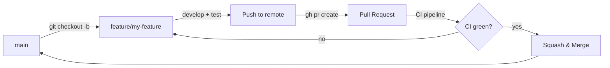
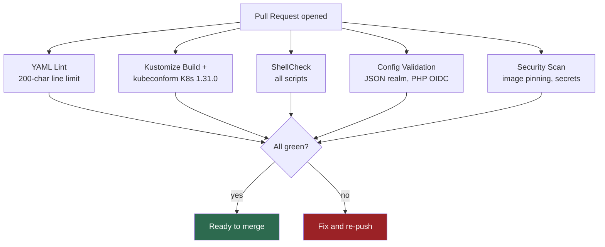

# Contributing to Workspace MVP

## Development Workflow

All changes go through pull requests. Direct pushes to `main` are not allowed.

### Branch Naming

| Prefix       | Purpose                          |
|-------------|----------------------------------|
| `feature/*` | New functionality                |
| `fix/*`     | Bug fixes                        |
| `chore/*`   | Refactoring, dependencies, CI/CD |

### Workflow



1. **Create a branch** from `main`:
   ```bash
   git checkout main && git pull
   git checkout -b feature/my-feature
   ```

2. **Develop locally** with k3d:
   ```bash
   task workspace:deploy            # deploy all services
   task workspace:status            # check pod health
   task workspace:logs -- keycloak  # tail service logs
   ```

3. **Validate before pushing**:
   ```bash
   task workspace:validate          # dry-run k8s manifests
   shellcheck scripts/*.sh          # lint scripts (if modified)
   ```

4. **Push and open a PR**:
   - Use the PR template checklist
   - CI runs automatically (manifest validation, YAML lint, security scan)

5. **CI must pass** before merge. The pipeline checks:
   - Kubernetes manifest validity (kustomize build + kubeconform)
   - YAML linting (k3d manifests)
   - Shell script linting
   - Config validation (realm JSON, PHP OIDC config)
   - Security scan (image pinning, secret detection)

6. **Merge via squash-and-merge** to keep `main` history clean.

### CI Pipeline



### Local k3d Development

Prerequisites: Docker, k3d, kubectl, task (go-task)

```bash
# First time: create cluster + deploy
task cluster:create              # creates k3d cluster
task workspace:deploy            # deploy all services

# Or everything at once (Cluster + MVP + MCP + Monitoring + Billing):
task workspace:up
```

**Day-to-day commands:**

```bash
task workspace:status                # check everything
task workspace:logs -- keycloak      # tail a service
task workspace:restart -- keycloak   # restart a service
task workspace:validate              # validate manifests
task workspace:psql -- keycloak      # psql shell to a database
task workspace:port-forward          # forward shared-db to localhost:5432
task workspace:teardown              # clean up
```

Services are available at:

| Service | URL | Credentials |
|---------|-----|-------------|
| Keycloak (SSO) | http://auth.localhost | admin / devadmin |
| Mattermost (Chat) | http://chat.localhost | -- |
| Nextcloud (Files + Talk) | http://files.localhost | -- |
| Collabora (Office) | http://office.localhost | -- |
| Talk HPB (Signaling) | http://signaling.localhost | -- |
| Claude Code (AI) | http://ai.localhost | -- |
| Invoice Ninja (Billing) | http://billing.localhost | -- |
| Vaultwarden (Passwords) | http://vault.localhost | -- |
| Whiteboard | http://board.localhost | -- |
| Mailpit (Dev Mail) | http://mail.localhost | -- |
| Docs | http://docs.localhost | -- |
| Website | http://web.localhost | -- |

### Running Tests

```bash
./tests/runner.sh local              # full test suite against k3d
./tests/runner.sh local SA-08        # single test
./tests/runner.sh local --verbose    # verbose output
./tests/runner.sh report             # generate markdown report
```

Test IDs: `FA-01`--`FA-11` (functional), `SA-01`--`SA-09` (security), `NFA-01`--`NFA-07` (non-functional), `AK-03`, `AK-04` (acceptance).

### Post-Deploy Setup

After the initial `task workspace:deploy`, optional setup steps:

```bash
task workspace:post-setup            # enable Nextcloud apps (calendar, contacts, OIDC)
task workspace:billing-setup         # build billing-bot image (token auto-provisioned)
task workspace:stripe-setup          # register Stripe payment gateway
task workspace:vaultwarden:seed      # seed Vaultwarden with secret templates
task workspace:monitoring            # install Prometheus + Grafana (NFA-02)
task mcp:deploy                      # deploy Claude Code MCP server pods
task website:deploy                  # deploy Astro website
```

### Monorepo Rules

1. **k3d/k3s is the only deployment target.** No docker-compose.
2. **All K8s manifests live in `k3d/`.** Use Kustomize.
3. **Domains are centralized** in `k3d/configmap-domains.yaml`. Never hardcode hostnames.
4. **Secrets stay in `k3d/secrets.yaml`** (dev values only). Never commit real credentials.
5. **Shared configs** (proxy configs, adapter code, import scripts) live outside `k3d/` and are loaded as ConfigMaps by the deploy task.
6. **Test after manifest changes**: `./tests/runner.sh local <TEST-ID>`.
7. **Validate before commit**: `task workspace:validate`.

### For AI Assistants (Claude Code)

When asked to develop a feature, fix a bug, or make any code change:

1. **Always create a feature branch** -- never commit directly to `main`
2. **Follow the PR template** -- fill out the checklist completely
3. **Run `task workspace:validate`** before pushing
4. **Create a PR** using `gh pr create` with the appropriate template
5. **Wait for CI** to pass before requesting merge
