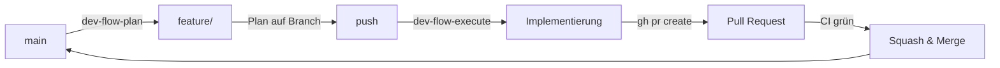

# Beitragen zum Workspace MVP

## Entwicklungs-Workflow

Alle Änderungen gehen durch Pull Requests. Direkte Pushes auf `main` sind nicht erlaubt.

### Branch-Namenskonvention

| Präfix       | Zweck                            |
|--------------|----------------------------------|
| `feature/*`  | Neue Funktionalität              |
| `fix/*`      | Fehlerbehebungen                 |
| `chore/*`    | Refactoring, Dependencies, CI/CD |
| `docs/*`     | Reine Dokumentations-Änderungen  |

### Standard-Workflow (`dev-flow`)

Für jede Aufgabe in diesem Repo: `dev-flow-plan` aufrufen (siehe [CLAUDE.md](CLAUDE.md#default-workflow)). Es übernimmt Path-Wahl (feature/fix/chore), Worktree, Brainstorming, Plan und Push. `dev-flow-execute` setzt den gepushten Plan dann um.



Manuelle Variante (ohne dev-flow):

```bash
git checkout main && git pull
git checkout -b feature/mein-feature
# ... Code-Änderungen
task workspace:validate    # Dry-Run der Manifeste falls relevant
task test:all              # Offline-Suite
git push -u origin feature/mein-feature
gh pr create --fill
```

**Pre-Push-Gate umgehen** (nur im Notfall):
```bash
SKIP_CI_CHECK=1 git push   # überspringt task quality:check
```

### Lokale Entwicklung

Voraussetzungen: Docker, k3d, kubectl, `task` (go-task).

#### Lokales Setup bewahren (Verlust durch git reset verhindern)

Lokale Konfigurationsdateien wie `.claude/settings.json` und `.opencode/opencode.jsonc` werden nicht im Git-Repository getrackt (bzw. sind gitignored). Bei einem unbedachten `git reset --hard` werden uncommitted oder ungestashte Änderungen (auch an diesen Configs) unwiderruflich gelöscht.
* **Best Practice:** Nutze vor einem `git reset --hard` immer `git stash push -u` (oder `git stash --include-untracked`), um deine lokalen Einstellungen und uncommitted Code zu sichern.
* **Selektives Zurücksetzen:** Nutze `git checkout origin/main -- <paths>` oder `git restore --source=origin/main <paths>` anstelle von `git reset --hard`, wenn du nur bestimmte Dateien auf den Stand von `origin/main` bringen möchtest, ohne das restliche Arbeitsverzeichnis zu beeinträchtigen.

```bash
task cluster:create
task workspace:deploy
task workspace:office:deploy   # Collabora
task workspace:post-setup      # Nextcloud-Apps + OIDC
```

Tägliche Befehle (ENV=dev ist Default):

```bash
task workspace:status            # Pods, Services, Ingress, PVCs
task workspace:logs -- keycloak  # Service-Logs
task workspace:restart -- <svc>  # Service neu starten
task workspace:psql -- website   # psql-Shell
task workspace:port-forward      # shared-db nach localhost:5432
task workspace:teardown          # Cleanup (interaktiv)
```

Vollständige Task-Referenz siehe [CLAUDE.md](CLAUDE.md#common-commands).

### CI-Pipeline

`.github/workflows/ci.yml` läuft auf jeder PR:

- `task test:all` — BATS-Unit-Tests, kustomize-Manifest-Struktur, Taskfile-Dry-Run
- **Test-Inventory-Check** — `website/src/data/test-inventory.json` muss zur Test-Liste passen
- **Systembrett-Template-Validierung** (`scripts/tests/systembrett-template.test.sh`)
- **Security-Scan** — Image-Pin-Hinweise + Hardcoded-Secret-Erkennung in `k3d/*.yaml`


Nicht in CI (lokal bei Bedarf): `yamllint`, `shellcheck`, `kubeconform`. Frühere Doku behauptete das fälschlich.

Weitere Workflows: `e2e.yml` (nightly Playwright gegen beide Brands), `build-website.yml` / `build-website-korczewski.yml`.

### Tests ausführen

```bash
./tests/runner.sh local              # Vollständige Suite gegen k3d
./tests/runner.sh local SA-08        # Einzelner Test
./tests/runner.sh local --verbose
./tests/runner.sh report             # Markdown-Report
```

Test-IDs: `FA-01`…`FA-29` (funktional), `SA-01`…`SA-10` (Sicherheit), `NFA-01`…`NFA-09` (nicht-funktional), `AK-03`, `AK-04` (Abnahme). Lücken (FA-01..08, FA-22, SA-06, SA-09) stammen aus entfernten Services (Mattermost, InvoiceNinja).

### Monorepo-Regeln

1. **k3d/k3s ist der einzige Deployment-Pfad.** Kein docker-compose.
2. **Alle K8s-Manifeste liegen in `k3d/`.** Kustomize ist das Build-Tool. Produktion via `prod-fleet/mentolder/` bzw. `prod-fleet/korczewski/` Overlay (wrappen die Brand-Overlays `prod-mentolder/`/`prod-korczewski/`; nicht `prod/` direkt anwenden). Push-basiert — kein Flux/Argo-Reconciler.
3. **Domains zentral** in `k3d/configmap-domains.yaml`. Keine hartkodierten Hostnamen.
4. **Dev-Secrets** in `k3d/secrets.yaml` (nur Dev-Werte — niemals echte Credentials).
5. **Prod-Secrets** als SealedSecrets in `environments/sealed-secrets/<env>.yaml`, generiert via `task env:seal ENV=<env>`.
6. **Nach Manifest-Änderungen testen**: `./tests/runner.sh local <TEST-ID>` und `task workspace:validate`.
7. **Squash-and-Merge** für eine saubere `main`-History.

### Für KI-Assistenten (Claude Code / Codex / Gemini)

Lies zuerst [CLAUDE.md](CLAUDE.md). Sie enthält Agent-Routing, Standard-Workflow, Footguns und die vollständige Task-Referenz. Diese Datei ist die kompakte Sicht für menschliche Beitragende.

### MCP-Erweiterung & Tool-Registrierung (Best Practices)

Wenn neue MCP-Tools im Go-Binary von `ticket-mcp` (unter `scripts/ticket-mcp/go/`) implementiert werden, müssen die entsprechenden Client-Schemas als statische JSON-Dateien im Verzeichnis `/home/patrick/.gemini/antigravity-cli/mcp/ticket-mcp/` hinterlegt werden, damit der Client (z. B. Antigravity) diese Tools lazy laden kann (z. B. `stage_plan.json` oder `record_phase_event.json`). Nach einer Tool-Erweiterung muss das Go-Binary mit `make -C scripts/ticket-mcp/go build` neu kompiliert werden.
