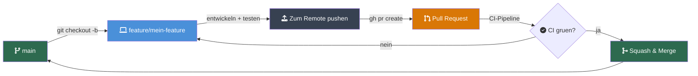
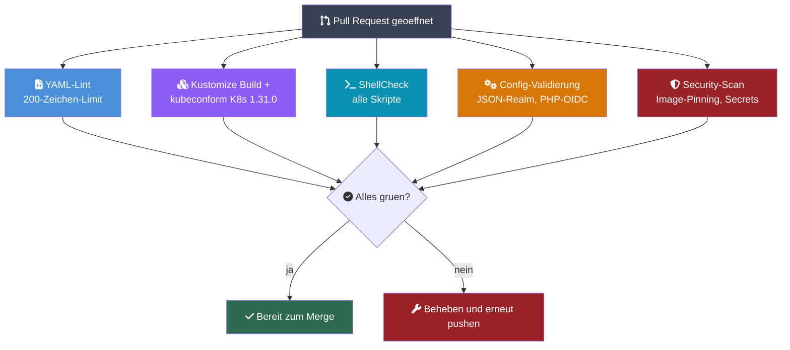

# Beitragen zum Workspace MVP

## Entwicklungs-Workflow

Alle Aenderungen gehen durch Pull Requests. Direkte Pushes auf `main` sind nicht erlaubt.

### Branch-Namenskonvention

| Praefix       | Zweck                            |
|--------------|----------------------------------|
| `feature/*` | Neue Funktionalitaet             |
| `fix/*`     | Fehlerbehebungen                 |
| `chore/*`   | Refactoring, Abhaengigkeiten, CI/CD |

### Workflow



1. **Branch erstellen** von `main`:
   ```bash
   git checkout main && git pull
   git checkout -b feature/mein-feature
   ```

2. **Lokal entwickeln** mit k3d:
   ```bash
   task workspace:deploy            # alle Services deployen
   task workspace:status            # Pod-Gesundheit pruefen
   task workspace:logs -- keycloak  # Service-Logs ansehen
   ```

3. **Vor dem Push validieren**:
   ```bash
   task workspace:validate          # Dry-Run der K8s-Manifeste
   shellcheck scripts/*.sh          # Skripte linten (falls geaendert)
   ```

4. **Pushen und PR erstellen**:
   - PR-Template-Checkliste verwenden
   - CI laeuft automatisch (Manifest-Validierung, YAML-Lint, Security-Scan)

5. **CI muss gruen sein** vor dem Merge. Die Pipeline prueft:
   - Kubernetes-Manifest-Gueltigkeit (kustomize build + kubeconform)
   - YAML-Linting (k3d-Manifeste)
   - Shell-Skript-Linting
   - Konfigurations-Validierung (Realm-JSON, PHP-OIDC-Config)
   - Security-Scan (Image-Pinning, Secret-Erkennung)

6. **Merge via Squash-and-Merge** fuer eine saubere `main`-History.

### CI-Pipeline



### Lokale k3d-Entwicklung

Voraussetzungen: Docker, k3d, kubectl, task (go-task)

```bash
# Erstmaliges Setup: Cluster erstellen + deployen
task cluster:create              # k3d-Cluster erstellen
task workspace:deploy            # alle Services deployen

# Oder alles auf einmal (Cluster + MVP + MCP + Monitoring + Billing):
task workspace:up
```

**Taegliche Befehle:**

```bash
task workspace:status                # alles pruefen
task workspace:logs -- keycloak      # Service-Logs ansehen
task workspace:restart -- keycloak   # Service neu starten
task workspace:validate              # Manifeste validieren
task workspace:psql -- keycloak      # psql-Shell zur Datenbank
task workspace:port-forward          # shared-db auf localhost:5432
task workspace:teardown              # aufraeumen
```

Services sind erreichbar unter:

| Service | URL | Zugangsdaten |
|---------|-----|--------------|
| Keycloak (SSO) | http://auth.localhost | admin / devadmin |
| Nextcloud (Dateien + Talk) | http://files.localhost | -- |
| Collabora (Office) | http://office.localhost | -- |
| Talk HPB (Signaling) | http://signaling.localhost | -- |
| Claude Code (KI) | http://ai.localhost | -- |
| Vaultwarden (Passwoerter) | http://vault.localhost | -- |
| Whiteboard | http://board.localhost | -- |
| Mailpit (Dev-Mail) | http://mail.localhost | -- |
| Docs | http://docs.localhost | -- |
| Website | http://web.localhost | -- |

### Tests ausfuehren

```bash
./tests/runner.sh local              # Vollstaendige Testsuite gegen k3d
./tests/runner.sh local SA-08        # Einzelner Test
./tests/runner.sh local --verbose    # Ausfuehrliche Ausgabe
./tests/runner.sh report             # Markdown-Report generieren
```

Test-IDs: `FA-01`--`FA-25` (funktional), `SA-01`--`SA-10` (Sicherheit), `NFA-01`--`NFA-09` (nicht-funktional), `AK-03`, `AK-04` (Abnahme).

### Post-Deploy-Setup

Nach dem initialen `task workspace:deploy` stehen optionale Setup-Schritte zur Verfuegung:

```bash
task workspace:post-setup            # Nextcloud-Apps aktivieren (Kalender, Kontakte, OIDC)
task workspace:billing-setup         # billing-bot Image bauen (Token automatisch provisioniert)
task workspace:stripe-setup          # Stripe Payment Gateway registrieren
task workspace:vaultwarden:seed      # Vaultwarden mit Secret-Templates befuellen
task workspace:monitoring            # Prometheus + Grafana installieren (NFA-02)
task mcp:deploy                      # Claude Code MCP-Server-Pods deployen
task website:deploy                  # Astro-Website deployen
```

### Monorepo-Regeln

1. **k3d/k3s ist der einzige Deployment-Pfad.** Kein docker-compose.
2. **Alle K8s-Manifeste liegen in `k3d/`.** Kustomize verwenden.
3. **Domains sind zentral** in `k3d/configmap-domains.yaml` definiert. Keine hartkodierten Hostnamen.
4. **Secrets bleiben in `k3d/secrets.yaml`** (nur Dev-Werte). Niemals echte Credentials committen.
5. **Gemeinsame Configs** (Proxy-Configs, Adapter-Code, Import-Skripte) liegen ausserhalb von `k3d/` und werden als ConfigMaps durch den Deploy-Task geladen.
6. **Nach Manifest-Aenderungen testen**: `./tests/runner.sh local <TEST-ID>`.
7. **Vor dem Commit validieren**: `task workspace:validate`.

### Fuer KI-Assistenten (Claude Code)

Bei der Entwicklung eines Features, Bugfixes oder einer Code-Aenderung:

1. **Immer einen Feature-Branch erstellen** -- niemals direkt auf `main` committen
2. **PR-Template verwenden** -- Checkliste vollstaendig ausfuellen
3. **`task workspace:validate` ausfuehren** vor dem Push
4. **PR erstellen** mit `gh pr create` und dem passenden Template
5. **Auf CI warten** -- erst nach gruener Pipeline Merge anfordern
