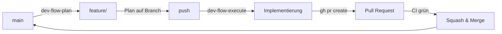

# Beitragen zum Workspace MVP

## Entwicklungs-Workflow

Alle Änderungen gehen durch Pull Requests. Direkte Pushes auf `main` sind nicht erlaubt.

### Branch-Namenskonvention

| Präfix       | Zweck                            |
|--------------|----------------------------------|
| `feature/*`  | Neue Funktionalität              |
| `fix/*`      | Fehlerbehebungen                 |
| `chore/*`    | Refactoring, Dependencies, CI/CD |
| `docs/*`     | Reine Dokumentations-Änderungen  |

### Standard-Workflow (`dev-flow`)

Features und Fixes laufen über [dev-flow-plan](.agents/skills/dev-flow-plan/SKILL.md) → [dev-flow-execute](.agents/skills/dev-flow-execute/SKILL.md). Wartung ohne Verhaltensänderung verwendet [dev-flow-chore](.agents/skills/dev-flow-chore/SKILL.md). Den Git-Ablauf beschreibt [git-workflow](.agents/skills/git-workflow/SKILL.md).


```mermaid
flowchart LR
    A[main] -->|dev-flow-plan| B[feature/<slug>]
    B -->|Plan auf Branch| C[push]
    C -->|dev-flow-execute| D[Implementierung]
    D -->|gh pr create| E[Pull Request]
    E -->|CI grün| F[Squash & Merge]
    F --> A
```

Manuelle Variante (ohne dev-flow):

```bash
git fetch origin main
# Vorher Ticket-ID ermitteln; Beispiel-ID durch das eigene Ticket ersetzen.
bash scripts/worktree-create.sh feature/mein-feature-T000XXX .worktrees/mein-feature-T000XXX
cd .worktrees/mein-feature-T000XXX
# ... Code-Änderungen
task workspace:validate    # Dry-Run der Manifeste falls relevant
task test:changed          # Gezielte Tests
task freshness:check       # Generierte Artefakte und Qualitäts-Gates
git push -u origin feature/mein-feature-T000XXX
gh pr create --fill
```

**Pre-Push-Gate umgehen** (nur im Notfall):
```bash
SKIP_CI_CHECK=1 git push   # überspringt task quality:check
```

### Lokale Entwicklung

Die [Website-Kurzreferenz](components/website/CLAUDE.md#dev-quick-start) beschreibt den lokalen Start mit Docker Compose oder direkt auf dem Host. Für den lokalen Kubernetes-Stack siehe [Devmesh-Runbook](docs/runbooks/devmesh-tailnet.md) und [Devmesh-Tasks](taskfiles/Taskfile.devmesh.yml).

| Bereich | Package Manager | Lockfile |
|---|---|---|
| Root | npm | `package-lock.json` |
| Website | pnpm | `components/website/pnpm-lock.yaml` |
| Brett | npm | `components/brett/package-lock.json` |

Lokale Einstellungen und laufende Arbeit vor Cleanup prüfen: `git status --short`, `git stash list` und `git worktree list`. Kein unbedachtes `git reset --hard`; uncommitted Änderungen mit `git stash push -u` sichern. Ignorierte Dateien werden von `git stash -u` nicht erfasst; benötigte lokale Konfiguration separat sichern. Fremde Worktrees und Stashes nur nach belegter Sicherung bereinigen.

Befehle über den [Task-Oracle](CLAUDE.md#running-tasks) ermitteln. Weitere Einstiegspunkte: [Dokumentationswegweiser](docs/README.md).

### CI-Pipeline

`.github/workflows/ci.yml` läuft auf jeder PR:

- `task test:all` — BATS-Unit-Tests, kustomize-Manifest-Struktur, Taskfile-Dry-Run
- **Test-Inventory-Check** — `components/website/src/data/test-inventory.json` muss zur Test-Liste passen
- **Systembrett-Template-Validierung** (`scripts/tests/systembrett-template.test.sh`)
- **Security-Scan** — Image-Pin-Hinweise + Hardcoded-Secret-Erkennung in `k3d/*.yaml`


Nicht in CI (lokal bei Bedarf): `yamllint`, `shellcheck`, `kubeconform`. Frühere Doku behauptete das fälschlich.

Weitere Workflows: `e2e.yml` (nightly Playwright gegen beide Brands), `build-website.yml` / `build-website-korczewski.yml`.

### Tests ausführen

```bash
./tests/runner.sh local              # Vollständige Suite gegen k3d
./tests/runner.sh local SA-08        # Einzelner Test
./tests/runner.sh local --verbose
./tests/runner.sh report             # Markdown-Report
```

Test-IDs: `FA-01`…`FA-29` (funktional), `SA-01`…`SA-10` (Sicherheit), `NFA-01`…`NFA-09` (nicht-funktional), `AK-03`, `AK-04` (Abnahme). Lücken (FA-01..08, FA-22, SA-06, SA-09) stammen aus entfernten Services (Mattermost, InvoiceNinja).

### Monorepo-Regeln

1. **Produktion verwendet Kubernetes/Kustomize.** Docker Compose ist für lokale Website-Entwicklung vorgesehen.
2. **Die Kubernetes-Basis liegt in `k3d/`.** Kustomize ist das Build-Tool. Produktion via `prod-fleet/mentolder/` bzw. `prod-fleet/korczewski/` Overlay (wrappen die Brand-Overlays `prod-mentolder/`/`prod-korczewski/`; nicht `prod/` direkt anwenden). Pull-basiert via [Flux](flux/clusters/fleet/) und [OCI-Render-Workflow](.github/workflows/render-fleet-artifact.yml); `workspace:deploy` bleibt Break-Glass.
3. **Domains zentral** in `k3d/configmap-domains.yaml`. Keine hartkodierten Hostnamen.
4. **Dev-Secrets** in `k3d/secrets.yaml` (nur Dev-Werte — niemals echte Credentials).
5. **Prod-Secrets** als SealedSecrets in `environments/sealed-secrets/<env>.yaml`, generiert via `task env:seal ENV=<env>`.
6. **Nach Manifest-Änderungen testen**: `./tests/runner.sh local <TEST-ID>` und `task workspace:validate`.
7. **Squash-and-Merge** für eine saubere `main`-History.

### Für KI-Assistenten (Claude Code / Codex / Gemini)

Lies zuerst [AGENTS.md](AGENTS.md), dann aufgabenbezogen [CLAUDE.md](CLAUDE.md). Sie enthält Agent-Routing, Standard-Workflow, Footguns und die vollständige Task-Referenz. Diese Datei ist die kompakte Sicht für menschliche Beitragende.

### MCP-Erweiterung & Tool-Registrierung (Best Practices)

Wenn neue MCP-Tools im Go-Binary von `ticket-mcp` (unter `scripts/ticket-mcp/go/`) implementiert werden, müssen die entsprechenden Client-Schemas als statische JSON-Dateien im Verzeichnis `/home/patrick/.gemini/antigravity-cli/mcp/ticket-mcp/` hinterlegt werden, damit der Client (z. B. Antigravity) diese Tools lazy laden kann (z. B. `stage_plan.json` oder `record_phase_event.json`). Nach einer Tool-Erweiterung muss das Go-Binary mit `make -C scripts/ticket-mcp/go build` neu kompiliert werden.

### antigravity-cli Permissions

Die antigravity-cli (eine Claude-Code-Instanz unter `~/.gemini/antigravity-cli/`) prüft jeden Bash-Aufruf gegen die `permissions.allow`-Liste in `~/.gemini/antigravity-cli/settings.json`. Diese Datei liegt **außerhalb des Repos** (host-lokal, nicht getrackt).

**Root Cause eines bekannten Mishaps (T001274):** Fehlt ein `Bash(gh *)`-Eintrag in `permissions.allow`, löst ein direkter `gh`-Aufruf eine interaktive Permission-Anfrage aus. Selbst wenn der User dann `custom(gh.read(...))` gewährt, matcht dieser Grant **nicht** das interne `Bash(gh *)`-Schema des Interceptors — der Befehl schlägt mit „permission denied" fehl.

**Workaround (nicht der Fix):** `bash -c "gh ..."` umgeht das Problem, weil der Interceptor dann `bash` statt `gh` prüft. Das ist ein Notbehelf, kein Ersatz für korrektes Pre-Granting.

**Korrekter Fix:** In `~/.gemini/antigravity-cli/settings.json` einen `permissions.allow`-Block pflegen, der `gh` (und `gh-axi`) vorermächtigt:

```json
{
  "permissions": {
    "allow": ["Bash(gh *)", "Bash(gh-axi *)"]
  }
}
```

Bei einer JSON-Merge-Bearbeitung bestehende Keys bewahren — nur `permissions.allow` ergänzen. Der BATS-Guard `antigravity-cli settings.json pre-grants Bash(gh *) permission` in `tests/spec/mcp-tooling.bats` verifiziert diese Konfiguration (er `skip`t auf Maschinen ohne installierte antigravity-cli).
