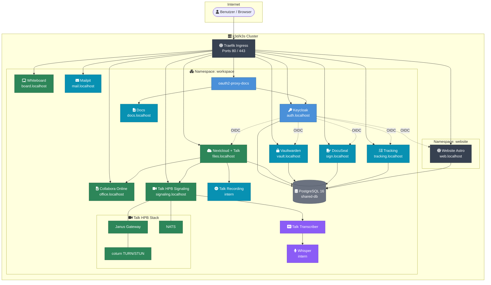
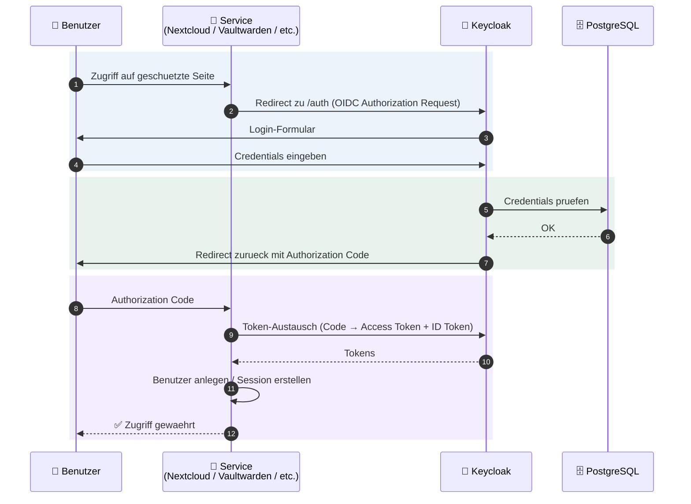
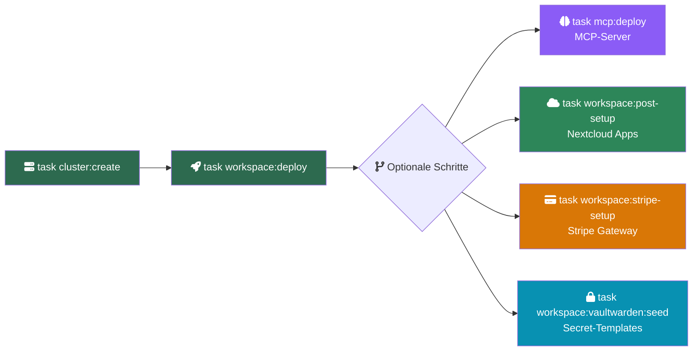

# Workspace MVP

Kubernetes-basierte Kollaborationsplattform fuer kleine Teams -- Nextcloud (Dateien + Talk Video + Collabora Office), Keycloak (SSO), Claude Code (KI), DocuSeal (Vertraege), Vaultwarden (Passwoerter) und weitere Services auf k3d/k3s mit Traefik Ingress.

## Schnellstart

Voraussetzungen: Docker, [k3d](https://k3d.io), kubectl, [task](https://taskfile.dev)

```bash
git clone https://github.com/Paddione/Bachelorprojekt.git && cd Bachelorprojekt

# Cluster erstellen + alle Services deployen
task cluster:create && task workspace:deploy
```

Oder alles auf einmal (Cluster + MVP + MCP):

```bash
task workspace:up
```

## Service-Endpunkte

| Service | URL | Beschreibung |
|---------|-----|--------------|
| Keycloak (SSO) | http://auth.localhost | Identity Provider (admin / devadmin) |
| Nextcloud (Dateien + Talk) | http://files.localhost | Dateien, Kalender, Kontakte, Video |
| Collabora (Office) | http://office.localhost | WOPI-Backend fuer Nextcloud (kein eigenstaendiges UI — antwortet mit "OK") |
| Talk HPB (Signaling) | http://signaling.localhost | WebRTC-Signaling (Janus + NATS + coturn) |
| Vaultwarden (Passwoerter) | http://vault.localhost | Passwort-Manager (Bitwarden-kompatibel) |
| Whiteboard | http://board.localhost | Kollaboratives Whiteboard + Systemisches Brett |
| DocuSeal (E-Signatur) | http://sign.localhost | Vertragsunterzeichnung |
| Tracking | http://tracking.localhost | Anforderungs-Tracking (Bachelorprojekt) |
| Mailpit (Dev-Mail) | http://mail.localhost | E-Mail-Testing (nur Dev) |
| Docs | http://docs.localhost | Projektdokumentation (Docsify) |
| Website | http://web.localhost | Astro + Svelte Webseite |
| Whisper | -- | Transkriptions-Service (intern, optional) |
| Talk Recording | -- | Anruf-Aufzeichnung fuer Nextcloud Talk (intern) |

## Dokumentation

| Dokument | Beschreibung |
|----------|-------------|
| [Architektur](http://docs.localhost/architecture) | Systemuebersicht, Service-Diagramm, Netzwerk und Datenfluss |
| [Services](http://docs.localhost/services) | Kubernetes-Services und deren Zusammenspiel |
| [Keycloak & SSO](http://docs.localhost/keycloak) | Identity Management, OIDC-Clients |
| [Migration](http://docs.localhost/migration) | Import von Slack, Teams, Google Workspace |
| [Skripte](http://docs.localhost/scripts) | Referenz aller Skripte, Parameter und Befehle |
| [Tests](http://docs.localhost/tests) | Automatisiertes Test-Framework |
| [Sicherheit](http://docs.localhost/security) | Sicherheitsrichtlinien und Best Practices |
| [Fehlerbehebung](http://docs.localhost/troubleshooting) | Haeufige Probleme und Loesungsansaetze |
| [Anforderungen](docs/README.md) | Maschinenlesbare Anforderungsdefinitionen (JSON) |

## Architektur



### SSO-Ablauf (OIDC)



### Deployment-Ablauf



Alternativ alles automatisch: `task workspace:up`

## Vollstaendige Task-Referenz

### Cluster-Lifecycle

| Befehl | Beschreibung |
|--------|-------------|
| `task cluster:create` | k3d-Cluster mit lokaler Registry erstellen |
| `task cluster:delete` | Cluster zerstoeren (mit Bestaetigung) |
| `task cluster:start` | Gestoppten Cluster starten |
| `task cluster:stop` | Cluster stoppen (Zustand bleibt erhalten) |
| `task cluster:status` | Cluster-Status, Nodes und Ressourcenverbrauch |
| `task namespaces:create` | Standard-Namespaces mit Pod Security Standards |

### Workspace MVP

| Befehl | Beschreibung |
|--------|-------------|
| `task workspace:up` | Vollautomatisch: Cluster + MVP + MCP |
| `task workspace:deploy` | Alle Workspace-Services deployen |
| `task workspace:status` | Pod-Status, Services, Ingress, PVCs anzeigen |
| `task workspace:logs -- <svc>` | Logs eines Service ansehen |
| `task workspace:restart -- <svc>` | Service neu starten |
| `task workspace:validate` | Manifeste per Dry-Run validieren |
| `task workspace:teardown` | Workspace-Namespace loeschen (mit Bestaetigung) |
| `task workspace:post-setup` | Nextcloud-Apps aktivieren (Kalender, Kontakte, OIDC, Collabora) |
| `task workspace:psql -- <db>` | psql-Shell zur shared-db oeffnen |
| `task workspace:port-forward` | shared-db auf localhost:5432 weiterleiten |
| `task workspace:dsgvo-check` | DSGVO-Compliance-Pruefung ausfuehren |

### Claude Code & MCP-Server

| Befehl | Beschreibung |
|--------|-------------|
| `task workspace:claude-code:setup` | MCP-Server in Claude Code-Datenbank registrieren |
| `task mcp:deploy` | Alle Claude Code MCP-Pods deployen (core + apps + auth) |
| `task mcp:status` | Status aller MCP-Pods und Container |
| `task mcp:logs -- <pod>/<container>` | MCP-Container-Logs ansehen |
| `task mcp:restart -- core\|apps\|auth` | MCP-Pod neu starten |
| `task mcp:select` | Interaktiver MCP-Server-Selektor |
| `task mcp:set-github-pat -- <token>` | GitHub PAT in claude-code-secrets aktualisieren |

### Vaultwarden

| Befehl | Beschreibung |
|--------|-------------|
| `task workspace:vaultwarden:seed` | Vaultwarden mit Produktions-Secret-Templates befuellen |
| `task workspace:vaultwarden:seed-logs` | Logs des letzten Seed-Jobs anzeigen |

### Website (Astro + Svelte)

| Befehl | Beschreibung |
|--------|-------------|
| `task website:build` | Astro-Website Docker-Image bauen |
| `task website:build:import` | Image bauen und in k3d importieren |
| `task website:deploy` | Website in den website-Namespace deployen |
| `task website:dev` | Astro Dev-Server lokal starten (Hot-Reload) |
| `task website:status` | Website Deployment-Status |
| `task website:logs` | Website-Logs |
| `task website:restart` | Website-Pod neu starten |
| `task website:redeploy` | Image neu bauen, importieren und neu starten |
| `task website:teardown` | Website-Namespace loeschen (mit Bestaetigung) |

### ArgoCD (GitOps Multi-Cluster)

| Befehl | Beschreibung |
|--------|-------------|
| `task argocd:setup` | Vollstaendiges Setup: Install + Login + Cluster-Registrierung + Apps |
| `task argocd:install` | ArgoCD auf Hetzner Hub-Cluster installieren |
| `task argocd:password` | Initiales Admin-Passwort ausgeben |
| `task argocd:ui` | ArgoCD-UI auf http://localhost:8090 weiterleiten |
| `task argocd:login` | Mit argocd CLI einloggen |
| `task argocd:cluster:register` | Hetzner + Korczewski Cluster mit Workspace-Labels registrieren |
| `task argocd:apps:apply` | AppProject und ApplicationSet anwenden |
| `task argocd:status` | Sync-/Health-Status aller Apps ueber alle Cluster |
| `task argocd:sync -- <app>` | Sync manuell ausloesen |
| `task argocd:diff -- <app>` | Diff zwischen Git und Live-Zustand |

### Dokumentation

| Befehl | Beschreibung |
|--------|-------------|
| `task docs:deploy` | Docsify Docs-Site deployen (git-sync) |

### TLS & DNS (Produktion)

| Befehl | Beschreibung |
|--------|-------------|
| `task cert:install` | cert-manager + lego DNS-01 Webhook installieren |
| `task cert:secret -- <key>` | ipv64 API-Key als Secret speichern |
| `task cert:status` | Wildcard-Zertifikat und ClusterIssuer Status |

### Konfiguration

| Befehl | Beschreibung |
|--------|-------------|
| `task domain:set -- <domain>` | Produktions-Domain in .env aendern |
| `task brand:set -- <name>` | Branding-Name in .env aendern |
| `task email:set -- <email>` | Kontakt-E-Mail in .env aendern |
| `task config:show` | Aktuelle Konfigurationsvariablen anzeigen |

### Build, Deploy & Dev (Demo-App)

| Befehl | Beschreibung |
|--------|-------------|
| `task build` | Demo-App Image bauen und in lokale Registry pushen |
| `task build:import` | Demo-App Image direkt in k3d importieren |
| `task deploy` | Demo-App per Kustomize deployen |
| `task deploy:status` | Demo-App Deployment-Status |
| `task dev` | Skaffold Dev-Modus (Auto-Rebuild + Hot-Reload) |
| `task dev:run` | Einmaliger Build + Deploy via Skaffold |

### Utilities

| Befehl | Beschreibung |
|--------|-------------|
| `task up` | Schnellstart: Cluster + Build + Deploy (Demo-App) |
| `task down` | Cluster zerstoeren |
| `task ingress:status` | Traefik Ingress-Controller Status |
| `task hooks:install` | Git-Hooks installieren (Branch-Naming, Validierung, Secret-Scan) |
| `task registry:list` | Images in der lokalen Registry auflisten |
| `task logs` | Logs der Demo-App ansehen |
| `task shell` | Debug-Shell im Cluster oeffnen |
| `task clean` | Vollstaendige Bereinigung (Cluster + Docker Prune) |

## Tests

```bash
./tests/runner.sh local              # Alle Tests gegen k3d
./tests/runner.sh local SA-08        # Einzelnen Test ausfuehren
./tests/runner.sh local --verbose    # Ausfuehrliche Ausgabe
./tests/runner.sh report             # Markdown-Report generieren
```

Test-IDs: `FA-01`--`FA-25` (funktional), `SA-01`--`SA-10` (Sicherheit), `NFA-01`--`NFA-09` (nicht-funktional), `AK-03`, `AK-04` (Abnahme).

## Projektstruktur

```
Bachelorprojekt/
  k3d/                          # Kubernetes-Manifeste (Kustomize) -- einziger Deployment-Pfad
    kustomization.yaml          # Kustomize-Orchestrierung
    configmap-domains.yaml      # Zentrale Domain-Konfiguration
    secrets.yaml                # Dev-Secrets (keine echten Credentials!)
    sealed-secrets-controller.yaml # Sealed Secrets Controller
    ingress.yaml                # Traefik Ingress Rules
    keycloak.yaml               # Keycloak + Realm-Import
    nextcloud.yaml              # Nextcloud + Talk
    collabora.yaml              # Collabora Online
    talk-hpb.yaml               # Talk HPB (Signaling + Janus + NATS)
    talk-recording.yaml         # Talk Anruf-Aufzeichnung
    talk-transcriber/           # Talk Transcriber (Deno, Talk → Website)
    claude-code-config.yaml     # Claude Code Konfiguration
    claude-code-rbac.yaml       # Kubernetes RBAC fuer MCP-Zugriff
    claude-code-mcp-*.yaml      # MCP-Server Manifeste
    vaultwarden.yaml            # Vaultwarden Passwort-Manager
    whiteboard.yaml             # Kollaboratives Whiteboard
    docuseal.yaml               # E-Signatur (DocuSeal)
    tracking.yaml               # Anforderungs-Tracking (Bachelorprojekt)
    brett.yaml                  # Systemisches Brett (Coaching-Board)
    website-schema.yaml         # Website-Datenbank-Schema (idempotent)
    mailpit.yaml                # Dev-Mailserver
    docs.yaml                   # Docsify Docs-Site
    website.yaml                # Astro Website
    shared-db.yaml              # PostgreSQL 16 (shared, 6 Datenbanken)
    backup-*.yaml               # Backup CronJob, PVC, Secrets
    realm-workspace-dev.json    # Keycloak Realm-Konfiguration
    nextcloud-oidc-dev.php      # Nextcloud OIDC-Konfiguration
  prod/                         # Produktions-Overlays (TLS, Ressourcen-Limits, Replicas)
  prod-korczewski/              # Korczewski-spezifische Produktions-Overlays
  k3s/                          # k3s-Produktions-Patches (Collabora, Storage, HPB)
  environments/                 # Umgebungskonfiguration (dev, mentolder, korczewski)
    dev.yaml                    # Entwicklungsumgebung
    mentolder.yaml              # Produktionsumgebung mentolder.de
    korczewski.yaml             # Produktionsumgebung korczewski.de
    schema.yaml                 # Konfigurations-Schema
    sealed-secrets/             # Sealed Secrets pro Umgebung
    certs/                      # TLS-Zertifikate pro Umgebung
  argocd/                       # ArgoCD GitOps Multi-Cluster Federation
    applicationset.yaml         # ApplicationSet fuer alle Cluster
    project.yaml                # AppProject-Definition
    install/                    # ArgoCD Installation + CMP-Plugin
  deploy/                       # Skaffold-basierter Deploy-Pfad (Dev-Iteration)
    mcp/                        # MCP-Server Kustomize Overlays
  claude-code/                  # Claude Code Konfiguration + System-Prompt
  scripts/                      # Bash-Utility-Skripte (Migration, Import, DSGVO, MCP, Env)
  tests/                        # Automatisierte Tests (Bash + Playwright + BATS)
    e2e/                        # Playwright E2E-Tests (35 Spec-Dateien)
    unit/                       # BATS Unit-Tests
  website/                      # Astro + Svelte Website (mentolder.de + korczewski.de via BRAND_ID)
  docs/                         # Projektdokumentation (Docsify-faehig)
  k3d/docs-content/             # Docs-ConfigMap-Quelle (Markdown + Docsify index.html), via `task docs:deploy`
```

## Regeln fuer dieses Monorepo

1. **Einziger Deployment-Pfad ist k3d/k3s.** Es gibt keine docker-compose-Konfiguration.
2. **Alle Kubernetes-Manifeste liegen in `k3d/`.** Kustomize ist das Build-Tool.
3. **Aenderungen gehen immer durch Pull Requests** -- keine direkten Pushes auf `main`.
4. **CI muss gruen sein** vor dem Merge (Manifest-Validierung, YAML-Lint, Shellcheck, Security-Scan).
5. **Domain-Konfiguration ist zentral** in `k3d/configmap-domains.yaml`. Keine hartkodierten Hostnamen in Manifesten.
6. **Secrets liegen in `k3d/secrets.yaml`** (nur Dev-Werte). Niemals echte Credentials committen.
7. **Tests laufen gegen den lokalen k3d-Cluster** via `./tests/runner.sh local`.
