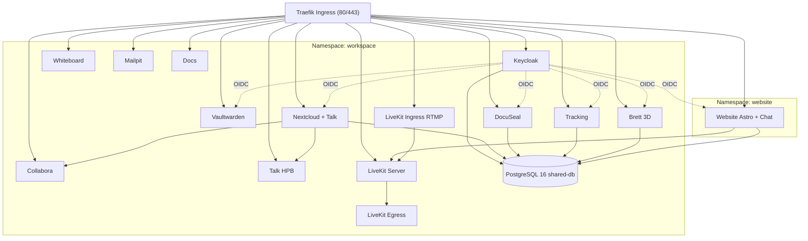

# Workspace MVP

Kubernetes-basierte Kollaborationsplattform für kleine Teams (Bachelorprojekt). Nextcloud (Dateien + Talk), Keycloak (SSO), Collabora (Office), Vaultwarden (Passwörter), DocuSeal (Verträge), Whiteboard, Brett (Systembrett), LiveKit (Streaming), eine Astro+Svelte Website mit eingebautem Chat — alles auf k3d/k3s mit Traefik Ingress. DSGVO-konform, alle Daten on-premises.

## Schnellstart (Dev / k3d)

Voraussetzungen: Docker, [k3d](https://k3d.io), kubectl, [task](https://taskfile.dev)

```bash
git clone https://github.com/Paddione/Bachelorprojekt.git && cd Bachelorprojekt
task workspace:up        # Cluster + Workspace + Office + MCP + Post-Setup
```

Oder schrittweise:

```bash
task cluster:create
task workspace:deploy
task workspace:office:deploy   # Collabora (separater Overlay)
task workspace:post-setup      # Nextcloud-Apps + OIDC
```

## Produktion

Zwei k3s-Cluster mit ArgoCD-Federation (Hub auf `mentolder`, Spoke `korczewski`). Jede ENV-aware Task akzeptiert `ENV=mentolder` oder `ENV=korczewski`:

```bash
task workspace:deploy ENV=mentolder
task feature:deploy            # fan-out auf beide Prod-Cluster
task health                    # Cross-Cluster-Status
```

Cluster-Topologie, Footguns und Operations-Befehle siehe **[CLAUDE.md](CLAUDE.md)** — das ist die maßgebliche Referenz für Entwicklung und Betrieb.

## Service-Endpunkte (Dev)

| Service | URL | Beschreibung |
|---------|-----|--------------|
| Website (Astro + Chat) | http://web.localhost | mentolder.de / korczewski.de (per `BRAND`) |
| Keycloak (SSO) | http://auth.localhost | Identity Provider |
| Nextcloud (Dateien + Talk) | http://files.localhost | Dateien, Kalender, Kontakte, Video |
| Collabora (Office) | http://office.localhost | WOPI-Backend für Nextcloud |
| Talk HPB (Signaling) | http://signaling.localhost | WebRTC (Janus + NATS + coturn) |
| Vaultwarden | http://vault.localhost | Passwort-Manager |
| Whiteboard | http://board.localhost | Kollaboratives Whiteboard |
| Brett (Systembrett) | http://brett.localhost | 3D-Aufstellungsboard |
| DocuSeal | http://sign.localhost | E-Signaturen |
| Docs | http://docs.localhost | Docsify-Dokumentation |
| Mailpit | http://mail.localhost | Dev-Mailserver |
| LiveKit | http://livekit.localhost | WebRTC Server (Streaming) |

In Produktion ersetzt `*.mentolder.de` / `*.korczewski.de` die `*.localhost`-Adressen.

## Architektur



## Repository-Layout (Kurzfassung)

- `k3d/` — Kubernetes-Basis-Manifeste (Kustomize, einziger Deployment-Pfad)
- `prod/`, `prod-mentolder/`, `prod-korczewski/` — Produktions-Overlays
- `environments/` — Per-Env Config + SealedSecrets
- `argocd/` — ApplicationSets + AppProject (Hub auf mentolder)
- `website/` — Astro + Svelte (Brand-aware: mentolder + korczewski)
- `brett/` — Node.js Systembrett-Service
- `arena-server/` — Multiplayer-Backend (nur korczewski)
- `scripts/`, `tests/`, `claude-code/`, `k3d/docs-content/`

## Tests

```bash
./tests/runner.sh local              # Alle Tests gegen k3d
./tests/runner.sh local <TEST-ID>    # Einzeltest (z.B. SA-08)
task test:all                        # Offline-Suite (Unit + Manifests + Dry-Run)
```

Test-IDs: `FA-01`…`FA-29` (funktional), `SA-01`…`SA-10` (Sicherheit), `NFA-01`…`NFA-09` (nicht-funktional), `AK-03`, `AK-04` (Abnahme). Lücken in den Nummern stammen aus entfernten Services (Mattermost, InvoiceNinja).

## Regeln

1. Einziger Deployment-Pfad: k3d/k3s mit Kustomize. Kein docker-compose.
2. Alle Änderungen über Pull Requests; Squash-and-Merge.
3. CI muss grün sein vor dem Merge (`task test:all`).
4. Domains zentral in `k3d/configmap-domains.yaml`; keine hartkodierten Hostnamen.
5. Prod-Secrets als SealedSecrets in `environments/sealed-secrets/`; niemals Klartext committen.
6. Detaillierte Konventionen, Gotchas und Tasks: siehe [CLAUDE.md](CLAUDE.md) und [CONTRIBUTING.md](CONTRIBUTING.md).
