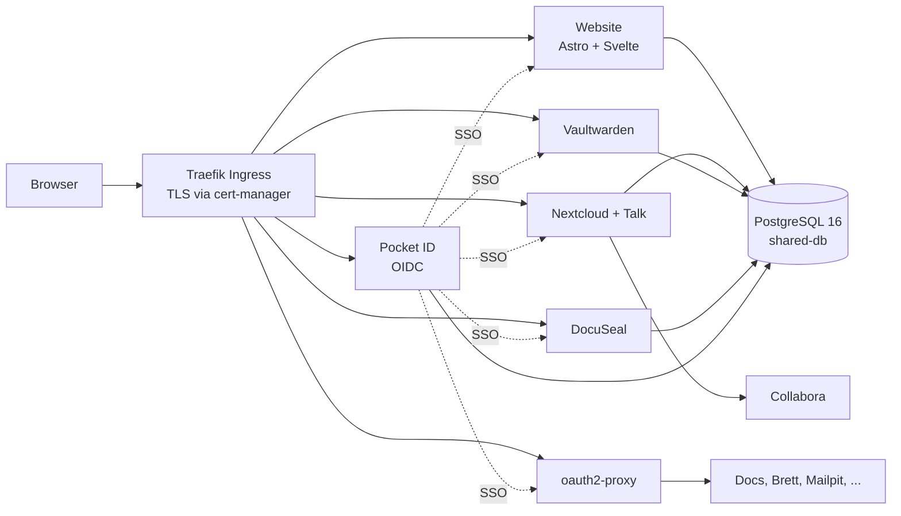

# Workspace MVP

**Selbst gehostete Kollaborationsplattform für kleine Teams auf Kubernetes, entstanden als Bachelorprojekt und seitdem im Produktivbetrieb.**

Die Plattform bündelt Dateien, Videokonferenzen, Office, Passwortverwaltung, Dokumentensignatur, Chat und eine öffentliche Website hinter einem gemeinsamen Single Sign-on. Alle Daten bleiben auf eigener Infrastruktur, Datenschutz nach DSGVO ist eine Architekturvorgabe und keine nachträgliche Konfiguration.

Live-Instanz: [mentolder.de](https://mentolder.de)


## Was die Plattform leistet

| Bereich | Umsetzung |
|---|---|
| Dateien und Video | Nextcloud mit Talk, High-Performance-Backend, coturn und Janus |
| Office | Collabora Online, direkt in Nextcloud eingebunden |
| Identität | Pocket ID als OIDC-Provider für rund 20 Clients, oauth2-proxy vor Diensten ohne eigenes OIDC |
| Passwörter | Vaultwarden |
| Verträge | DocuSeal für digitale Signaturen |
| Website und Chat | Astro/Svelte-Website mit eingebautem Messaging, Terminbuchung und Abrechnung inkl. E-Rechnung |
| Zusammenarbeit | Whiteboard und Brett, ein 3D-Board für systemische Aufstellungen |
| Betrieb | Tägliche Datenbank- und Volume-Backups mit wöchentlicher Restore-Verifikation, Monitoring mit Prometheus, Grafana, Loki und OpenTelemetry |

## Architektur


```mermaid
flowchart LR
    U[Browser] --> T[Traefik Ingress<br/>TLS via cert-manager]
    T --> P[Pocket ID<br/>OIDC]
    T --> W[Website<br/>Astro + Svelte]
    T --> N[Nextcloud + Talk]
    T --> O[oauth2-proxy]
    O --> S[Docs, Brett, Mailpit, ...]
    N --> C[Collabora]
    T --> V[Vaultwarden]
    T --> D[DocuSeal]
    W & N & V & D & P --> DB[(PostgreSQL 16<br/>shared-db)]
    P -. SSO .-> W & N & V & D & O
```

Alle Dienste laufen als Kubernetes-Deployments auf einem k3s-Cluster mit drei Control-Plane-Knoten und mehreren Workern bei Hetzner. Die Knoten sind über WireGuard vernetzt. Eine PostgreSQL-Instanz hält je Dienst eine eigene Datenbank.

Die Plattform ist mandantenfähig: Zwei Marken laufen aus derselben Codebasis in getrennten Namespaces, gesteuert über Kustomize-Overlays und Umgebungsprofile.

Die Architekturentscheidungen sind als [ADRs](docs/adr/) dokumentiert, zum Beispiel die [Konsolidierung auf einen Cluster](docs/adr/ADR-001-fleet-konsolidierung.md) und die [Trennung der Marken nach Namespace](docs/adr/ADR-003-brand-namespace-split.md).

## Technische Schwerpunkte

1. **GitOps-Deployment.** Jeder Merge auf `main` rendert die Manifeste zu einem OCI-Artefakt, das Flux auf dem Cluster abgleicht. Ein manueller Deploy-Pfad existiert nur für Notfälle.
2. **Secrets.** Klartext-Secrets liegen git-crypt-verschlüsselt im Repository und werden als SealedSecrets ausgerollt. gitleaks prüft jeden Commit.
3. **Spezifikationsgetriebene Entwicklung.** Anforderungen sind als [OpenSpec-Spezifikationen](openspec/specs/) beschrieben. Jede Änderung durchläuft Proposal, Delta-Spec und Archivierung.
4. **Testabdeckung.** BATS-Tests für Skripte und Manifeste, Vitest für die Website und Playwright-E2E-Tests gegen die laufenden Umgebungen. Die CI blockiert jeden Merge ohne grüne Prüfungen.
5. **KI-gestützter Entwicklungsprozess.** Ein Ticket-System steuert Coding-Agents durch Planung, Umsetzung, Review und Merge. Lokale LLMs übernehmen Routineaufgaben, Embedding und Reranking laufen auf eigener GPU.

## Kennzahlen

Stand September 2026.

| | |
|---|---|
| Entwicklungszeitraum | seit März 2026 |
| Commits | über 8.400 |
| Gemergte Pull Requests | über 5.000 |
| OpenSpec-Spezifikationen | 129 aktiv, über 900 archivierte Changes |
| Testdateien | über 900 BATS, über 500 Vitest, über 150 Playwright |
| GitHub-Actions-Workflows | 31 |

## Technologie

**Infrastruktur:** k3s, Kustomize, FluxCD, Traefik, cert-manager, SealedSecrets, git-crypt, WireGuard, Hetzner Cloud

**Anwendungen:** Astro, Svelte 5, TypeScript, Node.js, React, Three.js, PostgreSQL 16, Redis

**Qualität und Betrieb:** GitHub Actions, BATS, Vitest, Playwright, Lighthouse CI, Renovate, release-please, Prometheus, Grafana, Loki, OpenTelemetry

## Repository-Layout

| Bereich | Inhalt |
|---|---|
| [components/](components/) | Anwendungen: Website, Brett, VideoVault und weitere |
| [packages/](packages/) | Gemeinsame Pakete wie das Design-System |
| [k3d/](k3d/) | Kubernetes-Basis-Manifeste (der Verzeichnisname ist historisch) |
| [prod-fleet/](prod-fleet/), [flux/](flux/) | Produktions-Overlays und GitOps-Konfiguration |
| [prod/](prod/), [prod-mentolder/](prod-mentolder/), [prod-korczewski/](prod-korczewski/) | Von den Fleet-Overlays referenzierte Basen, nicht direkt anwenden |
| [dev-local/](dev-local/), [devmesh/](devmesh/) | Lokaler Entwicklungscluster |
| [environments/](environments/) | Umgebungsprofile, Schema und verschlüsselte Secrets |
| [scripts/](scripts/), [taskfiles/](taskfiles/), [Taskfile.yml](Taskfile.yml) | Automatisierung |
| [tests/](tests/), [openspec/](openspec/) | Tests, Spezifikationen und Change-Archiv |
| [docs/](docs/README.md) | Dokumentation, Runbooks und ADRs |

## Für Entwickler

- [Beitragen](CONTRIBUTING.md): Worktrees, Package Manager und Prüfungen
- [Dokumentationswegweiser](docs/README.md): Architektur, Betrieb und Referenzen
- [Website lokal starten](components/website/CLAUDE.md#dev-quick-start): Docker- und Host-Variante
- [Agent-Einstieg](AGENTS.md): Arbeitsregeln für Coding-Agents, ausführliche Referenz in [CLAUDE.md](CLAUDE.md)

Der lokale Kubernetes-Stack nutzt die Overlays in [dev-local/](dev-local/) und die Tasks in [taskfiles/Taskfile.devmesh.yml](taskfiles/Taskfile.devmesh.yml), beschrieben in [ADR-008](docs/adr/ADR-008-local-k3s-dev-mesh.md) und im [Devmesh-Runbook](docs/runbooks/devmesh-tailnet.md).

Vor einem Pull Request:

```bash
task test:changed
task freshness:check
task workspace:validate
```

Änderungen laufen über Worktrees und Pull Requests mit Squash-Merge. Root und Brett verwenden npm, die Website pnpm.

## Autor und Lizenz

Patrick Korczewski · [GitHub](https://github.com/Paddione)

Veröffentlicht unter der [MIT-Lizenz](LICENSE).
