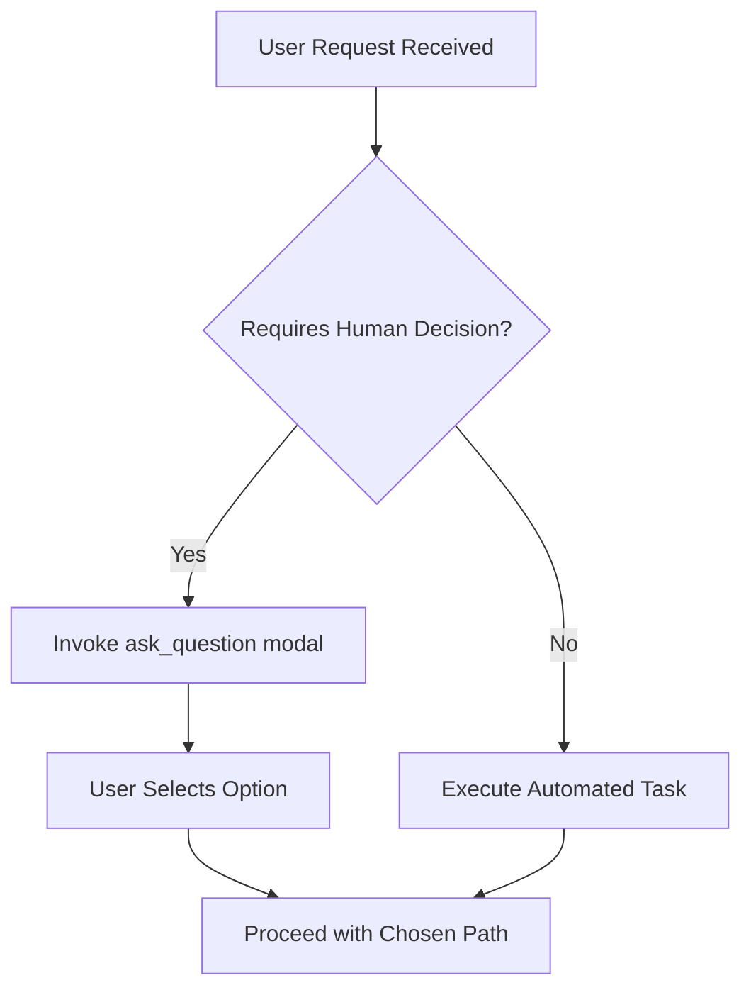

# Agent Visual Accessibility & Decision Modals Guide

## Overview

This guide establishes standard patterns and rules for agent visual presentation, decision-making interaction, and visual accessibility across harnesses (Antigravity, opencode, Claude Code). Adhering to these guidelines ensures clean human-in-the-loop interactions, prevents verbose log infodumps, and enhances clarity through visual surfaces.

---

## 1. Harness-Native Decision Modals (`ask_question` / `AskUserQuestion`)

When an agent needs human input to clarify requirements, select between design alternatives, or choose an architectural path, it MUST use harness-native decision modal tools rather than asking open-ended text questions in prose.

### Guidelines & Rules
- **Direct User Responses**: Format option strings as the direct response from the user's perspective (e.g. `"Use PostgreSQL schema migration"`).
- **Recommendation First**: Place recommended options at the top of the list and prefix them with `(Recommended)` (e.g. `"(Recommended) Migrate via task database:migrate"`).
- **Clickable File Links**: Include GitHub-style markdown links with exact line numbers using `file://` URIs (e.g. `[schema.sql](file:///path/to/schema.sql#L10-L25)`).
- **No Option Numbers**: Do not prefix options with numbers or bullets (e.g., `1. Option A`); the UI enumerates options automatically.
- **No 'Other' Write-In Option**: Do not add an explicit "Other" option; write-in fields are provided natively by the UI.
- **No Selection Instructions in Question**: Do not include "Select all that apply" in the question text; UI handles multi-select indications automatically via `is_multi_select: true`.

### Code Example: Invoking `ask_question`

```json
{
  "questions": [
    {
      "question": "Which database migration strategy should be applied for ticket [T900165](file:///home/patrick/Bachelorprojekt/docs/agent-guide/visual-accessibility.md)?",
      "options": [
        "(Recommended) Apply declarative Kustomize migration via task workspace:deploy",
        "Run direct psql schema migration script",
        "Defer migration until deployment phase"
      ],
      "is_multi_select": false
    }
  ]
}
```

---

## 2. Progressive Information Disclosure (`<details><summary>`)

To prevent wall-of-text infodumps, raw execution logs, stack traces, and verbose context dumps (>10 lines) MUST be wrapped in collapsible HTML disclosure blocks.

### Guidelines & Rules
- Use `<details><summary>` for all command logs, raw JSON outputs, stack traces, or long listing results.
- Pair collapsed logs with a high-level executive summary in prose or GitHub-style alert boxes (`[!NOTE]`, `[!TIP]`, `[!IMPORTANT]`, `[!WARNING]`, `[!CAUTION]`).
- Do not stack or nest alerts consecutively.

### Code Example: Progressive Disclosure & Alert Syntax

```markdown
> [!NOTE]
> All 15 unit tests passed successfully for the visual accessibility module.

<details>
<summary>Click to view raw test execution log (42 lines)</summary>

```bash
✓ tests/spec/agent-visual-decision.bats (3.1s)
  ✓ OpenSpec delta agent-behavior.md exists (120ms)
  ✓ Visual accessibility guide docs/agent-guide/visual-accessibility.md exists (95ms)
  ✓ Guide covers ask_question decision modals (80ms)
  ✓ Guide covers details summary progressive disclosure (85ms)
  ✓ Guide covers Mermaid flowcharts and Carousels (90ms)
  ✓ Guide covers Lavish HTML review surfaces (110ms)
```

</details>
```

---

## 3. Visual Diagrams & Markdown Carousels

Complex branching logic, multi-stage deployment pipelines, architectural decision trees, and visual comparisons MUST be rendered using Mermaid flowcharts or Markdown Carousels instead of long, unstructured bullet lists.

### Mermaid Flowcharts
- Use `flowchart TD` or `flowchart LR`.
- Always quote labels containing special characters, brackets, or parentheses: `id["Label (Details)"]`.
- Avoid raw HTML inside node labels.

#### Code Example: Mermaid Decision Flowchart



### Markdown Carousels
- Use ````carousel syntax with `<!-- slide -->` HTML comments to present before/after comparisons, UI progressions, or step-by-step visual walkthroughs.

#### Code Example: Markdown Carousel

````carousel
```markdown
<!-- Slide 1: Unstructured Log Infodump -->
Raw execution output printed directly to chat stream causing heavy scrolling.
```
<!-- slide -->
```markdown
<!-- Slide 2: Progressive Disclosure -->
<details>
<summary>View raw execution log</summary>
Log output collapsed inside clean disclosure block.
</details>
```
````

---

## 4. Lavish HTML Review Surfaces (`lavish-axi`)

For complex UI component designs, multi-file visual diffs, interactive wireframes, or rich analytical reports, agents can launch browser-based Lavish HTML review surfaces using `lavish-axi`.

### Guidelines & Rules
- **Consent Gate**: Always obtain user agreement/consent before launching an interactive browser review session.
- **Artifact Creation**: Save rich HTML artifacts in the conversation artifact directory (`<appDataDir>/brain/<conversation-id>/`).
- **Lavish CLI**: Invoke `lavish-axi` to render the interactive surface and receive structured user feedback annotations.

### Code Example: Lavish Surface Invocation Workflow

```bash
# 1. Generate HTML review artifact
# 2. Invoke lavish-axi CLI surface
lavish-axi serve --file /path/to/artifact/ui_preview.html --title "Agent Visual Review"
```
