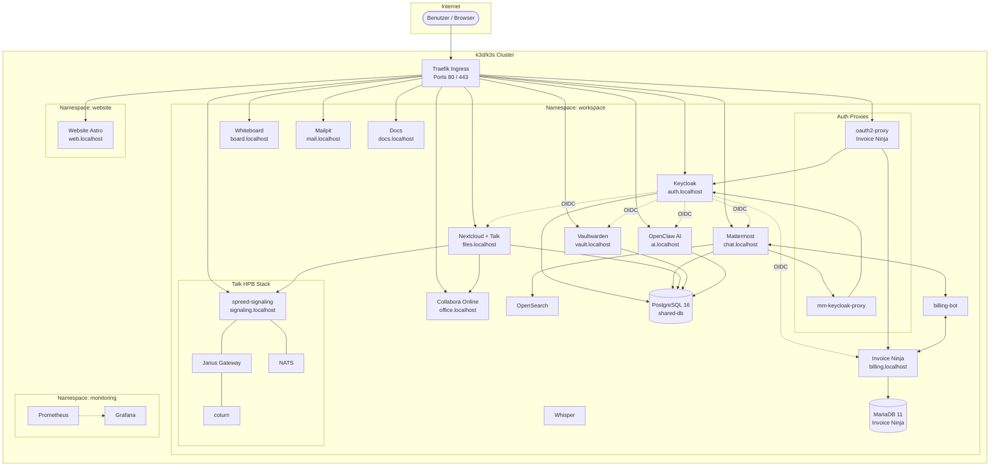
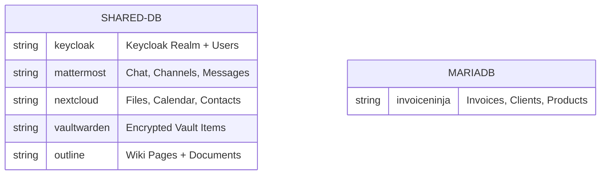
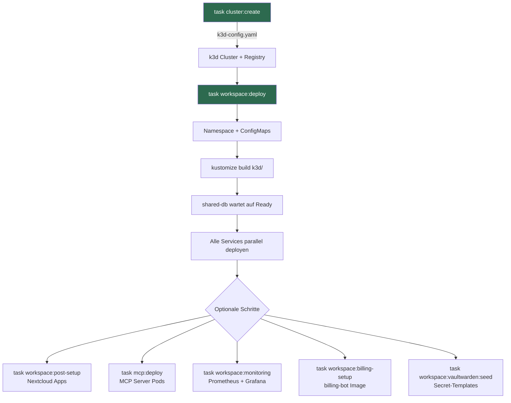

# Architektur

## Systemuebersicht

Workspace MVP ist eine Kubernetes-basierte Kollaborationsplattform fuer kleine Teams. Alle Services laufen als Deployments in einem k3d/k3s Cluster mit Traefik als Ingress Controller. Daten bleiben vollstaendig on-premises (DSGVO by Design).

## Namespaces

| Namespace | Zweck |
|-----------|-------|
| `workspace` | Alle Kernservices (Mattermost, Nextcloud, Keycloak, etc.) |
| `website` | Astro + Svelte Unternehmenswebsite |
| `monitoring` | Prometheus + Grafana Stack (optional) |
| `cert-manager` | TLS-Zertifikate via Let's Encrypt (Produktion) |
| `kube-system` | Traefik Ingress Controller (k3s built-in) |

Der `workspace`-Namespace hat Pod Security Standards konfiguriert:
- **enforce: baseline** -- Mindestanforderungen erzwungen
- **warn: restricted** -- Warnungen bei Verstoss gegen strengere Richtlinien

## Datenbank-Layout

Ein geteilter PostgreSQL 16 Cluster (`shared-db`) hostet mehrere Datenbanken:

Invoice Ninja verwendet eine separate MariaDB 11 Instanz, da es MySQL/MariaDB erfordert.

## Netzwerk und Routing

Traefik (k3s built-in) routet anhand von Host-Headern:

| Host | Service | Port |
|------|---------|------|
| auth.localhost | keycloak | 8080 |
| chat.localhost | mattermost | 8065 |
| files.localhost | nextcloud | 80 |
| office.localhost | collabora | 9980 |
| signaling.localhost | spreed-signaling | 8080 |
| meet.localhost | spreed-signaling | 8080 |
| ai.localhost | openclaw | 8080 |
| billing.localhost | oauth2-proxy-invoiceninja | 4180 |
| vault.localhost | vaultwarden | 80 |
| board.localhost | whiteboard | 3002 |
| mail.localhost | mailpit | 8025 |
| docs.localhost | docs | 80 |
| web.localhost | website | 4321 |
| wiki.localhost | outline | 3000 |

Alle Domains werden zentral in `k3d/configmap-domains.yaml` definiert.

## Persistent Storage

| PVC | Groesse | Service |
|-----|---------|---------|
| shared-db-data | 25 Gi | PostgreSQL |
| mattermost-data | 20 Gi | Mattermost Dateien |
| nextcloud-app | 2 Gi | Nextcloud App |
| nextcloud-data | 50 Gi | Nextcloud Dateien |
| openclaw-data | 2 Gi | OpenClaw AI Daten |
| invoiceninja-public | 5 Gi | Invoice Ninja |
| invoiceninja-mariadb-data | 5 Gi | MariaDB |
| vaultwarden-data | 5 Gi | Vaultwarden |
| opensearch-data | 5 Gi | OpenSearch Index |
| outline-data | 5 Gi | Outline Wiki |
| backup-pvc | 1 Gi | Verschluesselte Backups |

## Deployment-Ablauf

Alternativ: `task workspace:up` fuer vollautomatisches Setup (Cluster + MVP + MCP + Monitoring + Billing).

## Backup-Strategie

- **Zeitplan:** Taeglich um 02:00 UTC (CronJob)
- **Scope:** PostgreSQL-Datenbanken (keycloak, mattermost, nextcloud)
- **Verschluesselung:** AES-256-CBC mit PBKDF2 (openssl)
- **Rotation:** 30-Tage-Aufbewahrung, aeltere Backups werden automatisch geloescht
- **Speicher:** 1 Gi PVC (`backup-pvc`)
