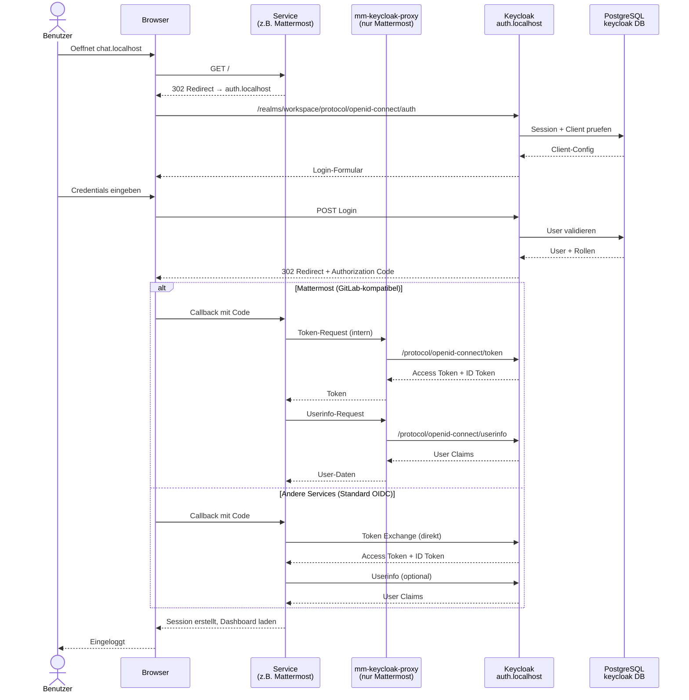
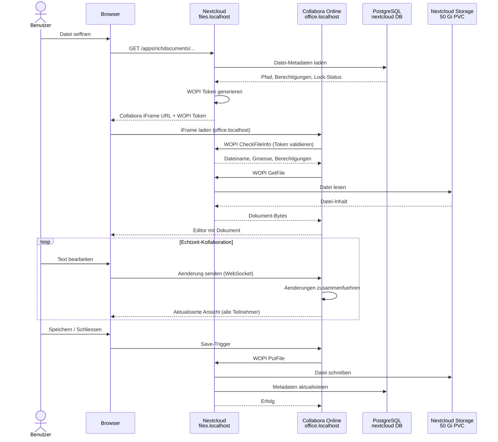
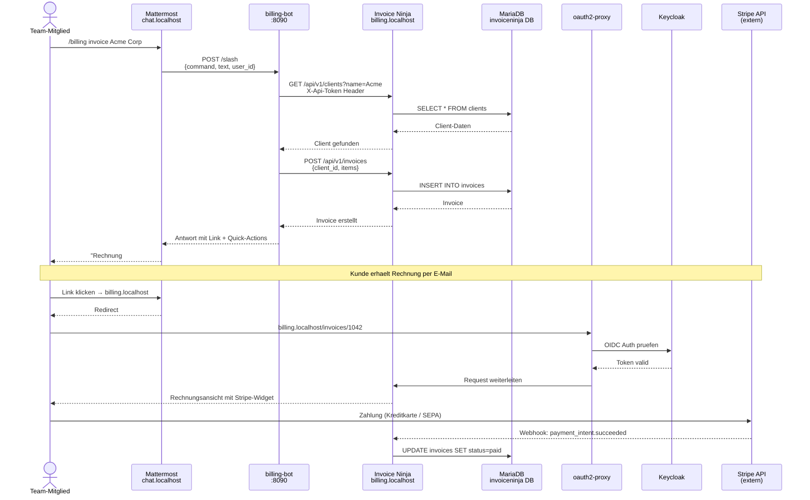
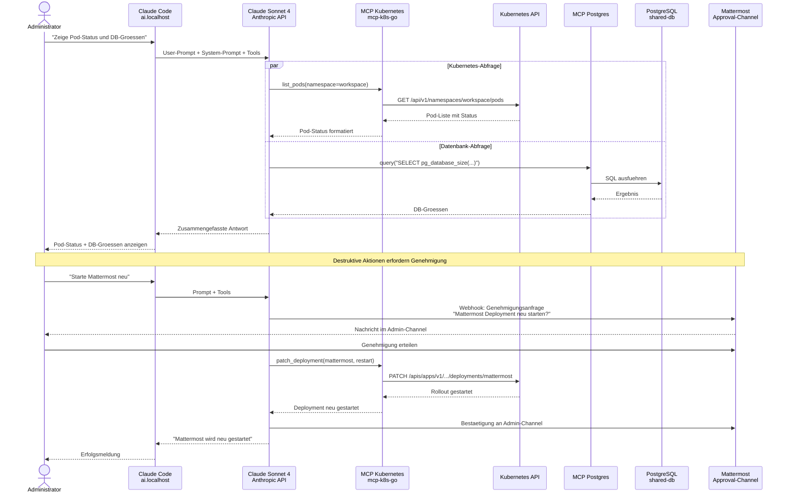
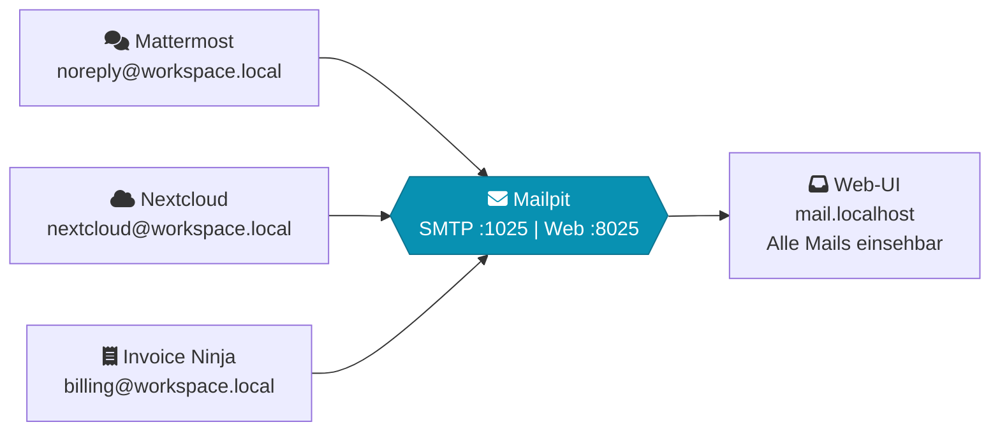
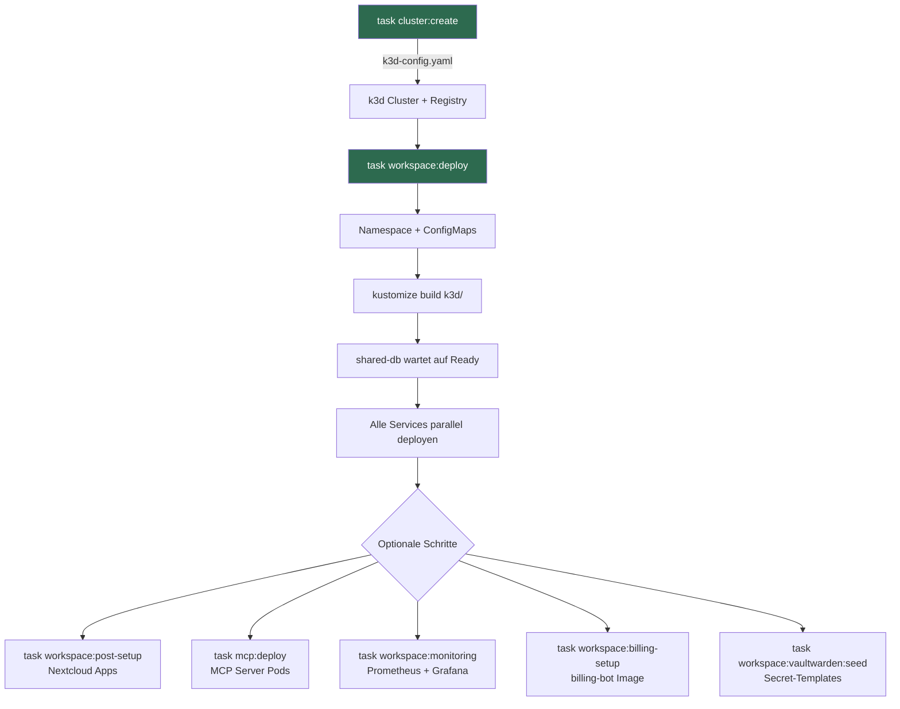

# Architektur

## Systemuebersicht

Workspace MVP ist eine Kubernetes-basierte Kollaborationsplattform fuer kleine Teams. Alle Services laufen als Deployments in einem k3d/k3s Cluster mit Traefik als Ingress Controller. Daten bleiben vollstaendig on-premises (DSGVO by Design).

> **Tipp:** Die Service-Boxen im Diagramm sind klickbar und fuehren zu den Detail-Abschnitten weiter unten.

```mermaid
flowchart TB
    User([fa:fa-user Benutzer / Browser])

    subgraph cluster ["fa:fa-server k3d/k3s Cluster"]
        direction TB
        Traefik{{"fa:fa-globe Traefik Ingress\n80 / 443"}}

        subgraph identity ["fa:fa-shield-halved Identitaet"]
            KC["fa:fa-key Keycloak\nauth.localhost"]
            PROXY["mm-keycloak-proxy"]
            OAUTH["oauth2-proxy"]
        end

        subgraph collaboration ["fa:fa-users Kommunikation & Zusammenarbeit"]
            MM["fa:fa-comments Mattermost\nchat.localhost"]
            NC["fa:fa-cloud Nextcloud + Talk\nfiles.localhost"]
            CO["fa:fa-file-word Collabora Online\noffice.localhost"]
            WB["fa:fa-chalkboard Whiteboard\nboard.localhost"]
            OL["fa:fa-book Outline Wiki\nwiki.localhost"]
        end

        subgraph video ["fa:fa-video Talk HPB Stack"]
            SIG["spreed-signaling\nsignaling.localhost"]
            JANUS["Janus Gateway"]
            NATS["NATS"]
            COTURN["coturn"]
        end

        subgraph ai ["fa:fa-robot KI & Automatisierung"]
            OC["fa:fa-brain Claude Code AI\nai.localhost"]
            MCP_K8S["MCP Kubernetes"]
            MCP_PG["MCP Postgres"]
            MCP_BR["MCP Browser"]
            WHISPER["fa:fa-microphone Whisper"]
        end

        subgraph billing ["fa:fa-file-invoice Abrechnung"]
            IN["fa:fa-receipt Invoice Ninja\nbilling.localhost"]
            BB["billing-bot"]
        end

        subgraph tools ["fa:fa-toolbox Werkzeuge"]
            VW["fa:fa-lock Vaultwarden\nvault.localhost"]
            MP["fa:fa-envelope Mailpit\nmail.localhost"]
            DOCS["fa:fa-file-lines Docs\ndocs.localhost"]
        end

        subgraph data ["fa:fa-database Datenhaltung"]
            DB[("PostgreSQL 16\nshared-db\n5 Datenbanken")]
            MARIA[("MariaDB 11\ninvoiceninja")]
            OS[("OpenSearch\nVolltextsuche")]
            REDIS[("Redis\nOutline Cache")]
        end

        subgraph external ["Weitere Namespaces"]
            WEB["fa:fa-globe Website Astro\nweb.localhost"]
            PROM["fa:fa-chart-line Prometheus"]
            GRAF["fa:fa-gauge Grafana"]
        end
    end

    %% --- Ingress Layer ---
    User --> Traefik
    Traefik --> KC
    Traefik --> MM
    Traefik --> NC
    Traefik --> CO
    Traefik --> SIG
    Traefik --> OC
    Traefik --> OAUTH
    Traefik --> VW
    Traefik --> WB
    Traefik --> MP
    Traefik --> DOCS
    Traefik --> WEB
    Traefik --> OL

    %% --- OIDC (Keycloak als IdP) ---
    KC -. "OIDC" .-> MM
    KC -. "OIDC" .-> NC
    KC -. "OIDC" .-> IN
    KC -. "OIDC" .-> OC
    KC -. "OIDC" .-> VW
    KC -. "OIDC" .-> OL
    KC -. "OIDC" .-> WEB

    %% --- Auth Proxies ---
    MM --> PROXY --> KC
    OAUTH --> KC
    OAUTH --> IN

    %% --- Collaboration ---
    NC --> CO
    NC --> SIG
    SIG --- JANUS
    SIG --- NATS
    JANUS --- COTURN

    %% --- Billing ---
    MM <--> BB <--> IN

    %% --- AI/MCP ---
    OC --> MCP_K8S
    OC --> MCP_PG
    OC --> MCP_BR

    %% --- Search ---
    MM --> OS

    %% --- Datenbanken ---
    KC --> DB
    MM --> DB
    NC --> DB
    VW --> DB
    OC --> DB
    OL --> DB
    IN --> MARIA
    OL --> REDIS

    %% --- Monitoring ---
    PROM -.-> GRAF

    %% --- SMTP ---
    MM -. "SMTP" .-> MP
    NC -. "SMTP" .-> MP
    IN -. "SMTP" .-> MP

    %% --- Klickbare Nodes ---
    click KC "#keycloak" "Keycloak: Zentraler OIDC Identity Provider fuer SSO. Verwaltet Benutzer, Rollen und 7 OIDC-Clients. Speichert Sessions und Realm-Konfiguration in PostgreSQL."
    click MM "#mattermost" "Mattermost: Team-Chat mit Channels, Threads und Dateifreigabe. Integriert OpenSearch fuer Volltextsuche, Webhooks fuer Automatisierung und Slash-Commands fuer billing-bot."
    click NC "#nextcloud" "Nextcloud: Dateiverwaltung, Kalender, Kontakte und Videokonferenzen via Talk. WOPI-Integration mit Collabora fuer Office-Dokumente. WebRTC via HPB Stack."
    click CO "#collabora" "Collabora Online: LibreOffice-basierter Office-Editor im Browser. Bearbeitet DOCX, XLSX, PPTX, ODT Dateien kollaborativ ueber WOPI-Protokoll mit Nextcloud."
    click OC "#claude-code" "Claude Code: KI-Assistent mit Claude Sonnet 4. Nutzt MCP-Server fuer Kubernetes-Verwaltung, Datenbank-Abfragen und Browser-Automatisierung. RBAC-gesichert."
    click IN "#invoice-ninja" "Invoice Ninja: Rechnungserstellung, Kundenverwaltung und Zahlungsabwicklung via Stripe. Geschuetzt durch oauth2-proxy. Eigene MariaDB-Instanz."
    click VW "#vaultwarden" "Vaultwarden: Self-hosted Bitwarden-kompatibler Passwort-Manager. Speichert verschluesselte Vault-Items in PostgreSQL. OIDC-Login via Keycloak."
    click BB "#billing-bot" "billing-bot: Go-Microservice. Verbindet Mattermost Slash-Commands mit Invoice Ninja API fuer schnelle Rechnungs- und Kundenerstellung aus dem Chat."
    click OL "#outline" "Outline: Kollaboratives Wiki fuer Teamwissen. Markdown-basiert mit Echtzeit-Bearbeitung, verschachtelten Dokumenten und Volltextsuche. Redis fuer Sessions."
    click WB "#whiteboard" "Whiteboard: Nextcloud-integriertes Whiteboard fuer visuelle Zusammenarbeit. Echtzeit-Kollaboration ueber WebSockets."
    click MP "#mailpit" "Mailpit: SMTP-Testserver fuer Entwicklung. Faengt alle ausgehenden E-Mails ab (kein Versand). Web-UI zur Inspektion von Benachrichtigungen."
    click DB "#datenbank-layout" "PostgreSQL 16 shared-db: 5 isolierte Datenbanken (keycloak, mattermost, nextcloud, vaultwarden, outline) mit eigenem User je Service."
    click MARIA "#datenbank-layout" "MariaDB 11: Dedizierte Instanz fuer Invoice Ninja (benoetigt MySQL-Kompatibilitaet)."
    click OS "#datenbank-layout" "OpenSearch 2.17: Elasticsearch-kompatibler Suchindex fuer Mattermost Volltextsuche und Autocomplete."
    click WEB "#website" "Website: Astro + Svelte Unternehmenswebsite mit Kontaktformular (Mattermost Webhook) und OIDC-Login."
    click PROM "#monitoring" "Prometheus: Metriken-Sammlung aller Kubernetes-Ressourcen. Speist DSGVO-Compliance-Dashboard."
    click GRAF "#monitoring" "Grafana: Visualisierung der Prometheus-Metriken. Enthaelt DSGVO-Compliance-Dashboard (NFA-02)."
    click WHISPER "#whisper" "Whisper: faster-whisper Transkriptionsservice fuer Audio-zu-Text Konvertierung."
    click SIG "#talk-hpb" "spreed-signaling: WebRTC-Signaling-Server fuer Nextcloud Talk Videokonferenzen."
    click MCP_K8S "#claude-code" "MCP Kubernetes: Read-only Zugriff auf Pods, Deployments, Services, Logs. Kann Deployments neu starten (mit Genehmigung)."
    click MCP_PG "#claude-code" "MCP Postgres: Superuser-Zugriff auf alle shared-db Datenbanken fuer Analyse und Debugging."

    %% --- Styles ---
    classDef identity_style fill:#4a90d9,color:#fff,stroke:#2d6a9f
    classDef collab_style fill:#2d8659,color:#fff,stroke:#1a5c3a
    classDef ai_style fill:#8b5cf6,color:#fff,stroke:#6d3ad4
    classDef billing_style fill:#d97706,color:#fff,stroke:#b45309
    classDef data_style fill:#6b7280,color:#fff,stroke:#4b5563
    classDef tools_style fill:#0891b2,color:#fff,stroke:#0e7490
    classDef infra_style fill:#374151,color:#fff,stroke:#1f2937

    class KC,PROXY,OAUTH identity_style
    class MM,NC,CO,WB,OL collab_style
    class OC,MCP_K8S,MCP_PG,MCP_BR,WHISPER ai_style
    class IN,BB billing_style
    class DB,MARIA,OS,REDIS data_style
    class VW,MP,DOCS tools_style
    class Traefik,WEB,PROM,GRAF infra_style
```



---

## Workflows

### SSO-Authentifizierung (OIDC)

Keycloak ist der zentrale Identity Provider. Alle Services authentifizieren ueber OpenID Connect. Mattermost nutzt einen internen Proxy, da es das GitLab-OAuth-Protokoll erwartet.



**Registrierte OIDC-Clients:** Mattermost, Nextcloud, Invoice Ninja, Claude Code, Vaultwarden, Outline, Website (7 Clients im Realm `workspace`)

---

### Datei-Kollaboration (Nextcloud + Collabora)

Dokumente werden in Nextcloud gespeichert und ueber das WOPI-Protokoll in Collabora Online bearbeitet. Mehrere Benutzer koennen gleichzeitig am selben Dokument arbeiten.



---

### Videokonferenz (Nextcloud Talk + HPB)

Nextcloud Talk nutzt den High Performance Backend (HPB) Stack fuer skalierbare Videokonferenzen. Signaling koordiniert die Teilnehmer, Janus leitet die Medienstroeme.

```mermaid
sequenceDiagram
    actor User1 as Teilnehmer A
    actor User2 as Teilnehmer B
    participant NC as Nextcloud Talk<br/>files.localhost
    participant SIG as spreed-signaling<br/>signaling.localhost
    participant NATS as NATS<br/>Message Bus
    participant JANUS as Janus<br/>WebRTC SFU
    participant TURN as coturn<br/>NAT Traversal

    User1 ->> NC: Anruf starten
    NC ->> NC: Raum erstellen, Token generieren
    NC -->> User1: Signaling-URL + Token

    User1 ->> SIG: WebSocket verbinden + Auth
    SIG ->> NC: Backend-Validierung (HTTP)
    NC -->> SIG: Teilnehmer autorisiert
    SIG ->> NATS: Raum-Event publizieren

    User2 ->> NC: Anruf beitreten
    NC -->> User2: Signaling-URL + Token
    User2 ->> SIG: WebSocket verbinden + Auth
    SIG ->> NATS: Teilnehmer-Event

    Note over SIG,JANUS: SDP Offer/Answer Austausch

    User1 ->> SIG: SDP Offer
    SIG ->> JANUS: Publish Stream
    JANUS -->> SIG: SDP Answer
    SIG -->> User1: SDP Answer

    User2 ->> SIG: Subscribe Request
    SIG ->> JANUS: Subscribe to Stream
    JANUS -->> SIG: Media Stream
    SIG -->> User2: SDP Answer

    alt Direktverbindung moeglich
        User1 <--> JANUS: Media (RTP/SRTP)
        JANUS <--> User2: Media (RTP/SRTP)
    else NAT/Firewall blockiert
        User1 <--> TURN: TURN Relay
        TURN <--> JANUS: Media weiterleiten
        JANUS <--> User2: Media (RTP/SRTP)
    end
```

---

### Abrechnung (billing-bot + Invoice Ninja)

Der billing-bot verbindet Mattermost Slash-Commands mit der Invoice Ninja API. Zahlungen laufen ueber Stripe.



---

### KI-Assistent (Claude Code + MCP)

Claude Code nutzt Claude Sonnet 4 mit MCP-Servern (Model Context Protocol) fuer Kubernetes-Management, Datenbank-Analyse und Browser-Automatisierung.



**MCP-Server und Berechtigungen (RBAC):**

| MCP-Server | Protokoll | Kann | Kann nicht |
|------------|-----------|------|------------|
| mcp-kubernetes | mcp-k8s-go | Pods, Deployments, Services, Logs, Events lesen; Deployments skalieren/neustarten | Loeschen, Erstellen, Exec, Secrets lesen |
| mcp-postgres | @modelcontextprotocol/server-postgres | Alle 5 shared-db Datenbanken abfragen (Superuser) | Schreibzugriff (per Konvention im System-Prompt) |
| mcp-browser | Playwright | URLs navigieren, Screenshots, Formulare ausfuellen | Keine Netzwerk-Beschraenkung (Cluster-intern) |
| mcp-mattermost | legard/mcp-server-mattermost | Channels, DMs, Posts lesen/schreiben | Admin-Operationen |
| mcp-nextcloud | ghcr.io/cbcoutinho/nextcloud-mcp-server | Dateien, Kalender, Kontakte (WebDAV/CalDAV/CardDAV) | Admin-Einstellungen |
| mcp-invoiceninja | ckanthony/openapi-mcp | Kunden, Rechnungen, Produkte, Zahlungen (REST API) | Direkte DB-Zugriffe |
| mcp-keycloak | quay.io/sshaaf/keycloak-mcp-server | Benutzer, Gruppen, Rollen, Sessions verwalten | Realm-Konfiguration aendern |
| mcp-github | ghcr.io/github/github-mcp-server | Repos, Issues, PRs, Code-Suche (PAT erforderlich) | Admin-Rechte |
| mcp-stripe | @stripe/agent-toolkit | Kunden, Zahlungen, Rechnungen, Abonnements | Kontoverwaltung |

---

### E-Mail-Zustellung (Mailpit)

Im Entwicklungsmodus faengt Mailpit alle ausgehenden E-Mails ab. In Produktion wird ein externer SMTP-Server konfiguriert.



---

## Datenbank-Layout

### Uebersicht

```mermaid
erDiagram
    SHARED_DB["PostgreSQL 16 (shared-db) — 25 Gi PVC"] {
        database keycloak "Realms, Users, Sessions, Clients"
        database mattermost "Teams, Channels, Messages, Files"
        database nextcloud "Files, Calendar, Contacts, Shares"
        database vaultwarden "Encrypted Vaults, Organizations"
        database outline "Documents, Collections, Users"
    }

    MARIADB["MariaDB 11 (invoiceninja-mariadb) — 5 Gi PVC"] {
        database invoiceninja "Clients, Invoices, Products, Payments"
    }

    OPENSEARCH["OpenSearch 2.17 (opensearch) — 5 Gi PVC"] {
        index mattermost_posts "Volltextindex aller Nachrichten"
        index mattermost_channels "Channel-Suchindex"
    }

    REDIS["Redis 7 (Sidecar in Outline-Pod)"] {
        db sessions "Outline User Sessions"
        db cache "Document Render Cache"
    }

    KC_SVC["Keycloak"] ||--|| SHARED_DB : "keycloak DB"
    MM_SVC["Mattermost"] ||--|| SHARED_DB : "mattermost DB"
    NC_SVC["Nextcloud"] ||--|| SHARED_DB : "nextcloud DB"
    VW_SVC["Vaultwarden"] ||--|| SHARED_DB : "vaultwarden DB"
    OL_SVC["Outline"] ||--|| SHARED_DB : "outline DB"
    OL_SVC ||--|| REDIS : "sessions + cache"
    IN_SVC["Invoice Ninja"] ||--|| MARIADB : "invoiceninja DB"
    MM_SVC ||--|| OPENSEARCH : "Suchindex"
    MCP_PG["MCP Postgres"] }|--|| SHARED_DB : "superuser read-only"
```

### Datenbank-Isolation

Jede Datenbank hat einen eigenen User mit ausschliesslichem Zugriff auf seine Datenbank:

| Datenbank | User | Service | Besonderheiten |
|-----------|------|---------|----------------|
| `keycloak` | `keycloak` | Keycloak | Realm-Export als ConfigMap |
| `mattermost` | `mattermost` | Mattermost | + OpenSearch fuer Volltextsuche |
| `nextcloud` | `nextcloud` | Nextcloud | Datei-Metadaten, Kalender, Kontakte |
| `vaultwarden` | `vaultwarden` | Vaultwarden | Verschluesselte Vault-Items |
| `outline` | `outline` | Outline | + Redis Sidecar fuer Sessions |
| `invoiceninja` | `invoiceninja` | Invoice Ninja | Separate MariaDB (MySQL-Kompatibilitaet) |

Die Init-Skripte in `shared-db` erstellen User und Datenbanken idempotent beim ersten Start und synchronisieren Passwoerter bei Neustarts.

---

## Namespaces

| Namespace | Zweck |
|-----------|-------|
| `workspace` | Alle Kernservices (Mattermost, Nextcloud, Keycloak, etc.) |
| `website` | Astro + Svelte Unternehmenswebsite |
| `monitoring` | Prometheus + Grafana Stack (optional) |
| `cert-manager` | TLS-Zertifikate via Let's Encrypt (Produktion) |
| `kube-system` | Traefik Ingress Controller (k3s built-in) |

Der `workspace`-Namespace hat Pod Security Standards konfiguriert:
- **enforce: baseline** -- Mindestanforderungen erzwungen
- **warn: restricted** -- Warnungen bei Verstoss gegen strengere Richtlinien

## Netzwerk und Routing

Traefik (k3s built-in) routet anhand von Host-Headern:

| Host | Service | Port |
|------|---------|------|
| auth.localhost | keycloak | 8080 |
| chat.localhost | mattermost | 8065 |
| files.localhost | nextcloud | 80 |
| office.localhost | collabora | 9980 |
| signaling.localhost | spreed-signaling | 8080 |
| meet.localhost | spreed-signaling | 8080 |
| ai.localhost | claude-code | 8080 |
| billing.localhost | oauth2-proxy-invoiceninja | 4180 |
| vault.localhost | vaultwarden | 80 |
| board.localhost | whiteboard | 3002 |
| mail.localhost | mailpit | 8025 |
| docs.localhost | docs | 80 |
| web.localhost | website | 4321 |
| wiki.localhost | outline | 3000 |

Alle Domains werden zentral in `k3d/configmap-domains.yaml` definiert.

## Persistent Storage

| PVC | Groesse | Service |
|-----|---------|---------|
| shared-db-data | 25 Gi | PostgreSQL |
| mattermost-data | 20 Gi | Mattermost Dateien |
| nextcloud-app | 2 Gi | Nextcloud App |
| nextcloud-data | 50 Gi | Nextcloud Dateien |
| invoiceninja-public | 5 Gi | Invoice Ninja |
| invoiceninja-mariadb-data | 5 Gi | MariaDB |
| vaultwarden-data | 5 Gi | Vaultwarden |
| opensearch-data | 5 Gi | OpenSearch Index |
| outline-data | 5 Gi | Outline Wiki |
| backup-pvc | 1 Gi | Verschluesselte Backups |

## Deployment-Ablauf



Alternativ: `task workspace:up` fuer vollautomatisches Setup (Cluster + MVP + MCP + Monitoring + Billing).

## Backup-Strategie

- **Zeitplan:** Taeglich um 02:00 UTC (CronJob)
- **Scope:** PostgreSQL-Datenbanken (keycloak, mattermost, nextcloud)
- **Verschluesselung:** AES-256-CBC mit PBKDF2 (openssl)
- **Rotation:** 30-Tage-Aufbewahrung, aeltere Backups werden automatisch geloescht
- **Speicher:** 1 Gi PVC (`backup-pvc`)
