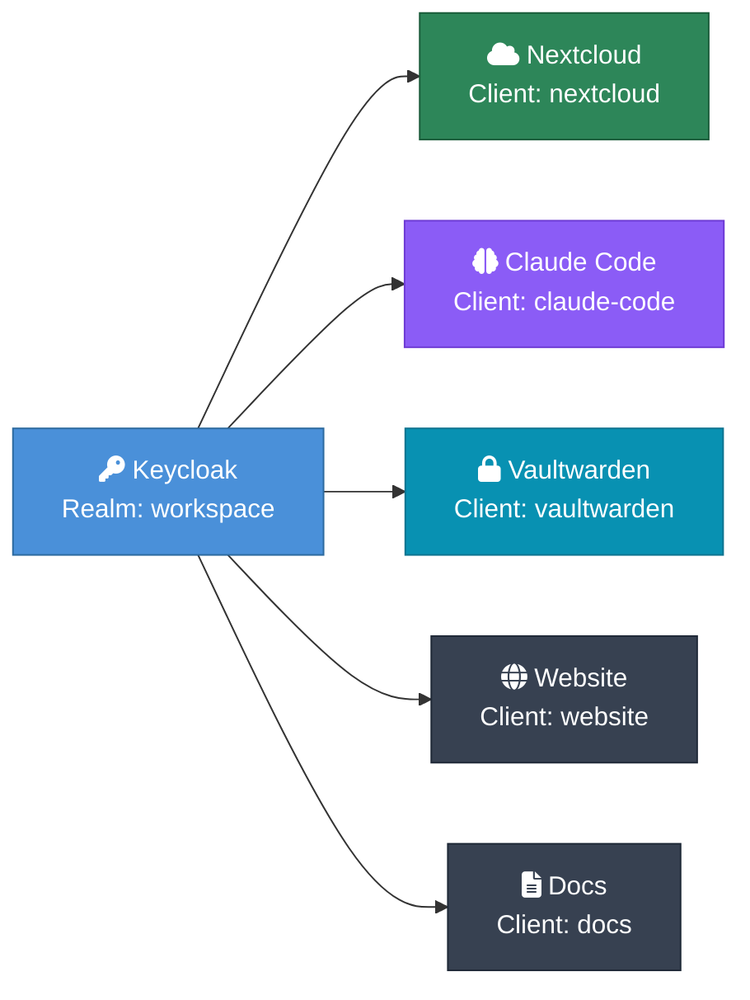
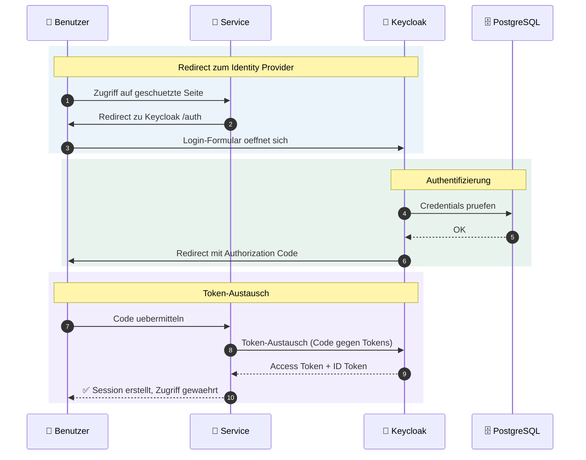

# Keycloak & SSO

## Uebersicht

Keycloak ist der zentrale Identity Provider fuer alle Services. Alle Anwendungen authentifizieren ueber OpenID Connect (OIDC) gegen den Realm `workspace`.

- **Image:** `quay.io/keycloak/keycloak:24.0`
- **URL:** http://auth.localhost
- **Admin-Login:** admin / devadmin
- **Realm:** `workspace`

## Realm-Konfiguration

Der Realm `workspace` wird beim Keycloak-Start automatisch aus einer Template-Datei importiert. Umgebungsvariablen (OIDC-Secrets, Domains) werden per `import-entrypoint.sh` substituiert.

**Realm-Einstellungen:**
- Anzeigename: "Workspace MVP (Dev)"
- SSL: none (Dev), external (Prod)
- Registrierung: deaktiviert
- Login mit E-Mail: aktiviert
- Brute-Force-Schutz: aktiviert
- Passwort-Richtlinie: min. 12 Zeichen, Gross-/Kleinbuchstaben, Ziffern, Sonderzeichen, PBKDF2-SHA512

## OIDC-Clients

| Client | Redirect URI | Secret-Variable |
|--------|-------------|-----------------|
| nextcloud | `http://{NC_DOMAIN}/apps/oidc_login/oidc` | NEXTCLOUD_OIDC_SECRET |
| claude-code | `http://{AI_DOMAIN}/*` | CLAUDE_CODE_OIDC_SECRET |
| vaultwarden | `http://{VAULT_DOMAIN}/identity/connect/oidc-signin` | VAULTWARDEN_OIDC_SECRET |
| website | `http://{WEB_DOMAIN}/*` | WEBSITE_OIDC_SECRET |
| docs | `http://{DOCS_DOMAIN}/oauth2/callback` | DOCS_OIDC_SECRET |

Alle Clients verwenden `client-secret` als Authenticator und den Standard-Flow (Authorization Code). Scopes: `openid email profile`.

## SSO-Ablauf

## Service-spezifische Integration

### Nextcloud

Konfiguriert ueber `k3d/nextcloud-oidc-dev.php` (als ConfigMap gemountet):

- **Provider-URL:** `http://keycloak:8080/realms/workspace` (intern)
- **Button-Text:** "Mit Keycloak anmelden"
- **Attribut-Mapping:** id=preferred_username, name=name, mail=email
- **Logout-URL:** Keycloak-Logout mit Redirect zurueck zu Nextcloud

### Claude Code

Claude Code ist ein lokaler KI-Client (CLI/Desktop/IDE), der nicht als Web-UI im Cluster laeuft. Der OIDC-Client `claude-code` ist fuer die Authentifizierung der MCP-Server und zukuenftige Web-Integrationen reserviert.

- **Client-ID:** claude-code
- **Scopes:** openid email profile
- **Redirect URI:** `http://{AI_DOMAIN}/*`

### Vaultwarden

Native SSO-Unterstuetzung:

- **SSO Authority:** `http://keycloak:8080/realms/workspace`
- SSO aktiviert, aber nicht erzwungen (Passwort-Login bleibt als Fallback)

### Docs (oauth2-proxy)

Zugriff auf `docs.localhost` laeuft ueber `oauth2-proxy-docs` als Reverse-Proxy:

- **Proxy-Port:** 4180
- **Upstream:** `http://docs:80`
- **Code Challenge:** S256 (PKCE)
- **Login-URL (Browser):** `http://auth.localhost/...`
- **Token/JWKS/UserInfo (Server):** `http://keycloak:8080/...` (intern)

## Secrets-Management

Alle OIDC-Secrets werden in `k3d/secrets.yaml` (Dev) bzw. `prod/secrets.yaml` (Prod) definiert und als Kubernetes Secret `workspace-secrets` bereitgestellt.

**Relevante Secret-Keys:**
- KEYCLOAK_ADMIN_PASSWORD
- KEYCLOAK_DB_PASSWORD
- NEXTCLOUD_OIDC_SECRET
- CLAUDE_CODE_OIDC_SECRET
- VAULTWARDEN_OIDC_SECRET
- WEBSITE_OIDC_SECRET
- DOCS_OIDC_SECRET

## Dateien

| Datei | Zweck |
|-------|-------|
| `k3d/keycloak.yaml` | Deployment + Service |
| `k3d/realm-workspace-dev.json` | Realm-Template (Dev) mit Platzhaltern |
| `prod/realm-workspace-prod.json` | Realm-Template (Prod) |
| `k3d/nextcloud-oidc-dev.php` | Nextcloud OIDC-Konfiguration (Dev) |
| `prod/nextcloud-oidc-prod.php` | Nextcloud OIDC-Konfiguration (Prod) |
| `scripts/import-entrypoint.sh` | Variable-Substitution + Keycloak-Start |
| `k3d/oauth2-proxy-docs.yaml` | Docs OAuth2-Proxy (SSO-Gateway) |
