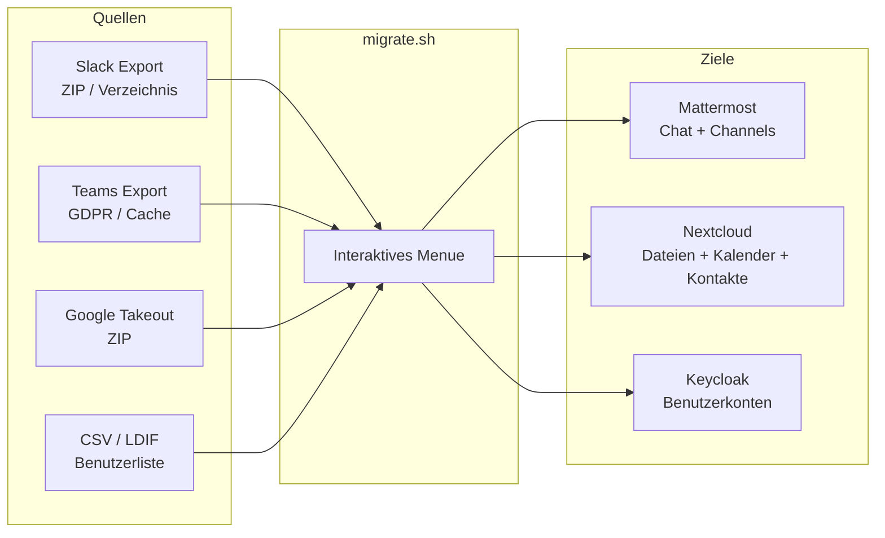

# Migration

## Uebersicht

Das Migrations-Framework ermoeglicht den Import von Daten aus Slack, Microsoft Teams und Google Workspace in die Workspace-Plattform. Alle Skripte laufen lokal auf dem Rechner des Benutzers.



## Migrations-Assistent

```bash
# Interaktives Menue starten
scripts/migrate.sh

# Nur scannen (keine Migration)
scripts/migrate.sh --no-scan

# Trockenlauf (keine Daten aendern)
scripts/migrate.sh --dry-run
```

**Voraussetzungen:** bash 4+, curl, jq, python3, unzip

### Menue-Optionen

| # | Aktion | Quelle | Ziel |
|---|--------|--------|------|
| 1 | Slack importieren | Slack Export ZIP | Mattermost (JSONL Bulk Import) |
| 2 | Teams importieren | GDPR-Export oder lokaler Cache | Mattermost + Nextcloud |
| 3 | Google importieren | Google Takeout | Mattermost + Nextcloud |
| 4 | Benutzer importieren | CSV oder LDIF | Keycloak |
| 5 | Daten exportieren | Mattermost + Nextcloud + Keycloak | ZIP-Archiv |
| 6 | Server konfigurieren | -- | Verbindungsdaten setzen |
| 7 | Quellen scannen | Lokales System | Erkennung vorhandener Exporte |

## Import-Details

### Slack nach Mattermost

**Skript:** `scripts/lib/slack-import.sh`

- Akzeptiert Slack Export ZIP oder entpacktes Verzeichnis
- Konvertiert zu Mattermost JSONL Bulk Import Format
- Wandelt um: Channels, Benutzer, Nachrichten, Threads, Mentions, Links
- Upload via `mmctl`

### Microsoft Teams nach Mattermost + Nextcloud

**Skript:** `scripts/lib/teams-import.sh`

- Unterstuetzt GDPR-Datenexport (myaccount.microsoft.com) und lokalen Teams-Cache
- Erkennt Export-Typ automatisch
- Chat-Nachrichten nach Mattermost (JSONL)
- Dateien nach Nextcloud (WebDAV)
- Kalender nach .ics, Kontakte nach .vcf

### Google Workspace nach Mattermost + Nextcloud

**Skript:** `scripts/lib/google-import.sh`

- Google Takeout Export (takeout.google.com)
- Google Chat nach Mattermost (JSONL)
- Drive nach Nextcloud (WebDAV)
- Kalender nach Nextcloud Calendar (CalDAV)
- Kontakte nach Nextcloud Contacts (CardDAV)
- Erkennt deutsche und englische Ordnernamen

### Benutzer nach Keycloak

**Skript:** `scripts/import-users.sh`

```bash
# CSV-Import
scripts/import-users.sh --csv users.csv --url http://auth.localhost --admin admin --pass devadmin

# LDIF-Import
scripts/import-users.sh --ldif users.ldif --realm workspace

# Trockenlauf
scripts/import-users.sh --csv users.csv --dry-run
```

**Parameter:**
- `--csv FILE` / `--ldif FILE` -- Eingabedatei
- `--url URL` -- Keycloak-URL (Standard: http://auth.localhost)
- `--admin USER` -- Admin-Benutzer (Standard: admin)
- `--pass PASS` -- Admin-Passwort
- `--realm REALM` -- Realm (Standard: workspace)
- `--group GROUP` -- Standardgruppe fuer importierte Benutzer
- `--dry-run` -- Nur anzeigen, nicht importieren

Erstellt fehlende Gruppen automatisch. Setzt temporaere Passwoerter (Aenderung beim ersten Login erforderlich).

## Datenexport

Option 5 im Migrations-Assistenten erstellt ein ZIP-Archiv mit selektiv exportierten Daten:

- **Mattermost:** Nachrichten (JSONL via mmctl/API), Dateien (aus Volume)
- **Nextcloud:** Dateien (WebDAV), Kalender (CalDAV/iCal), Kontakte (CardDAV/vCard)
- **Keycloak:** Benutzer (CSV + LDIF), Realm-Konfiguration (JSON)

**Skript:** `scripts/lib/export.sh`

## Quellen-Erkennung

**Skript:** `scripts/lib/scan.sh`

Scannt automatisch typische Speicherorte fuer vorhandene Exporte:
- Slack: Cache und Download-Verzeichnisse
- Teams: lokaler Cache und GDPR-Exporte
- Mattermost: bestehende Installationen
- Nextcloud: Desktop-Client-Synchronisierung
- Google Takeout: Download-Verzeichnisse

Erkennt Betriebssystem (Linux, macOS, WSL) und durchsucht die entsprechenden Pfade.

## Hilfs-Bibliothek

**Skript:** `scripts/lib/nextcloud-api.sh`

Wiederverwendbare Funktionen fuer Nextcloud-Operationen:
- WebDAV: Verzeichnisse erstellen, Dateien hoch-/herunterladen
- CalDAV: Kalender erstellen, .ics importieren/exportieren
- CardDAV: Adressbuecher erstellen, .vcf importieren/exportieren
