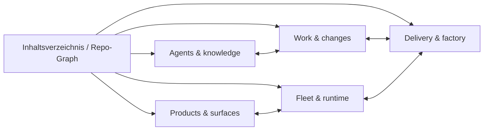

# Neovim rebuild: repository scouting and plugin decisions

This runbook guides a deliberate Neovim redesign for the Bachelorprojekt repo. It keeps repository evidence, plugin choices, dashboard categories, detailed behavior, tickets, and implementation in separate reviewable steps. Use it before replacing the live config.

## 1. Preserve and identify the live setup

1. Run `nvim --version` and query `vim.fn.stdpath('config')`, `stdpath('data')`, and `stdpath('state')` from Neovim. Check `$MYVIMRC` and `:scriptnames` in a running session if available.
2. Resolve the authored config source when dotfile tooling or symlinks are involved. Back up the full Neovim config directory before any reset; verify at least the entrypoint checksum and file count. Keep the backup outside the directory being rebuilt.
3. Record OS/runtime boundaries (Linux, WSL, or native Windows), shells and binaries used by plugins, and any cross-boundary commands. Never treat `.vimrc` or `_vimrc` as a Neovim config candidate.

## 2. Scout repository evidence

Read the root `AGENTS.md`, then only the deeper instructions relevant to discovered paths. Gather evidence instead of assuming an editor feature is needed:

| Evidence source | What to learn |
|---|---|
| `README.md`, `CLAUDE.md`, architecture docs | Project structure, workflows, safety boundaries |
| `package.json`, workspace manifests, lockfiles, `Taskfile.yml` | Languages, formatters, check commands, package-manager boundaries |
| `scripts/`, `openspec/`, tests and generated inventories | Common navigation and deliberate actions; commands that should not run implicitly |
| File inventory (`rg --files`, grouped by extensions) | Actual languages and config formats |
| Existing Neovim config and lockfile | Current behavior, plugin overlap, local modules, unresolved legacy assumptions |
| Existing plugin source/docs and current upstream docs | Compatibility, maintenance, setup requirements, security and performance costs |

For each possible capability, write a short evidence note with paths or commands that support it. Separate observed needs from guesses. Check current plugin documentation and maintenance status when making a recommendation; plugin status can change.

## 3. Compare plugin candidates

Create a shortlist, not an install list. For each candidate record:

- workflow it enables and repo evidence for that workflow;
- existing plugin, built-in Neovim feature, or CLI that overlaps;
- compatibility with the installed Neovim version and Linux/WSL/Windows environment;
- maintenance/activity and required external binaries or services;
- startup, operational, and configuration costs;
- recommendation: choose, defer, or reject, with the reason.

When two options have unclear advantages, show the tradeoff in plain language and ask the user to choose. Keep a built-in or already-installed option as the default only when it covers the observed need well. Do not silently add alternatives that duplicate an existing capability.

## 4. Choose the dashboard table of contents

After the user chooses plugins, propose user-facing workflow categories. Every category must name at least one chosen plugin that provides a real capability in it. A plugin can support multiple categories, and a category can combine plugins. Avoid categories with no selected capability anchor.

Present a compact mapping:

| TOC category | User task | Selected plugin anchor(s) | Repo evidence | Unresolved choice |
|---|---|---|---|---|

The TOC is an entry point, not a commitment to a specific keymap or implementation. Agree on the category list before detailed specs.

## 5. Brainstorm exact category specs

Discuss one category at a time. Define its entry point, visible actions, context/root detection, behavior outside a repo, Windows/WSL behavior, failure messages, safety boundaries, keymaps, and acceptance criteria. Ask about ambiguous advantages or behavior; do not fill in product choices by assumption. Record settled decisions and explicit non-goals. A category is ready for a ticket when its observable behavior and acceptance criteria are agreed.

## 6. Create the EPIC and category tickets

Use `bash scripts/ticket.sh create --help` and the repo's ticket skills/workflow to confirm current command semantics. Create one `project` EPIC for the Neovim rebuild, then one `feat` or `chore` child per agreed TOC category. Set each child's parent to the EPIC using the supported `--product-id`/parent workflow, then read back and verify the links. Tickets should include selected plugin anchors, behavior, acceptance criteria, dependencies, and relevant config paths. Do not create tickets for unchosen candidates or underspecified categories.

## 7. Implement and verify after scope is agreed

Use the backup only for reviewed migration candidates, then start a clean modular Lua config using the agreed categories and plugins; prefer built-in Neovim features when they meet the need. Once migration has accounted for the useful pieces, follow the user's disposition instruction for the backup. Validate startup with the target `nvim --headless -u <config>/init.lua -i NONE +qa`, capture errors, and exercise each category's agreed acceptance criteria. Test terminal, GUI, clipboard, external binary, and WSL behaviors in the matching runtime; report what could not be exercised.

## Initial repo scout (2026-09-26)

These are observations to seed the discussion, not approved design decisions:

- Neovim is `0.12.5`; the active config root resolves to `/home/patrick/.config/nvim`.
- The live setup uses `lazy.nvim` and already contains Snacks (including a custom dashboard and picker), OpenCode integration, Gitsigns, Trouble, Telescope, kubectl.nvim, and ToggleTerm. See `~/.config/nvim/init.lua`, `lua/plugins/nodectl.lua`, `lua/config/dashboard.lua`, and `lazy-lock.json`.
- `lua/config/dashboard.lua` already labels its home page `Inhaltsverzeichnis`, with entries for files/search, AI/OpenCode, models, infrastructure, factory/LM proxy, settings/help, and ComfyUI. These existing labels are discovery evidence; none are automatically approved as rebuild categories.
- Repo instructions emphasize explicit repository checks, pnpm for `components/website`, npm for root and Brett, and no implicit deployment or Git mutations. See root `AGENTS.md`.
- The repository has a broad project toolchain and local editor integration under `editor/llama-vim/`; inspect it for compatibility evidence, but don't assume that its Vim support implies the personal Neovim config should share a classic Vim startup file.
- A category-first short list to discuss is: project files/search (Snacks picker vs Telescope overlap), AI/OpenCode (opencode.nvim), Git context (Gitsigns and an explicit lazygit terminal), infrastructure controls (kubectl.nvim and ToggleTerm), plus language tooling. Language tooling needs a separate decision: this config currently has no obvious LSP, formatter, or completion stack, and repo filetypes suggest Lua, TypeScript/JavaScript, Astro/Svelte, JSONC, YAML, Markdown, Bash, SQL, and Kubernetes manifests. Candidate choices may include Neovim built-ins, nvim-lspconfig/Mason, Treesitter, and a completion source, but validate current APIs, support, and overlap before recommending them.
- Current upstream documentation adds important tradeoffs for the language-tooling discussion: Neovim 0.12 has built-in LSP configuration/enable APIs, while `nvim-lspconfig` remains useful for server definitions and requires 0.11.3+; avoid its deprecated `require('lspconfig').…setup()` pattern. The current `nvim-treesitter` rewrite requires Neovim 0.12, a C compiler, `tree-sitter-cli`, `tar`, and `curl`, and does not support lazy loading. `blink.cmp` targets Neovim 0.12; its current main branch warns that v2 is under active development, and building its fuzzy matcher from source needs Rust. These are real setup/maintenance costs to weigh against syntax highlighting/completion benefits. Sources: [nvim-lspconfig](https://github.com/neovim/nvim-lspconfig), [nvim-treesitter](https://github.com/nvim-treesitter/nvim-treesitter), [blink.cmp](https://github.com/Saghen/blink.cmp), [Snacks picker](https://github.com/folke/snacks.nvim/blob/main/docs/picker.md).
- There are pre-existing backups inside the live config directory. The full current directory was additionally copied to `/home/patrick/.config/nvim.backup-20260926-161724`; the copy's `init.lua` checksum matches the source.

## Agreed direction and graph-shaped TOC draft

The user chose a trimmed TOC centered on **control and visualization of repository content and workflows**, then clarified that the home screen should be a schematic of the repo graph. Each zone opens a category main page. Search on the home view finds **named capabilities within categories**, such as “show worktrees” or “open service map”; it is not code or file search. General completion, formatting, themes, and language tooling are outside this TOC scope. Standalone workstation controls such as ComfyUI and model tuning are outside the proposed repo-focused map.

Use the repository's graph sources for different jobs:

| Source | Contribution to the schematic | Limit |
|---|---|---|
| K3 code graph (`get_architecture`, relationships) | Confirm structural seams and cross-zone links | ~96k nodes; its raw clusters are too detailed and sometimes generically labeled for the home view |
| `docs/generated/graph.json` and `docs/diagrams/architecture.md` | Service and deployment relationships for the runtime zone | Covers deployed services, not the whole repository; generated data can lag |
| `scripts/datamodel/workflow-map.yaml`, `docs/agent-guide/maps/`, `AGENTS.md` | Human-readable workflow names and boundaries | Authored taxonomy, not live state |
| Active worktree paths and Git status | Open the correct category content and show local change context | Depends on the selected worktree |

Treat the home screen as a curated, graph-shaped sitemap of these sources, with explicit source/freshness labels where live data appears. Do not render the full K3 graph as the home screen.

| Zone / category main page | Grounded repo content | Candidate plugin anchor | To specify with user |
|---|---|---|---|
| Products & surfaces | `components/`, app and service boundaries | Snacks dashboard | Which product areas appear, and what summary is useful? |
| Work & changes | `openspec/`, tickets, worktrees, Git state | Gitsigns + Snacks dashboard | Which readouts and deliberate actions belong here? |
| Agents & knowledge | `.opencode/`, agent maps, K1/K3/K4, OpenCode | opencode.nvim + Snacks dashboard | Which agent functions should be visible or callable? |
| Delivery & factory | CI, verification, factory, cockpit | Snacks dashboard/terminal | Which status sources and controls belong here? |
| Fleet & runtime | `k3d/`, `flux/`, service graph, pods/logs | kubectl.nvim + Snacks dashboard | Which contexts, namespaces, and live operations? |

Snacks is the preferred shared navigation layer: its dashboard supports selectable actions and its picker accepts a supplied `items` list, so one maintained capability registry can drive the home search and each category main page. Telescope is a separate, highly extensible fuzzy picker. Both can filter custom lists; Telescope's extension ecosystem is useful if a later selected capability needs an extension unavailable in Snacks. The current request does not call for a second picker. Sources: [Snacks dashboard](https://github.com/folke/snacks.nvim/blob/main/docs/dashboard.md), [Snacks picker](https://github.com/folke/snacks.nvim/blob/main/docs/picker.md), [Telescope](https://github.com/nvim-telescope/telescope.nvim).

The capability registry should give each action a stable ID, category, visible name, search words, source, and action. From the home screen, selecting a zone opens its main page; selecting a search result opens the owning page and focuses the named function. Support keyboard selection and clear back/home navigation; decide mouse behavior during category specification. The project's web cockpit already has audited action APIs (`docs/sdlc/cockpit-action-inventory.md`), so Neovim controls should have a clear purpose before duplicating them.

The five zones are a working graph model, not finalized ticket scope. Brainstorm each category's exact behavior and selected plugin integration with the user, then create the EPIC and child tickets.

### Interaction decision

The user chose two-step function navigation: selecting a result in the home search opens its owning category main page and focuses that function. A deliberate second selection invokes the action. The home search should index capability names, aliases, and category labels from one registry; it should not call a code-search or file-search provider. Keep `Back` and `Home` available from category pages.

### Candidate capability registry for category brainstorming

The following rows are prompts for exact specs, not approved actions. Their paths and commands are repo evidence; confirm display, failure behavior, and controls with the user before ticket creation.

| Zone | Named function on main page | Repo source | Candidate plugin role |
|---|---|---|---|
| Products & surfaces | Show product/service boundaries; open a product's entry page | `components/`, K3 architecture overview | Snacks dashboard navigation |
| Work & changes | Show local and factory worktrees; show active branch/changes; open ticket context; open active OpenSpec changes | `scripts/worktree-list.sh --json [--all]`, Git, `scripts/ticket.sh list`, `openspec/changes/` | Gitsigns for change context; Snacks for page/actions |
| Agents & knowledge | Show agent roles and tools; open K1/K3/K4 maps; open OpenCode in repo context | `.opencode/agent-models.jsonc`, `docs/agent-guide/maps/`, `docs/brain/recall-routing.md` | opencode.nvim for deliberate OpenCode actions; Snacks for page |
| Delivery & factory | Show CI and factory state; open SDLC cockpit; show verification commands | GitHub CI, `scripts/ticket.sh factory-control get`, `Taskfile.yml`, `/sdlc/cockpit` | Snacks page/terminal |
| Fleet & runtime | Open service graph; show cluster contexts, pods, and logs; open related manifests | `docs/generated/graph.json`, `docs/diagrams/architecture.md`, `k3d/`, `flux/` | kubectl.nvim for live views; Snacks for page |

Start detailed specification with **Work & changes**, since “show worktrees” is the agreed home-search example. Record its button behavior and guards before moving to the next zone.

### Work & changes decision and button rule

The user chose both navigation into existing tools **and** direct page buttons for actions that can sensibly be invoked with a bounded target and explicit inputs. The category page should show state first, then group buttons by the object they affect. A button must use a canonical repo command or existing guarded workflow, show its target and expected effect, and return the result to the page. Changes such as ticket status updates and worktree creation get structured input; cleanup/removal must run the repo's guards and ask for explicit confirmation. Do not generate buttons from every CLI subcommand or expose arbitrary shell execution.

The default Work & changes page is scoped to the active buffer's worktree, branch, and linked ticket. It must contain **All Worktrees** and **Ticket Queue** buttons that open full in-Neovim list views. All Worktrees calls `scripts/worktree-list.sh --json --all`, showing local entries even if the factory query is unavailable and displaying `factory_note` as the reason. Ticket Queue shows active tickets from **both** `mentolder` and `korczewski`, with brand labels and an explicit way to view completed tickets. Use the canonical `scripts/ticket.sh list --brand <brand>` source for each brand and combine results in the view; avoid the default 200-row truncation being mistaken for a full queue. If a branch has no linked ticket, show that explicitly and keep the queue button available.

| Work & changes group | Proposed button or readout | Canonical source | Behavior to finalize |
|---|---|---|---|
| Worktrees | Show current worktree; **All Worktrees** list; open selected worktree; create worktree; clean up selected worktree | `scripts/worktree-list.sh --json --all`, `scripts/worktree-create.sh`, `scripts/worktree-clean-check.sh`, managed remove helper | Opening behavior; form fields; cleanup confirmation and claim handling |
| Git changes | Show current branch, changed files and diff; open selected changed file | Git, Gitsigns | Scope to active worktree; display of untracked/ignored files |
| Tickets | Show linked ticket and status; **Ticket Queue** across both brands; view completed; create ticket; change status; add comment; open cockpit detail | `scripts/ticket.sh list/get/create/update-status/add-comment` | Structured forms; status transitions; queue pagination/filtering |
| OpenSpec | Show active changes; open proposal/spec/tasks; launch approved lifecycle command | `openspec/changes/`, `scripts/openspec.sh` | Which lifecycle actions are useful from a button and which belong in the existing plan flow |

Prior art matters here: `worktree-create.sh` enforces branch naming and ticket IDs; `worktree-clean-check.sh` protects dirty and claimed worktrees; `ticket.sh list` provides JSON and ticket mutation commands have defined required fields. The Neovim page must preserve these guards rather than reimplementing them. A transient failure (DB or cluster unavailable) should leave local Git/worktree information usable and explain the missing source.

### Products & surfaces evidence for the next category

Two existing structures could define product nodes, and they serve different purposes. The `components/` tree currently has six concrete code/app directories (`VideoVault`, `brett`, `mediaviewer-widget`, `mentolder-web`, `studio-server`, `website`). The ticket product taxonomy has seven broad project groups per brand (Website, Infra/Deployment, AI/Software-Factory, Ticket-System/Cockpit, Auth/Security/DSGVO, Dev-Tooling, Sonstiges; see `docs/superpowers/specs/2026-07-21-feature-product-linking-design.md`). Several ticket groups overlap the other proposed TOC zones.

**Decision:** Use the six `components/` directories as primary graph nodes. Show related ticket-product groups as secondary links on a component detail page. Each component directory has a Dockerfile and package manifest; VideoVault, Brett, and Website also have a README. The generated service graph has corresponding service nodes for all six names (case can differ), which is enough for a documented component-to-service link. Treat this as a structural relationship, not proof that a service is currently healthy or deployed in a particular environment.

**Detail page decision:** Select a component node to see its repo path, available README, build/package entry points, related ticket groups, and linked service-graph node. Show a small **live health badge** with source and observation time, and let it open the corresponding Fleet & runtime detail. Give each available link an explicit button: open component root, open README/docs, show related tickets, inspect service relationships, open monitoring GUI, and open centralized logs filtered to this component. If a source is absent for a component, omit or disable that button with a reason instead of fabricating a link.

### Monitoring, centralized logs, and daily GitHub issue

The user also wants monitoring GUI access, filterable centralized logs with an optional verbose view, and one daily GitHub issue containing warning-or-higher findings for assessment. This crosses Products & surfaces and Fleet & runtime. Keep the UI work in those category tickets and create a separate dependent child ticket under the EPIC for the scheduled digest and any required log normalization. Do not make the daily digest depend on Neovim being open.

Existing repo evidence:

- Grafana and Loki are provisioned under `k3d/monitoring/`; Promtail collects container logs across fleet nodes. The Grafana Log Explorer has namespace, app, level, and brand variables plus visible timestamps (`k3d/monitoring/grafana-dashboards/log-explorer.json`).
- Promtail currently extracts JSON `level`, maps numeric `40` to `warn` and `50` to `error`, drops `debug`, and retains `info` (`k3d/monitoring/values/promtail-values.yaml`). Log sources without a recognized level need an explicit coverage policy so warning-or-higher findings are not silently missed.
- The dashboard refers to a Loki datasource UID of `loki`, while `k3d/monitoring/loki-grafana-datasource.yaml` declares a datasource name but no UID. Verify the deployed UID and align these before relying on the GUI.
- Loki is addressed through the internal `loki.monitoring.svc:3100` service; its `query_range` API takes explicit `start`, `end`, `limit`, and `direction`. The default 100-line limit is too small for a complete daily digest; query in bounded windows and detect pagination/truncation. See [Loki HTTP API](https://grafana.com/docs/loki/latest/reference/loki-http-api/).
- `.github/workflows/sentinel.yml` is prior art for a daily GitHub issue, but its report is unrelated to logs. The repository `Paddione/Bachelorprojekt` is **public** (verified with `gh repo view`), so issues must not receive unsanitized log payloads.

**UI draft:** On component detail, show health state, source, and observed time. Add **Open Monitoring** and **Open Logs** buttons that carry the component/service scope to Grafana. On the Fleet page, offer filters for brand, namespace, app/service, pod/container, severity, time window, and text or trace ID. Start with warning-or-higher; a **Verbose** control may widen the interactive view to info/debug retained in Loki. Keep the GUI's source and query window visible, and distinguish no matching logs from query failure.

**Verbose capability boundary:** The current Promtail pipeline drops `debug` before ingestion, so the proposed Verbose button can expose retained `info` entries today but cannot recover past debug entries. If the user wants debug on demand, specify a separate, time-bounded collection change and its retention/storage guard. The daily issue filter must run on the query or report output; it must not prune lower-severity entries from Loki merely to prepare the issue. Preserve an explicit `unknown` severity bucket for streams whose level cannot be normalized, and show its count in coverage reporting.

**Daily digest draft:** Once per day, inspect a complete, non-overlapping 24-hour window. Exclude entries below warning from the issue body while leaving Loki retention unchanged. Normalize known severity formats, report coverage gaps for unclassified streams, and group repeats by service/process, severity, error class/message, and location. Create one issue for the window only when qualifying findings exist; reruns update that same day's issue. Each group should include first/last event timestamps with timezone, brand, namespace, app, pod/container/process, occurrence count, precise message/error code and stack or source location where present, a short redacted example, and a filtered Grafana link. State a root cause only when the logs support it; otherwise label the cause unknown and include the most relevant evidence. Cap issue size with counts and links, never silently truncate a query. Because the target repo is public, scrub secrets and personal data before publishing; full raw context stays in Grafana. A digest failure should be visible as a workflow failure, not reported as “no warnings.”

**Candidate report contract:** Use a fixed UTC window `[start, end)`, a stable window key in the title or issue marker, and the time the query completed. Report total matching events, per-severity counts, group counts, and source coverage before the grouped findings. A finding records `first_seen`, `last_seen`, severity, brand, namespace, workload, pod, container, logger/process if present, count, error class/code, message template, and stack frame/source location if present. Use `unknown` for any missing field rather than guessing. Keep the original event timestamp separate from ingestion/query time. Redact before writing any issue text, including titles and example lines. Link each group to a Grafana query with the same scope and time window. If a response hits Loki's result limit or a stream has no usable severity, mark the window incomplete and surface that as an operational failure instead of claiming the daily scan was clean. Avoid a silent 100-entry `query_range` default by querying bounded intervals with an explicit limit and checking each response for saturation.

**Working recommendation after discussing scope and destination:** Cover all repo-managed workloads across both `mentolder` and `korczewski`, including delivery/runtime services that are not one of the six component nodes. Exclude unrelated cluster/system namespaces from the daily issue; keep them available in Grafana's interactive view. Publish the sanitized daily issue in the existing public `Paddione/Bachelorprojekt` repository. The issue should retain enough structured detail to identify the failing workload and event, while raw lines and sensitive values stay in Loki/Grafana. A private issue repository remains an option if full raw log excerpts become a requirement; it would need a named repo and a credential route.

### Existing Neovim backup: selective migration, not a rebuild source

The user wants a new config designed from the agreed categories. Inspect the saved config at `/home/patrick/.config/nvim.backup-20260926-161724` for reusable behavior; do not copy its old home page or monolithic `init.lua` into the new layout. The live config remains in place until the new config is ready. Since useful pieces exist, retain this backup as a migration reference until those pieces are accounted for.

| Backup item | Decision for the new config | Reason |
|---|---|---|
| `lazy.nvim` bootstrap and lockfile | Keep the plugin-manager approach; build a small, explicit plugin set and pin it after selection | Existing installation and reproducibility without retaining the old monolith |
| `lua/config/dashboard.lua` | Reuse the page/navigation pattern and keyboard Back/Home behavior, then replace all page definitions | Snacks page updates already work; old seven pages center on personal machine controls rather than repo zones |
| Snacks dashboard/picker | Select for graph-shaped TOC and action-name search | One registry can back both navigation and category actions |
| Gitsigns, opencode.nvim, kubectl.nvim | Keep as candidate anchors for Work, Agents, and Fleet; carry over only needed settings/actions | These map to agreed repo workflows; avoid importing unrelated mappings wholesale |
| `lua/config/inference_factory.lua` | Reuse its per-buffer Git-root and guarded command-invocation ideas, not Windows model/VRAM controls | Worktree-aware actions need correct root and explicit targets |
| `lua/config/editor.lua` | Keep only small, useful behavior such as persistent undo and source inspection if desired | The user scoped the redesign to repo control and visualization rather than editor-productivity features |
| `lua/config/nodectl.lua`, ComfyUI, FreeToken, machine checklist, old README, backup snapshots | Do not transplant into the repo dashboard | They represent older personal machine menus and stale environment assumptions; surface a current repo operation only through its canonical source |
| Snacks `vim.ui.select` height override in `init.lua` | Recheck against the selected Snacks version before considering any workaround | A local patch for an older observed bug should not be copied blindly |
| Windows/WSL OpenCode path adapter and config mirror | Carry over only if native Windows Neovim remains an intended target | It encodes a specific WSL distro and cannot be assumed portable |

Migration means reimplementing the selected behavior in new modules with current repo sources and guards. It does not mean restoring or editing the backup as the new live config. If a later review finds that a candidate does not earn its place, omit it. No classic Vim configuration is involved.

### Remaining category specs for discussion

These are concrete proposals to review with the user before creating tickets. Every displayed live value should include its source, query time, loading state, and a distinct unavailable state. Every action should be registered once for both the category button and home capability search; selecting a search hit navigates and focuses, then a second selection acts.

**Agents & knowledge** — plugin anchors: `opencode.nvim` for deliberate agent sessions and Snacks for navigation. The main page shows the current worktree, the agent roles and model mapping from `.opencode/agent-models.jsonc` and `docs/agent-guide/registry/agents.yaml`, plus active locks from `scripts/agent-lock.sh list`. It links K1, K3, and K4 to their documented purposes in `docs/brain/recall-routing.md`; the map is a guide, not a fabricated live index status. Buttons: open a selected agent definition or registry entry; open agent/tool/knowledge maps; show active locks and unread messages; start or resume OpenCode in the current worktree; open the repo's task oracle with a user-entered goal. **Decision:** A selected runnable agent also gets an **Ask this agent** button. It opens a goal prompt, displays the selected agent, model/write capability, and worktree, then starts an explicit session with that agent after the user submits. Use the current OpenCode CLI's `run --agent <name> --dir <worktree> <goal>` or a verified equivalent; pass arguments as an array and capture result/session link. `opencode.nvim` currently exposes generic ask and agent-cycle actions, not an exact named-agent selector, so do not fake selection by cycling. List OpenCode agents from `.opencode/agent-models.jsonc` as runnable; Claude Code domain-role documentation in `docs/agent-guide/registry/agents.yaml` is informational until a supported launcher is found. No agent dispatch occurs on page load. If OpenCode or the knowledge service is unavailable, keep authored maps accessible and show the failing source. Native Windows/WSL path translation is included only if that runtime is confirmed as a target.

**Delivery & factory** — plugin anchor: Snacks page and terminal, with existing SDLC cockpit for authenticated, audited controls. The main page shows the current branch's latest CI run, factory queue and control state for each brand, and relevant verification commands from `Taskfile.yml`. Buttons: open the CI run and its failed jobs; open the SDLC cockpit; view factory queue, holds and slots; run `test:changed`, `freshness:check`, or `workspace:validate` deliberately in a worktree-bound terminal; open the output and rerun a failed check. Factory enqueue, tick, pause/resume, release slot, and CI rerun buttons should use the existing guarded/audited cockpit actions where available, with target and effect shown before invocation. The cockpit inventory (`docs/sdlc/cockpit-action-inventory.md`) classifies `ci_rerun` and some controls as irreversible; the UI must preserve its authentication, classification, and audit rather than calling shell lookalikes. Unavailable GitHub or factory state is shown per source without hiding local check buttons. **Review point:** whether the page should invoke authenticated cockpit actions directly or open the cockpit focused on the selected action when an embedded session is unavailable.

**Fleet & runtime** — plugin anchors: `kubectl.nvim` for cluster object views and Snacks for category navigation; Grafana/Loki are linked external UIs. The main page starts with service relationships from `docs/generated/graph.json`, then overlays observed status for both brand namespaces and shared repo-managed runtime services. An edge in the generated graph proves a documented relationship, not current health. Buttons: choose brand/namespace/service; refresh observed status; open pods, deployment and events in kubectl.nvim; open the mapped manifest; open Grafana monitoring; open Log Explorer with scoped filters; switch to Verbose retained logs; and open the existing cockpit control for a selected Flux reconciliation. Show query time and source for each badge, and distinguish `ready`, `degraded`, `unavailable`, `unmapped`, and `unknown/query failed`. `task workspace:status:all-prods` is an existing human-readable overview; `task flux:stalled` is a read-only stale-reconciliation check. Resolve Grafana's Loki datasource UID mismatch and component-to-workload mapping before relying on deep links. No cluster mutation runs on entering the page. **Review point:** the live health definition and whether direct operational controls beyond the existing cockpit are needed.

**Node, pod, storage, and scaling addition requested by the user:** Fleet & runtime must cover every member node of both configured Kubernetes contexts (`fleet` and `devmesh`), not just the two product namespaces. A node list shows Ready state, CPU/RAM capacity and current utilization, GPU availability and utilization if instrumented, host filesystem capacity/free space, and Longhorn schedulable/available/scheduled storage where present. Node detail shows all currently active pods on the node; pod rows show namespace, service/workload owner, node, phase/readiness, CPU/RAM requests and measured usage, GPU request, and mounted PVC/storage class. Resolve pod ownership through owner references (for example Pod → ReplicaSet → Deployment) and show Service selector matches separately: a pod may have no Service or several. Default to Running/Pending, with an explicit history view for completed/failed jobs. Keep host disk, Kubernetes ephemeral storage, PVC requested size, and Longhorn physical/replica storage separate; never add them into a misleading single disk total.

**Health badge decision:** The user accepted the recommendation to show Kubernetes readiness alongside a separate recent error signal from Grafana/Loki. Label each source and its observation time; a ready pod with recent errors must visibly retain both facts.

The current read-only cluster inspection found six Ready `fleet` nodes, all advertising zero `nvidia.com/gpu`, and three Ready `devmesh` nodes, with one GPU advertised on `gpu-metal`; both contexts are present in the local kubeconfig. `kubectl top nodes` currently returns CPU and RAM usage in both contexts. Longhorn node resources exist in both contexts; `fleet` exposes per-node `storageMaximum`, `storageAvailable`, and `storageScheduled` through `nodes.longhorn.io`, and its `longhorn` StorageClass currently specifies three replicas. The repo's kube-prometheus-stack enables node exporter and kube-state-metrics, while no DCGM/GPU exporter was found in repo manifests or the current `devmesh` pods. **Actual GPU utilization and VRAM measurement are part of this category's implementation scope:** scout an exporter supported by the GPU/driver, expose it to the monitoring source, and verify real metrics on the GPU node. Until that is working, show `telemetry unavailable` rather than substituting allocated GPU count for utilization. On CPU-only nodes show `no GPU`, not zero-percent utilization. Existing Grafana `k8s-overview` is an empty placeholder, so a real node/pod resource dashboard must be added or linked to a confirmed provisioned dashboard.

**Scale-up preview and button:** Select a scalable Deployment or StatefulSet, choose a target replica count, and show the additional pod count plus a before/after estimate for CPU, RAM, GPU count, ephemeral storage, and newly created PVCs. Use the live PodTemplate's scheduling **requests**, including sidecars, init-container rules, and pod overhead, as the reservation estimate. Show measured usage separately; it is not a safe proxy for scheduler fit. Add `extra replicas × per-replica requests` to the current workload and cluster requested totals. For StatefulSet volume claim templates, add per-new-pod requested PVC capacity and estimate Longhorn physical demand using the actual StorageClass replica factor, clearly marked as an estimate; do not count a shared existing PVC once per new pod. Check node allocatable minus currently requested resources, scheduling constraints, pod limits, namespace quota, GPU availability, storage class and RWO conflicts, HPA presence, and GitOps ownership. Present eligible nodes and possible blockers, not a guaranteed placement; only the scheduler determines the final node. If requests are missing or telemetry is stale, label the estimate incomplete rather than implying spare capacity. Buttons: **Preview scale**, **Open workload**, and **Prepare GitOps scale change**, showing exact context/namespace/workload/current→target and requiring explicit confirmation. **Decision:** The user chose persistent GitOps scaling only. The action identifies the owning manifest/overlay, prepares a branch/worktree change and PR through the repo workflow, and shows the pending PR and post-merge Flux status; it does not run `kubectl scale` as a live override. If the workload's source cannot be identified unambiguously, disable Apply and show the candidates rather than changing the wrong overlay. A Service that selects multiple workloads requires explicit workload selection. [Kubernetes resource management](https://kubernetes.io/docs/concepts/configuration/manage-resources-containers/), [node allocatable](https://kubernetes.io/docs/tasks/administer-cluster/reserve-compute-resources/), [GPU scheduling](https://kubernetes.io/docs/tasks/manage-gpus/scheduling-gpus/), and [NVIDIA exporter metrics](https://docs.nvidia.com/datacenter/dcgm/latest/reference/dcgm-exporter-metrics.html) explain the underlying measurement and scheduling distinctions.

**Cross-category acceptance proposal:** Starting Neovim in any tracked worktree detects that worktree; starting outside the project explains the missing context and still opens authored maps. Home search finds named capabilities, opens the owning main page with the action focused, and requires a second activation. All Worktrees and Ticket Queue remain available in Work & changes. Product detail reaches its Fleet status, Grafana view, and scoped logs. A failed remote query never turns into a green badge or an empty-log claim. Buttons display exact target, source, and result. Keyboard navigation, mouse selection, Back, and Home work on each page, since the user explicitly asked to click into categories.
