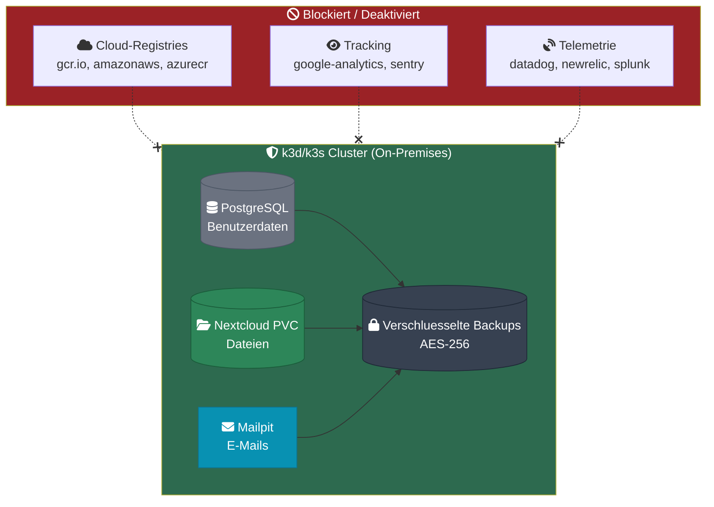
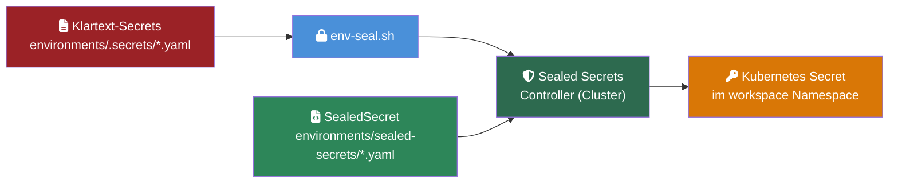
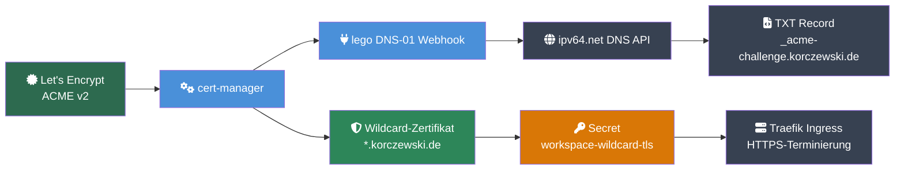

# Sicherheit

## DSGVO / Datensouveraenitaet

Workspace MVP ist DSGVO-konform by Design. Alle Daten bleiben vollstaendig on-premises.



### Automatisierte DSGVO-Pruefung

```bash
scripts/dsgvo-compliance-check.sh           # Menschenlesbar
scripts/dsgvo-compliance-check.sh --json    # Fuer Grafana-Dashboard
```

| Pruefung | Beschreibung |
|----------|-------------|
| D01 | Keine Container-Images von US-Cloud-Providern (gcr.io, amazonaws, azurecr, mcr.microsoft) |
| D02 | Keine DNS-Aufloesung externer Tracking-Domains (google-analytics, sentry.io) |
| D03 | Alle PVCs nutzen lokalen Storage (keine Cloud-Storage-Klassen wie aws-ebs, azure-disk) |
| D04 | Keycloak Audit Events aktiviert |
| D05 | Website-API erreichbar (Health-Check /api/health) |
| D06 | Keine proprietaeren Telemetrie-Dienste (datadog, newrelic, splunk, segment, mixpanel) |
| D07 | Alle Container-Images sind Open-Source |
| D08 | SMTP-Server ist Cluster-intern (mailpit, kein externer Relay) |

## Pod Security Standards

Der `workspace`-Namespace erzwingt Pod Security Standards:

```yaml
pod-security.kubernetes.io/enforce: baseline
pod-security.kubernetes.io/warn: restricted
```

- **baseline** (erzwungen): Verhindert bekannte Privilege-Escalation-Vektoren
- **restricted** (Warnung): Zeigt Verstoesse gegen strengere Richtlinien an

### Security Contexts

PostgreSQL (`shared-db`) laeuft als Non-Root-User:
```yaml
securityContext:
  fsGroup: 999
  runAsUser: 999
  runAsGroup: 999
```

### Container SecurityContexts

Alle Deployments haben `allowPrivilegeEscalation: false`, `capabilities: drop: [ALL]` und `seccompProfile: RuntimeDefault`.

**Volle Härtung** (`readOnlyRootFilesystem: true`, `runAsNonRoot: true`):
`mailpit`, `oauth2-proxy-docs`, `docs`, `nextcloud-redis`, `website`

**Partielle Härtung** (`readOnlyRootFilesystem: false` — Applikation schreibt Dateien):
`keycloak`, `nextcloud`, `vaultwarden`, `whiteboard`

**Sonderfälle:**
- `collabora`: SYS_ADMIN (LibreOffice-Kern) — isoliert im Namespace `workspace-office`
- `nextcloud`: initContainers laufen als root fuer Berechtigungs-Setup

## Authentifizierung

### Single Sign-On (SSO)

Alle Services authentifizieren ueber Keycloak OIDC. Siehe [Keycloak & SSO](keycloak.md) fuer die vollstaendige Konfiguration.

**Passwort-Richtlinie (Keycloak Realm):**
- Mindestens 12 Zeichen
- Mindestens 1 Grossbuchstabe
- Mindestens 1 Kleinbuchstabe
- Mindestens 1 Ziffer
- Mindestens 1 Sonderzeichen
- Hash-Algorithmus: PBKDF2-SHA512

### Brute-Force-Schutz

Keycloak Brute-Force-Detection ist aktiviert fuer den Realm `workspace`.

## Secret-Management

### Entwicklung

Alle Secrets in `k3d/secrets.yaml` (Base64-kodierte Dev-Werte). **Niemals echte Credentials in diese Datei committen.**

**Secret: `workspace-secrets`** -- relevante Keys:

| Kategorie | Keys |
|-----------|------|
| Datenbank | SHARED_DB_PASSWORD, KEYCLOAK_DB_PASSWORD, NEXTCLOUD_DB_PASSWORD, VAULTWARDEN_DB_PASSWORD, WEBSITE_DB_PASSWORD |
| OIDC | NEXTCLOUD_OIDC_SECRET, CLAUDE_CODE_OIDC_SECRET, VAULTWARDEN_OIDC_SECRET, WEBSITE_OIDC_SECRET, DOCS_OIDC_SECRET |
| Admin | KEYCLOAK_ADMIN_PASSWORD, NEXTCLOUD_ADMIN_PASSWORD, COLLABORA_ADMIN_PASSWORD, VAULTWARDEN_ADMIN_TOKEN, CLAUDE_CODE_ADMIN_EMAIL, CLAUDE_CODE_ADMIN_PASSWORD |
| Service | SIGNALING_SECRET, TURN_SECRET, WHITEBOARD_JWT_SECRET, OAUTH2_PROXY_COOKIE_SECRET, CLAUDE_CODE_WEBUI_SECRET_KEY |
| Extern | ANTHROPIC_API_KEY, STRIPE_PUBLISHABLE_KEY, STRIPE_SECRET_KEY |

### Produktion (Sealed Secrets)

Produktions-Secrets werden mit dem Sealed Secrets Controller verschluesselt und koennen sicher im Git-Repository gespeichert werden.



**Workflow:**
1. Klartext-Secrets in `environments/.secrets/<umgebung>.yaml` pflegen (gitignored)
2. `scripts/env-seal.sh` verschluesselt sie mit dem Cluster-Zertifikat
3. Verschluesselte `SealedSecret`-Ressourcen in `environments/sealed-secrets/` committen
4. Der Sealed Secrets Controller im Cluster entschluesselt sie zu Kubernetes Secrets

**Umgebungsspezifische Konfiguration:**

| Datei | Zweck |
|-------|-------|
| `environments/dev.yaml` | Entwicklungsumgebung (localhost-Domains) |
| `environments/mentolder.yaml` | Produktion mentolder.de |
| `environments/korczewski.yaml` | Produktion korczewski.de |
| `environments/schema.yaml` | JSON-Schema zur Validierung |

Manifest: `k3d/sealed-secrets-controller.yaml`

Legacy: `prod/secrets.yaml` enthaelt separate Produktions-Secrets (wird durch Sealed Secrets ersetzt).

### Vaultwarden als Secret-Store

Vaultwarden dient als zentraler Passwort-Manager fuer das Team. Der Seed-Job (`task workspace:vaultwarden:seed`) erstellt initiale Ordner:
- Infrastructure
- Services
- MCP Keys

## TLS (Produktion)



**Setup-Befehle:**
```bash
task cert:install               # cert-manager + lego Webhook installieren
task cert:secret -- <api-key>   # ipv64 API-Key speichern (cert-manager + workspace NS)
task cert:status                # Zertifikat-Status anzeigen
```

### Architektur

- **ClusterIssuer:** `letsencrypt-prod` (ACME v2, `prod/cluster-issuer.yaml`)
- **Certificate:** `workspace-wildcard` fuer `*.korczewski.de` + `korczewski.de` (`prod/wildcard-certificate.yaml`)
- **Secret:** `workspace-wildcard-tls` im Namespace `workspace` (automatisch von cert-manager erstellt)
- **DNS-Provider:** ipv64.net (API-Key als Secret `ipv64-api-key`)
- **Erneuerung:** Automatisch durch cert-manager (30 Tage vor Ablauf)

### Wichtige Konfigurationsdetails

Der `ipv64-api-key` Secret muss in **zwei Namespaces** existieren:
- `cert-manager` -- fuer den lego-Webhook-Pod (als Umgebungsvariable)
- `workspace` -- fuer die Challenge-Aufloesung (secretKeyRef im Solver-Config)

Der Befehl `task cert:secret` erstellt den Secret in beiden Namespaces und setzt die Umgebungsvariable auf dem Webhook-Deployment.

**Hinweis:** Die Ingress-Ressource (`prod/ingress.yaml`) verwendet **keine** `cert-manager.io/cluster-issuer`-Annotation. Das Wildcard-Zertifikat wird separat ueber `prod/wildcard-certificate.yaml` verwaltet, nicht ueber den Ingress-Shim.

## Netzwerk-Sicherheit

### Kubernetes NetworkPolicies (L3)

Default-Deny auf allen Namespaces (`workspace`, `website`). Selektive Freigaben:

| Policy | Namespace | Erlaubter Traffic |
|--------|-----------|------------------|
| `default-deny-ingress` | workspace, website | Blockiert (Default) |
| `default-deny-egress` | workspace, website | Blockiert (Default) |
| `allow-dns-egress` | workspace, website | kube-dns Port 53 UDP/TCP |
| `allow-intra-namespace-egress` | workspace, website | Pod-zu-Pod im Namespace |
| `allow-intra-namespace-ingress` | website | Intra-Namespace Ingress |
| `allow-traefik-ingress` | workspace, website | Traefik aus kube-system |
| `allow-mcp-external-egress` | workspace | mcp-github/mcp-stripe → HTTPS 443 |
| `allow-egress-to-workspace` | website | Website → workspace Services |

```bash
kubectl get networkpolicies -n workspace    # Policies anzeigen
kubectl describe networkpolicy default-deny-ingress -n workspace
```

### HTTP Security Header (L7)

Neue Traefik-Middleware `security-headers` (alle Prod-Services):

| Header | Wert |
|--------|------|
| `X-Frame-Options` | `SAMEORIGIN` |
| `X-Content-Type-Options` | `nosniff` |
| `X-XSS-Protection` | `1; mode=block` |
| `Referrer-Policy` | `strict-origin-when-cross-origin` |
| `Permissions-Policy` | `camera=(), microphone=(), geolocation=(), payment=()` |

### Rate-Limiting (L7)

Traefik-Rate-Limit-Middlewares pro Service (Produktion):

| Service | avg req/s | Burst |
|---------|-----------|-------|
| Keycloak | 20 | 40 |
| Vaultwarden | 20 | 40 |
| Nextcloud | 50 | 100 |
| Website | 200 | 400 |

### Zugriffsschutz interne Tools (L7)

Mailpit (`mail.*`) und MCP-Status (`ai.*`) sind hinter BasicAuth geschuetzt (Traefik `basic-auth-internal`-Middleware, Secret `traefik-basic-auth`). Docs (`docs.*`) ist hinter Keycloak SSO via oauth2-proxy geschuetzt.

Dev-Credentials: `admin:admin` (in `k3d/secrets.yaml`).
Produktion: `htpasswd -nb <user> <password>` zum Generieren verwenden.

## Backup-Verschluesselung

Taegliche Backups der PostgreSQL-Datenbanken:
- **Verschluesselung:** AES-256-CBC mit PBKDF2 (openssl)
- **Rotation:** 30-Tage-Aufbewahrung
- **Scope:** keycloak, nextcloud, website

## CI-Sicherheitspruefungen

GitHub Actions prueft bei jedem PR:
- **Image Pinning:** Alle Container-Images muessen auf eine spezifische Version gepinnt sein
- **Secret Detection:** Scan nach versehentlich committeten Credentials
- **Manifest-Validierung:** kustomize build + kubeconform
- **Shell Linting:** shellcheck auf allen Skripten
