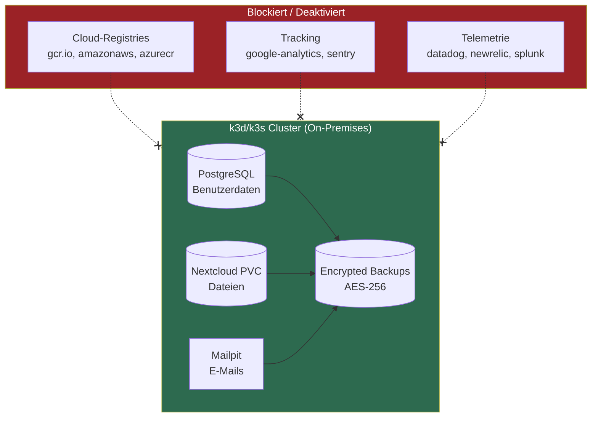
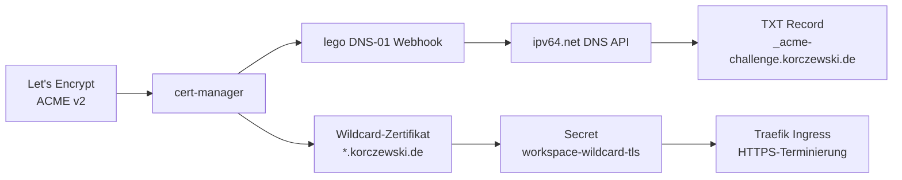

# Sicherheit

## DSGVO / Datensouveraenitaet

Workspace MVP ist DSGVO-konform by Design. Alle Daten bleiben vollstaendig on-premises.



### Automatisierte DSGVO-Pruefung

```bash
scripts/dsgvo-compliance-check.sh           # Menschenlesbar
scripts/dsgvo-compliance-check.sh --json    # Fuer Grafana-Dashboard
```

| Pruefung | Beschreibung |
|----------|-------------|
| D01 | Keine Container-Images von US-Cloud-Providern (gcr.io, amazonaws, azurecr, mcr.microsoft) |
| D02 | Keine DNS-Aufloesung externer Tracking-Domains (google-analytics, telemetry.mattermost, sentry.io) |
| D03 | Alle PVCs nutzen lokalen Storage (keine Cloud-Storage-Klassen wie aws-ebs, azure-disk) |
| D04 | Keycloak Audit Events aktiviert |
| D05 | Mattermost Audit-Log erreichbar (/api/v4/audits) |
| D06 | Keine proprietaeren Telemetrie-Dienste (datadog, newrelic, splunk, segment, mixpanel) |
| D07 | Alle Container-Images sind Open-Source |
| D08 | SMTP-Server ist Cluster-intern (mailpit, kein externer Relay) |

### Grafana DSGVO-Dashboard

Das Monitoring-Stack (`task workspace:monitoring`) installiert ein DSGVO-Compliance-Dashboard in Grafana, das die Ergebnisse der automatisierten Pruefung visualisiert.

## Pod Security Standards

Der `workspace`-Namespace erzwingt Pod Security Standards:

```yaml
pod-security.kubernetes.io/enforce: baseline
pod-security.kubernetes.io/warn: restricted
```

- **baseline** (erzwungen): Verhindert bekannte Privilege-Escalation-Vektoren
- **restricted** (Warnung): Zeigt Verstoesse gegen strengere Richtlinien an

### Security Contexts

PostgreSQL (`shared-db`) laeuft als Non-Root-User:
```yaml
securityContext:
  fsGroup: 999
  runAsUser: 999
  runAsGroup: 999
```

## Authentifizierung

### Single Sign-On (SSO)

Alle Services authentifizieren ueber Keycloak OIDC. Siehe [Keycloak & SSO](keycloak.md) fuer die vollstaendige Konfiguration.

**Passwort-Richtlinie (Keycloak Realm):**
- Mindestens 12 Zeichen
- Mindestens 1 Grossbuchstabe
- Mindestens 1 Kleinbuchstabe
- Mindestens 1 Ziffer
- Mindestens 1 Sonderzeichen
- Hash-Algorithmus: PBKDF2-SHA512

### Brute-Force-Schutz

Keycloak Brute-Force-Detection ist aktiviert fuer den Realm `workspace`.

## Secret-Management

### Entwicklung

Alle Secrets in `k3d/secrets.yaml` (Base64-kodierte Dev-Werte). **Niemals echte Credentials in diese Datei committen.**

**Secret: `workspace-secrets`** -- enthaelt 34 Keys:

| Kategorie | Keys |
|-----------|------|
| Datenbank | SHARED_DB_PASSWORD, KEYCLOAK_DB_PASSWORD, MATTERMOST_DB_PASSWORD, NEXTCLOUD_DB_PASSWORD, VAULTWARDEN_DB_PASSWORD, OUTLINE_DB_PASSWORD, INVOICENINJA_DB_PASSWORD |
| OIDC | MATTERMOST_OIDC_SECRET, NEXTCLOUD_OIDC_SECRET, INVOICENINJA_OIDC_SECRET, CLAUDE_CODE_OIDC_SECRET, VAULTWARDEN_OIDC_SECRET, WEBSITE_OIDC_SECRET, OUTLINE_OIDC_SECRET |
| Admin | KEYCLOAK_ADMIN_PASSWORD, NEXTCLOUD_ADMIN_PASSWORD, COLLABORA_ADMIN_PASSWORD, INVOICENINJA_ADMIN_PASSWORD, VAULTWARDEN_ADMIN_TOKEN, CLAUDE_CODE_ADMIN_EMAIL, CLAUDE_CODE_ADMIN_PASSWORD |
| Service | SIGNALING_SECRET, TURN_SECRET, WHITEBOARD_JWT_SECRET, INVOICENINJA_APP_KEY, INVOICENINJA_API_TOKEN, BILLING_BOT_MM_TOKEN, OAUTH2_PROXY_COOKIE_SECRET, CLAUDE_CODE_WEBUI_SECRET_KEY |
| Extern | ANTHROPIC_API_KEY, STRIPE_PUBLISHABLE_KEY, STRIPE_SECRET_KEY |
| Outline | OUTLINE_SECRET_KEY, OUTLINE_UTILS_SECRET |

### Produktion

`prod/secrets.yaml` enthaelt separate Produktions-Secrets. Platzhalter muessen vor dem Deploy ersetzt werden.

### Vaultwarden als Secret-Store

Vaultwarden dient als zentraler Passwort-Manager fuer das Team. Der Seed-Job (`task workspace:vaultwarden:seed`) erstellt initiale Ordner:
- Infrastructure
- Services
- MCP Keys

## TLS (Produktion)



**Setup-Befehle:**
```bash
task cert:install               # cert-manager + lego Webhook installieren
task cert:secret -- <api-key>   # ipv64 API-Key speichern (cert-manager + workspace NS)
task cert:status                # Zertifikat-Status anzeigen
```

### Architektur

- **ClusterIssuer:** `letsencrypt-prod` (ACME v2, `prod/cluster-issuer.yaml`)
- **Certificate:** `workspace-wildcard` fuer `*.korczewski.de` + `korczewski.de` (`prod/wildcard-certificate.yaml`)
- **Secret:** `workspace-wildcard-tls` im Namespace `workspace` (automatisch von cert-manager erstellt)
- **DNS-Provider:** ipv64.net (API-Key als Secret `ipv64-api-key`)
- **Erneuerung:** Automatisch durch cert-manager (30 Tage vor Ablauf)

### Wichtige Konfigurationsdetails

Der `ipv64-api-key` Secret muss in **zwei Namespaces** existieren:
- `cert-manager` -- fuer den lego-Webhook-Pod (als Umgebungsvariable)
- `workspace` -- fuer die Challenge-Aufloesung (secretKeyRef im Solver-Config)

Der Befehl `task cert:secret` erstellt den Secret in beiden Namespaces und setzt die Umgebungsvariable auf dem Webhook-Deployment.

**Hinweis:** Die Ingress-Ressource (`prod/ingress.yaml`) verwendet **keine** `cert-manager.io/cluster-issuer`-Annotation. Das Wildcard-Zertifikat wird separat ueber `prod/wildcard-certificate.yaml` verwaltet, nicht ueber den Ingress-Shim.

## Netzwerk-Sicherheit

Aktuell sind keine Kubernetes NetworkPolicies konfiguriert. Die Isolation erfolgt ueber:
- Namespace-Trennung (workspace, website, monitoring)
- Pod Security Standards (baseline erzwungen)
- Service-basiertes Routing (nur explizit exponierte Ports)

## Backup-Verschluesselung

Taegliche Backups der PostgreSQL-Datenbanken:
- **Verschluesselung:** AES-256-CBC mit PBKDF2 (openssl)
- **Rotation:** 30-Tage-Aufbewahrung
- **Scope:** keycloak, mattermost, nextcloud

## CI-Sicherheitspruefungen

GitHub Actions prueft bei jedem PR:
- **Image Pinning:** Alle Container-Images muessen auf eine spezifische Version gepinnt sein
- **Secret Detection:** Scan nach versehentlich committeten Credentials
- **Manifest-Validierung:** kustomize build + kubeconform
- **Shell Linting:** shellcheck auf allen Skripten
