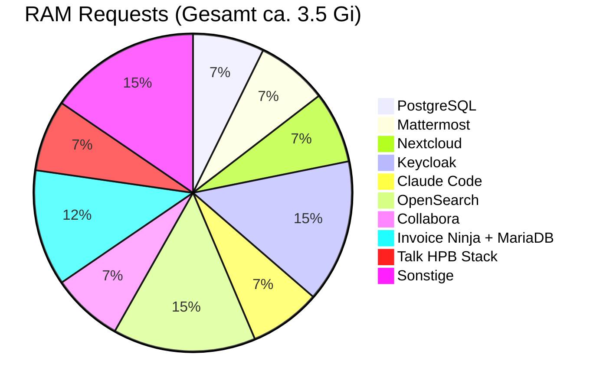

# Services

Alle Services laufen als Kubernetes Deployments. Jeder Service hat definierte Resource Requests/Limits und Health Checks.

## Kern-Services

### Keycloak (SSO)

| Eigenschaft | Wert |
|-------------|------|
| Image | `quay.io/keycloak/keycloak:24.0` |
| Port | 8080 |
| URL | http://auth.localhost |
| Datenbank | PostgreSQL (shared-db/keycloak) |
| Resources | 250m--1 CPU, 512Mi--1Gi RAM |
| Manifest | `k3d/keycloak.yaml` |

OIDC-Provider fuer alle Services. Realm `workspace` wird beim Start automatisch importiert. Siehe [Keycloak & SSO](keycloak.md) fuer Details.

### Mattermost (Chat)

| Eigenschaft | Wert |
|-------------|------|
| Image | `mattermost/mattermost-enterprise-edition:9.7` |
| Port | 8065 |
| URL | http://chat.localhost |
| Datenbank | PostgreSQL (shared-db/mattermost) |
| Storage | 20 Gi PVC (Dateien) |
| Resources | 250m--1 CPU, 256Mi--1Gi RAM |
| Manifest | `k3d/mattermost.yaml` |

Team-Chat mit Channels, DMs, Threads, Webhooks, Slash-Commands. OpenSearch-Integration fuer Volltextsuche. OIDC-Login ueber mm-keycloak-proxy. Konfiguriert mit deutscher Sprache und Europe/Berlin Zeitzone.

**Zugehoerige Manifeste:**
- `k3d/mattermost-hpa.yaml` -- Horizontal Pod Autoscaler
- `k3d/mm-keycloak-proxy.yaml` -- Nginx-Proxy fuer interne Keycloak-Kommunikation

### Nextcloud (Dateien + Talk)

| Eigenschaft | Wert |
|-------------|------|
| Image | `nextcloud:28-apache` |
| Port | 80 |
| URL | http://files.localhost |
| Datenbank | PostgreSQL (shared-db/nextcloud) |
| Storage | 2 Gi (App) + 50 Gi (Daten) |
| Resources | 200m CPU, 256Mi--1Gi RAM |
| Manifest | `k3d/nextcloud.yaml` |

Dateiverwaltung mit Kalender, Kontakte, Talk (Video), Collabora-Integration. OIDC ueber `nextcloud-oidc-dev.php` ConfigMap. Apps werden nach Deploy per `task workspace:post-setup` aktiviert:
- calendar, contacts, oidc_login, richdocuments, spreed

### Collabora Online (Office)

| Eigenschaft | Wert |
|-------------|------|
| Image | `collabora/code:25.04.9.4.1` |
| Port | 9980 |
| URL | http://office.localhost |
| Resources | 200m CPU, 256Mi--1Gi RAM |
| Manifest | `k3d/collabora.yaml` |

LibreOffice-basiertes Online-Office. Verbunden mit Nextcloud ueber WOPI. Woerterbuecher: Deutsch + Englisch.

### Talk HPB (Signaling)

Drei Deployments fuer WebRTC-Videokonferenzen:

| Komponente | Image | Port |
|------------|-------|------|
| spreed-signaling | `strukturag/nextcloud-spreed-signaling:1.2.4` | 8080 |
| Janus Gateway | `canyan/janus-gateway:master` | 8188 |
| NATS | `nats:2.10-alpine` | 4222 |
| coturn | `coturn/coturn:4.6-alpine` | 3478 |

**Manifest:** `k3d/talk-hpb.yaml` (signaling + Janus + NATS), `k3d/coturn.yaml`

Janus konfiguriert mit STUN/TURN ueber coturn. RTP-Port-Range: 20000--40000. Alle Konfigurationen ueber ConfigMaps inline im Manifest.

## AI & Suche

### Claude Code (KI-Assistent)

Claude Code ist ein lokaler KI-Client (CLI/Desktop/IDE), der ueber MCP-Server (Model Context Protocol) mit dem Kubernetes-Cluster interagiert. Es gibt kein Web-UI im Cluster -- stattdessen zeigt `ai.localhost` eine MCP-Status-Seite mit Health-Checks aller MCP-Server.

| Eigenschaft | Wert |
|-------------|------|
| Status-Seite | http://ai.localhost (MCP-Status-Dashboard) |
| MCP-Server | 11 Server in separaten Pods |
| Backend | Anthropic API (Claude Sonnet 4) |
| Manifest | `k3d/claude-code-config.yaml`, `k3d/claude-code-rbac.yaml` |

**MCP-Server (k3d/):**

| Pod / Manifest | Container | Funktion |
|----------------|-----------|----------|
| `claude-code-mcp-ops.yaml` | mcp-kubernetes, mcp-postgres, mcp-mattermost | Cluster-Management, DB-Abfragen, Chat-Integration |
| `claude-code-mcp-browser.yaml` | mcp-browser | Playwright Browser-Automatisierung |
| `claude-code-mcp-apps.yaml` | mcp-nextcloud, mcp-invoiceninja | Dateien/Kalender, Rechnungen |
| `claude-code-mcp-auth.yaml` | mcp-keycloak | Benutzer-/Rollenverwaltung |
| `claude-code-mcp-github.yaml` | mcp-github | GitHub Repos, Issues, PRs (PAT erforderlich) |
| `claude-code-mcp-stripe.yaml` | mcp-stripe | Zahlungen, Abonnements |

**Produktion (deploy/mcp/):**
- `mcp-status.yaml` -- Health-Dashboard (nginx + healthcheck sidecar)
- `mcp-auth-proxy.yaml` -- ForwardAuth-Proxy fuer Token-Validierung (RBAC)
- Konsolidierte Pods: `claude-code-mcp-core.yaml`, `claude-code-mcp-apps.yaml`, `claude-code-mcp-auth.yaml`

**Zugehoerige Manifeste:**
- `k3d/claude-code-config.yaml` -- Umgebungskonfiguration (MCP-URLs, API-Keys)
- `k3d/claude-code-rbac.yaml` -- Kubernetes RBAC fuer MCP-Zugriff (ClusterRole + ServiceAccount)
- `claude-code/system-prompt.md` -- System-Prompt fuer Claude Code
- `claude-code/cluster.settings.json` -- MCP-Konfiguration fuer Cluster-Admin-Rolle
- `claude-code/business.settings.json` -- MCP-Konfiguration fuer Business-Benutzer-Rolle

### OpenSearch (Volltextsuche)

| Eigenschaft | Wert |
|-------------|------|
| Image | `opensearchproject/opensearch:2.17.1` |
| Ports | 9200 (HTTP), 9600 (Telemetrie) |
| Storage | 5 Gi PVC |
| Resources | 200m CPU, 512Mi--1Gi RAM |
| Manifest | `k3d/opensearch.yaml` |

Single-Node Cluster fuer Mattermost-Volltextsuche. Security-Plugin deaktiviert (Dev). JVM Heap: 256m.

### Whisper (Transkription, optional)

| Eigenschaft | Wert |
|-------------|------|
| Image | `fedirz/faster-whisper-server:latest-cpu` |
| Port | 8000 |
| Resources | 1--4 CPU, 2--4Gi RAM |
| Manifest | `k3d/whisper.yaml` |

CPU-basierte Spracherkennung mit dem Medium-Modell. Deploy: `task whisper:deploy`.

## Business-Services

### Invoice Ninja (Rechnungen)

| Eigenschaft | Wert |
|-------------|------|
| Image | `invoiceninja/invoiceninja:5` + `nginx:1.27-alpine` (Sidecar) |
| Port | 9000 (FPM) / 80 (Nginx) |
| URL | http://billing.localhost (ueber oauth2-proxy) |
| Datenbank | MariaDB 11 (eigene Instanz) |
| Storage | 5 Gi (App) + 5 Gi (MariaDB) |
| Manifest | `k3d/invoiceninja.yaml` |

Rechnungserstellung mit Stripe-Integration. Zugriff ueber oauth2-proxy fuer Keycloak-SSO. Nginx-Sidecar serviert statische Dateien.

**Zugehoerige Manifeste:**
- `k3d/oauth2-proxy-invoiceninja.yaml` -- OAuth2-Proxy (quay.io/oauth2-proxy/oauth2-proxy:v7.6.0)
- `k3d/billing-bot.yaml` -- Go-Bot fuer Mattermost-Integration
- `k3d/billing-bot-init-job.yaml` -- Automatische Token/Slash-Command-Provisionierung

### billing-bot

| Eigenschaft | Wert |
|-------------|------|
| Image | `registry.localhost:5000/billing-bot:v1` |
| Port | 8090 |
| Resources | 50m CPU, 32--64Mi RAM |
| Manifest | `k3d/billing-bot.yaml` |

Go-Microservice: `/slash` (Slash-Command Handler), `/actions` (Interactive Messages), `/healthz`. Verbindet Mattermost mit Invoice Ninja.

### Vaultwarden (Passwoerter)

| Eigenschaft | Wert |
|-------------|------|
| Image | `vaultwarden/server:1.30.5-alpine` |
| Port | 80 |
| URL | http://vault.localhost |
| Datenbank | PostgreSQL (shared-db/vaultwarden) |
| Storage | 5 Gi PVC |
| Resources | 50m CPU, 64--256Mi RAM |
| Manifest | `k3d/vaultwarden.yaml` |

Bitwarden-kompatibler Passwort-Manager mit SSO-Login ueber Keycloak. Seed-Job fuer initiale Ordnerstruktur: `task workspace:vaultwarden:seed`.

## Kollaboration

### Whiteboard

| Eigenschaft | Wert |
|-------------|------|
| Image | `ghcr.io/nextcloud-releases/whiteboard:v1.5.7` |
| Port | 3002 |
| URL | http://board.localhost |
| Resources | 100m CPU, 128--256Mi RAM |
| Manifest | `k3d/whiteboard.yaml` |

Nextcloud-integriertes kollaboratives Whiteboard mit JWT-Authentifizierung.

### Outline (Wiki, optional)

| Eigenschaft | Wert |
|-------------|------|
| Image | `outlinewiki/outline:0.75.0` + `redis:7-alpine` (Sidecar) |
| Port | 3000 |
| URL | http://wiki.localhost |
| Datenbank | PostgreSQL (shared-db/outline) |
| Storage | 5 Gi PVC (Dateien) |
| Resources | 100m CPU, 256--512Mi RAM |
| Manifest | `k3d/outline.yaml` |

Wissensdatenbank mit Keycloak-OIDC. Redis-Sidecar fuer Caching. Deploy: `task outline:deploy`.

## Infrastruktur-Services

### Mailpit (Dev-Mail)

| Eigenschaft | Wert |
|-------------|------|
| Image | `axllent/mailpit:v1.21` |
| Ports | 1025 (SMTP), 8025 (Web UI) |
| URL | http://mail.localhost |
| Resources | 25m CPU, 32--128Mi RAM |
| Manifest | `k3d/mailpit.yaml` |

SMTP-Server fuer Entwicklung. Alle Services senden E-Mails an Mailpit.

### Docs (Docsify)

| Eigenschaft | Wert |
|-------------|------|
| Image | `nginx:1.27-alpine` + `alpine/git:v2.43.0` (Init) |
| Port | 80 |
| URL | http://docs.localhost |
| Resources | 10m CPU, 16--64Mi RAM |
| Manifest | `k3d/docs.yaml` |

Git-Sync InitContainer klont `docs/` von GitHub, Docsify rendert Markdown im Browser.

### Website (Astro + Svelte)

| Eigenschaft | Wert |
|-------------|------|
| URL | http://web.localhost |
| Namespace | `website` (eigener Namespace) |
| Manifest | `k3d/website.yaml` |

Unternehmenswebsite mit Kontaktformular (Mattermost-Webhook). Deploy: `task website:deploy`.

## Ressourcen-Uebersicht

