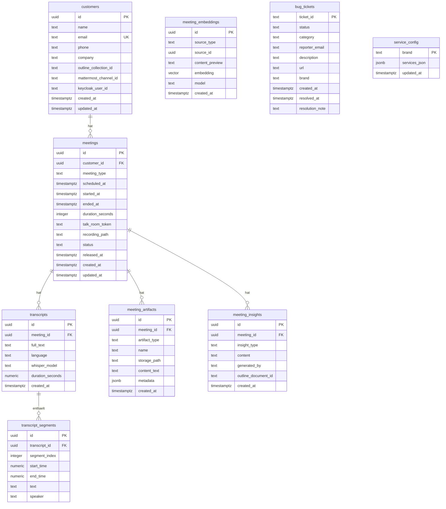
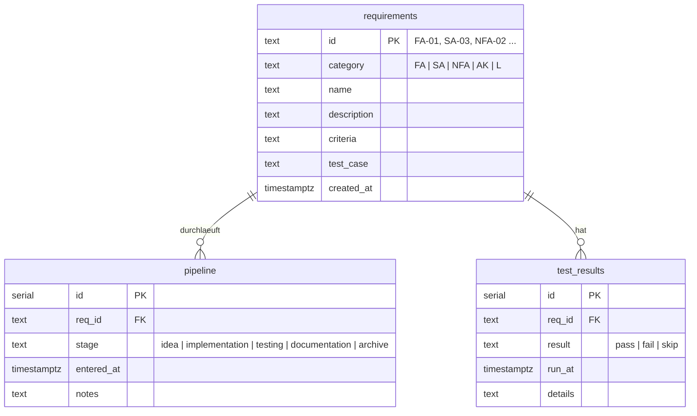

# Database ER Models Implementation Plan

> **For agentic workers:** REQUIRED SUB-SKILL: Use superpowers:subagent-driven-development (recommended) or superpowers:executing-plans to implement this plan task-by-task. Steps use checkbox (`- [ ]`) syntax for tracking.

**Goal:** Neue Dokumentationsseite `docs/database.md` mit Mermaid-ER-Diagrammen fuer beide im Repo definierten PostgreSQL-Schemas, plus Querverweis in bestehenden Docs.

**Architecture:** Reine Dokumentationsaufgabe — drei Dateiaenderungen, kein Code, kein Kubernetes. Die Diagramme werden als Mermaid `erDiagram`-Bloecke in Markdown geschrieben und rendern direkt in Docsify und GitHub.

**Tech Stack:** Markdown, Mermaid erDiagram

---

## File Map

| Aktion | Datei | Inhalt |
|--------|-------|--------|
| Erstellen | `docs/database.md` | Neue Seite mit beiden ER-Diagrammen |
| Aendern | `docs/_sidebar.md` | Link zu `database.md` hinzufuegen |
| Aendern | `docs/architecture.md` | Querverweis im Abschnitt "Datenbank-Layout" |

---

## Task 1: `docs/database.md` erstellen

**Files:**
- Create: `docs/database.md`

- [ ] **Schritt 1: Datei erstellen**

Lege `docs/database.md` mit folgendem Inhalt an:

```markdown
# Datenbankmodelle

Alle im Repository definierten Schemas laufen auf `shared-db` (PostgreSQL 16).
Die Tabellenstrukturen werden durch Kubernetes-Init-Skripte idempotent angelegt —
`k3d/website-schema.yaml` fuer die `website`-Datenbank,
`deploy/tracking/init.sql` fuer das `bachelorprojekt`-Schema.

---

## Website-Datenbank (`website`)

Speichert die Meeting Knowledge Pipeline: Kunden, Meeting-Verlauf, Transkripte,
Artefakte, KI-Insights, Vektor-Embeddings sowie Bug-Tickets und Service-Konfigurationen.



> **`meeting_embeddings`** referenziert Zeilen aus `transcripts`, `transcript_segments`,
> `meeting_artifacts` oder `meeting_insights` ueber das Tupel `(source_type, source_id)` —
> eine polymorphe Relation ohne Datenbank-FK. `source_type` nimmt einen der Werte
> `'transcript'`, `'segment'`, `'artifact'` oder `'insight'` an.

### Tabellenbeschreibungen

| Tabelle | Beschreibung |
|---------|--------------|
| `customers` | Kunden/Coachees — Referenzpunkte zu Keycloak, Mattermost-Channel und Outline-Collection |
| `meetings` | Meeting-Verlauf mit Status-Lifecycle: `scheduled → active → ended → transcribed → finalized` |
| `transcripts` | Volltext-Transkripte aus Whisper (faster-whisper-medium) |
| `transcript_segments` | Zeitgestempelte Segmente eines Transkripts mit optionalem Speaker-Label |
| `meeting_artifacts` | Artefakte (Whiteboard-Export, Datei, Screenshot, Dokument) je Meeting |
| `meeting_insights` | KI-generierte Einsichten: Zusammenfassung, Aktionspunkte, Themen, Sentiment, Coaching-Notizen |
| `meeting_embeddings` | pgvector-Einbettungen (BAAI/bge-base-en-v1.5, 768 Dim.) fuer semantische Suche |
| `bug_tickets` | Bug-Meldungen vom Website-Formular mit Status `open → resolved → archived` |
| `service_config` | Angebots-Overrides je Brand (JSON) fuer das Admin-Panel |

---

## Bachelorprojekt-Tracking-Schema (`bachelorprojekt`)

Verfolgt den Fortschritt aller Anforderungen durch den Entwicklungsprozess.
Angelegt in der `postgres`-Standarddatenbank auf `shared-db`.



### Views

| View | Beschreibung |
|------|--------------|
| `v_pipeline_status` | Aktueller Stage je Anforderung (neuester `pipeline`-Eintrag) |
| `v_progress_summary` | Anzahl Anforderungen je Stage |
| `v_open_issues` | Alle Anforderungen ausser `archive` |
| `v_latest_tests` | Letztes Testergebnis je Anforderung |
```

- [ ] **Schritt 2: Pruefen, dass die Datei existiert**

```bash
ls -la docs/database.md
```

Erwartete Ausgabe: Datei vorhanden, > 0 Bytes.

- [ ] **Schritt 3: Commit**

```bash
git add docs/database.md
git commit -m "docs: add database ER model documentation"
```

---

## Task 2: `docs/_sidebar.md` aktualisieren

**Files:**
- Modify: `docs/_sidebar.md`

- [ ] **Schritt 1: Eintrag hinzufuegen**

In `docs/_sidebar.md` nach der Zeile `- [Architektur](architecture.md)` einfuegen:

```
- [Datenbankmodelle](database.md)
```

Die Sektion **Fuer Administratoren** soll danach so aussehen:

```markdown
- **Fuer Administratoren**
- [Architektur](architecture.md)
- [Datenbankmodelle](database.md)
- [Services](services.md)
- [Keycloak & SSO](keycloak.md)
- [Migration](migration.md)
- [Skripte](scripts.md)
- [Tests](tests.md)
- [Sicherheit](security.md)
- [Verarbeitungsverzeichnis (Art. 30)](verarbeitungsverzeichnis.md)
- [Fehlerbehebung](troubleshooting.md)
- [Anforderungen](requirements.md)
- [MCP Actions](mcp-actions.md)
```

- [ ] **Schritt 2: Commit**

```bash
git add docs/_sidebar.md
git commit -m "docs: add Datenbankmodelle link to sidebar"
```

---

## Task 3: `docs/architecture.md` — Querverweis

**Files:**
- Modify: `docs/architecture.md`

- [ ] **Schritt 1: Querverweis einfuegen**

In `docs/architecture.md` am Ende des Abschnitts `## Datenbank-Layout` (nach Zeile 585 —
direkt vor dem `---`-Trennstrich) folgenden Absatz einfuegen:

```markdown
> Die vollstaendigen Tabellenstrukturen und ER-Diagramme fuer `website` und `bachelorprojekt`
> sind in [Datenbankmodelle](database.md) dokumentiert.
```

Der betroffene Bereich in `docs/architecture.md` (Zeilen 583-587):

```
| `outline` | `outline` | Outline | + Redis Sidecar fuer Sessions |
| `invoiceninja` | `invoiceninja` | Invoice Ninja | Separate MariaDB (MySQL-Kompatibilitaet) |

Die Init-Skripte in `shared-db` erstellen User und Datenbanken idempotent beim ersten Start und synchronisieren Passwoerter bei Neustarts.

---
```

Wird zu:

```
| `outline` | `outline` | Outline | + Redis Sidecar fuer Sessions |
| `invoiceninja` | `invoiceninja` | Invoice Ninja | Separate MariaDB (MySQL-Kompatibilitaet) |

Die Init-Skripte in `shared-db` erstellen User und Datenbanken idempotent beim ersten Start und synchronisieren Passwoerter bei Neustarts.

> Die vollstaendigen Tabellenstrukturen und ER-Diagramme fuer `website` und `bachelorprojekt`
> sind in [Datenbankmodelle](database.md) dokumentiert.

---
```

- [ ] **Schritt 2: Commit**

```bash
git add docs/architecture.md
git commit -m "docs: add cross-reference to database ER model page"
```
