# Workspace Docs Refresh Implementation Plan

> **For agentic workers:** REQUIRED SUB-SKILL: Use superpowers:subagent-driven-development (recommended) or superpowers:executing-plans to implement this plan task-by-task. Steps use checkbox (`- [ ]`) syntax for tracking.

**Goal:** Refresh `docs.mentolder.de` and `docs.korczewski.de` end-to-end — brand-switching shell, audience-first sidebar, three new Quickstart pages + Glossary + Decision-Log, ~24 Mermaid diagrams, content sweep that removes Mattermost / InvoiceNinja / Stripe references.

**Architecture:** All content lives in `k3d/docs-content/` (served as a ConfigMap). The Docsify shell `docs-site/index.html` detects the hostname and sets `data-brand="mentolder|korczewski"` on `<html>` synchronously before docsify boots; CSS variables and Mermaid theme switch from that attribute. No new tooling, no migration off Docsify. Rollout via existing `task docs:deploy`.

**Tech Stack:** Docsify 4 (vendored from CDN), Mermaid 10 + docsify-mermaid plugin, Panzoom 9, plain HTML/CSS/JS. Validation via BATS. Content in German.

**Spec:** `docs/superpowers/specs/2026-05-10-docs-refresh-design.md`

---

## File Structure

| Path | Action | Responsibility |
|------|--------|----------------|
| `docs-site/index.html` | rewrite | Brand-switch shell — `data-brand` plumbing, two CSS token sets, Mermaid theme set once at boot |
| `k3d/docs-content/_sidebar.md` | rewrite | New navigation: Quickstarts → Services → Betrieb → Sicherheit → Entwicklung → Administration → Benutzerhandbuch → Referenz |
| `k3d/docs-content/README.md` | rewrite | Landing — lede, 3-track cards, fresh architecture diagram, services-endpoints table, Schnellstart, hilfe |
| `k3d/docs-content/quickstart-enduser.md` | create | 5-Min Quickstart for end-users |
| `k3d/docs-content/quickstart-admin.md` | create | First-install guide for admins |
| `k3d/docs-content/quickstart-dev.md` | create | Codebase tour for developers |
| `k3d/docs-content/glossary.md` | create | ~25 entries, alphabetical |
| `k3d/docs-content/decisions.md` | create | Decision log with 7 initial entries; dates filled from git log |
| `k3d/docs-content/requirements.md` | edit | Drop Mattermost/InvoiceNinja/Stripe rows |
| `k3d/docs-content/tests.md` | edit | Drop tests for retired services |
| `k3d/docs-content/vaultwarden.md` | edit | Drop InvoiceNinja example + add OIDC mermaid |
| `k3d/docs-content/services.md` | edit | Refresh diagram, ensure no Mattermost row |
| `k3d/docs-content/architecture.md` | edit | Refresh node count + unified-cluster wording |
| `k3d/docs-content/operations.md` | edit | Replace `mentolder:*`/`korczewski:*` shorthand with `ENV=` form |
| `k3d/docs-content/{nextcloud,collabora,livestream,einvoice,claude-code,website,whiteboard,mailpit,monitoring,shared-db,argocd,environments,contributing,security,dsgvo,backup,talk-hpb}.md` | edit | One Mermaid diagram per page (some already have one, refresh) |
| `tests/unit/test-docs-content.bats` | create | Lint forbidden strings, sidebar-link integrity, brand-data attribute injection |

---

## Task 1: Validation harness (BATS)

Validate forbidden strings, sidebar-link integrity, and brand-switch presence. Run before and after every content task.

**Files:**
- Create: `tests/unit/test-docs-content.bats`

- [ ] **Step 1: Write the test file**

```bash
#!/usr/bin/env bats
# Lints docs-content/ for forbidden strings + sidebar link integrity + brand-switch presence in shell.

DOCS="$BATS_TEST_DIRNAME/../../k3d/docs-content"
SHELL_HTML="$BATS_TEST_DIRNAME/../../docs-site/index.html"

@test "no Mattermost references in docs (decisions.md exempted)" {
  found=$(grep -ril 'mattermost' "$DOCS" --exclude='decisions.md' || true)
  [ -z "$found" ] || { echo "Forbidden refs: $found"; false; }
}

@test "no InvoiceNinja references in docs (decisions.md exempted)" {
  found=$(grep -ril 'invoiceninja\|invoice ninja' "$DOCS" --exclude='decisions.md' || true)
  [ -z "$found" ] || { echo "Forbidden refs: $found"; false; }
}

@test "no Stripe references in docs (decisions.md exempted)" {
  found=$(grep -ril 'stripe' "$DOCS" --exclude='decisions.md' || true)
  [ -z "$found" ] || { echo "Forbidden refs: $found"; false; }
}

@test "no \"korczewski-Cluster\" or \"separater Cluster\" wording in docs" {
  found=$(grep -riln 'korczewski-Cluster\|separater Cluster\|separates Cluster' "$DOCS" --exclude='decisions.md' || true)
  [ -z "$found" ] || { echo "Stale wording: $found"; false; }
}

@test "every sidebar link has a backing markdown file" {
  while read -r target; do
    f="$DOCS/${target}.md"
    [ -f "$f" ] || { echo "Missing: $f"; false; return; }
  done < <(grep -oE '\]\([a-z][a-z0-9-]*\)' "$DOCS/_sidebar.md" | sed -E 's/[]()]//g')
}

@test "sidebar starts with a Quickstarts group" {
  head -1 "$DOCS/_sidebar.md" | grep -q '\*\*Quickstarts\*\*'
}

@test "sidebar contains all three Quickstart links" {
  grep -q 'quickstart-enduser' "$DOCS/_sidebar.md"
  grep -q 'quickstart-admin' "$DOCS/_sidebar.md"
  grep -q 'quickstart-dev' "$DOCS/_sidebar.md"
}

@test "sidebar entry for MCP-Server uses \"Claude Code\" label" {
  grep -q '\[MCP-Server (Claude Code)\](claude-code)' "$DOCS/_sidebar.md"
}

@test "shell sets data-brand from hostname" {
  grep -q "data-brand" "$SHELL_HTML"
  grep -q "korczewski" "$SHELL_HTML"
  grep -q "mentolder" "$SHELL_HTML"
}

@test "shell defines token blocks for both brands" {
  grep -q ':root\[data-brand="mentolder"\]' "$SHELL_HTML"
  grep -q ':root\[data-brand="korczewski"\]' "$SHELL_HTML"
}

@test "every service page has at least one mermaid block" {
  for p in keycloak nextcloud collabora talk-hpb livestream einvoice claude-code vaultwarden website whiteboard mailpit monitoring shared-db; do
    grep -q '```mermaid' "$DOCS/${p}.md" || { echo "Missing mermaid: ${p}.md"; false; return; }
  done
}

@test "glossary and decisions exist and are non-trivial" {
  [ -s "$DOCS/glossary.md" ]
  [ -s "$DOCS/decisions.md" ]
  [ "$(wc -l < "$DOCS/glossary.md")" -gt 30 ]
  [ "$(wc -l < "$DOCS/decisions.md")" -gt 30 ]
}
```

- [ ] **Step 2: Run tests to verify they fail**

Run: `bats tests/unit/test-docs-content.bats`
Expected: most tests FAIL — no `data-brand` in shell yet, sidebar lacks Quickstarts, glossary/decisions don't exist, Mattermost/InvoiceNinja/Stripe still present in 3 files.

- [ ] **Step 3: Commit**

```bash
git add tests/unit/test-docs-content.bats
git commit -m "test(docs): bats harness for docs-content lint + sidebar integrity"
```

---

## Task 2: Brand-switching shell rewrite

**Files:**
- Modify: `docs-site/index.html` (full rewrite of `<style>` and the `<script>` plugins block)

- [ ] **Step 1: Replace the `<style>` block with token-based CSS**

Open `docs-site/index.html`. Locate the `<style>` block at line 12 and replace its entire contents (lines 13-580 approx., from `/* MENTOLDER DARK-NAVY / GOLD THEME */` to the closing `</style>`) with:

```css
/* ===================================================================
   DOCS — TOKEN-BASED THEME (mentolder default + korczewski override)
   =================================================================== */

:root[data-brand="mentolder"] {
  --bg-1: #0b111c; --bg-2: #101826; --bg-3: #17202e; --bg-4: #1d2736;
  --line: rgba(255,255,255,.08); --line-2: rgba(255,255,255,.14);
  --fg: #eef1f3; --fg-soft: #cdd3d9; --mute: #8c96a3; --mute-2: #6a727e;
  --accent: #d7b06a; --accent-2: #e8c884; --sage: #9bc0a8;
  --serif: 'Newsreader', Georgia, serif;
  --sans:  'Geist', system-ui, -apple-system, sans-serif;
  --mono:  'Geist Mono', ui-monospace, monospace;
  --kicker-pre: ''; --kicker-post: '';
  --group-pre: ''; --group-post: '';
}

:root[data-brand="korczewski"] {
  --bg-1: #111111; --bg-2: #161616; --bg-3: #1a1a1a; --bg-4: #222222;
  --line: #222; --line-2: #2a2a2a;
  --fg: #e0d9cc; --fg-soft: #cdd3d9; --mute: #888; --mute-2: #555;
  --accent: #a08060; --accent-2: #c09060; --sage: #9bc0a8;
  --serif: 'Newsreader', Georgia, serif;
  --sans:  'Geist', system-ui, -apple-system, sans-serif;
  --mono:  'Geist Mono', ui-monospace, monospace;
  --kicker-pre: '[ '; --kicker-post: ' ]';
  --group-pre: '[ '; --group-post: ' ]';
}

/* ---- Base ---- */
*, *::before, *::after { box-sizing: border-box; }
html, body { background: var(--bg-1) !important; color: var(--fg); font-family: var(--sans); }
body { line-height: 1.6; }

/* ---- Sidebar ---- */
.sidebar { background: var(--bg-1) !important; border-right: 1px solid var(--line) !important; }
.sidebar .sidebar-nav a { color: var(--fg-soft) !important; transition: color .15s; font-size: .9rem; }
.sidebar .sidebar-nav a:hover { color: var(--accent-2) !important; }
.sidebar .sidebar-nav li.active > a, .sidebar .sidebar-nav a.active {
  color: var(--accent) !important;
  border-left: 3px solid var(--accent) !important;
  padding-left: .6em; font-weight: 600;
}
.sidebar .sidebar-nav > ul > li > p,
.sidebar .sidebar-nav > ul > li > span,
.sidebar h5 {
  font-family: var(--mono); font-size: .68rem; font-weight: 700;
  letter-spacing: .14em; text-transform: uppercase;
  color: var(--accent) !important; margin: 1.2em 0 .35em;
}
.sidebar .sidebar-nav > ul > li > p::before { content: var(--group-pre); }
.sidebar .sidebar-nav > ul > li > p::after  { content: var(--group-post); }
.sidebar-toggle { background: var(--bg-1) !important; }
.sidebar-toggle span { background-color: var(--mute) !important; }
.app-name-link { color: var(--accent) !important; font-weight: 700 !important; font-family: var(--serif) !important; font-style: italic; }

/* ---- Main / content ---- */
#main { background: var(--bg-1) !important; color: var(--fg); }
.content { color: var(--fg); max-width: 880px !important; }
.markdown-section { color: var(--fg); padding: 30px 45px 40px; }

#main h1 {
  font-family: var(--serif) !important; font-weight: 500 !important;
  color: var(--accent-2) !important; letter-spacing: -.01em;
  border-bottom: 1px solid var(--line) !important; padding-bottom: .4em !important;
  margin-top: .5em !important; font-size: 2.1rem;
}
#main h1 em { color: var(--accent); font-style: italic; }
#main h2 {
  font-family: var(--serif) !important; font-weight: 500 !important;
  color: var(--fg) !important; font-size: 1.4rem; margin: 1.6em 0 .6em;
  letter-spacing: -.005em;
}
#main h3 {
  font-family: var(--serif) !important; font-weight: 500 !important;
  color: var(--fg-soft) !important; font-size: 1.1rem; margin: 1.4em 0 .4em;
}

/* ---- Page hero (kept from original) ---- */
.page-hero {
  background: var(--bg-2); border: 1px solid var(--line); border-radius: 6px;
  padding: 1.4rem 1.6rem; margin: 1.5rem 0 2rem;
  display: flex; align-items: flex-start; gap: 1rem; position: relative;
}
.page-hero-icon { font-size: 2rem; line-height: 1; flex-shrink: 0; }
.page-hero-body { flex: 1; }
.page-hero-title { font-family: var(--serif); font-size: 1.35rem; color: var(--accent-2); margin-bottom: .25rem; }
.page-hero-desc { color: var(--fg-soft); font-size: .92rem; line-height: 1.55; margin-bottom: .55rem; }
.page-hero-meta { display: flex; gap: .4rem; flex-wrap: wrap; }
.page-hero-tag {
  font-family: var(--mono); font-size: .65rem; padding: .2rem .55rem;
  background: var(--bg-3); color: var(--mute); border-radius: 999px;
  text-transform: uppercase; letter-spacing: .1em;
}
.page-hero-back {
  position: absolute; top: 1rem; right: 1.2rem;
  font-family: var(--mono); font-size: .7rem; color: var(--mute);
  text-decoration: none; letter-spacing: .08em;
}
.page-hero-back:hover { color: var(--accent); }

/* ---- Tracks (used on landing) ---- */
.tracks {
  display: grid; grid-template-columns: repeat(3, 1fr); gap: 1rem;
  margin: 1.5rem 0 2rem;
}
.track-card {
  background: var(--bg-2); border: 1px solid var(--line); border-radius: 6px;
  padding: 1rem 1.1rem; display: flex; flex-direction: column; gap: .25rem;
  text-decoration: none; transition: border-color .15s, transform .15s;
}
.track-card:hover { border-color: var(--accent); transform: translateY(-1px); text-decoration: none; }
.track-card .lab {
  font-family: var(--mono); font-size: .62rem; color: var(--accent);
  text-transform: uppercase; letter-spacing: .14em;
}
.track-card .lab::before { content: var(--kicker-pre); }
.track-card .lab::after  { content: var(--kicker-post); }
.track-card .ti { font-family: var(--serif); font-size: 1.05rem; color: var(--fg); }
.track-card .de { font-size: .82rem; color: var(--mute); line-height: 1.4; }
.track-card .arrow { font-family: var(--mono); font-size: .72rem; color: var(--accent); margin-top: .25rem; }

/* ---- Auto-TOC + kicker utility ---- */
.kicker {
  font-family: var(--mono); font-size: .7rem; color: var(--accent);
  text-transform: uppercase; letter-spacing: .16em; margin: 0 0 .4rem;
}
.kicker::before { content: var(--kicker-pre); }
.kicker::after  { content: var(--kicker-post); }

.toc-box {
  background: var(--bg-2); border: 1px solid var(--line); border-radius: 6px;
  padding: 1rem 1.2rem; margin: 1rem 0 2rem;
}
.toc-title {
  font-family: var(--mono); font-size: .65rem; color: var(--accent);
  text-transform: uppercase; letter-spacing: .14em; margin-bottom: .5rem;
}
.toc-title::before { content: var(--kicker-pre); }
.toc-title::after  { content: var(--kicker-post); }
.toc-list { list-style: none; padding: 0; margin: 0; }
.toc-item { margin: .15rem 0; }
.toc-item a { color: var(--fg-soft); text-decoration: none; font-size: .9rem; }
.toc-item a:hover { color: var(--accent-2); }
.toc-num { color: var(--mute-2); font-family: var(--mono); font-size: .8rem; margin-right: .25rem; }

/* ---- Tables ---- */
.markdown-section table {
  display: table; width: 100%; border-collapse: collapse; margin: 1rem 0 1.6rem;
  background: var(--bg-2); border: 1px solid var(--line); border-radius: 4px; overflow: hidden;
}
.markdown-section th, .markdown-section td {
  padding: .55rem .8rem; border: none; border-bottom: 1px solid var(--line);
  text-align: left; vertical-align: top;
}
.markdown-section th {
  background: var(--bg-3); color: var(--accent); font-family: var(--mono);
  font-size: .7rem; text-transform: uppercase; letter-spacing: .12em; font-weight: 600;
}
.markdown-section td { color: var(--fg-soft); font-size: .88rem; }
.markdown-section tr:last-child td { border-bottom: none; }
.markdown-section td code { color: var(--accent-2); }

/* ---- Code ---- */
.markdown-section code {
  background: var(--bg-3); color: var(--accent-2);
  font-family: var(--mono); font-size: .82em;
  padding: .15rem .35rem; border-radius: 3px;
}
.markdown-section pre {
  background: var(--bg-2) !important; border: 1px solid var(--line);
  border-radius: 4px; padding: 1rem; overflow-x: auto;
}
.markdown-section pre code {
  background: transparent; color: var(--fg); padding: 0;
}

/* ---- Blockquote ---- */
.markdown-section blockquote {
  border-left: 3px solid var(--accent); background: var(--bg-2);
  padding: .8rem 1.1rem; margin: 1rem 0; color: var(--fg-soft);
}
.markdown-section blockquote strong { color: var(--accent-2); }

/* ---- Links ---- */
.markdown-section a:not(.track-card):not(.page-hero-back) {
  color: var(--accent-2); border-bottom: 1px solid transparent; transition: border-color .15s;
}
.markdown-section a:not(.track-card):not(.page-hero-back):hover { border-bottom-color: var(--accent-2); }

/* ---- Search ---- */
.search { padding: 12px 18px !important; border-bottom: 1px solid var(--line) !important; }
.search input { background: var(--bg-2) !important; color: var(--fg) !important; border: 1px solid var(--line) !important; border-radius: 3px; padding: .4rem .6rem; }
.search .matching-post { border-bottom: 1px solid var(--line) !important; }
.search .matching-post a { color: var(--fg) !important; }
.search .matching-post p { color: var(--mute) !important; font-size: .82rem; }
mark { background: rgba(215,176,106,.3) !important; color: var(--accent-2) !important; border-radius: 2px; }

/* ---- Mermaid ---- */
.mermaid-wrapper { position: relative; margin: 1rem 0 1.5rem; }
.mermaid-zoom-hint { position: absolute; bottom: .5rem; right: .8rem; font-family: var(--mono); font-size: .65rem; color: var(--mute); }
.mermaid-zoom-reset {
  position: absolute; top: .5rem; right: .8rem;
  background: var(--bg-3); color: var(--accent); border: 1px solid var(--line);
  font-family: var(--mono); font-size: .68rem; padding: .25rem .6rem; border-radius: 3px; cursor: pointer;
}
.mermaid-zoom-reset:hover { border-color: var(--accent); }

/* ---- Misc ---- */
hr { border: none; border-top: 1px solid var(--line); margin: 2em 0; }
.cover-main { background: var(--bg-1) !important; }
nav.app-nav a { color: var(--fg-soft) !important; }
nav.app-nav a:hover { color: var(--accent) !important; }
```

- [ ] **Step 2: Replace the `<script>` plugins block**

In `docs-site/index.html`, locate `window.$docsify = {` (around line 585) and replace the entire `window.$docsify = { … }` object — and the small inline script that follows it — with this:

```html
<script>
  // 1) Brand detection — runs BEFORE docsify boots so CSS variables apply on first paint.
  (function () {
    var host = window.location.hostname;
    var brand = host.endsWith('korczewski.de') ? 'korczewski' : 'mentolder';
    document.documentElement.setAttribute('data-brand', brand);
    window.__BRAND__ = brand;
  })();

  window.$docsify = {
    name: 'Workspace · Docs',
    repo: '',
    loadSidebar: true,
    subMaxLevel: 2,
    search: {
      maxAge: 86400000,
      paths: 'auto',
      placeholder: 'Suchen …',
      noData: 'Kein Ergebnis',
      depth: 3
    },
    plugins: [
      // ---- Domain & brand resolver ----
      function (hook) {
        var host   = window.location.hostname;
        var domain = host.replace(/^docs\./, '');
        var proto  = window.location.protocol.replace(':', '');
        hook.beforeEach(function (content) {
          return content
            .replace(/\{DOMAIN\}/g, domain)
            .replace(/\{PROTO\}/g, proto);
        });
      },
      // ---- Mermaid Panzoom (kept from original) ----
      function (hook) {
        hook.doneEach(function () {
          setTimeout(function () {
            document.querySelectorAll('.mermaid svg').forEach(function (svg) {
              if (svg.dataset.panzoomApplied) return;
              svg.dataset.panzoomApplied = '1';
              var wrapper = document.createElement('div');
              wrapper.className = 'mermaid-wrapper';
              var hint = document.createElement('span');
              hint.className = 'mermaid-zoom-hint';
              hint.textContent = 'Scroll = Zoom · Ziehen = Pan';
              var resetBtn = document.createElement('button');
              resetBtn.className = 'mermaid-zoom-reset';
              resetBtn.textContent = 'Reset';
              svg.parentNode.insertBefore(wrapper, svg);
              wrapper.appendChild(svg);
              wrapper.appendChild(hint);
              wrapper.appendChild(resetBtn);
              var pz = panzoom(svg, { maxZoom: 10, minZoom: 0.3, boundsPadding: 0.1 });
              resetBtn.addEventListener('click', function () { pz.moveTo(0,0); pz.zoomAbs(0,0,1); });
            });
          }, 300);
        });
      },
      // ---- Auto-TOC (kept from original) ----
      function (hook) {
        hook.doneEach(function () {
          var existing = document.querySelector('#main .auto-toc');
          if (existing) existing.remove();
          var headings = Array.from(document.querySelectorAll('#main h2'));
          if (headings.length < 2) return;
          var base = (window.location.hash.split('?')[0] || '#/').replace(/^#/, '') || '/';
          var box = document.createElement('div'); box.className = 'toc-box auto-toc';
          var titleEl = document.createElement('div'); titleEl.className = 'toc-title';
          titleEl.textContent = 'Auf dieser Seite';
          box.appendChild(titleEl);
          var ul = document.createElement('ul'); ul.className = 'toc-list';
          headings.forEach(function (h, i) {
            var raw = h.textContent.trim();
            var id = h.id || raw.toLowerCase()
              .replace(/ä/g,'ae').replace(/Ä/g,'ae')
              .replace(/ö/g,'oe').replace(/Ö/g,'oe')
              .replace(/ü/g,'ue').replace(/Ü/g,'ue')
              .replace(/ß/g,'ss')
              .replace(/\s+/g,'-').replace(/[^a-z0-9-]/g,'');
            if (!h.id) h.id = id;
            var li = document.createElement('li'); li.className = 'toc-item';
            var a = document.createElement('a');
            a.href = '#' + base + '?id=' + id;
            var num = document.createElement('span'); num.className = 'toc-num';
            num.textContent = (i+1) + '.';
            a.appendChild(num);
            a.appendChild(document.createTextNode(' ' + raw));
            li.appendChild(a); ul.appendChild(li);
          });
          box.appendChild(ul);
          var hero = document.querySelector('#main .page-hero');
          var h1   = document.querySelector('#main h1');
          var anchor = hero || h1;
          if (anchor) anchor.insertAdjacentElement('afterend', box);
          else {
            var main = document.querySelector('#main');
            if (main) main.insertBefore(box, main.firstChild);
          }
        });
      }
    ]
  };
</script>
<script src="//cdn.jsdelivr.net/npm/docsify/lib/docsify.min.js"></script>
<script src="//cdn.jsdelivr.net/npm/docsify/lib/plugins/search.min.js"></script>
<script src="//cdn.jsdelivr.net/npm/mermaid/dist/mermaid.min.js"></script>
<script src="//cdn.jsdelivr.net/npm/docsify-mermaid@2.0.1/dist/docsify-mermaid.js"></script>
<script src="//cdn.jsdelivr.net/npm/panzoom@9.4.3/dist/panzoom.min.js"></script>
<script>
  (function () {
    var brand = window.__BRAND__ || 'mentolder';
    var themeVariables = brand === 'korczewski'
      ? { background: '#111111', primaryColor: '#1a1a1a', primaryTextColor: '#e0d9cc',
          primaryBorderColor: '#a08060', lineColor: '#888', secondaryColor: '#161616',
          tertiaryColor: '#222' }
      : { background: '#0b111c', primaryColor: '#17202e', primaryTextColor: '#eef1f3',
          primaryBorderColor: '#d7b06a', lineColor: '#8c96a3', secondaryColor: '#101826',
          tertiaryColor: '#1d2736' };
    mermaid.initialize({ startOnLoad: false, useMaxWidth: true, securityLevel: 'loose',
                         theme: 'base', themeVariables: themeVariables });
  })();
</script>
```

- [ ] **Step 3: Run the BATS suite**

Run: `bats tests/unit/test-docs-content.bats -f "shell"`
Expected: shell-related tests PASS (data-brand, both token blocks present).

- [ ] **Step 4: Commit**

```bash
git add docs-site/index.html
git commit -m "feat(docs): brand-switch shell — data-brand attribute + token-based theme + per-brand mermaid"
```

---

## Task 3: Sidebar restructure

**Files:**
- Modify: `k3d/docs-content/_sidebar.md` (full rewrite)

- [ ] **Step 1: Replace the file with the new structure**

```markdown
- **Quickstarts**
  - [Endnutzer (5 Min)](quickstart-enduser)
  - [Admin (Setup)](quickstart-admin)
  - [Entwickler (Tour)](quickstart-dev)

- **Services**
  - [Keycloak (SSO)](keycloak)
  - [Nextcloud + Talk](nextcloud)
  - [Collabora (Office)](collabora)
  - [Talk HPB (Signaling)](talk-hpb)
  - [Livestream (LiveKit)](livestream)
  - [E-Invoice (ZUGFeRD & XRechnung)](einvoice)
  - [MCP-Server (Claude Code)](claude-code)
  - [Vaultwarden (Passwörter)](vaultwarden)
  - [Website (Astro & Svelte)](website)
  - [Whiteboard](whiteboard)
  - [Mailpit (Dev-Mail)](mailpit)
  - [Monitoring (Prometheus & Grafana)](monitoring)
  - [PostgreSQL (shared-db)](shared-db)

- **Betrieb**
  - [Deployment & Taskfile](operations)
  - [Umgebungen & Secrets](environments)
  - [ArgoCD (GitOps)](argocd)
  - [Backup & Wiederherstellung](backup)

- **Sicherheit**
  - [Sicherheitsarchitektur](security)
  - [Sicherheitsbericht](security-report)
  - [DSGVO / Datenschutz](dsgvo)
  - [Verarbeitungsverzeichnis](verarbeitungsverzeichnis)

- **Entwicklung**
  - [Beitragen & CI/CD](contributing)
  - [Architektur](architecture)
  - [Tests](tests)
  - [Skripte-Referenz](scripts)
  - [Migration](migration)
  - [Anforderungen](requirements)
  - [Fehlerbehebung](troubleshooting)

- **Administration**
  - [Adminhandbuch](adminhandbuch)
  - [Admin-Webinterface](admin-webinterface)
  - [Projekt-Verwaltung](admin-projekte)
  - [Tickets (Unified Inbox)](admin-tickets)

- **Benutzerhandbuch**
  - [Für Endnutzer](benutzerhandbuch)
  - [Systembrett im Whiteboard](systembrett)
  - [Systemisches Brett (3D)](systemisches-brett)

- **Referenz**
  - [Glossar](glossary)
  - [Decision-Log](decisions)
```

- [ ] **Step 2: Run BATS**

Run: `bats tests/unit/test-docs-content.bats -f "sidebar"`
Expected: sidebar-related tests PASS (Quickstarts group present, MCP label correct). The "every sidebar link backed" test still FAILS because `quickstart-*.md`, `glossary.md`, `decisions.md` don't exist yet — that's fixed by tasks 4-6.

- [ ] **Step 3: Commit**

```bash
git add k3d/docs-content/_sidebar.md
git commit -m "feat(docs): restructure sidebar — Quickstarts on top, fix MCP label, add Referenz group"
```

---

## Task 4: Three Quickstart pages

**Files:**
- Create: `k3d/docs-content/quickstart-enduser.md`
- Create: `k3d/docs-content/quickstart-admin.md`
- Create: `k3d/docs-content/quickstart-dev.md`

- [ ] **Step 1: Write `quickstart-enduser.md`**

```markdown
<div class="page-hero">
  <span class="page-hero-icon">🚀</span>
  <div class="page-hero-body">
    <div class="page-hero-title">Quickstart — Endnutzer</div>
    <p class="page-hero-desc">In fünf Minuten vom ersten Login zum ersten Talk-Call.</p>
    <div class="page-hero-meta">
      <span class="page-hero-tag">5 Minuten</span>
      <span class="page-hero-tag">Kein Setup</span>
    </div>
  </div>
  <a href="#/" class="page-hero-back">← Übersicht</a>
</div>

# In fünf Minuten startklar

<p class="kicker">Endnutzer · Erste Schritte</p>

Du hast einen Account von deiner Plattform-Administration erhalten. Diese Seite führt dich durch deinen ersten produktiven Tag.

## 1. Portal öffnen

Rufe `https://web.{DOMAIN}/portal` auf. Es wird dich automatisch zum Single Sign-On weiterleiten.

## 2. Anmelden

Gib Benutzername und Initial-Passwort ein. Beim ersten Login wirst du gebeten, ein neues Passwort zu setzen — wähl mindestens zwölf Zeichen.

## 3. Dashboard kennenlernen

Nach dem Login landest du im Portal-Dashboard. Du siehst:

- **Eigene Termine** — direkt mit Talk-Call verknüpft
- **Letzte Dateien** — synchronisiert aus Nextcloud
- **Kontakt** — Chat mit anderen Workspace-Nutzern

## 4. Datei hochladen

Klick auf **Dateien** in der Seitenleiste. Du landest in Nextcloud. Zieh eine Datei in den Browser — fertig.

## 5. Talk-Call starten

Zurück im Portal: **Talk** öffnen → **Neuer Call**. Sende den Link an Teilnehmer per Chat oder Mail.

## 6. Tiefer einsteigen

- **Whiteboard** — kollaboratives Zeichnen, mit Systembrett-Vorlage für systemische Aufstellungen.
- **Vaultwarden** — Passwort-Tresor, geteilt mit Teamkollegen.
- **Office** — Word/Excel/PowerPoint im Browser, öffnet aus Nextcloud.

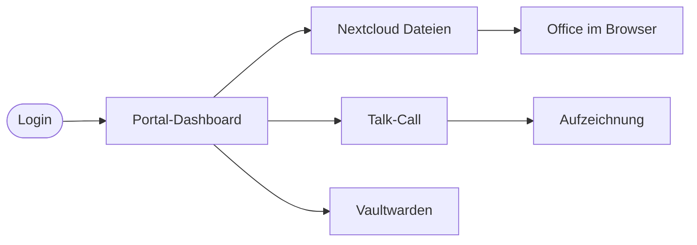

> **Mehr erfahren:** Vollständiges [Benutzerhandbuch](benutzerhandbuch) für alle Funktionen.
```

- [ ] **Step 2: Write `quickstart-admin.md`**

```markdown
<div class="page-hero">
  <span class="page-hero-icon">🛠️</span>
  <div class="page-hero-body">
    <div class="page-hero-title">Quickstart — Admin</div>
    <p class="page-hero-desc">Vom leeren Server zum laufenden Workspace.</p>
    <div class="page-hero-meta">
      <span class="page-hero-tag">~30 Minuten</span>
      <span class="page-hero-tag">Kubernetes</span>
    </div>
  </div>
  <a href="#/" class="page-hero-back">← Übersicht</a>
</div>

# Admin-Quickstart

<p class="kicker">Admin · Erstinstallation</p>

Diese Seite bringt einen leeren k3d-Cluster auf einen funktionierenden Workspace. Für Produktiv-Deployments siehe [Deployment & Taskfile](operations) und [Umgebungen & Secrets](environments).

## Was du brauchst

| Werkzeug | Zweck |
|----------|-------|
| Docker | Container-Runtime |
| k3d | k3s in Docker — lokaler Cluster |
| kubectl | Kubernetes-CLI |
| task | Task-Runner (siehe `taskfile.dev`) |
| git | Quellcode |

## 1. Cluster anlegen

```bash
git clone https://github.com/Paddione/Bachelorprojekt.git
cd Bachelorprojekt
task cluster:create
```

Die Konfiguration steht in `k3d-config.yaml`. Wenn der Befehl durchläuft, gibt `kubectl get nodes` einen Eintrag mit Status `Ready` aus.

## 2. Workspace deployen

```bash
task workspace:deploy
```

Dies wendet alle Manifeste aus `k3d/` per Kustomize an: Keycloak, Nextcloud, Vaultwarden, Talk-HPB, Whiteboard, Website, Postgres und mehr. Erwarte eine Wartezeit von zwei bis drei Minuten beim ersten Mal — Container-Images werden gepullt.

## 3. Post-Setup ausführen

```bash
task workspace:post-setup
task workspace:talk-setup
```

Dies aktiviert Nextcloud-Apps (Calendar, Contacts, OIDC, Collabora) und konfiguriert Talk-HPB-Signaling.

## 4. Erste Validierung

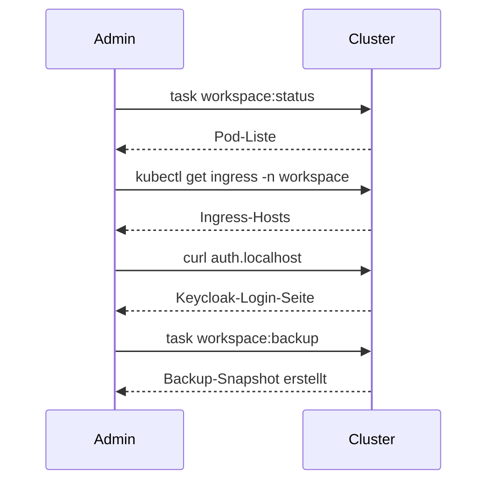

Vier Health-Checks:

1. `task workspace:status` — alle Pods im Status `Running`?
2. `auth.localhost` öffnen — Keycloak-Login lädt?
3. `files.localhost` öffnen — Nextcloud-Login lädt, OIDC-Redirect funktioniert?
4. `task workspace:backup` — Snapshot wird angelegt?

## 5. Admin-User anlegen

```bash
task workspace:admin-users-setup
```

Damit werden Default-Admins in Keycloak und Nextcloud erstellt. Passwörter siehe `environments/.secrets/dev.yaml`.

## Weiter geht's

- [Adminhandbuch](adminhandbuch) — täglicher Betrieb
- [Backup & Wiederherstellung](backup) — Backup-Strategien
- [Sicherheitsarchitektur](security) — was wo verschlüsselt ist
```

- [ ] **Step 3: Write `quickstart-dev.md`**

```markdown
<div class="page-hero">
  <span class="page-hero-icon">🧭</span>
  <div class="page-hero-body">
    <div class="page-hero-title">Quickstart — Entwickler</div>
    <p class="page-hero-desc">Codebase-Tour für neue Beitragende.</p>
    <div class="page-hero-meta">
      <span class="page-hero-tag">Codebase</span>
      <span class="page-hero-tag">Workflow</span>
    </div>
  </div>
  <a href="#/" class="page-hero-back">← Übersicht</a>
</div>

# Entwickler-Quickstart

<p class="kicker">Entwickler · Codebase-Tour</p>

Diese Seite ist die Karte. Jede ausführliche Erklärung steht woanders — hier findest du den Einstieg.

## Repo-Layout

| Verzeichnis | Inhalt |
|-------------|--------|
| `k3d/` | Alle Kubernetes-Manifeste (Kustomize) — der einzige Deploy-Pfad |
| `prod/` | Gemeinsame Prod-Patches (TLS, Limits, Replicas) |
| `prod-mentolder/`, `prod-korczewski/` | Per-Env-Overlays |
| `environments/` | Per-Env-Config (`<env>.yaml`), SealedSecrets, Schema |
| `argocd/` | GitOps-Konfiguration für Multi-Cluster-Federation |
| `website/` | Astro + Svelte Portal |
| `brett/` | 3D Systembrett-Service |
| `scripts/` | Bash-Utilities (env-resolve, talk-hpb-setup, …) |
| `tests/` | BATS + Playwright Test-Suite |
| `Taskfile.yml` | Alle Build-/Deploy-/Ops-Befehle |

## Drei Beispiel-Workflows

### Eine Website-Änderung

```bash
cd website
npm run dev                  # Lokaler Astro-Dev-Server
# Edit src/components/...
git checkout -b feature/abc
# Commit + push
gh pr create
# CI grün → merge (squash) → task feature:website
```

### Eine Manifest-Änderung

```bash
# Edit k3d/<service>.yaml
task workspace:validate      # Dry-run
task workspace:deploy        # Lokal anwenden
./tests/runner.sh local FA-03   # Relevanten Test fahren
```

### Einen Test schreiben

```bash
# Edit tests/integration/sa-08.bats
./tests/runner.sh local SA-08 --verbose
task test:unit               # BATS-Unit-Tests
task test:manifests          # Kustomize-Output-Validierung
```

## Taskfile-Tour

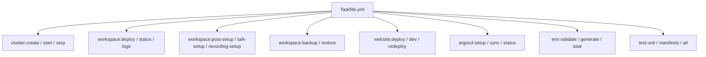

## CI/CD

GitHub Actions (`.github/workflows/ci.yml`) läuft auf jeder PR:

- Offline-Tests: `task test:all` (BATS + Manifest-Struktur + Taskfile-Dry-Run)
- Image-Pin-Advisory + Hardcoded-Secret-Detection in `k3d/*.yaml`

PRs werden squash-gemergt. Branch-Naming: `feature/*`, `fix/*`, `chore/*`.

## Weiter geht's

- [Beitragen & CI/CD](contributing) — vollständiger PR-Workflow
- [Tests](tests) — Test-IDs (FA-/SA-/NFA-) und Kategorien
- [Architektur](architecture) — System-Diagramm und Komponenten
- [Migration](migration) — wie Migrations laufen
```

- [ ] **Step 4: Run BATS**

Run: `bats tests/unit/test-docs-content.bats -f "Quickstart"`
Expected: PASS — all three Quickstart files exist and are referenced.

- [ ] **Step 5: Commit**

```bash
git add k3d/docs-content/quickstart-enduser.md k3d/docs-content/quickstart-admin.md k3d/docs-content/quickstart-dev.md
git commit -m "feat(docs): three audience Quickstart pages — enduser, admin, dev"
```

---

## Task 5: Glossary

**Files:**
- Create: `k3d/docs-content/glossary.md`

- [ ] **Step 1: Write the glossary**

```markdown
<div class="page-hero">
  <span class="page-hero-icon">📖</span>
  <div class="page-hero-body">
    <div class="page-hero-title">Glossar</div>
    <p class="page-hero-desc">Begriffe, die im Workspace immer wieder vorkommen — kurz erklärt.</p>
  </div>
  <a href="#/" class="page-hero-back">← Übersicht</a>
</div>

# Glossar

<p class="kicker">Referenz · Begriffe von A bis Z</p>

## A

**ApplicationSet (ArgoCD)** — Eine ArgoCD-Ressource, die mehrere Applications generisch erzeugt (z. B. eine Application pro Cluster). Im Workspace fan-out-en wir damit dasselbe Manifest auf mentolder + korczewski. Siehe [ArgoCD (GitOps)](argocd).

**ArgoCD** — GitOps-Controller. Synct Manifeste aus Git ins Cluster und meldet Drift. Hub-Cluster ist mentolder; alle `argocd:*`-Tasks laufen ausschließlich gegen den Hub. Siehe [ArgoCD (GitOps)](argocd).

## B

**Brand** — Visuelles Identitätsset. Workspace betreibt zwei Brands: `mentolder` und `korczewski`. Erscheint als `BRAND_ID`-ConfigMap und steuert Theme/Logo/Texte in Website und Docs.

**Backup** — Tägliche Postgres-Dumps via `db-backup` CronJob; Restore über `task workspace:restore`. Siehe [Backup & Wiederherstellung](backup).

## C

**Collabora** — Office-Suite (Word, Excel, PowerPoint) im Browser. Öffnet Dokumente aus Nextcloud. Eigene Subdomain `office.{DOMAIN}`. Siehe [Collabora (Office)](collabora).

**ConfigMap** — Kubernetes-Ressource für unverschlüsselte Konfiguration (z. B. `docs-content`, `realm-template`). Geheimnisse gehören in `Secret` / `SealedSecret`.

## D

**Docsify** — JS-basierter Markdown-Renderer. Lädt `index.html` und alle `*.md` aus `k3d/docs-content/` zur Laufzeit im Browser. Kein Build-Schritt.

**DSGVO** — Datenschutz-Grundverordnung. Kernprinzip des Workspace: alle Daten bleiben on-premises. Siehe [DSGVO / Datenschutz](dsgvo).

## E

**ENV** — Eine Umgebung wie `dev`, `mentolder`, `korczewski`. Steuert Cluster-Kontext, Sealed Secret und Kustomize-Overlay. Wird Tasks via `ENV=mentolder` mitgegeben.

## H

**HPB (High-Performance Backend)** — Talk-Signaling-Server (Janus + NATS). Wird benötigt für Mehrteilnehmer-Calls. Eigene Subdomain `signaling.{DOMAIN}`. Siehe [Talk HPB (Signaling)](talk-hpb).

## I

**Ingress** — Traefik (k3s built-in). Routet HTTP/HTTPS nach Subdomain an die richtigen Services.

## K

**k3d** — k3s in Docker. Lokaler Single-Node-Cluster für Entwicklung. Konfiguration: `k3d-config.yaml`.

**k3s** — Lightweight Kubernetes von Rancher. Läuft in Produktion (Hetzner-Nodes + Home-Worker via WireGuard).

**Keycloak** — Identity Provider. Realm `workspace`. Alle Services authentifizieren über OIDC. Siehe [Keycloak (SSO)](keycloak).

**Kustomize** — Manifest-Builder. Base in `k3d/`, Overlays in `prod-mentolder/` / `prod-korczewski/`.

## L

**LiveKit** — WebRTC-Server für Webinare und Livestreams. Läuft mit `hostNetwork: true` und Node-Pinning. Siehe [Livestream (LiveKit)](livestream).

## M

**MCP (Model Context Protocol)** — Protokoll für Claude-Code-Erweiterungen. Workspace betreibt einen MCP-Monolith mit Postgres-, Browser-, GitHub-, Keycloak- und Kubernetes-Servern. Siehe [MCP-Server (Claude Code)](claude-code).

**Mermaid** — Markdown-Diagramm-Sprache. Wird in Docsify gerendert; pro Brand eigene Themen-Variablen.

## N

**Nextcloud** — Selbstgehostete Cloud (Dateien, Kalender, Kontakte, Talk). Subdomain `files.{DOMAIN}`. Siehe [Nextcloud + Talk](nextcloud).

## O

**OIDC** — OpenID Connect. Authentifizierungs-Layer auf OAuth 2.0. Keycloak ist der Provider; Clients sind Nextcloud, Vaultwarden, Website, DocuSeal, Tracking, MCP-Server.

**Overlay** — Kustomize-Verzeichnis, das die Base patcht. `prod-mentolder/` und `prod-korczewski/` sind die zwei produktiven Overlays.

## P

**Portal** — Frontend-Sektion der Website unter `/portal`. Authentifizierter Bereich für Endnutzer mit Dashboard, Chat, Buchung.

**Post-Setup** — Schritte nach `task workspace:deploy`: Nextcloud-Apps aktivieren, OIDC verdrahten, Talk-Signaling konfigurieren. Siehe [Quickstart Admin](quickstart-admin).

## S

**SealedSecret** — Verschlüsseltes Secret, das im Repo committed werden darf. Der Sealed-Secrets-Controller im Cluster entschlüsselt zur Laufzeit zu einem normalen `Secret`.

**SSO (Single Sign-On)** — Einmaliger Login deckt alle Workspace-Services ab. Implementiert via Keycloak + OIDC.

**shared-db** — Zentrale PostgreSQL-16-Instanz im Cluster. Pro Service eine eigene Datenbank (`keycloak`, `nextcloud`, `vaultwarden`, `website`, `docuseal`, `tracking`). Siehe [PostgreSQL (shared-db)](shared-db).

## T

**Talk** — Nextcloud Talk: Chat, Audio-/Videocalls, integriert in Nextcloud. Mehrteilnehmer-Calls via HPB.

**Taskfile** — Task-Runner-Konfiguration (`taskfile.dev`). Single-Source-of-Truth für alle Build-/Deploy-/Ops-Befehle.

## V

**Vaultwarden** — Bitwarden-kompatibler Passwort-Manager. Subdomain `vault.{DOMAIN}`. Siehe [Vaultwarden (Passwörter)](vaultwarden).

## W

**Whiteboard** — Excalidraw-basiertes kollaboratives Zeichenbrett. Subdomain `board.{DOMAIN}`. Siehe [Whiteboard](whiteboard).

**Whisper** — OpenAI-Whisper-basierter Transkriptions-Service. Talk-Transcriber-Bot nutzt ihn für Live-Untertitel.

**WireGuard** — VPN-Mesh, das Home-Worker-Nodes mit dem Hetzner-Cluster verbindet. Hub: `pk-hetzner`.

**Workspace** — Die Plattform als Ganzes; auch der Kubernetes-Namespace (`workspace` für mentolder, `workspace-korczewski` für korczewski).
```

- [ ] **Step 2: Run BATS**

Run: `bats tests/unit/test-docs-content.bats -f "glossary"`
Expected: PASS.

- [ ] **Step 3: Commit**

```bash
git add k3d/docs-content/glossary.md
git commit -m "feat(docs): glossary — ~30 entries with cross-links"
```

---

## Task 6: Decision Log

**Files:**
- Create: `k3d/docs-content/decisions.md`

- [ ] **Step 1: Look up real dates from git log**

Run these to fetch actual dates (each prints one date or empty if no match):

```bash
git log --first-parent --format='%ad' --date=short --grep='Stripe' --grep='stripe' -i | head -1
git log --first-parent --format='%ad' --date=short --grep='Mattermost' -i | head -1
git log --first-parent --format='%ad' --date=short --grep='InvoiceNinja\|invoice ninja' -i | head -1
git log --first-parent --format='%ad' --date=short --grep='livekit' -i | tail -1
git log --first-parent --format='%ad' --date=short -- k3d/sealed-secrets.yaml environments/sealed-secrets/ 2>/dev/null | tail -1
git log --first-parent --format='%ad' --date=short --grep='cluster.merge\|cluster merge\|korczewski' -i | head -1
```

Note the dates — substitute them where the template below has `<DATE>`.

- [ ] **Step 2: Write the decision log**

```markdown
<div class="page-hero">
  <span class="page-hero-icon">🧭</span>
  <div class="page-hero-body">
    <div class="page-hero-title">Decision-Log</div>
    <p class="page-hero-desc">Architekturentscheidungen mit Kontext, Konsequenz und Datum.</p>
  </div>
  <a href="#/" class="page-hero-back">← Übersicht</a>
</div>

# Decision-Log

<p class="kicker">Referenz · Architektur-Entscheidungen</p>

Chronologisch, neueste zuerst. Jeder Eintrag hält fest, *warum* wir etwas geändert haben — nicht *was* (das steht im Code und im Git-Log).

---

## 2026-05-05 — Korczewski- und Mentolder-Cluster vereinen

**Status:** akzeptiert · gerollt am 2026-05-05

**Kontext:** Wir betrieben zwei separate k3s-Cluster (mentolder + korczewski) hinter zwei Hostgruppen. Cross-Cluster-Operations waren teuer, die Nodes der Korczewski-Box waren im Schnitt zu 30 % ausgelastet, ArgoCD musste zwei Cluster verwalten.

**Entscheidung:** Die korczewski-Nodes traten der mentolder-Cluster bei. korczewski.de läuft jetzt im Namespace `workspace-korczewski` auf demselben physischen Cluster, mit demselben Traefik. Der `korczewski`-kubeconfig-Kontext zeigt jetzt auf `pk-hetzner` (Cluster-API).

**Konsequenz:** Eine Cluster-Version, eine ArgoCD-Instanz, eine Backup-Strategie. Im Gegenzug brauchen alle Korczewski-Workloads `workspace-namespace`-Annotationen + `workspace-korczewski`-Labels in den ApplicationSets.

---

## <DATE> — Stripe komplett rausnehmen

**Status:** akzeptiert

**Kontext:** Stripe-Integration war vorgesehen für Coaching-Buchungen, wurde aber nie aktiv genutzt. Die Maintenance-Last (Webhooks, PCI-Zone-Hygiene, Test-Mocks) war hoch.

**Entscheidung:** Stripe-Code, -Webhooks, -Tasks und -Secrets vollständig entfernt. Services-Seiten linken auf Kontakt-Formular, keine Buchungs-Buttons.

**Konsequenz:** ~1500 Zeilen Code weg, weniger Compliance-Pflichten. Falls Buchung später kommt, wird sie neu evaluiert.

---

## <DATE> — Mattermost und InvoiceNinja entfernen

**Status:** akzeptiert · superseded by Custom Messaging in Astro-Website (siehe nächster Eintrag)

**Kontext:** Mattermost als Chat und InvoiceNinja als Rechnungs-Tool waren als externe Container eingebunden. Beide hatten eigene Backups, eigene OIDC-Klemmen, eigene UI-Sprünge — Reibung im Tagesbetrieb.

**Entscheidung:** Beide Services entfernt. Chat zieht in die Astro-Website. Rechnungslogik wird durch DocuSeal + manuelle ZUGFeRD-Erstellung ersetzt.

**Konsequenz:** Weniger bewegliche Teile, einheitlicher SSO-Pfad. Test-Suite hat einige FA-/SA-Lücken (FA-22, SA-06, SA-09 entfernt) — Gaps in der Nummerierung sind beabsichtigt.

---

## <DATE> — Custom Messaging in der Astro-Website (statt Mattermost)

**Status:** akzeptiert

**Kontext:** Nach Mattermost-Entfernung brauchten wir weiter Chat. Die Astro-Website hatte bereits eigenes Auth + DB.

**Entscheidung:** Chat als Svelte-Insel direkt in `web.{DOMAIN}/portal/chat`. Backend = `/api/chat/*`-Endpoints in der Website, Storage in der `website`-DB.

**Konsequenz:** Ein einziges Frontend, keine OIDC-Verkettung mehr für Chat. Featureset bleibt schlank — bewusst kein Mattermost-Klon.

---

## <DATE> — LiveKit für Streaming (statt Janus-only)

**Status:** akzeptiert

**Kontext:** Janus reichte für Talk-Calls, aber nicht für RTMP-Ingest und Webinar-Recording. Wir wollten OBS-Integration und MP4-Aufzeichnungen.

**Entscheidung:** LiveKit-Server, -Ingress (RTMP) und -Egress (Recording) deployen. `hostNetwork: true` + Node-Pinning auf `gekko-hetzner-3`. DNS-Pin der `livekit.{DOMAIN}`-A-Records auf den Pin-Node.

**Konsequenz:** RTMP funktioniert, Recordings landen im Egress-PVC. Trade-off: ein hostNetwork-Pod im `workspace`-Namespace + privilegiertes pod-security-Profil dort.

---

## <DATE> — SealedSecrets statt envsubst-Workflow

**Status:** akzeptiert · PR #61

**Kontext:** Vorheriger Ansatz: `.env`-Datei + `envsubst` über Manifeste. Geheimnisse waren nie im Repo, dafür auf jedem Maintainer-Laptop. Onboarding-Schmerz, Rotation-Chaos.

**Entscheidung:** Bitnami SealedSecrets. Plaintext in `environments/.secrets/<env>.yaml` (gitignoriert), versiegelt nach `environments/sealed-secrets/<env>.yaml` (committed). Cluster entschlüsselt mit privatem Key.

**Konsequenz:** Geheimnisse leben mit dem Code im Repo, sind reproduzierbar deploybar. Rotation = neuer `env:seal`-Lauf. Drift-Gefahr: jede manuelle `kubectl edit secret`-Aktion wird beim nächsten Deploy überschrieben.

---

## Foundation — k3d/k3s + Kustomize als einziger Deploy-Pfad

**Status:** akzeptiert · keine Alternative aktiv

**Kontext:** Anfangs gab es zusätzlich docker-compose-Dateien für lokale Entwicklung. Zwei Deploy-Pfade führten zu Drift (Service-A funktionierte in compose, nicht in k8s).

**Entscheidung:** docker-compose entfernt. Nur k3d (lokal) und k3s (prod), beide identisch via Kustomize gefüttert.

**Konsequenz:** Lokal = Prod (modulo Overlay). Onboarding braucht Docker + k3d, etwas mehr als compose. Wert: keine Drift-Klassen mehr.
```

- [ ] **Step 3: Substitute the real dates from Step 1 into the `<DATE>` placeholders**

Edit each `<DATE>` token. If git log returns no match for an entry, leave a sensible approximation based on commit context (`git log --before='2026-05-01' --after='2026-04-01' --format='%ad %s' --date=short --grep='<term>'`).

- [ ] **Step 4: Run BATS**

Run: `bats tests/unit/test-docs-content.bats -f "decisions"`
Expected: PASS.

- [ ] **Step 5: Commit**

```bash
git add k3d/docs-content/decisions.md
git commit -m "feat(docs): decision log — 7 architecture decisions with context + consequence"
```

---

## Task 7: Landing page rewrite

**Files:**
- Modify: `k3d/docs-content/README.md` (full rewrite)

- [ ] **Step 1: Replace `README.md` with the new landing**

```markdown
<div class="page-hero">
  <span class="page-hero-icon">🏠</span>
  <div class="page-hero-body">
    <div class="page-hero-title">Workspace · Dokumentation</div>
    <p class="page-hero-desc">Alles, was du zum Verstehen, Aufsetzen und Betreiben des Workspace brauchst — auf deinem Server, DSGVO by Design.</p>
    <div class="page-hero-meta">
      <span class="page-hero-tag">Self-Hosted</span>
      <span class="page-hero-tag">DSGVO</span>
      <span class="page-hero-tag">Kubernetes</span>
    </div>
  </div>
</div>

# Workspace — alles bleibt auf <em>deinem Server</em>.

<p class="kicker">Startseite · Wähl deinen Einstieg</p>

Workspace ist eine selbstgehostete Plattform für Coaching, Beratung und Office-Arbeit: Dateien, Talk, Kalender, KI-Assistenz, Passwörter — alles auf deiner Hardware, alles unter einem Single-Sign-On. Drei Einstiegswege:

<div class="tracks">
  <a href="#/quickstart-enduser" class="track-card">
    <span class="lab">Endnutzer</span>
    <span class="ti">In 5 Minuten</span>
    <span class="de">Login · Portal · erstes Talk-Call · Datei hochladen</span>
    <span class="arrow">→ Quickstart</span>
  </a>
  <a href="#/quickstart-admin" class="track-card">
    <span class="lab">Admin</span>
    <span class="ti">Plattform aufsetzen</span>
    <span class="de">Cluster · Workspace · Post-Setup · Backup</span>
    <span class="arrow">→ Quickstart</span>
  </a>
  <a href="#/quickstart-dev" class="track-card">
    <span class="lab">Entwickler</span>
    <span class="ti">Codebase-Tour</span>
    <span class="de">k3d · environments · Tasks · Tests</span>
    <span class="arrow">→ Quickstart</span>
  </a>
</div>

## Architektur auf einen Blick

```mermaid
flowchart TB
  User([Browser])
  subgraph cluster["k3s Cluster (vereint, betreibt mentolder.de + korczewski.de)"]
    Traefik{{"Traefik Ingress · 443"}}
    subgraph identity["Identität"]
      KC[Keycloak · auth.{DOMAIN}]
    end
    subgraph collab["Zusammenarbeit"]
      NC[Nextcloud + Talk · files.{DOMAIN}]
      CO[Collabora · office.{DOMAIN}]
      WB[Whiteboard · board.{DOMAIN}]
    end
    subgraph stream["Live"]
      LK[LiveKit · livekit.{DOMAIN}]
    end
    subgraph tools["Tools"]
      VW[Vaultwarden · vault.{DOMAIN}]
      WEB[Portal · web.{DOMAIN}]
      DS[DocuSeal · sign.{DOMAIN}]
    end
    subgraph data["Daten"]
      DB[(shared-db · PG 16)]
    end
  end

  User --> Traefik
  Traefik --> KC & NC & CO & WB & LK & VW & WEB & DS
  KC -. OIDC .-> NC & VW & WEB & DS
  NC --> CO
  KC & NC & VW & WEB & DS --> DB
```

## Service-Endpunkte

`{DOMAIN}` ist `mentolder.de` oder `korczewski.de`.

| Service | URL | Beschreibung |
|---------|-----|--------------|
| Portal & Website | `https://web.{DOMAIN}` | Astro + Svelte Portal mit Chat und Buchung |
| Keycloak (SSO) | `https://auth.{DOMAIN}` | Zentrale Anmeldung (OIDC) |
| Nextcloud + Talk | `https://files.{DOMAIN}` | Dateien, Kalender, Kontakte, Talk |
| Collabora Online | `https://office.{DOMAIN}` | Office im Browser (öffnet aus Nextcloud) |
| Talk HPB | `https://signaling.{DOMAIN}` | WebRTC-Signaling für Mehrteilnehmer-Calls |
| LiveKit | `https://livekit.{DOMAIN}` · `https://stream.{DOMAIN}` | Webinare und Streams (Server + RTMP-Ingest) |
| Vaultwarden | `https://vault.{DOMAIN}` | Passwort-Manager (Bitwarden-kompatibel) |
| Whiteboard | `https://board.{DOMAIN}` | Kollaboratives Zeichnen |
| DocuSeal | `https://sign.{DOMAIN}` | E-Signatur für Verträge |
| Dokumentation | `https://docs.{DOMAIN}` | Diese Dokumentation |

> **Entwicklung:** Auf einem lokalen k3d-Cluster sind dieselben Dienste unter `*.localhost` (HTTP statt HTTPS) erreichbar. Siehe [Beitragen & CI/CD](contributing).

## Schnellstart (3 Befehle)

```bash
git clone https://github.com/Paddione/Bachelorprojekt.git
cd Bachelorprojekt
task workspace:up      # Cluster + alle Services + Post-Setup in einem Rutsch
```

Detaillierte Anleitung: [Admin-Quickstart](quickstart-admin).

## Hilfe

- [Fehlerbehebung](troubleshooting) — bekannte Probleme und Workarounds
- [Decision-Log](decisions) — warum wir Dinge so entschieden haben
- [Glossar](glossary) — Begriffe, die immer wieder vorkommen
```

- [ ] **Step 2: Run BATS**

Run: `bats tests/unit/test-docs-content.bats`
Expected: All sidebar / glossary / decisions / quickstart / shell tests PASS. Forbidden-string tests still FAIL because Mattermost/InvoiceNinja/Stripe haven't been swept yet — that's Task 8.

- [ ] **Step 3: Commit**

```bash
git add k3d/docs-content/README.md
git commit -m "feat(docs): rewrite landing — 3 audience tracks + fresh architecture diagram + endpoints"
```

---

## Task 8: Content sweep

**Files:**
- Modify: `k3d/docs-content/requirements.md`
- Modify: `k3d/docs-content/tests.md`
- Modify: `k3d/docs-content/vaultwarden.md`
- Modify: `k3d/docs-content/services.md`
- Modify: `k3d/docs-content/architecture.md`
- Modify: `k3d/docs-content/operations.md`

- [ ] **Step 1: Locate stale references**

Run: `grep -rn -i 'mattermost\|invoiceninja\|invoice ninja\|stripe' k3d/docs-content/ --include='*.md' | grep -v 'decisions.md'`

For each match, decide whether to remove the line, replace it (e.g. `Mattermost` → `Custom Messaging`), or rewrite the surrounding paragraph. The expected end state is: zero matches outside `decisions.md`.

- [ ] **Step 2: Edit `requirements.md`**

For each row mentioning Mattermost, InvoiceNinja, or Stripe, delete the row. Keep the FA-/SA-/NFA- numbering as-is (gaps are intentional and noted in CLAUDE.md).

- [ ] **Step 3: Edit `tests.md`**

For each test row referencing the removed services, delete the row. Keep test-ID gaps.

- [ ] **Step 4: Edit `vaultwarden.md`**

Find the InvoiceNinja example in the "Vaults für Geschäftsdaten" section and replace it with a generic example:

```markdown
- **Beispiel: API-Tokens** — speichere Service-Tokens (z. B. für Backup-Ziele oder Monitoring) in einem geteilten Tresor mit Lese-Zugriff für die Admin-Gruppe.
```

- [ ] **Step 5: Edit `services.md`**

Remove any row in the services table that lists Mattermost. Refresh the diagram if it shows a Mattermost node.

- [ ] **Step 6: Edit `architecture.md`**

Find any sentence that says "korczewski-Cluster" or implies a separate Korczewski cluster. Rewrite to reflect the unified cluster (one cluster, two namespaces). Update node counts in any "Topologie"-style sentence to reflect 12 nodes (6 Hetzner CPs + 6 home workers).

- [ ] **Step 7: Edit `operations.md`**

Search for `mentolder:deploy`, `korczewski:deploy`, `mentolder:status`, etc. Replace each with the `ENV=` form (`task workspace:deploy ENV=mentolder`). Keep the documentation note that the legacy shorthand was removed 2026-05-05.

- [ ] **Step 8: Run BATS**

Run: `bats tests/unit/test-docs-content.bats`
Expected: ALL tests PASS, including the forbidden-string suite.

- [ ] **Step 9: Commit**

```bash
git add k3d/docs-content/requirements.md k3d/docs-content/tests.md k3d/docs-content/vaultwarden.md k3d/docs-content/services.md k3d/docs-content/architecture.md k3d/docs-content/operations.md
git commit -m "fix(docs): content sweep — remove Mattermost/InvoiceNinja/Stripe refs, unified-cluster wording"
```

---

## Task 9: Mermaid diagrams — hub pages

Hub pages: README (done in Task 7), architecture, services, security, dsgvo, backup, talk-hpb. Add or refresh one diagram per page.

**Files:**
- Modify: `k3d/docs-content/architecture.md`
- Modify: `k3d/docs-content/services.md`
- Modify: `k3d/docs-content/security.md`
- Modify: `k3d/docs-content/dsgvo.md`
- Modify: `k3d/docs-content/backup.md`
- Modify: `k3d/docs-content/talk-hpb.md`

- [ ] **Step 1: `architecture.md` — refresh the existing diagram**

Find the topmost `mermaid` block (around the "Komponenten-Diagramm" header). Replace it with:

````markdown
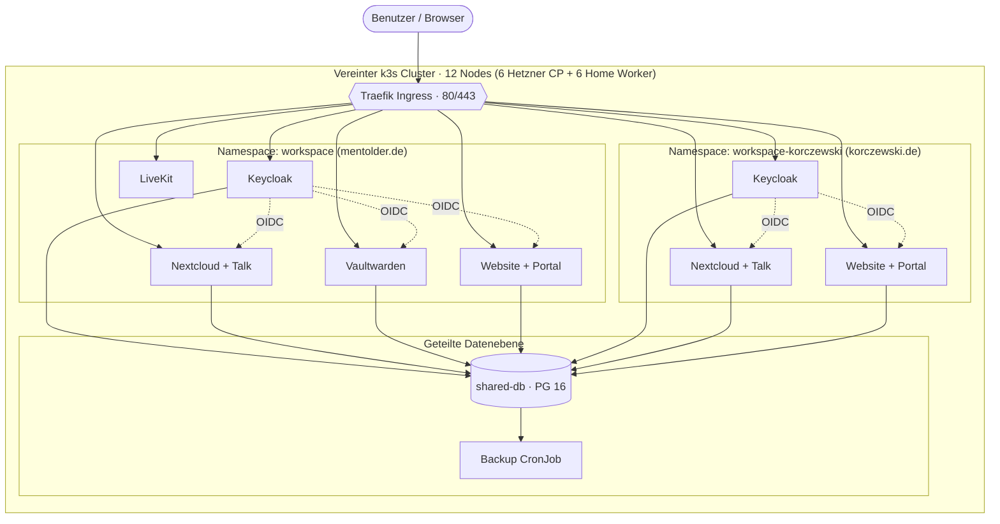
````

- [ ] **Step 2: `services.md` — refresh diagram**

Find the existing `mermaid` block. Replace with a service-only view (no infra, no namespaces):

````markdown
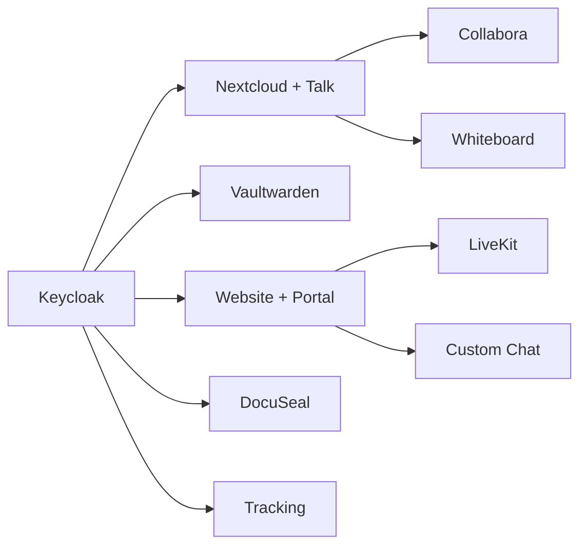
````

- [ ] **Step 3: `security.md` — add or refresh trust-boundary diagram**

Place after the introductory paragraph:

````markdown
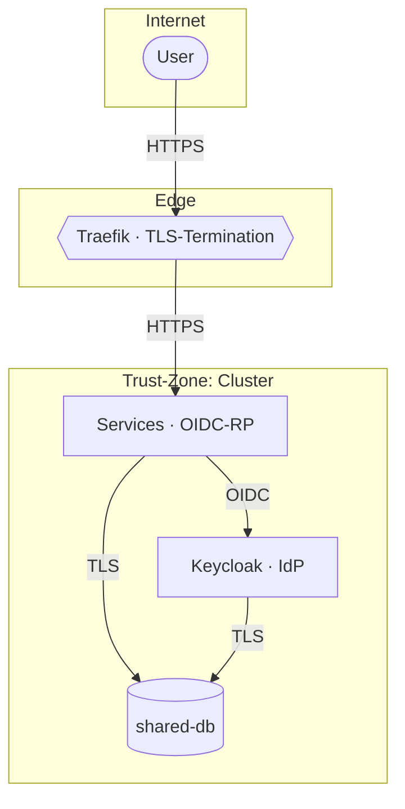
````

- [ ] **Step 4: `dsgvo.md` — add data-flow diagram**

Place after the introduction:

````markdown
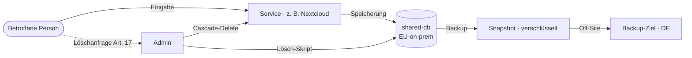
````

- [ ] **Step 5: `backup.md` — add nightly backup sequence**

Place near the top:

````markdown
```mermaid
sequenceDiagram
  participant Cron as Backup CronJob
  participant DB as shared-db
  participant PVC as Backup PVC
  participant Off as Off-Site
  Note over Cron: Täglich 02:30
  Cron->>DB: pg_dump --all
  DB-->>Cron: SQL-Stream
  Cron->>PVC: gzip + verschlüsseln
  PVC-->>Cron: Snapshot abgelegt
  Cron->>Off: rsync (nur Diff)
  Off-->>Cron: OK
  Cron->>Cron: alte Snapshots > 30 Tage löschen
```
````

- [ ] **Step 6: `talk-hpb.md` — refresh signaling diagram**

Locate the existing `mermaid` block. Replace with:

````markdown
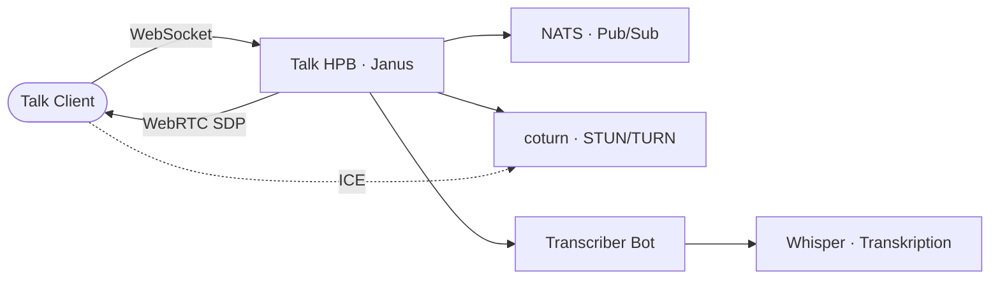
````

- [ ] **Step 7: Run BATS**

Run: `bats tests/unit/test-docs-content.bats -f "service page"`
Expected: pass for the hub pages already covered.

- [ ] **Step 8: Commit**

```bash
git add k3d/docs-content/architecture.md k3d/docs-content/services.md k3d/docs-content/security.md k3d/docs-content/dsgvo.md k3d/docs-content/backup.md k3d/docs-content/talk-hpb.md
git commit -m "feat(docs): refresh hub-page diagrams — architecture, services, security, dsgvo, backup, talk-hpb"
```

---

## Task 10: Mermaid diagrams — service pages (auth & data)

**Files:**
- Modify: `k3d/docs-content/keycloak.md`
- Modify: `k3d/docs-content/vaultwarden.md`
- Modify: `k3d/docs-content/claude-code.md`
- Modify: `k3d/docs-content/website.md`
- Modify: `k3d/docs-content/shared-db.md`
- Modify: `k3d/docs-content/argocd.md`
- Modify: `k3d/docs-content/environments.md`

- [ ] **Step 1: `keycloak.md` — add OIDC-flow sequence**

Add (or replace existing if outdated) after the "OIDC-Clients" section:

````markdown
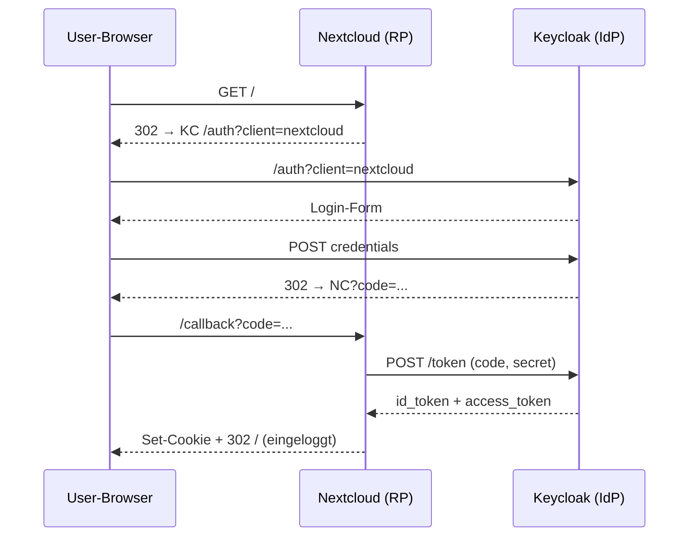
````

- [ ] **Step 2: `vaultwarden.md` — add data-flow diagram**

Add near the top:

````markdown
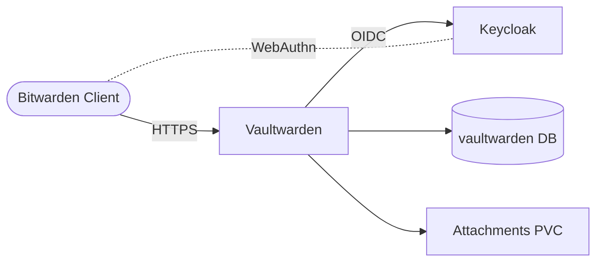
````

- [ ] **Step 3: `claude-code.md` — add MCP architecture**

Add after the introduction:

````markdown
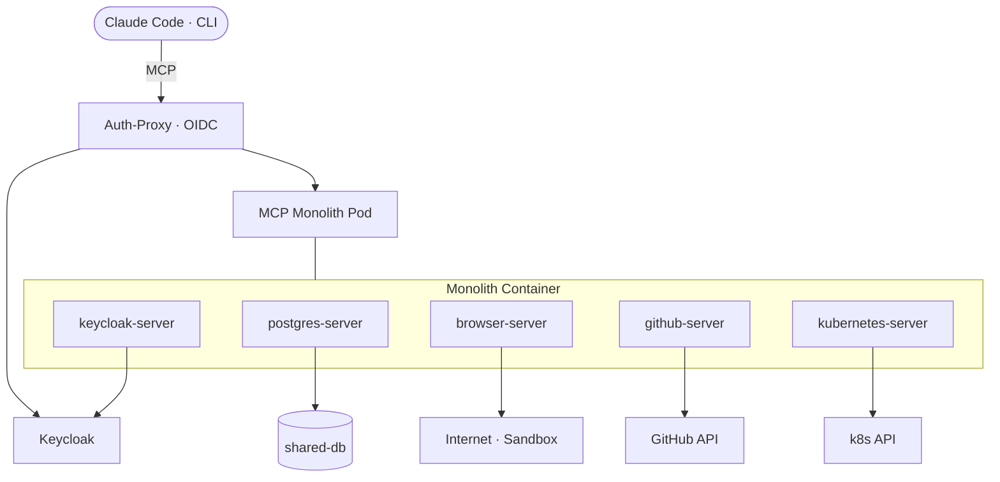
````

- [ ] **Step 4: `website.md` — add architecture**

Add near the top:

````markdown
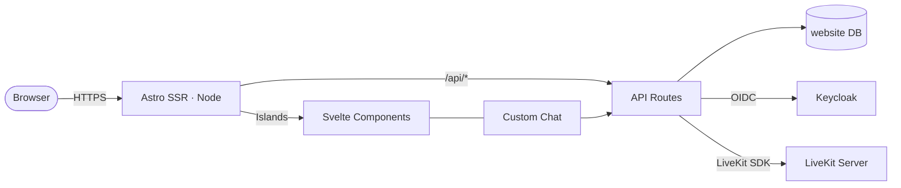
````

- [ ] **Step 5: `shared-db.md` — add database topology**

Add near the top:

````markdown
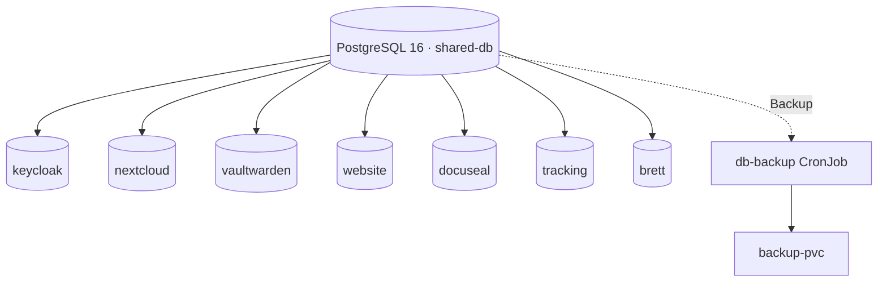
````

- [ ] **Step 6: `argocd.md` — add fan-out diagram**

Add after the introduction:

````markdown
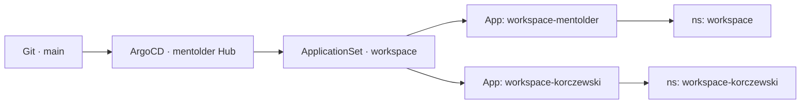
````

- [ ] **Step 7: `environments.md` — add env-resolve flow**

Add near the top:

````markdown
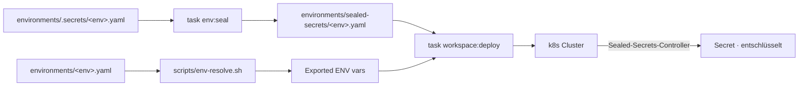
````

- [ ] **Step 8: Run BATS**

Run: `bats tests/unit/test-docs-content.bats`
Expected: pass for the service-page mermaid check on these pages.

- [ ] **Step 9: Commit**

```bash
git add k3d/docs-content/keycloak.md k3d/docs-content/vaultwarden.md k3d/docs-content/claude-code.md k3d/docs-content/website.md k3d/docs-content/shared-db.md k3d/docs-content/argocd.md k3d/docs-content/environments.md
git commit -m "feat(docs): mermaid diagrams for auth + data services (Keycloak, Vaultwarden, MCP, Website, shared-db, ArgoCD, environments)"
```

---

## Task 11: Mermaid diagrams — service pages (collaboration & ops)

**Files:**
- Modify: `k3d/docs-content/nextcloud.md`
- Modify: `k3d/docs-content/collabora.md`
- Modify: `k3d/docs-content/livestream.md`
- Modify: `k3d/docs-content/einvoice.md`
- Modify: `k3d/docs-content/whiteboard.md`
- Modify: `k3d/docs-content/mailpit.md`
- Modify: `k3d/docs-content/monitoring.md`
- Modify: `k3d/docs-content/operations.md`
- Modify: `k3d/docs-content/contributing.md`
- Modify: `k3d/docs-content/tests.md`

- [ ] **Step 1: `nextcloud.md`**

````markdown
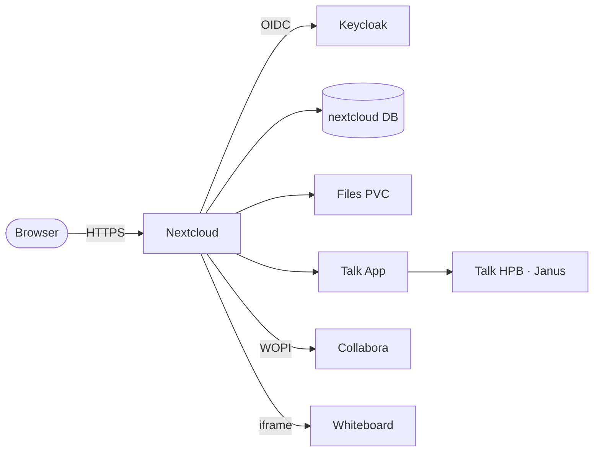
````

- [ ] **Step 2: `collabora.md`**

````markdown
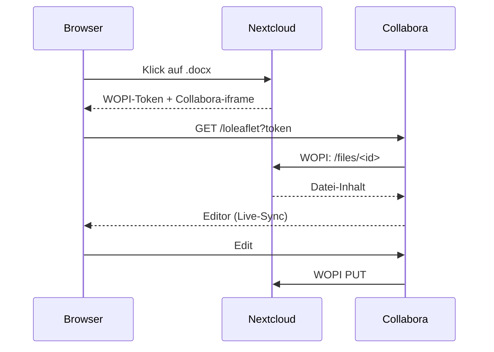
````

- [ ] **Step 3: `livestream.md`**

````markdown
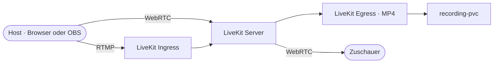
````

- [ ] **Step 4: `einvoice.md`**

````markdown
```mermaid
flowchart LR
  Admin([Admin · Portal]) -- Eingabe --> WEB[Website]
  WEB --> Gen[ZUGFeRD-Generator]
  Gen --> XML[XRechnung XML]
  Gen --> PDF[PDF/A-3 mit Anhang]
  PDF --> NC[Nextcloud · /Invoices]
  XML --> Mail[Versand · SMTP]
```
````

- [ ] **Step 5: `whiteboard.md`**

````markdown
```mermaid
flowchart LR
  User([Browser]) -- HTTPS --> NC[Nextcloud]
  NC --> WBapp[Whiteboard App]
  WBapp -- WebSocket --> Backend[board.{DOMAIN} Backend]
  Backend --> Store[Whiteboard Store]
  WBapp -- iframe --> Excalidraw[Excalidraw Frontend]
```
````

- [ ] **Step 6: `mailpit.md`**

````markdown
```mermaid
sequenceDiagram
  participant Svc as Service · z. B. Keycloak
  participant MP as Mailpit · SMTP :1025
  participant UI as Mailpit UI · :8025
  Svc->>MP: SMTP Mail
  MP-->>Svc: 250 OK
  MP->>MP: in Memory speichern
  UI->>MP: GET /messages
  MP-->>UI: JSON-Liste
```
````

- [ ] **Step 7: `monitoring.md`**

````markdown
```mermaid
flowchart LR
  subgraph targets["Scrape-Ziele"]
    Pods[(Kubernetes Pods)]
    Nodes[(Node-Exporter)]
    PG[(postgres-exporter)]
  end
  Prom[Prometheus] -- /metrics --> targets
  Prom --> TSDB[(TSDB · 15d)]
  Graf[Grafana] --> Prom
  Admin([Admin]) -- HTTPS --> Graf
```
````

- [ ] **Step 8: `operations.md` — add Taskfile-categories diagram**

Add near the top of the page:

````markdown
```mermaid
flowchart TB
  TF[Taskfile.yml]
  TF --> Cluster[cluster: create / start / stop]
  TF --> WS[workspace: deploy / status / logs / restart]
  TF --> Post[workspace: post-setup / talk-setup / recording-setup]
  TF --> BU[workspace: backup / restore]
  TF --> WEB[website: deploy / dev / redeploy]
  TF --> Brett[brett: build / deploy / logs]
  TF --> Argo[argocd: setup / sync / status]
  TF --> ENV[env: validate / generate / seal]
  TF --> Test[test: unit / manifests / all]
  TF --> Cert[cert: install / status]
  TF --> MCP[mcp: deploy / logs / restart]
```
````

- [ ] **Step 9: `contributing.md` — add PR flow**

Add near the top:

````markdown
```mermaid
sequenceDiagram
  participant Dev
  participant GH as GitHub
  participant CI
  participant Main as main
  Dev->>GH: push feature/abc
  Dev->>GH: gh pr create
  GH->>CI: trigger
  CI->>CI: task test:all
  CI-->>GH: ✓ green
  Dev->>GH: squash-merge
  GH->>Main: 1 commit
  Main-->>Dev: trigger task feature:* (manuell)
```
````

- [ ] **Step 10: `tests.md` — add runner overview**

Add near the top:

````markdown
```mermaid
flowchart TB
  Runner[tests/runner.sh]
  Runner --> Unit[BATS · tests/unit/*]
  Runner --> Int[BATS · tests/integration/*]
  Runner --> E2E[Playwright · tests/e2e/*]
  Runner --> Acc[Acceptance · AK-*]
  Unit --> AssertLib[Assertion Lib]
  E2E --> Browser[Headless Chromium]
  Acc --> LiveCluster[Live Cluster]
```
````

- [ ] **Step 11: Run BATS**

Run: `bats tests/unit/test-docs-content.bats`
Expected: ALL tests PASS, including "every service page has at least one mermaid block".

- [ ] **Step 12: Commit**

```bash
git add k3d/docs-content/nextcloud.md k3d/docs-content/collabora.md k3d/docs-content/livestream.md k3d/docs-content/einvoice.md k3d/docs-content/whiteboard.md k3d/docs-content/mailpit.md k3d/docs-content/monitoring.md k3d/docs-content/operations.md k3d/docs-content/contributing.md k3d/docs-content/tests.md
git commit -m "feat(docs): mermaid diagrams for collab + ops pages (Nextcloud/Collabora/LiveKit/E-Invoice/Whiteboard/Mailpit/Monitoring/Operations/Contributing/Tests)"
```

---

## Task 12: Deploy + visual smoke test

**Files:** none modified.

- [ ] **Step 1: Run the full BATS suite**

Run: `bats tests/unit/test-docs-content.bats`
Expected: 12/12 tests PASS.

- [ ] **Step 2: Deploy to both production clusters**

```bash
task docs:deploy
```

This recreates the `docs-content` ConfigMap and rolls the docs pod on mentolder + korczewski.

- [ ] **Step 3: Visual smoke test — mentolder**

Open `https://docs.mentolder.de/#/` in a browser:

- ✅ Header shows "Workspace · Docs" in serif italic, brass color
- ✅ Sidebar starts with **QUICKSTARTS** group (no brackets in mentolder variant)
- ✅ Three Quickstart entries are clickable and load
- ✅ Landing page shows three audience cards
- ✅ Architecture mermaid diagram renders, has the unified-cluster wording
- ✅ A service page (e.g. `/keycloak`) shows the OIDC sequence diagram

- [ ] **Step 4: Visual smoke test — korczewski**

Open `https://docs.korczewski.de/#/` in the same way:

- ✅ Header / sidebar uses kore palette (#111 background, brass `#a08060`)
- ✅ Sidebar group labels are bracketed: `[ QUICKSTARTS ]`, `[ SERVICES ]`, etc.
- ✅ Body content is the same German prose as on mentolder
- ✅ Mermaid diagrams use the kore color set (warmer brass on darker background)

- [ ] **Step 5: Run the offline test suite as a safety net**

Run: `task test:all`
Expected: PASS — confirms the new BATS file integrates with the unit test runner.

- [ ] **Step 6: Final commit if any small fixes were needed**

```bash
# Only if step 3 or 4 surfaced issues that needed touch-ups.
git add -p
git commit -m "fix(docs): smoke-test corrections from manual review"
```

---

## Self-Review

**Spec coverage:** every section of the spec maps to a task —

- Goals / non-goals / success criteria — drive task scope; verified in Task 12 visual smoke test.
- Brand-switching shell — Task 2.
- Sidebar layout — Task 3.
- Landing page (`README.md`) — Task 7 (after Quickstarts in Task 4 so links exist).
- Three Quickstart pages — Task 4.
- Glossary — Task 5.
- Decision Log — Task 6.
- Mermaid coverage table — Tasks 9-11 (split into hub / auth+data / collab+ops).
- Content sweep — Task 8.
- Deployment — Task 12.
- Acceptance checklist items — covered by BATS (Task 1) + Task 12 visual smoke test.

**Placeholder check:** the only `<DATE>` tokens are in Task 6 step 2 and are explicitly resolved by Task 6 step 3 from `git log` output. No "TBD" / "TODO" elsewhere.

**Type / naming consistency:** CSS variable names (`--bg-1`, `--accent`, `--kicker-pre`, etc.) are defined once in Task 2 and only consumed in Task 2. Sidebar link targets in Task 3 match the `*.md` filenames in Tasks 4-6. The data attribute is `data-brand` everywhere.
