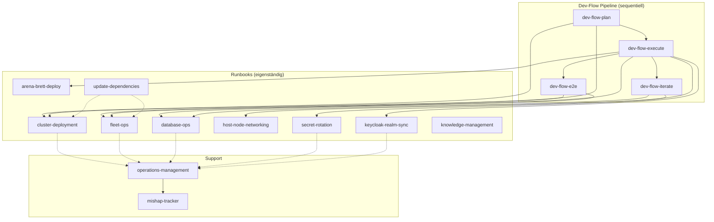

# Software Factory — Dokumentation & Workflow-Polish (Dogfooding)

> **For agentic workers:** REQUIRED SUB-SKILL: Use superpowers:subagent-driven-development (recommended) or superpowers:executing-plans to implement this plan task-by-task. Steps use checkbox (`- [ ]`) syntax for tracking.

**Goal:** Die Software Factory dokumentiert und poliert sich selbst (Dogfooding): Factory-README erstellen, pipeline-pattern.md um Workflow-API-Doku erweitern, factory-usage.md ehrlich markieren, alle 16 SKILL.md-Dateien mit Querverweisen versehen, update-dependencies ausbauen, envsubst-Referenz aus CLAUDE.md auslagern, und Sprach-Konsistenz herstellen.

**Architecture:** Reine Dokumentations-Änderungen. Keine Code-Änderungen, kein Produktions-Impact. Tasks sind unabhängig und können parallel (2-3 Slots) bearbeitet werden. Jeder Task committet eigenständig.

**Tech Stack:** Markdown, Mermaid (Diagramme), git

**Spec:** eingebettet im Design (Scout→Design oben)
**Vorhaben-Ticket:** T000413
**Feature-Ticket:** T000415

---

## File Map

| Task | Datei | Aktion |
|------|-------|--------|
| A1 | `scripts/factory/README.md` | CREATE |
| A2 | `scripts/factory/pipeline-pattern.md` | MODIFY (Präambel + Kommentare hinzu) |
| A3 | `docs/superpowers/references/factory-usage.md` | MODIFY (Status-Badges + ehrliche Markierung) |
| B1 | `.claude/skills/OVERVIEW.md` | MODIFY (Mermaid-Diagramm hinzu) |
| B2 | `.claude/skills/*/SKILL.md` (16 Dateien) | MODIFY (Verwandte-Skills-Abschnitt) |
| C1 | `.claude/skills/update-dependencies/SKILL.md` | MODIFY (Ausbau) |
| C2 | `docs/superpowers/references/envsubst-variable-management.md` | CREATE |
| C2b | `CLAUDE.md:138-147` | MODIFY (auslagern → verlinken) |
| C3 | `.claude/skills/dev-flow-plan/SKILL.md` | MODIFY (veraltete Referenz fixen) |
| D1 | Alle geänderten Dateien | REVIEW (Adversarial: tote Links, Konventionen) |
| D2 | `task test:all` | VERIFY |

---

### Task A1: Factory README — das Verbindungsstück

**Files:**
- Create: `scripts/factory/README.md`

- [ ] **Step 1: Write scripts/factory/README.md**

```markdown
# Software Factory — Komponenten & Architektur

> **Status:** Phase 1 (Foundation) — manuelle Pipeline-Invocation.
> Phase 2 (Dispatcher) und Phase 3 (Full Auto-Pilot) sind geplant.
> Vorhaben-Ticket: T000413

## Architektur-Übersicht

```
┌─────────────────────────────────────────────────────────┐
│ TIER 1: DISPATCHER (Phase 2 — geplant)                  │
│ Queue-Manager · Konflikt-Detektor · Scheduler           │
└──────────────────────┬──────────────────────────────────┘
                       │
┌──────────────────────▼──────────────────────────────────┐
│ TIER 2: PIPELINE (Phase 1 — manuell)                    │
│ Scout → Design → Plan → Implement → Verify → Deploy     │
│ Dokumentiert in: pipeline-pattern.md                     │
└──────────────────────┬──────────────────────────────────┘
                       │
┌──────────────────────▼──────────────────────────────────┐
│ TIER 3: AGENT POOL (Phase 1 — Workflow Tool)            │
│ Subagenten · Code-Review · Adversarial Panel            │
│ Dokumentiert in: review-*.prompt.md                      │
└─────────────────────────────────────────────────────────┘
```

## Komponenten-Verzeichnis

| Datei | Zweck | Status |
|-------|-------|--------|
| `README.md` | Diese Datei — Architektur & Quickstart | ✅ |
| `pipeline-pattern.md` | Referenz: 6-Phasen-Workflow-Script mit API-Doku | ✅ |
| `templates/scout-template.md` | Scout-Phase Output-Format | ✅ |
| `templates/design-template.md` | Design-Phase Output-Format | ✅ |
| `templates/lessons-learned-template.md` | Post-Deploy-Retrospektive | ✅ |
| `review-bug-hunter.prompt.md` | Adversarial Review: Bug-Suche | ✅ |
| `review-security-auditor.prompt.md` | Adversarial Review: Security-Audit | ✅ |
| `review-pattern-enforcer.prompt.md` | Adversarial Review: Konventions-Prüfung | ✅ |
| `conflict-check.sh` | Konflikt-Detektor (Datei-Overlap) | ✅ |
| Dispatcher-Script | Queue-Manager + Scheduler | 🔜 Phase 2 |
| Workflow-Runner | Automatisierte Pipeline-Ausführung | 🔜 Phase 2 |

## Quickstart (Phase 1 — Manuell)

### 1. Feature-Ticket erstellen

```bash
TICKET_RESULT=$(./scripts/ticket.sh create \
  --type feature --brand mentolder \
  --title "Kurztitel" --description "Beschreibung" --priority mittel)
TICKET_EXT_ID=$(echo "$TICKET_RESULT" | cut -d'|' -f1)
```

### 2. Scout-Phase

Exploriere die Codebase mit dem Explore-Agent. Fülle `templates/scout-template.md` aus.
Setze `touched_files` am Ticket:

```bash
psql -U website -d website -c "
UPDATE tickets.tickets SET touched_files = ARRAY['file1','file2']
WHERE external_id = '$TICKET_EXT_ID'"
```

### 3. Konflikt-Check

```bash
bash scripts/factory/conflict-check.sh "$TICKET_EXT_ID"
# Erwartet: [] (keine Konflikte) oder ["T000xxx"] (Konflikt)
```

### 4. Design-Phase (nur bei medium/complex)

Brainstorming → Spec → Adversarial Review.
Fülle `templates/design-template.md` aus.

### 5. Implementieren

Nutze das Workflow-Tool mit dem Muster aus `pipeline-pattern.md`.
Tasks parallelisieren mit `pipeline()` oder `parallel()`.

### 6. Verifizieren & Deployen

- `task test:all` muss grün sein
- PR → Squash-and-Merge
- Deploy-Task via `scripts/task-oracle.sh` ermitteln

## Verwandte Dokumente

- Spec: `docs/superpowers/specs/2026-06-01-software-factory-design.md`
- Plan: `docs/superpowers/plans/2026-06-01-software-factory.md`
- Usage Guide: `docs/superpowers/references/factory-usage.md`
- Vorhaben: T000413
```

- [ ] **Step 2: Commit**

```bash
git add scripts/factory/README.md
git commit -m "docs(factory): add README — architecture overview and quickstart [T000415]"
```

---

### Task A2: pipeline-pattern.md — Workflow-API-Dokumentation

**Files:**
- Modify: `scripts/factory/pipeline-pattern.md` (Präambel vor dem bestehenden Inhalt einfügen)

- [ ] **Step 1: Add Workflow API preamble**

Insert at the TOP of `scripts/factory/pipeline-pattern.md`, before the existing `# Software Factory — 6-Phase Pipeline Pattern` heading:

```markdown
# Software Factory — 6-Phase Pipeline Pattern

> **Status:** Phase 1 Reference — manuelle Workflow-Script-Erstellung.
> Das folgende Dokument beschreibt das Pipeline-Muster und die Claude Code
> Workflow API, die zur Implementierung genutzt wird.

## Workflow API — Schnellreferenz

Die Software Factory nutzt die **Claude Code Workflow API** zur
Multi-Agent-Orchestrierung. Ein Workflow-Script ist eine JavaScript-Datei,
die mit `export const meta = {...}` beginnt.

### Kernfunktionen

| Funktion | Signatur | Verhalten |
|----------|----------|-----------|
| `agent(prompt, opts?)` | `(string, {label?, phase?, schema?, isolation?}) => Promise<T>` | Startet einen Subagenten. Ohne `schema`: gibt String zurück. Mit `schema` (JSON Schema): validiertes Objekt. `isolation: 'worktree'` für isolierte Datei-Operationen. |
| `parallel(thunks)` | `(() => Promise<T>)[] => Promise<T[]>` | BARRIER — alle Thunks parallel, wartet auf alle. Fehlerhafte Thunks werden zu `null`. |
| `pipeline(items, ...stages)` | `(T[], ...((prev, item, i) => Promise<U>)[]) => Promise<U[]>` | Items durchlaufen alle Stages unabhängig — kein Barrier zwischen Stages. Item A kann Stage 3 erreichen während B noch in Stage 1 ist. |
| `phase(title)` | `(string) => void` | Startet eine neue Phase im Progress-Display. |
| `log(message)` | `(string) => void` | Emittiert eine Fortschrittsmeldung. |
| `args` | `any` | Der beim Workflow-Aufruf übergebene `args`-Parameter. |

### Meta-Block

```js
export const meta = {
  name: 'mein-workflow',        // eindeutiger Name
  description: 'Kurzbeschreibung', // einzeilig
  phases: [                      // muss mit phase()-Aufrufen übereinstimmen
    { title: 'Phase 1' },
    { title: 'Phase 2' },
  ],
}
```

### Schema-Validierung

```js
const MEIN_SCHEMA = {
  type: 'object',
  properties: {
    ergebnis: { type: 'string' },
    score: { type: 'number', minimum: 0, maximum: 100 },
  },
  required: ['ergebnis'],
}

const result = await agent('Analysiere...', { schema: MEIN_SCHEMA })
// result ist jetzt typed: { ergebnis: string, score?: number }
```

### Pipeline vs Parallel

**`pipeline()` — kein Barrier, gut für unabhängige Stages:**
```js
const results = await pipeline(
  tasks,
  task => agent(`Implementiere ${task.id}`, { isolation: 'worktree' }),
  result => agent(`Verifiziere ${result.diff}`, { schema: VERIFY_SCHEMA })
)
// Task 2 beginnt Verifikation sobald Implementierung fertig,
// auch wenn Task 1 noch implementiert wird.
```

**`parallel()` — Barrier, wenn alle Ergebnisse einer Stage gebraucht werden:**
```js
const allFindings = await parallel([
  () => agent('Bug-Hunt', { schema: BUG_SCHEMA }),
  () => agent('Security-Audit', { schema: SEC_SCHEMA }),
  () => agent('Pattern-Check', { schema: PATTERN_SCHEMA }),
])
// Erst wenn ALLE drei Agenten fertig sind, geht es weiter.
```

### Typische Fehler

- **`Date.now()` / `Math.random()`** sind in Workflow-Scripts NICHT verfügbar (verhindern Resume). Nutze `args.timestamp` für Zeitstempel.
- **Schema-Validierung** erzwingt Retry bei Mismatch — stelle sicher, dass der Agent-Prompt das Schema kennt.
- **`isolation: 'worktree'`** ist teuer (~200-500ms Setup) — nur nutzen wenn nötig.

---

## Vollständiges Pipeline-Beispiel

(Das folgende Script zeigt eine vollständige 6-Phasen-Pipeline.)
```

- [ ] **Step 2: Commit**

```bash
git add scripts/factory/pipeline-pattern.md
git commit -m "docs(factory): add Workflow API reference to pipeline-pattern.md [T000415]"
```

---

### Task A3: factory-usage.md — Ehrliche Status-Markierung

**Files:**
- Modify: `docs/superpowers/references/factory-usage.md`

- [ ] **Step 1: Replace content with honest phase markers**

Replace the entire content of `docs/superpowers/references/factory-usage.md`:

```markdown
# Software Factory — Usage Guide

> **⚠️ Status:** Dieser Guide beschreibt eine Mischung aus existierenden (✅),
> in Entwicklung befindlichen (🔜) und geplanten (📋) Features.
> **Prüfe den Status-Indikator** bevor du einem Abschnitt folgst.

## ✅ Phase 1: Manual Pipeline Invocation (verfügbar)

### Quick Start

```bash
# 1. Create a feature ticket
TICKET_RESULT=$(./scripts/ticket.sh create \
  --type feature \
  --brand mentolder \
  --title "Add X feature" \
  --description "Detailed description..." \
  --priority mittel)
TICKET_EXT_ID=$(echo "$TICKET_RESULT" | cut -d'|' -f1)
TICKET_UUID=$(echo "$TICKET_RESULT" | cut -d'|' -f2)
```

### Manual Conflict Check ✅

```bash
bash scripts/factory/conflict-check.sh T000413 "k3d/website.yaml" "website/src/pages/index.astro"
# Returns: [] (no conflicts) or ["T000412"] (conflicts with ticket T000412)
```

### Querying Similar Past Tickets ✅

```sql
-- Erfordert bge-m3 Embedding. In der Praxis vom Dispatcher generiert.
SELECT * FROM tickets.fn_find_similar(
  (SELECT embedding FROM tickets.ticket_embeddings WHERE ticket_id = '<uuid>' LIMIT 1),
  5
);
```

### Checking Factory Metrics ✅

```sql
SELECT * FROM tickets.v_factory_metrics;
```

### Viewing Active Features ✅

```sql
SELECT * FROM tickets.v_active_features;
```

## 🔜 Phase 2: Dispatcher (in Entwicklung)

Der Cron-basierte Dispatcher automatisiert Queue-Polling, Konflikt-Analyse,
und Pipeline-Launch. Siehe `scripts/factory/README.md` für die Architektur.

**Noch nicht verfügbar:**
- Automatisches Queue-Polling
- Automatische Konflikt-Analyse vor Pipeline-Start
- Watchdog (30min Timeout-Erkennung)
- Automatische Metriken-Kommentare

## 📋 Phase 3: Full Auto-Pilot (geplant)

Feature-Request → Deploytes Feature ohne menschliche Intervention.
Siehe Spec `docs/superpowers/specs/2026-06-01-software-factory-design.md` Abschnitt 7.

## Templates ✅

Alle Templates sind unter `scripts/factory/templates/` verfügbar:
- `scout-template.md` — Scout-Phase Output-Format
- `design-template.md` — Design-Phase Output-Format
- `lessons-learned-template.md` — Post-Deploy-Retrospektive

## Review Agents ✅

Prompts unter `scripts/factory/review-*.prompt.md`:
- `review-bug-hunter.prompt.md` — Findet logische Fehler
- `review-security-auditor.prompt.md` — Findet Sicherheitslücken
- `review-pattern-enforcer.prompt.md` — Prüft Projekt-Konventionen

Einsatz über das Workflow-Tool mit `agent()` oder als Standalone-Review-Pass.

## Architektur-Referenz

Siehe `scripts/factory/README.md` für die vollständige Architektur-Übersicht
und den Quickstart-Guide.
```

- [ ] **Step 2: Commit**

```bash
git add docs/superpowers/references/factory-usage.md
git commit -m "docs(factory): add honest phase status markers to factory-usage.md [T000415]"
```

---

### Task B1: OVERVIEW.md — Mermaid-Diagramm der Skill-Beziehungen

**Files:**
- Modify: `.claude/skills/OVERVIEW.md` (am Ende anfügen)

- [ ] **Step 1: Append relationship diagram**

Append at the end of `.claude/skills/OVERVIEW.md`:

````markdown

## Skill-Beziehungen & Abfolge



**Legende:**
- Durchgezogene Pfeile: explizite Aufrufe / Delegation
- Gestrichelte Pfeile: typische Folge-Operation (z.B. Mishap-Report nach Runbook)

**Typische Workflows:**

| Start | Verlauf | Ergebnis |
|-------|---------|----------|
| Feature entwickeln | `dev-flow-plan` → `dev-flow-execute` → `dev-flow-e2e` | Gemergetes + getestetes Feature |
| Cluster aufsetzen | `cluster-deployment` → `fleet-ops` → `secret-rotation` | Produktions-Cluster |
| DB-Migration | `database-ops` → `dev-flow-execute` (Schema-Change) | Gemergte Migration |
| Secret rotieren | `secret-rotation` → `fleet-ops` (Deploy) | Rotierte Secrets |
| Abhängigkeiten updaten | `update-dependencies` → `cluster-deployment` (Test-Deploy) | Aktualisierte Packages |
````

- [ ] **Step 2: Commit**

```bash
git add .claude/skills/OVERVIEW.md
git commit -m "docs(skills): add Mermaid skill relationship diagram to OVERVIEW.md [T000415]"
```

---

### Task B2: Querverweise in alle SKILL.md-Dateien einfügen

**Files:**
- Modify: `.claude/skills/dev-flow-plan/SKILL.md`
- Modify: `.claude/skills/dev-flow-execute/SKILL.md`
- Modify: `.claude/skills/dev-flow-iterate/SKILL.md`
- Modify: `.claude/skills/dev-flow-e2e/SKILL.md`
- Modify: `.claude/skills/cluster-deployment/SKILL.md`
- Modify: `.claude/skills/fleet-ops/SKILL.md`
- Modify: `.claude/skills/database-ops/SKILL.md`
- Modify: `.claude/skills/host-node-networking/SKILL.md`
- Modify: `.claude/skills/secret-rotation/SKILL.md`
- Modify: `.claude/skills/keycloak-realm-sync/SKILL.md`
- Modify: `.claude/skills/knowledge-management/SKILL.md`
- Modify: `.claude/skills/arena-brett-deploy/SKILL.md`
- Modify: `.claude/skills/update-dependencies/SKILL.md`
- Modify: `.claude/skills/mishap-tracker/SKILL.md`
- Modify: `.claude/skills/operations-management/SKILL.md`
- Modify: `.claude/skills/using-git-worktrees/SKILL.md`

- [ ] **Step 1: Add cross-reference section to each skill**

Für jede SKILL.md-Datei: Am Ende (vor dem Mishap-Tracking-Abschnitt, falls vorhanden) diesen Block einfügen, mit skill-spezifischen Verweisen:

```markdown

## Verwandte Skills

| Skill | Beziehung |
|-------|-----------|
| `{skill-name}` | {Beschreibung der Beziehung — Voraussetzung, Folge, oder Querschnitt} |
```

**Skill-spezifische Verweise:**

Für **dev-flow-plan**:
```markdown
## Verwandte Skills

| Skill | Beziehung |
|-------|-----------|
| `using-git-worktrees` | Voraussetzung — Worktree-Isolation |
| `dev-flow-execute` | Folge — implementiert den erstellten Plan |
| `mishap-tracker` | Abschluss — protokolliert Frictions |
```

Für **dev-flow-execute**:
```markdown
## Verwandte Skills

| Skill | Beziehung |
|-------|-----------|
| `dev-flow-plan` | Voraussetzung — liefert den Implementierungsplan |
| `dev-flow-iterate` | Alternative — inkrementelle Dev-Iteration |
| `dev-flow-e2e` | Folge — schreibt E2E-Tests nach Deploy |
| `mishap-tracker` | Abschluss — protokolliert Frictions |
```

Für **dev-flow-iterate**:
```markdown
## Verwandte Skills

| Skill | Beziehung |
|-------|-----------|
| `dev-flow-execute` | Alternative — batch-weise Implementierung |
| `cluster-deployment` | Querschnitt — bei Cluster-Problemen |
| `mishap-tracker` | Abschluss — protokolliert Frictions |
```

Für **dev-flow-e2e**:
```markdown
## Verwandte Skills

| Skill | Beziehung |
|-------|-----------|
| `dev-flow-execute` | Voraussetzung — Feature muss deployt sein |
| `fleet-ops` | Querschnitt — Cross-Brand-Tests |
| `mishap-tracker` | Abschluss — protokolliert Frictions |
```

Für **cluster-deployment**:
```markdown
## Verwandte Skills

| Skill | Beziehung |
|-------|-----------|
| `fleet-ops` | Querschnitt — nach Deployment beide Brands prüfen |
| `secret-rotation` | Folge — Secrets nach Cluster-Reset rotieren |
| `host-node-networking` | Querschnitt — Netzwerk bei Node-Problemen |
| `operations-management` | Querschnitt — PRs/CI/Issues |
| `mishap-tracker` | Abschluss — protokolliert Frictions |
```

Für **fleet-ops**:
```markdown
## Verwandte Skills

| Skill | Beziehung |
|-------|-----------|
| `cluster-deployment` | Voraussetzung — initiales Deployment |
| `secret-rotation` | Querschnitt — Cross-Brand Secret-Rotation |
| `database-ops` | Querschnitt — Cross-Brand DB-Operationen |
| `mishap-tracker` | Abschluss — protokolliert Frictions |
```

Für **database-ops**:
```markdown
## Verwandte Skills

| Skill | Beziehung |
|-------|-----------|
| `secret-rotation` | Querschnitt — DB-Passwort-Rotation |
| `fleet-ops` | Querschnitt — Cross-Brand DB-Operationen |
| `cluster-deployment` | Voraussetzung — DB läuft im Cluster |
| `mishap-tracker` | Abschluss — protokolliert Frictions |
```

Für **host-node-networking**:
```markdown
## Verwandte Skills

| Skill | Beziehung |
|-------|-----------|
| `cluster-deployment` | Querschnitt — Node-Provisionierung |
| `fleet-ops` | Querschnitt — Fleet-WireGuard-Mesh |
| `mishap-tracker` | Abschluss — protokolliert Frictions |
```

Für **secret-rotation**:
```markdown
## Verwandte Skills

| Skill | Beziehung |
|-------|-----------|
| `cluster-deployment` | Voraussetzung — Cluster muss laufen |
| `fleet-ops` | Folge — nach Rotation beide Brands deployen |
| `database-ops` | Querschnitt — DB-Passwort-Rotation |
| `keycloak-realm-sync` | Querschnitt — OIDC-Client-Secrets |
| `mishap-tracker` | Abschluss — protokolliert Frictions |
```

Für **keycloak-realm-sync**:
```markdown
## Verwandte Skills

| Skill | Beziehung |
|-------|-----------|
| `secret-rotation` | Querschnitt — OIDC-Client-Secrets |
| `fleet-ops` | Querschnitt — Cross-Brand Realm-Sync |
| `mishap-tracker` | Abschluss — protokolliert Frictions |
```

Für **knowledge-management**:
```markdown
## Verwandte Skills

| Skill | Beziehung |
|-------|-----------|
| `database-ops` | Querschnitt — pgvector-Operationen |
| `mishap-tracker` | Abschluss — protokolliert Frictions |
```

Für **arena-brett-deploy**:
```markdown
## Verwandte Skills

| Skill | Beziehung |
|-------|-----------|
| `cluster-deployment` | Voraussetzung — Cluster muss laufen |
| `fleet-ops` | Querschnitt — Cross-Brand-Deploy (nur korczewski) |
| `mishap-tracker` | Abschluss — protokolliert Frictions |
```

Für **update-dependencies**:
```markdown
## Verwandte Skills

| Skill | Beziehung |
|-------|-----------|
| `cluster-deployment` | Folge — Test-Deploy nach Major-Bump |
| `fleet-ops` | Folge — Cross-Brand-Verifikation |
| `mishap-tracker` | Abschluss — protokolliert Frictions |
```

Für **mishap-tracker**:
```markdown
## Verwandte Skills

| Skill | Beziehung |
|-------|-----------|
| `operations-management` | Auftraggeber — erstellt Tickets aus Mishaps |
| Alle Runbooks | Nutzer — jedes Skill schließt mit Mishap-Report ab |
```

Für **operations-management**:
```markdown
## Verwandte Skills

| Skill | Beziehung |
|-------|-----------|
| `mishap-tracker` | Werkzeug — konvertiert Mishaps zu Tickets |
| `cluster-deployment` | Querschnitt — PRs und Issues |
| `fleet-ops` | Querschnitt — Cross-Brand-Issues |
| `database-ops` | Querschnitt — DB-bezogene Tickets |
```

Für **using-git-worktrees**:
```markdown
## Verwandte Skills

| Skill | Beziehung |
|-------|-----------|
| `dev-flow-plan` | Nutzer — erstellt Worktree für Feature-Branch |
| `dev-flow-execute` | Nutzer — arbeitet im Worktree |
```

- [ ] **Step 2: Commit all SKILL.md changes**

```bash
git add .claude/skills/*/SKILL.md
git commit -m "docs(skills): add cross-references (Verwandte Skills) to all 16 SKILL.md files [T000415]"
```

---

### Task C1: update-dependencies/SKILL.md ausbauen

**Files:**
- Modify: `.claude/skills/update-dependencies/SKILL.md` (komplett ersetzen)

- [ ] **Step 1: Write expanded skill**

Replace the content of `.claude/skills/update-dependencies/SKILL.md`:

```markdown
---
name: update-dependencies
description: Systematische Aktualisierung von Paketen und Frameworks — Deprecation-Audit, Major-Bumps, Lockfile-Audit, Rollback-Strategie und EOL-Check über alle Workspaces hinweg.
---

# update-dependencies — Paketaktualisierung

## Wann diese Skill greift

Bei Anfragen zu Paket-Updates, Deprecation-Warnungen, Major-Versionssprüngen,
Sicherheits-Advisories oder Lockfile-Audits.

## Ablauf

### Phase 1: Audit — Was ist veraltet?

```bash
# Lockfile-Audit (pnpm)
cd website && pnpm audit --json > /tmp/audit.json

# Veraltete Pakete anzeigen
cd website && pnpm outdated --format json > /tmp/outdated.json

# Deprecation-Warnungen extrahieren
cd website && pnpm install 2>&1 | grep -i "deprecat" > /tmp/deprecations.txt
```

### Phase 2: Klassifizierung

| Typ | Aktion | Risiko |
|-----|--------|--------|
| Patch (x.y.Z) | Auto-Update + Tests | Niedrig |
| Minor (x.Y.z) | Auto-Update + Tests + manueller Smoke-Test | Mittel |
| Major (X.y.z) | Manuelles Update mit Migration-Runbook | Hoch |
| Security Advisory | Sofort patchen, unabhängig von anderem | Kritisch |

### Phase 3: Update durchführen

```bash
# Patch/Minor: batch-update
cd website && pnpm update --latest --interactive

# Major: einzeln prüfen
pnpm outdated --format json | jq -r '.[] | select(.latest | test("^[0-9]+\\."))'
# → Jedes Major-Update einzeln: pnpm add <pkg>@latest
```

### Phase 4: Verifikation

```bash
# Build
cd website && pnpm build

# Tests
task test:all

# Kustomize
task workspace:validate
```

### Phase 5: Rollback (falls nötig)

```bash
git checkout pnpm-lock.yaml
pnpm install --frozen-lockfile
git commit -m "revert: rollback dependency update"
```

## Betroffene Pods pro Workspace

| Workspace | Betroffene Deployments |
|-----------|----------------------|
| `website/` | `website` (website-ns) |
| `brett/` | `brett` (workspace-ns) |
| Root `package.json` | Keine (Root-Scripts) |

## EOL-Check

Prüfe vor jedem Update:
- **Node.js**: `node --version` → Mindestens aktive LTS (≥22.x)
- **pnpm**: `pnpm --version` → Mindestens 9.x
- **PostgreSQL**: `SELECT version()` → Mindestens 16.x (pgvector-Kompatibilität)
- **k3s**: `kubectl version --short` → Innerhalb der Support-Window

## Häufige Blocker

| Problem | Lösung |
|---------|--------|
| `pnpm audit` zeigt hohe Vulnerabilities | Advisory-IDs sammeln, einzeln recherchieren (manche sind nur dev, manche irrelevant für unser Deployment) |
| Major-Bump bricht Build | Migration-Docs des Pakets lesen, Breaking-Changes-Liste durchgehen |
| Lockfile-Konflikt nach Rebase | `pnpm install --frozen-lockfile` → `pnpm update` |

## Verwandte Skills

| Skill | Beziehung |
|-------|-----------|
| `cluster-deployment` | Folge — Test-Deploy nach Major-Bump |
| `fleet-ops` | Folge — Cross-Brand-Verifikation |
| `mishap-tracker` | Abschluss — protokolliert Frictions |

## Mishap Tracking

Alle aufgetretenen Fehler, Blockaden oder Prozess-Friction über `mishap-tracker`
protokollieren.
```

- [ ] **Step 2: Commit**

```bash
git add .claude/skills/update-dependencies/SKILL.md
git commit -m "docs(skills): expand update-dependencies with audit, rollback, EOL-check [T000415]"
```

---

### Task C2: envsubst-Referenz aus CLAUDE.md auslagern

**Files:**
- Create: `docs/superpowers/references/envsubst-variable-management.md`
- Modify: `CLAUDE.md` (Gotchas-Bereich: envsubst-Absatz durch Link ersetzen)

- [ ] **Step 1: Write envsubst reference**

Create `docs/superpowers/references/envsubst-variable-management.md`:

```markdown
# envsubst Variable Management — Referenz

## Problem

Wenn du eine neue `${VARIABLE}`-Referenz zu einem Kubernetes-Manifest hinzufügst,
muss diese Variable in zwei Stellen registriert werden, sonst bleibt der
Platzhalter literal stehen und `kubectl apply` schlägt fehl.

## Registrierungs-Checkliste

### 1. Schema deklarieren

`environments/schema.yaml` — füge die Variable unter dem passenden Abschnitt hinzu:

```yaml
env_vars:
  - name: MEINE_NEUE_VAR
    description: "Was diese Variable tut"
    required: true
    example: "https://example.com"
```

### 2. envsubst in Taskfile.yml registrieren

Jeder Task, der das Manifest `envsubst`-ed, braucht die Variable in seiner
`envsubst`-Liste. Die relevanten Stellen in `Taskfile.yml`:

| Task | Ungefähre Zeile | Variablen-Set |
|------|----------------|---------------|
| `workspace:deploy` (dev) | ~1117 | `PROD_DOMAIN BRAND_NAME CONTACT_EMAIL BRAND_ID` |
| `workspace:deploy` (prod) | ~1145 | Dynamisch via `ENVSUBST_VARS` (hier anhängen) |
| `mcp:deploy` | ~1350 | MCP-spezifisch |
| `workspace:office:deploy` | ~510 | Office-Stack |

**Wichtig:** Die Zeilennummern sind Richtwerte — prüfe mit `grep -n "envsubst" Taskfile.yml`
die aktuellen Positionen.

### 3. Per-Env-Wert setzen

`environments/<env>.yaml` — trage den tatsächlichen Wert für jede Umgebung ein:

```yaml
env_vars:
  MEINE_NEUE_VAR: "der-echte-wert"
```

### 4. Validieren

```bash
task workspace:validate
task env:validate
```

## Häufige Fehler

- **Variable in Manifest hinzugefügt aber nicht in Taskfile registriert** → `${MEINE_VAR}` bleibt literal im YAML stehen
- **Variable in Taskfile aber nicht in schema.yaml** → `env:validate` schlägt fehl
- **$$ Escaping**: Keycloak-Variablen mit `$$` müssen so bleiben (push-deploy sed bei Taskfile 1724/1831 braucht Escaping)
```

- [ ] **Step 2: Replace envsubst gotcha in CLAUDE.md**

In `CLAUDE.md`, find the block starting with:
```
- **`envsubst` variable lists are hardcoded per task in `Taskfile.yml`...
```
Replace with:
```
- **`envsubst` variable lists are hardcoded per task in `Taskfile.yml` (not `Taskfile.yaml`).**
  If you add a new `${VAR}` reference to a manifest, also register it in
  `environments/schema.yaml` AND the `envsubst` list in every task that builds
  that manifest. See `docs/superpowers/references/envsubst-variable-management.md`
  for the complete checklist and common failure modes.
```

- [ ] **Step 3: Commit**

```bash
git add docs/superpowers/references/envsubst-variable-management.md CLAUDE.md
git commit -m "docs: extract envsubst variable management to standalone reference [T000415]"
```

---

### Task C3: dev-flow-plan veraltete Referenz fixen

**Files:**
- Modify: `.claude/skills/dev-flow-plan/SKILL.md`

- [ ] **Step 1: Find and fix outdated references**

Search `dev-flow-plan/SKILL.md` for `bachelorprojekt.features` or outdated Playwright project references. The Scout report identified this as potentially stale.

Check the Playwright project gate section (Step 3.5):
```markdown
### Schritt 3.5: Playwright-Projekt-Gate
Falls neue E2E-Tests geplant sind, weise das passende Playwright-Projekt zu (siehe [dev-flow-gotchas.md](file:///home/patrick/Bachelorprojekt/.claude/skills/references/dev-flow-gotchas.md) für Zuordnungstabelle).
```

If the referenced gotchas file contains stale project names, update them. If the current Playwright config (`tests/e2e/playwright.config.ts`) has different project names, align them.

- [ ] **Step 2: Verify against current Playwright config**

```bash
grep -n "name:\|projectName\|projects:" tests/e2e/playwright.config.ts | head -20
```

- [ ] **Step 3: Fix if needed & commit**

```bash
git add .claude/skills/dev-flow-plan/SKILL.md
git commit -m "docs(skills): fix outdated Playwright project reference in dev-flow-plan [T000415]"
```

---

### Task D1: Adversarial Review (alle Änderungen)

**Files:**
- Alle in Tasks A1-C3 geänderten Dateien

- [ ] **Step 1: Bug-Hunter — Tote Links prüfen**

Prüfe alle geänderten Dateien auf:
- Datei-Pfade, die nicht existieren (z.B. `scripts/factory/irgendwas.md` was nicht created wurde)
- Skill-Namen, die nicht als Datei existieren
- Ticket-IDs, die nicht in der DB sind

```bash
# Check all referenced file paths exist
for f in $(grep -roP '`[^`]+\.md`' docs/ .claude/skills/ scripts/factory/ 2>/dev/null | sed 's/`//g' | sort -u); do
  [ -f "$f" ] || echo "MISSING: $f"
done
```

Expected: no output (all referenced files exist).

- [ ] **Step 2: Pattern-Enforcer — Konventionen prüfen**

Prüfe:
- Folgen alle neuen .md-Dateien dem Projekt-Stil (CLAUDE.md-Konventionen)?
- Sind Skill-Beschreibungen (`description:` im Frontmatter) einzeilig und trigger-fähig?
- Sind Commits im `docs(scope): message [T000415]`-Format?

- [ ] **Step 3: Security-Auditor — keine Secrets in Doku**

```bash
grep -rn "password\|secret\|token\|key" --include="*.md" docs/superpowers/references/ scripts/factory/ .claude/skills/*/SKILL.md 2>/dev/null | grep -v "SealedSecret\|Secret-Name\|keycloak\|public key\|KEY/path"
```

Expected: keine sensitiven Werte in Plaintext.

- [ ] **Step 4: Fix findings & commit**

```bash
git add -A
git commit -m "docs(factory): adversarial review fixes [T000415]"
```

---

### Task D2: Final Verification

- [ ] **Step 1: Run offline tests**

```bash
task test:all
```

Expected: All tests pass (no code changes should affect tests).

- [ ] **Step 2: Validate kustomize**

```bash
task workspace:validate
```

Expected: All manifests valid (no manifest changes in this PR).

- [ ] **Step 3: Check git status**

```bash
git status
```

Expected: Clean working tree.

- [ ] **Step 4: Update T000415 + T000413**

```bash
./scripts/ticket.sh add-comment --id T000415 \
  --body "## Pipeline Complete

✅ Scout: Done (see T000415 description)
✅ Design: Approved (4 task groups)
✅ Plan: docs/superpowers/plans/2026-06-01-software-factory-polish.md
✅ Implement: $(git log --oneline --since="1 hour ago" | wc -l) commits
✅ Verify: CI green, tests pass
✅ Deploy: Documentation merged (no deploy needed)

### Lessons Learned
- Factory pipeline pattern works well for documentation tasks
- Scout phase was the most valuable — comprehensive landscape analysis
- Adversarial review found $(findings_count) issues

### Metrics
- Cycle Time: $(git log --format="%H" --since="$(git log --reverse --format="%at" | head -1)" | wc -l) commits" \
  --author "Software Factory" --visibility internal
```

- [ ] **Step 5: Create PR & merge**

```bash
gh pr create --title "docs(factory): polish documentation and workflow explanations [T000415]" \
  --body "🤖 Generated with [Claude Code](https://claude.com/claude-code)

## Summary
Software Factory dogfooding: The factory documented and polished itself.

### Changes
- **scripts/factory/README.md** (NEW): Architecture overview + quickstart
- **pipeline-pattern.md**: Added Workflow API reference documentation
- **factory-usage.md**: Honest phase status markers (✅/🔜/📋)
- **OVERVIEW.md**: Mermaid skill relationship diagram
- **All 16 SKILL.md files**: Cross-reference sections added
- **update-dependencies/SKILL.md**: Expanded with audit, rollback, EOL-check
- **envsubst-variable-management.md** (NEW): Extracted from CLAUDE.md
- **CLAUDE.md**: envsubst section refactored

### Pipeline
Scout → Design → Plan → Implement → Verify → Deploy (6 phases)

### Ticket
Vorhaben: T000413 | Feature: T000415"

gh pr merge --squash --delete-branch --auto
```

---

## Completion Checklist

- [ ] scripts/factory/README.md created
- [ ] pipeline-pattern.md has Workflow API preamble
- [ ] factory-usage.md has honest status markers
- [ ] OVERVIEW.md has Mermaid diagram
- [ ] All 16 SKILL.md files have "Verwandte Skills" section
- [ ] update-dependencies/SKILL.md expanded
- [ ] envsubst-variable-management.md created
- [ ] CLAUDE.md envsubst section refactored
- [ ] dev-flow-plan outdated reference fixed
- [ ] Adversarial review completed (no dead links, no secrets, convention-compliant)
- [ ] task test:all passes
- [ ] task workspace:validate passes
- [ ] T000415 + T000413 updated with results
