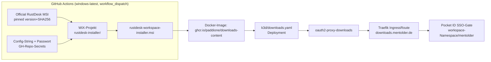

# RustDesk MSI Installer — Auto-Provisioning — Design

## Ziel

Ein vorkonfigurierter Windows-Installer (`.msi`) für den RustDesk-Client, der beim Setup
automatisch den Relay-Server (ID-Server + Key) und ein gemeinsames Unattended-Access-Passwort
einträgt — für Patrick und gekko (dieselben 2 Nutzer wie beim bestehenden RustDesk-Relay),
ohne dass diese Werte auf jedem neuen Windows-Rechner manuell eingetippt werden müssen.

Sub-Feature der bereits archivierten `rustdesk-server`-Spec (`openspec/specs/rustdesk-server.md`).
Die Web-Client-Aktivierung (Port 21118/21119, OIDC-gated auf `rustdesk.mentolder.de`) wurde beim
Brainstorming als eigenständiges, unabhängiges Feature identifiziert und ausgekoppelt — siehe
Ticket **T001377**.

## Kontext & bestehende Konventionen

Der Relay (`hbbs`/`hbbr`) läuft bereits produktiv (`k3d/rustdesk-stack/`, Namespace `rustdesk`,
gemeinsam für beide Brands via `task fleet:shared-services`). Das ed25519-Keypair liegt in der
SealedSecret `rustdesk-secrets`. Laut Design-Doc der Parent-Spec steuert der Public Key
(`id_ed25519.pub`) ausschließlich die ID-Registrierung/-Lookup — ein Leak ist laut eigener
Risikoanalyse "bestenfalls Spoofing/DoS", keine Session-Einsicht (die läuft separat
Ende-zu-Ende via ECDH). Ein **Unattended-Access-Passwort** hat eine fundamental andere
Risikoklasse: Es ist der einzige Faktor für passwortlose Fernsteuerung eines Rechners.

Das Repo ist auf GitHub **öffentlich**. Eine MSI ist trivial mit `lessmsi`/`orca`/7-Zip zu
entpacken — jeder Klartext-String darin ist für jeden mit Datei-Zugriff sofort lesbar. Das
schließt eine Distribution über ein öffentliches GitHub Release oder öffentlich einsehbare
GitHub-Actions-Artifacts aus (auf einem öffentlichen Repo sind beide für jeden herunterladbar).

Offizielle RustDesk-Dokumentation (`rustdesk/doc.rustdesk.com`, Stand 2026-07-01) bestätigt den
Provisionierungsmechanismus: kein Custom-Client-Compile nötig. Die offizielle MSI wird normal
installiert; danach zwei CLI-Aufrufe konfigurieren den Client:

```
rustdesk.exe --config <config-string>
rustdesk.exe --password <password>
```

Der `<config-string>` ist ein **opaker String**, der einmalig manuell auf einem bereits
konfigurierten RustDesk-Client über *Settings → Network → Export Server Config* erzeugt wird
(ohne RustDesk Server Pro/Web-Konsole gibt es keinen Weg, ihn direkt aus Host+Key zu berechnen).
Das ist ein einmaliger manueller Bootstrap-Schritt, kein Automatisierungsproblem.

Der Auth-Provider für SSO-Gating ist **Pocket ID**, nicht Keycloak (CLAUDE.md ist an dieser
Stelle veraltet — Keycloak wurde vollständig durch Pocket ID ersetzt). Pocket ID läuft
**pro Brand-Namespace** eigenständig (`workspace` und `workspace-korczewski` haben je eine
eigene Instanz + eigene OIDC-Clients), analog zum `docs`-Service-Muster
(`k3d/docs.yaml` + `k3d/oauth2-proxy-docs.yaml` + eigener Pocket-ID-Client + eigenes Secret
`POCKET_ID_DOCS_SECRET` + eigener Ingress-Host).

## Architektur



**Kernmechanismus:** WiX-Toolset (v4/v5, `dotnet tool install --global wix`, kostenlos, läuft
nativ auf `windows-latest`). Ein schlankes WiX-Projekt bettet die offizielle, per Version+SHA256
gepinnte RustDesk-MSI ein und installiert sie via Custom Action silent
(`msiexec /i official.msi /qn`). Danach zwei weitere deferred Custom Actions:
`rustdesk.exe --config <config-string>` und `rustdesk.exe --password <password>`. Ergebnis: eine
einzelne, echte `.msi`-Datei.

**Verworfene Alternativen:**
- *Custom-Client-Kompilierung* (RustDesk aus Source mit Compile-Time-Konstanten,
  offizieller Weg für gebrandete Clients): erfordert vollen Rust+Flutter+Sciter-Buildtoolchain,
  Stunden Buildzeit, laufender Wartungsaufwand bei jedem Upstream-Release. Für 2 private Nutzer
  Overkill.
- *Reines PowerShell/Batch-Skript* (offizielles RustDesk-Deployment-Skript 1:1 übernommen):
  einfachster Weg, aber kein Doppelklick-`.msi`-Artefakt — widerspricht der expliziten
  Anforderung "MSI installer".

**Ein gemeinsamer Installer für beide Brands** — der Relay ist brand-unabhängig
(REQ-RUSTDESK-RELAY-001), kein Mehrwert durch getrennte Builds.

## Secrets-Fluss

**Kein SealedSecret-Pfad** (Korrektur einer initialen Fehlannahme während des Brainstormings):
`.github/workflows/ci.yml:142-148` zeigt, dass CI git-crypt **niemals entschlüsselt** — es gibt
nur eine Prüfung, dass alles verschlüsselt *bleibt*. Der SealedSecret-Pfad existiert, weil ein
laufender Pod ein Secret zur Laufzeit im Cluster braucht. Hier gibt es keinen solchen Pod — der
einzige Konsument ist der Windows-CI-Build-Job selbst.

Der korrekte Mechanismus: **native GitHub-Actions-Repo-Secrets**, exakt wie `FLEET_KUBECONFIG`
bereits in `build-docs.yml:75,87` verwendet wird:

- `RUSTDESK_CLIENT_CONFIG_STRING` — der einmalig manuell exportierte Config-String.
- `RUSTDESK_UNATTENDED_PASSWORD` — das gemeinsame Unattended-Passwort.

Beide werden einmalig manuell in den Repo-Settings gesetzt (kein `schema.yaml`-Eintrag, kein
`environments/.secrets/`-Eintrag, kein SealedSecret). GitHub Actions maskiert bekannte
`secrets.*`-Werte automatisch in Logs — das gebaute MSI-Binary selbst enthält das Passwort aber
im Klartext (das ist der Zweck), weshalb die private Downloads-Distribution die einzige
Schutzschicht bleibt, nicht die CI-Logs.

**Passwort-Rotation:** kein automatisierter Weg — im Verdachtsfall manueller Re-Build +
Re-Verteilung, analog zur bestehenden "keine feste Rotationspflicht"-Policy des Relay-Keys.

## CI-Pipeline

Neuer Workflow `.github/workflows/build-rustdesk-installer.yml`:

- **Trigger:** ausschließlich `workflow_dispatch` (kein Auto-Build bei Push) — minimiert, wie
  oft das Passwort überhaupt in einem Build-Kontext existiert.
- **Runner:** `windows-latest` — der erste Windows-Runner in diesem Repo (bisher nur
  `ubuntu-latest` in allen `build-*.yml`).
- **Schritte:**
  1. WiX Toolset installieren (`dotnet tool install --global wix`).
  2. Offizielle RustDesk-MSI herunterladen, Version + SHA256-Checksumme gegen eine gepinnte
     Konstante verifizieren (Supply-Chain-Schutz, analog zur Digest-Pinning-Konvention bei
     Docker-Images im Repo).
  3. WiX-Build mit `${{ secrets.RUSTDESK_CLIENT_CONFIG_STRING }}` /
     `${{ secrets.RUSTDESK_UNATTENDED_PASSWORD }}` als Build-Variablen injiziert.
  4. Output: `rustdesk-workspace-installer.msi`.
  5. **Smoke-Test auf demselben Runner:** `msiexec /i rustdesk-workspace-installer.msi /qn`,
     danach nur *nicht-sensible* Fakten prüfen (Config-Datei existiert, enthält den erwarteten
     ID-Server-Hostnamen) — das Passwort wird **niemals** zurückgelesen oder geloggt, auch nicht
     zum Vergleich (Diff-Vergleiche könnten das automatische Masking umgehen).
  6. MSI in ein minimales Docker-Image packen (statischer Dateiserver, analog zur
     `docs`-Image-Struktur), push zu `ghcr.io`.
  7. `kubectl rollout restart` gegen den `downloads`-Service via `secrets.FLEET_KUBECONFIG`
     (bereits vorhanden, wiederverwendet).

## Error-Handling

- Silent-Install der offiziellen RustDesk-MSI schlägt fehl → die Custom Action gibt einen
  Fehlercode zurück → die gesamte Installation rollt zurück (Standard-MSI-Transaktionsverhalten),
  kein halb-konfigurierter Zustand.
- `rustdesk.exe --config`/`--password` dürfen erst laufen, wenn der RustDesk-Windows-Service
  tatsächlich den Status `Running` erreicht hat — Polling-Loop analog zum offiziellen
  Referenz-Deployment-Skript (`Start-Sleep` + Service-Status-Check), sonst Race-Condition
  zwischen Service-Start und Konfigurationsaufruf.

## Downloads-Service (SSO-gated Distribution)

Neuer, dedizierter Service — **einmalig** in der `workspace`-Namespace (mentolder) deployed,
**nicht** dupliziert für `workspace-korczewski`. Begründung: Pocket ID läuft normalerweise pro
Brand-Namespace eigenständig, aber `rustdesk.mentolder.de` ist bereits heute ein einziger
kanonischer, mentolder-genamespacter Hostname für **beide** Brands (REQ-RUSTDESK-RELAY-001).
Die Downloads-Seite folgt demselben Muster: eine URL, gated durch mentolders Pocket-ID-Instanz,
in der Patrick und gekko ohnehin schon Accounts haben.

Generisch benannt (`downloads`, nicht `rustdesk-dl`), falls künftig weitere interne Artefakte
SSO-gated verteilt werden sollen.

**Neue Dateien:**
- `k3d/downloads.yaml` — Deployment + Service, statischer Dateiserver (analog `docs.yaml`).
- `k3d/oauth2-proxy-downloads.yaml` — eigener oauth2-proxy, OIDC-Client-ID `downloads`.
- `k3d/pocket-id-client-seed.yaml` — neue Zeile für den `downloads`-Client.
- `environments/schema.yaml` — `POCKET_ID_DOWNLOADS_SECRET` (generate:true, wie bei `docs`).
- `k3d/ingress.yaml` — neue Host-Route `downloads.mentolder.de` → `oauth2-proxy-downloads:4180`.
- `k3d/configmap-domains.yaml` — `DOWNLOADS_DOMAIN: "downloads.localhost"`.
- `k3d/kustomization.yaml` — beide neuen Manifeste als Resources ergänzen.

## Testing

- CI-Smoke-Test auf dem `windows-latest`-Runner (siehe CI-Pipeline, Schritt 5) — einzige
  automatisierte Verifikation, da BATS/Playwright kein Windows-Artefakt installieren können.
- Rot→Grün-Task: Smoke-Test-Assertion zuerst **ohne** die Custom-Action-Config-Injection-Logik
  schreiben (**expected: FAIL** — Config-Datei fehlt/enthält nicht den erwarteten Host), dann
  die Custom Actions implementieren (**PASS**).
- Manuelle Verifikation: Patrick installiert die fertige MSI auf einem echten Windows-Rechner,
  bestätigt, dass RustDesk ohne manuelle Konfiguration mit `rustdesk.mentolder.de` verbunden ist
  und der Unattended-Zugriff mit dem gebackenen Passwort funktioniert.

## Sicherheit / DSGVO

- Unattended-Passwort ist ein echtes Secret (volle Fernsteuerung bei Leak) — deshalb: kein
  öffentliches GitHub Release, kein öffentlich einsehbares Actions-Artifact, ausschließlich
  Distribution über die OIDC-gated Downloads-Seite.
- Config-String enthält nur den ID-Server-Host + Public Key — laut Parent-Spec-Risikoanalyse
  nicht hochsensibel (nur ID-Lookup-Kontrolle), wird aber dennoch nicht separat unterschiedlich
  behandelt, da beide Werte gemeinsam in derselben MSI landen.
- Keine personenbezogenen Daten involviert (dieselbe Einschätzung wie in der Parent-Spec).

## Out of Scope

- RustDesk-Web-Client-Aktivierung (Port 21118/21119, OIDC-gated auf `rustdesk.mentolder.de`) —
  eigenständiges Feature, getrackt als **Ticket T001377**, braucht eigene OpenSpec-Delta gegen
  `rustdesk-server` (kehrt REQ-RUSTDESK-RELAY-004 um) und eigene Brainstorming-Runde.
- Automatisierte Passwort-Rotation.
- Brand-spezifische Installer-Varianten (Branding/Icon) — ein gemeinsamer Installer genügt.
- macOS/Linux-Client-Provisionierung — nur Windows-MSI in diesem Scope.
