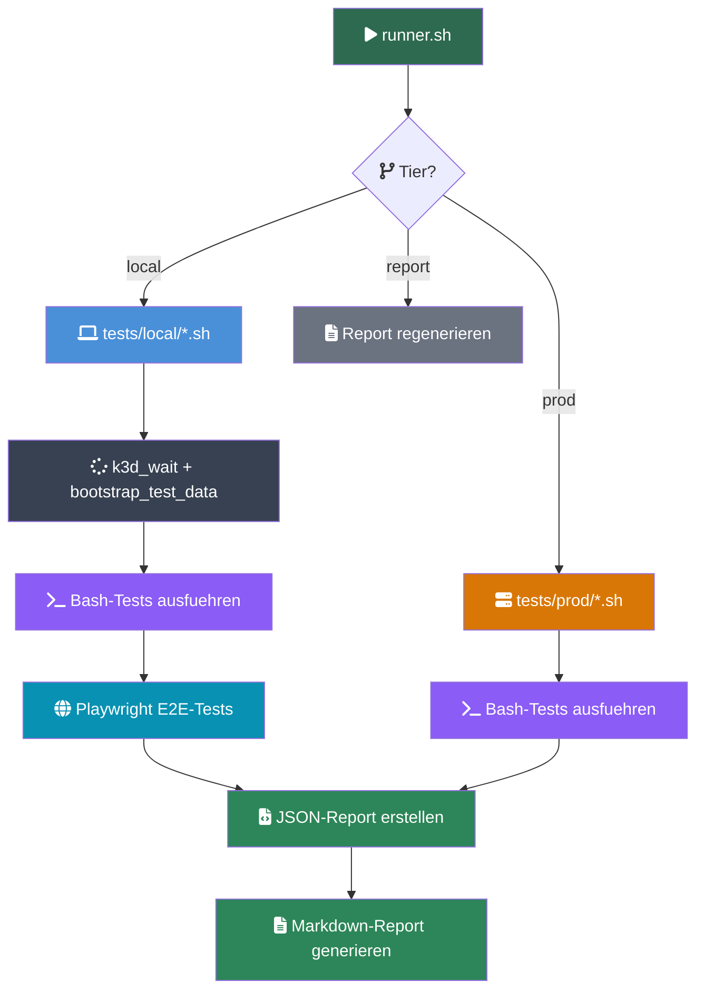

# Tests

## Uebersicht

Das Test-Framework kombiniert Bash-basierte API/CLI-Tests mit Playwright-basierten E2E-Browser-Tests. Alle Tests laufen gegen den laufenden k3d-Cluster.



## Ausfuehrung

```bash
# Alle lokalen Tests
./tests/runner.sh local

# Einzelne Tests
./tests/runner.sh local FA-01 SA-03

# Ausfuehrliche Ausgabe
./tests/runner.sh local --verbose

# Produktions-Tests (benoetigt PROD_DOMAIN)
./tests/runner.sh prod

# Report aus vorhandenen Ergebnissen regenerieren
./tests/runner.sh report
```

**Voraussetzungen:** kubectl, jq, curl (automatisch geprueft)

## Test-Kategorien

### Funktionale Tests (FA)

| ID | Name | Beschreibung |
|----|------|-------------|
| FA-01 | Messaging | DM, Gruppen-DM, Channel-Nachrichten, Persistenz, Webhooks, Pinning |
| FA-02 | Kanaele | Erstellen, Berechtigungen, oeffentlich/privat, Archivierung |
| FA-03 | Videokonferenzen | Talk HPB, Janus/WebRTC, Signaling-Server |
| FA-04 | Dateiablage | Nextcloud Upload/Download, Nextcloud-Integration |
| FA-05 | Nutzerverwaltung | Benutzer anlegen/deaktivieren, Rollen, CSV-Import |
| FA-06 | Benachrichtigungen | Push, Stummschaltung, Do-Not-Disturb |
| FA-07 | Suche | Volltext, Kanal-/Benutzersuche, OpenSearch |
| FA-08 | Homeoffice-Status | Status-Emojis, Custom-Status, Kalender |
| FA-09 | Billing Bot | /billing Slash-Command, Invoice Ninja Integration |
| FA-10 | Website | Astro-Deployment, Kontaktformular, Webhook |
| FA-11 | Kunden-Gast-Portal | Gast-Account, privater Kanal, Keycloak |
| FA-12 | Claude Code AI | Bot-User, Admin-Kanaele, MCP-Server |
| FA-13 | Dokumentation | Docsify-Deployment, Inhalte |
| FA-14 | Self-Registration | Anmeldung, Signup |
| FA-15 | OIDC-Authentifizierung | OpenID Connect Flow |
| FA-16 | Buchungssystem | Booking Integration |
| FA-17 | Meeting-Raeume | Raum-Management |
| FA-18 | Transkription | Whisper Service |
| FA-19 | Outline Wiki | Wiki-Deployment, Keycloak-OIDC |
| FA-20 | Finalisierung | Abschlusspruefungen |
| FA-21 | Billing Workflows | Rechnungsworkflows |
| FA-22 | Stripe Payment Gateway | Stripe als Zahlungsgateway in Invoice Ninja (nur Shell-Tests, kein Playwright-Spec) |
| FA-23 | Vaultwarden | Passwort-Manager mit Keycloak SSO |
| FA-24 | Kollaboratives Whiteboard | Nextcloud Whiteboard (board.{domain}) |
| FA-25 | Mailpit | Self-hosted SMTP-Server und Web-UI |

### Sicherheits-Tests (SA)

| ID | Name | Beschreibung |
|----|------|-------------|
| SA-01 | Passwortsicherheit | bcrypt-Hashing, Policy, kein Klartext |
| SA-02 | Authentifizierung | Login/Logout, Session-Management |
| SA-03 | Passwortsicherheit (lokal) | Lokale Variante |
| SA-04--SA-07 | Autorisierung | Zugriffskontrolle und Berechtigungen |
| SA-08 | SSO-Integration | Keycloak OIDC Flow |
| SA-09 | Weitere Sicherheit | Zusaetzliche Sicherheitspruefungen |
| SA-10 | MCP-Endpunkt-Absicherung | ForwardAuth-Proxy, Bearer-Token, HTTP 401 ohne Token |

### Nicht-funktionale Tests (NFA)

| ID | Name | Beschreibung |
|----|------|-------------|
| NFA-01 | Datensouveraenitaet | DSGVO, keine Cloud-Images, kein Tracking |
| NFA-02 | Performance | Monitoring, Last-Tests |
| NFA-03 | Verfuegbarkeit | Pod-Neustart, Auto-Recovery, Datenpersistenz |
| NFA-04 | Skalierbarkeit | Load Testing |
| NFA-05 | Usability | Barrierefreiheit, UX |
| NFA-06 | Datenbank-Konsistenz | DB-Integritaet |
| NFA-07 | Logging & Monitoring | Log-Verfuegbarkeit |

### Abnahme-Tests (AK)

| ID | Name | Beschreibung |
|----|------|-------------|
| AK-03 | Technische Machbarkeit | k3d-Pods laufen, stabile Image-Tags |
| AK-04 | Infrastruktur | Infrastruktur-Validierung |

### Produktions-Tests (tests/prod/)

| ID | Pruefung |
|----|---------|
| SA-01 | TLS-Verschluesselung, Cipher-Staerke, HSTS, Zertifikats-Gueltigkeit |
| SA-07 | Produktions-Sicherheit |
| SA-09 | Produktions-Sicherheits-Validierung |
| NFA-01 | DSGVO-Compliance (keine Cloud-Registries, Telemetrie deaktiviert, Pod Security) |
| NFA-02 | Performance-Benchmarks (optional, mit `ab`) |
| NFA-04 | Load Testing |

## Playwright E2E-Tests

Browser-basierte UI-Tests in `tests/e2e/` -- werden automatisch vom `local`-Tier
nach den Bash-Tests gestartet. Der `prod`-Tier führt sie nicht automatisch aus;
siehe "Playwright gegen Produktion" unten.

**Konfiguration** (`tests/e2e/playwright.config.ts`):
- Base-URL: `TEST_BASE_URL` (Standard: `http://localhost:8065`)
- Website-URL: `WEBSITE_URL` (Standard: `http://localhost:4321`)
- Ein Worker, 1 Retry, Locale: de-DE, Zeitzone: Europe/Berlin
- Screenshots + Trace nur bei Fehler

**Projekt-Gruppen** (aufrufbar via `--project=<name>`):
- `setup` -- Login-Flow, speichert Session in `.auth/user.json`
- `chat` -- Mattermost-UI: FA-01, FA-02, FA-04, FA-06, FA-07, FA-08, FA-09, FA-11
- `auth` -- Authentifizierung/SSO: FA-05, SA-02, SA-08
- `website` -- Astro-Site + APIs: FA-10, FA-14 bis FA-21
- `services` -- Infra-Dienste: FA-03, FA-12, FA-13, FA-23, FA-24, FA-25, SA-10, NFA-05
- `smoke` -- Cross-Service Integration Smoke Tests

**Global Setup:** Authentifiziert als `MM_TEST_USER` (Standard `testuser1`, vom
Bootstrap in `tests/lib/k3d.sh` angelegt) mit `MM_TEST_PASS` (Standard
`Testpassword123!`), deaktiviert Onboarding/Tutorials, speichert Session.

**Test-Specs (29 Dateien):**
- `fa-01-messaging.spec.ts` -- DM- und Channel-Nachrichten
- `fa-02-channels.spec.ts` -- Kanal-Erstellung, Berechtigungen
- `fa-03-video.spec.ts` -- Nextcloud Talk / Signaling
- `fa-04-files.spec.ts` -- Dateiablage
- `fa-05-user-mgmt.spec.ts` -- Nutzerverwaltung, SSO-Admin
- `fa-06-notifications.spec.ts` -- Benachrichtigungen, DND, Mentions
- `fa-07-search.spec.ts` -- Volltextsuche
- `fa-08-status.spec.ts` -- Homeoffice-Status
- `fa-09-billing.spec.ts` -- /billing Command + /leistungen Website-Seite
- `fa-10-website.spec.ts` -- Astro-Website, Kontaktformular
- `fa-11-guest.spec.ts` -- Gast-Zugang
- `fa-12-claude-code.spec.ts` -- Claude Code / MCP-Statusseite
- `fa-13-docs.spec.ts` -- Docsify-Docs
- `fa-14-registration.spec.ts` -- Self-Registration
- `fa-15-oidc.spec.ts` -- OIDC-Website-Login
- `fa-16-booking.spec.ts` -- Kalender / Buchung
- `fa-17-meeting.spec.ts` -- Meeting-Lifecycle
- `fa-18-transcription.spec.ts` -- Whisper-Upload-API (akzeptiert 404/405 für GET)
- `fa-19-outline.spec.ts` -- Outline Wiki
- `fa-20-finalize.spec.ts` -- Meeting-Finalisierung
- `fa-21-billing.spec.ts` -- Service Catalog, Invoice-API
- `fa-23-vaultwarden.spec.ts` -- Vaultwarden-Gesundheit
- `fa-24-whiteboard.spec.ts` -- Whiteboard-Service
- `fa-25-mailpit.spec.ts` -- Mailpit Web-UI und API
- `sa-02-auth.spec.ts` -- Falsches Passwort, SSO-Button
- `sa-08-sso.spec.ts` -- Cross-Service-SSO (Browser)
- `sa-10-mcp-auth.spec.ts` -- MCP-Statusseite ohne Auth
- `nfa-05-usability.spec.ts` -- Mobile, Quick-Switcher
- `integration-smoke.spec.ts` -- Cross-Service Smoke gegen Produktion

**Hilfsfunktionen** (`specs/helpers.ts`):
- `dismissOverlays(page)` -- Tour/Onboarding entfernen
- `goToChannel(page, team, channel)` -- Kanal-Navigation
- `goToDM(page, team, username)` -- DM-Navigation

### Playwright gegen Produktion

Der `runner.sh prod`-Tier startet die Playwright-Tests nicht automatisch.
Manuell aus `tests/e2e/` aufrufen:

```bash
# Smoke-Tests gegen mentolder.de
TEST_BASE_URL=https://chat.mentolder.de \
WEBSITE_URL=https://web.mentolder.de \
  npx playwright test --project=smoke

# Alles (chat + auth + website + services + smoke)
TEST_BASE_URL=https://chat.mentolder.de \
WEBSITE_URL=https://web.mentolder.de \
VAULT_URL=https://vault.mentolder.de \
MCP_STATUS_URL=https://ai.mentolder.de \
MM_TEST_USER=Paddione \
MM_TEST_PASS='Plotterpapier11!$' \
  npx playwright test
```

**Für Produktion relevante Umgebungsvariablen:**
- `TEST_BASE_URL` -- Mattermost (z. B. `https://chat.mentolder.de`)
- `WEBSITE_URL` -- Astro-Website (z. B. `https://web.mentolder.de`)
- `VAULT_URL` -- Vaultwarden (z. B. `https://vault.mentolder.de`)
- `MCP_STATUS_URL` -- Claude Code MCP-Statusseite (z. B. `https://ai.mentolder.de`)
- `MM_TEST_USER` / `MM_TEST_PASS` -- Anmeldedaten für Setup und Auth-Specs
- `SMOKE_KC_USER` / `SMOKE_KC_PASS` -- Override nur für `integration-smoke.spec.ts`
  (Fallback: `MM_TEST_USER` / `MM_TEST_PASS`, dann Realm-Defaults). Nützlich, wenn
  die Smoke-Tests ein anderes Konto nutzen als der Setup-Login.

## Test-Bibliothek (tests/lib/)

### assert.sh -- Assertion-Framework

```bash
assert_eq <actual> <expected> <req> <test_id> <desc>
assert_contains <haystack> <needle> <req> <test_id> <desc>
assert_not_contains <haystack> <needle> <req> <test_id> <desc>
assert_http <expected_status> <url> <req> <test_id> <desc>
assert_http_redirect <url> <expected_location> <req> <test_id> <desc>
assert_lt <actual> <max> <req> <test_id> <desc>
assert_gt <actual> <min> <req> <test_id> <desc>
assert_cmd <command> <req> <test_id> <desc>
assert_match <string> <regex> <req> <test_id> <desc>
skip_test <req> <test_id> <desc> <reason>
assert_summary  # Pass/Fail/Skip-Zaehler ausgeben
```

Jede Assertion schreibt ein JSON-Objekt in `$RESULTS_FILE`:
```json
{"req":"FA-01","test":"T1","desc":"DM gesendet","status":"pass","duration_ms":125,"detail":""}
```

### k3d.sh -- Kubernetes-Utilities

- `k3d_wait()` -- Wartet auf Service-Bereitschaft (Mattermost, Keycloak, Nextcloud)
- `bootstrap_test_data()` -- Erstellt Test-User, Teams, Channels, Gast-Accounts
- Port-Forward-Management fuer Mattermost, Nextcloud, Keycloak
- API-Hilfsfunktionen (`_mm_api`, `_mm_login`, `_kc_admin_login`)
- Automatische Token-Regenerierung nach Pod-Neustarts

### report.sh -- Report-Generierung

- `finalize_json` -- JSONL in strukturiertes JSON mit Metadaten konvertieren
- `generate_markdown` -- JSON in Markdown-Report mit Tabelle, Zusammenfassung, Fehlerdetails

## Ergebnis-Format

Reports werden in `tests/results/` gespeichert:
- `{datum}-{tier}.json` -- Strukturiertes JSON
- `{datum}-{tier}.md` -- Markdown-Report mit Pass/Fail/Skip-Zusammenfassung
