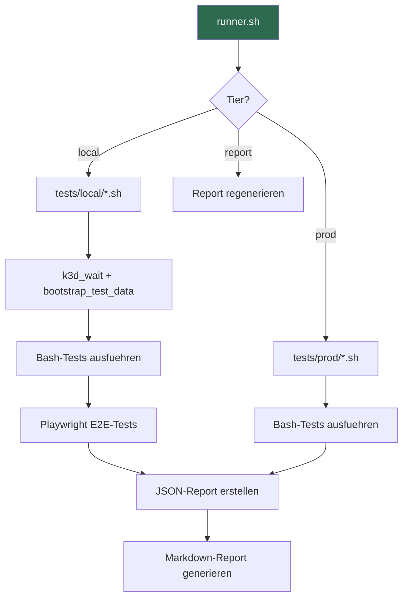

# Tests

## Uebersicht

Das Test-Framework kombiniert Bash-basierte API/CLI-Tests mit Playwright-basierten E2E-Browser-Tests. Alle Tests laufen gegen den laufenden k3d-Cluster.



## Ausfuehrung

```bash
# Alle lokalen Tests
./tests/runner.sh local

# Einzelne Tests
./tests/runner.sh local FA-01 SA-03

# Ausfuehrliche Ausgabe
./tests/runner.sh local --verbose

# Produktions-Tests (benoetigt PROD_DOMAIN)
./tests/runner.sh prod

# Report aus vorhandenen Ergebnissen regenerieren
./tests/runner.sh report
```

**Voraussetzungen:** kubectl, jq, curl (automatisch geprueft)

## Test-Kategorien

### Funktionale Tests (FA)

| ID | Name | Beschreibung |
|----|------|-------------|
| FA-01 | Messaging | DM, Gruppen-DM, Channel-Nachrichten, Persistenz, Webhooks, Pinning |
| FA-02 | Kanaele | Erstellen, Berechtigungen, oeffentlich/privat, Archivierung |
| FA-03 | Videokonferenzen | Talk HPB, Janus/WebRTC, Signaling-Server |
| FA-04 | Dateiablage | Nextcloud Upload/Download, Nextcloud-Integration |
| FA-05 | Nutzerverwaltung | Benutzer anlegen/deaktivieren, Rollen, CSV-Import |
| FA-06 | Benachrichtigungen | Push, Stummschaltung, Do-Not-Disturb |
| FA-07 | Suche | Volltext, Kanal-/Benutzersuche, OpenSearch |
| FA-08 | Homeoffice-Status | Status-Emojis, Custom-Status, Kalender |
| FA-09 | Billing Bot | /billing Slash-Command, Invoice Ninja Integration |
| FA-10 | Website | Astro-Deployment, Kontaktformular, Webhook |
| FA-11 | Kunden-Gast-Portal | Gast-Account, privater Kanal, Keycloak |
| FA-12 | OpenClaw AI | Bot-User, Admin-Kanaele, MCP-Server |
| FA-13 | Dokumentation | Docsify-Deployment, Inhalte |
| FA-14 | Self-Registration | Anmeldung, Signup |
| FA-15 | OIDC-Authentifizierung | OpenID Connect Flow |
| FA-16 | Buchungssystem | Booking Integration |
| FA-17 | Meeting-Raeume | Raum-Management |
| FA-18 | Transkription | Whisper Service |
| FA-19 | Outline Wiki | Wiki-Deployment, Keycloak-OIDC |
| FA-20 | Finalisierung | Abschlusspruefungen |
| FA-21 | Billing Workflows | Rechnungsworkflows |

### Sicherheits-Tests (SA)

| ID | Name | Beschreibung |
|----|------|-------------|
| SA-01 | Passwortsicherheit | bcrypt-Hashing, Policy, kein Klartext |
| SA-02 | Authentifizierung | Login/Logout, Session-Management |
| SA-03 | Passwortsicherheit (lokal) | Lokale Variante |
| SA-04--SA-07 | Autorisierung | Zugriffskontrolle und Berechtigungen |
| SA-08 | SSO-Integration | Keycloak OIDC Flow |
| SA-09 | Weitere Sicherheit | Zusaetzliche Sicherheitspruefungen |

### Nicht-funktionale Tests (NFA)

| ID | Name | Beschreibung |
|----|------|-------------|
| NFA-01 | Datensouveraenitaet | DSGVO, keine Cloud-Images, kein Tracking |
| NFA-02 | Performance | Monitoring, Last-Tests |
| NFA-03 | Verfuegbarkeit | Pod-Neustart, Auto-Recovery, Datenpersistenz |
| NFA-04 | Skalierbarkeit | Load Testing |
| NFA-05 | Usability | Barrierefreiheit, UX |
| NFA-06 | Datenbank-Konsistenz | DB-Integritaet |
| NFA-07 | Logging & Monitoring | Log-Verfuegbarkeit |

### Abnahme-Tests (AK)

| ID | Name | Beschreibung |
|----|------|-------------|
| AK-03 | Technische Machbarkeit | k3d-Pods laufen, stabile Image-Tags |
| AK-04 | Infrastruktur | Infrastruktur-Validierung |

### Produktions-Tests (tests/prod/)

| ID | Pruefung |
|----|---------|
| SA-01 | TLS-Verschluesselung, Cipher-Staerke, HSTS, Zertifikats-Gueltigkeit |
| SA-07 | Produktions-Sicherheit |
| SA-09 | Produktions-Sicherheits-Validierung |
| NFA-01 | DSGVO-Compliance (keine Cloud-Registries, Telemetrie deaktiviert, Pod Security) |
| NFA-02 | Performance-Benchmarks (optional, mit `ab`) |
| NFA-04 | Load Testing |

## Playwright E2E-Tests

Browser-basierte UI-Tests in `tests/e2e/`.

**Konfiguration:**
- Base-URL: `TEST_BASE_URL` (Standard: http://localhost:8065)
- Einzelner Worker, 1 Retry
- Screenshots + Trace bei Fehler
- Locale: de-DE, Zeitzone: Europe/Berlin

**Global Setup:** Authentifiziert als `testuser1`, deaktiviert Onboarding/Tutorials, speichert Auth-Session.

**Test-Specs (26 Dateien):**
- `fa-01-messaging.spec.ts` bis `fa-21-billing.spec.ts` -- Funktionale UI-Tests
- `sa-02-auth.spec.ts` -- Login/Logout Browser-Flow
- `sa-08-sso.spec.ts` -- Keycloak SSO Browser-Flow
- `nfa-05-usability.spec.ts` -- Barrierefreiheit und UX

**Hilfsfunktionen** (`specs/helpers.ts`):
- `dismissOverlays(page)` -- Tour/Onboarding entfernen
- `goToChannel(page, team, channel)` -- Kanal-Navigation
- `goToDM(page, team, username)` -- DM-Navigation

## Test-Bibliothek (tests/lib/)

### assert.sh -- Assertion-Framework

```bash
assert_eq <actual> <expected> <req> <test_id> <desc>
assert_contains <haystack> <needle> <req> <test_id> <desc>
assert_not_contains <haystack> <needle> <req> <test_id> <desc>
assert_http <expected_status> <url> <req> <test_id> <desc>
assert_http_redirect <url> <expected_location> <req> <test_id> <desc>
assert_lt <actual> <max> <req> <test_id> <desc>
assert_gt <actual> <min> <req> <test_id> <desc>
assert_cmd <command> <req> <test_id> <desc>
assert_match <string> <regex> <req> <test_id> <desc>
skip_test <req> <test_id> <desc> <reason>
assert_summary  # Pass/Fail/Skip-Zaehler ausgeben
```

Jede Assertion schreibt ein JSON-Objekt in `$RESULTS_FILE`:
```json
{"req":"FA-01","test":"T1","desc":"DM gesendet","status":"pass","duration_ms":125,"detail":""}
```

### k3d.sh -- Kubernetes-Utilities

- `k3d_wait()` -- Wartet auf Service-Bereitschaft (Mattermost, Keycloak, Nextcloud)
- `bootstrap_test_data()` -- Erstellt Test-User, Teams, Channels, Gast-Accounts
- Port-Forward-Management fuer Mattermost, Nextcloud, Keycloak
- API-Hilfsfunktionen (`_mm_api`, `_mm_login`, `_kc_admin_login`)
- Automatische Token-Regenerierung nach Pod-Neustarts

### report.sh -- Report-Generierung

- `finalize_json` -- JSONL in strukturiertes JSON mit Metadaten konvertieren
- `generate_markdown` -- JSON in Markdown-Report mit Tabelle, Zusammenfassung, Fehlerdetails

## Ergebnis-Format

Reports werden in `tests/results/` gespeichert:
- `{datum}-{tier}.json` -- Strukturiertes JSON
- `{datum}-{tier}.md` -- Markdown-Report mit Pass/Fail/Skip-Zusammenfassung
