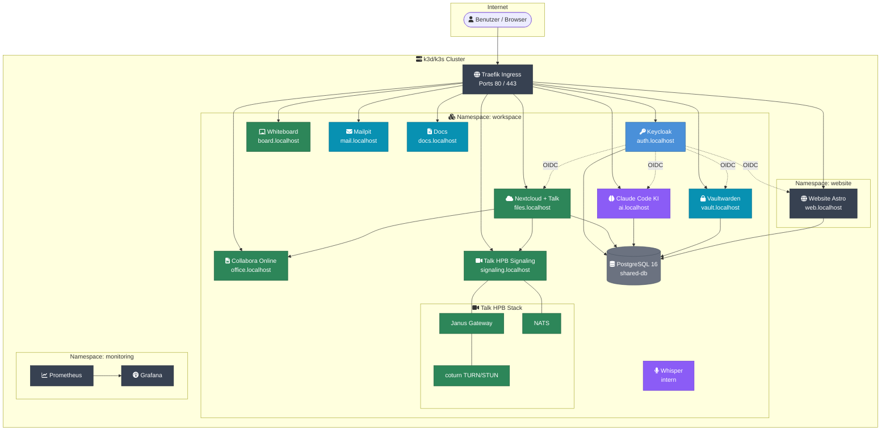
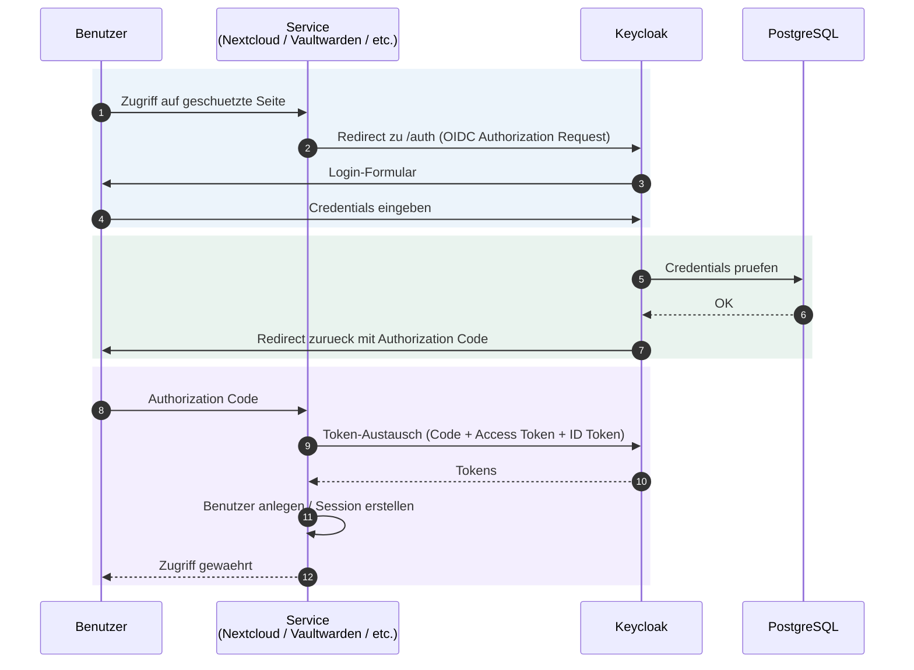
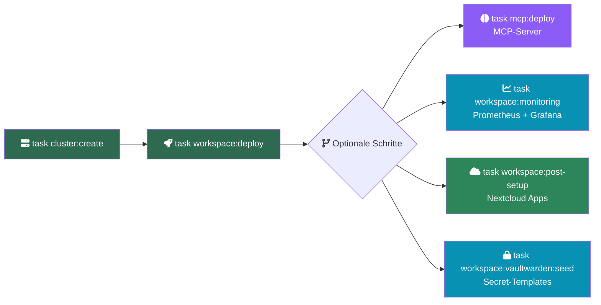

# Workspace MVP

Das Workspace MVP ist eine Kubernetes-basierte, selbst gehostete Kollaborationsplattform fuer kleine Teams, entwickelt im Rahmen einer Bachelorarbeit. Die Plattform integriert Dateiablage, Video-Kommunikation, Passwort-Management, KI-Unterstuetzung und weitere Dienste unter einem einheitlichen Single Sign-On. Alle Daten verbleiben auf eigenen Servern -- DSGVO-konform by Design.

## Schnellstart

Voraussetzungen: [Docker](https://www.docker.com/), [k3d](https://k3d.io), [kubectl](https://kubernetes.io/docs/tasks/tools/), [task](https://taskfile.dev)

```bash
git clone https://github.com/Paddione/Bachelorprojekt.git
cd Bachelorprojekt

# Cluster erstellen + alle Services automatisch deployen
task workspace:up
```

Oder schrittweise:

```bash
task cluster:create       # k3d-Cluster anlegen
task workspace:deploy     # Alle Services deployen (Kustomize)
task workspace:post-setup # Nextcloud-Apps aktivieren (Kalender, Kontakte, OIDC, Collabora)
```

## Service-Endpunkte

| Service | URL (Dev) | URL (Prod) | Beschreibung |
|---------|-----------|------------|--------------|
| Keycloak (SSO) | http://auth.localhost | https://auth.korczewski.de | Identity Provider, OIDC |
| Nextcloud | http://files.localhost | https://files.korczewski.de | Dateien, Kalender, Talk |
| Collabora | http://office.localhost | https://office.korczewski.de | Office-Suite (WOPI-Backend) |
| Talk HPB | http://signaling.localhost | https://signaling.korczewski.de | WebRTC-Signaling |
| Claude Code | http://ai.localhost | https://ai.korczewski.de | KI-Assistent (MCP-Status) |
| Vaultwarden | http://vault.localhost | https://vault.korczewski.de | Passwort-Manager |
| Whiteboard | http://board.localhost | https://board.korczewski.de | Kollaboratives Whiteboard |
| Mailpit | http://mail.localhost | -- (nur Dev) | E-Mail-Testing |
| Docs | http://docs.localhost | https://docs.korczewski.de | Diese Dokumentation |
| Website | http://web.localhost | https://web.mentolder.de | Astro+Svelte Website |
| Whisper | -- (intern) | -- (intern) | Sprach-Transkription (optional) |
| Monitoring | -- | -- | Prometheus + Grafana (optional) |

## Architektur



## SSO-Ablauf



## Deployment-Ablauf



Alternativ alles automatisch: `task workspace:up`

## Dokumentationsstruktur

| Abschnitt | Beschreibung |
|-----------|-------------|
| [Architektur](architecture) | Systemuebersicht, Datenfluss, Netzwerk |
| [Services](services) | Kubernetes-Services und ihr Zusammenspiel |
| [Keycloak & SSO](keycloak) | Identity Management, OIDC-Clients, Realm-Konfiguration |
| [Datenbank](database) | PostgreSQL-Schema, Datenbankzugriffe |
| [Sicherheit](security) | Sicherheitsrichtlinien, TLS, Secrets-Management |
| [Skripte](scripts) | Referenz aller Bash-Skripte und Parameter |
| [DSGVO](dsgvo) | Datenschutz, Datensouveraenitaet, Compliance-Pruefung |
| [Administration](adminhandbuch) | Betrieb, Monitoring, Backup, Troubleshooting |
