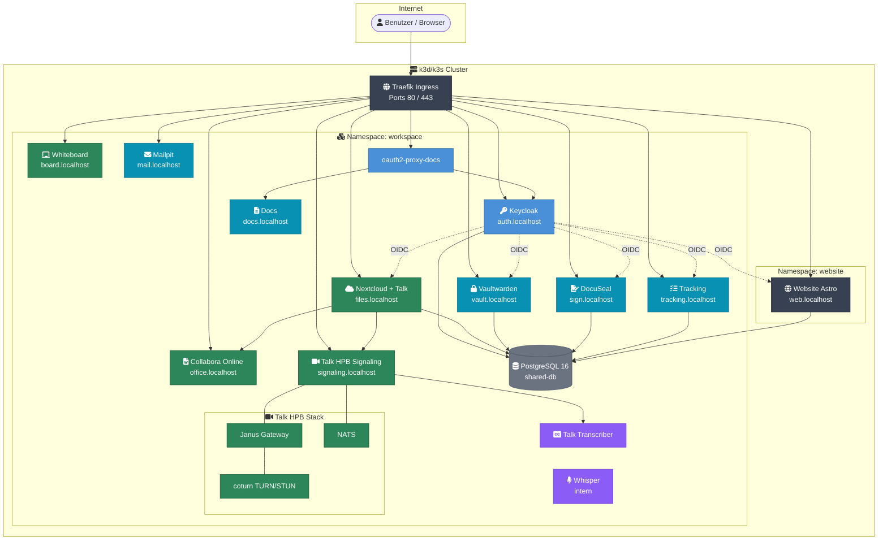
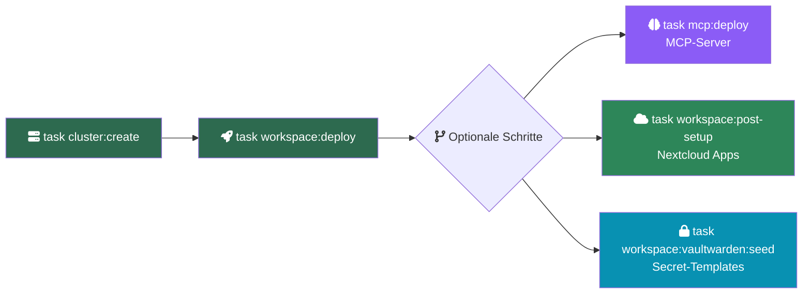

# Workspace

Der Workspace ist eine selbst gehostete, Kubernetes-basierte Kollaborationsplattform für kleine Teams. Sie bündelt Dateiablage, Video-Kommunikation, Office-Suite, Passwort-Management, KI-Unterstützung und weitere Dienste hinter einem einheitlichen Single Sign-On. Alle Daten verbleiben in Deutschland auf eigenen Servern — DSGVO-konform by Design.

## Für Endnutzer

- [Benutzerhandbuch](benutzerhandbuch) — Erster Login, Portal, Nextcloud, Talk, Vaultwarden, Whiteboard
- Portal: `https://web.mentolder.de/portal` bzw. `https://web.korczewski.de/portal`

## Für Administratoren

- [Adminhandbuch](adminhandbuch) — Betrieb, Benutzerverwaltung, Backups, Updates
- [Admin-Webinterface](admin-webinterface) — Vollständige Referenz aller Admin-Bereiche
- [Projekt-Verwaltung](admin-projekte) — Projekte, Teilprojekte, Aufgaben, Gantt

## Service-Endpunkte (Produktion)

`{DOMAIN}` ist `mentolder.de` oder `korczewski.de`.

| Service | URL | Beschreibung |
|---------|-----|--------------|
| Portal & Website | `https://web.{DOMAIN}` | Astro + Svelte Portal mit Chat, Buchung, Rechnungen |
| Keycloak (SSO) | `https://auth.{DOMAIN}` | Zentrale Anmeldung (OIDC) |
| Nextcloud | `https://files.{DOMAIN}` | Dateien, Kalender, Kontakte, Talk |
| Collabora Online | `https://office.{DOMAIN}` | Office im Browser (öffnet aus Nextcloud) |
| Talk HPB | `https://signaling.{DOMAIN}` | WebRTC-Signaling für Videocalls |
| LiveKit Stream | `https://livekit.{DOMAIN}` · `https://stream.{DOMAIN}` | Livestream / Webinare (Server + RTMP-Ingest) |
| Vaultwarden | `https://vault.{DOMAIN}` | Passwort-Manager (Bitwarden-kompatibel) |
| Whiteboard | `https://board.{DOMAIN}` | Kollaboratives Zeichnen |
| DocuSeal | `https://sign.{DOMAIN}` | E-Signatur für Verträge |
| Dokumentation | `https://docs.{DOMAIN}` | Diese Dokumentation |
| Whisper | (intern) | Automatische Transkription |
| Claude Code | (Plattform-Backend) | KI-Assistent über MCP-Server |

> **Entwicklung:** Auf einem lokalen k3d-Cluster sind dieselben Dienste unter `*.localhost` (HTTP statt HTTPS) erreichbar. Details: [Beitragen & CI/CD](contributing).

## Schnellstart (Entwicklung)

Voraussetzungen: [Docker](https://www.docker.com/), [k3d](https://k3d.io), [kubectl](https://kubernetes.io/docs/tasks/tools/), [task](https://taskfile.dev).

```bash
git clone https://github.com/Paddione/Bachelorprojekt.git
cd Bachelorprojekt
task workspace:up      # Cluster erstellen + alle Services deployen
```

Schrittweise:

```bash
task cluster:create        # k3d-Cluster anlegen
task workspace:deploy      # Alle Services deployen (Kustomize)
task workspace:post-setup  # Nextcloud-Apps aktivieren (Kalender, Kontakte, OIDC, Collabora)
```

## Architektur



## SSO-Ablauf


## Deployment-Ablauf



Alternativ alles automatisch: `task workspace:up`

## Dokumentationsstruktur

| Abschnitt | Beschreibung |
|-----------|-------------|
| [Architektur](architecture) | Systemübersicht, Datenfluss, Netzwerk |
| [Services](services) | Kubernetes-Services und ihr Zusammenspiel |
| [Keycloak & SSO](keycloak) | Identity Management, OIDC-Clients, Realm-Konfiguration |
| [Datenbank](database) | PostgreSQL-Schema, Datenbankzugriffe |
| [Sicherheit](security) | Sicherheitsrichtlinien, TLS, Secrets-Management |
| [Skripte](scripts) | Referenz aller Bash-Skripte und Parameter |
| [DSGVO](dsgvo) | Datenschutz, Datensouveränität, Compliance-Prüfung |
| [Administration](adminhandbuch) | Betrieb, Monitoring, Backup, Troubleshooting |
