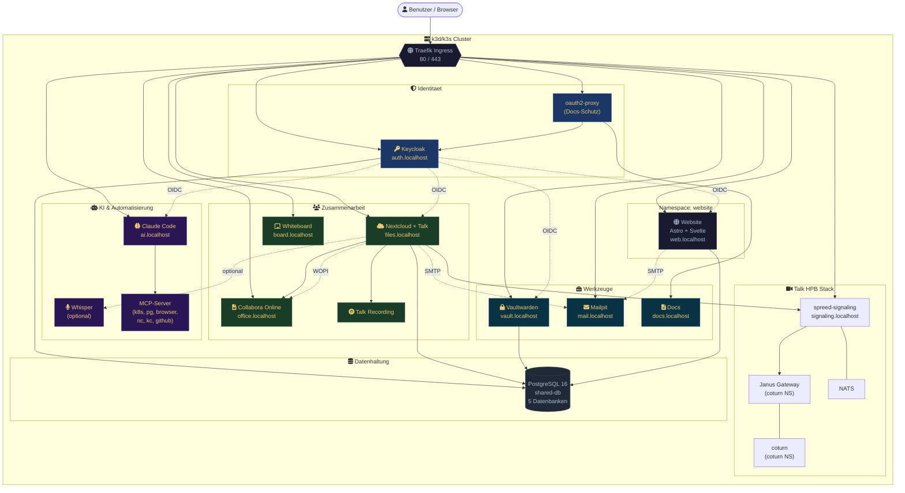
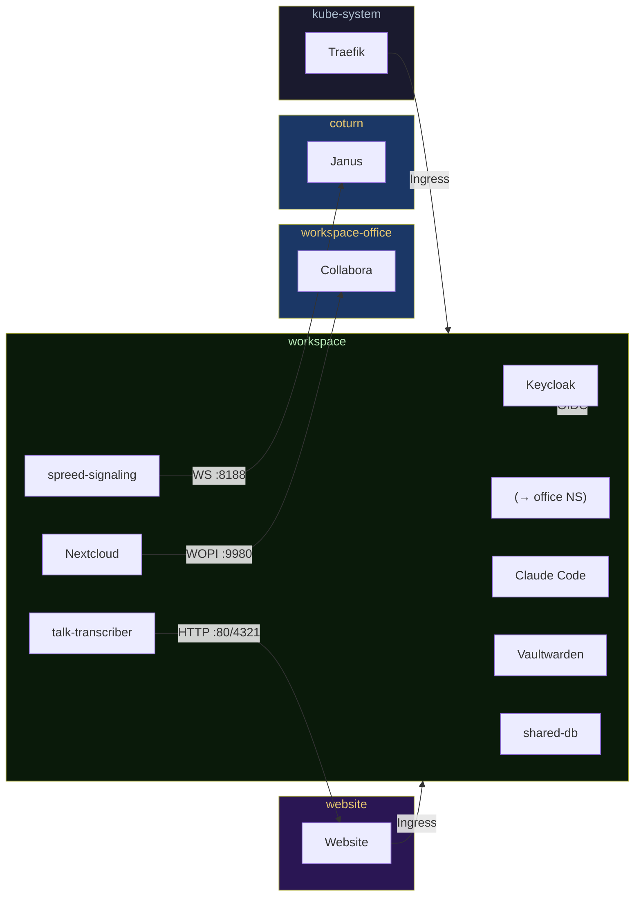
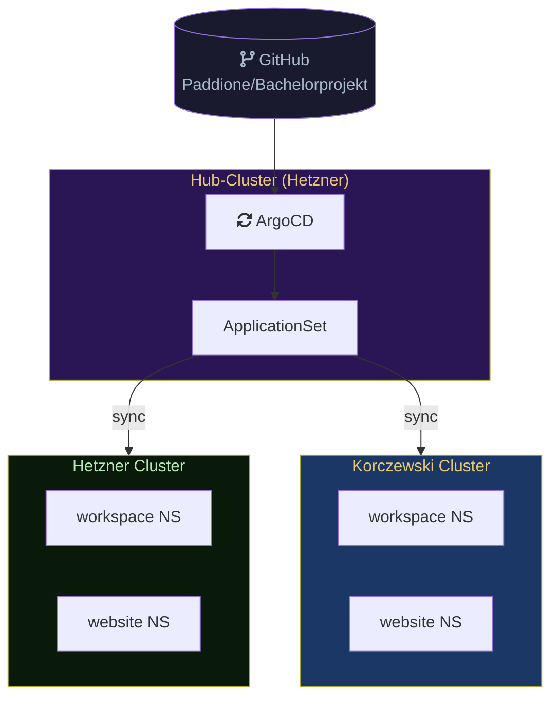
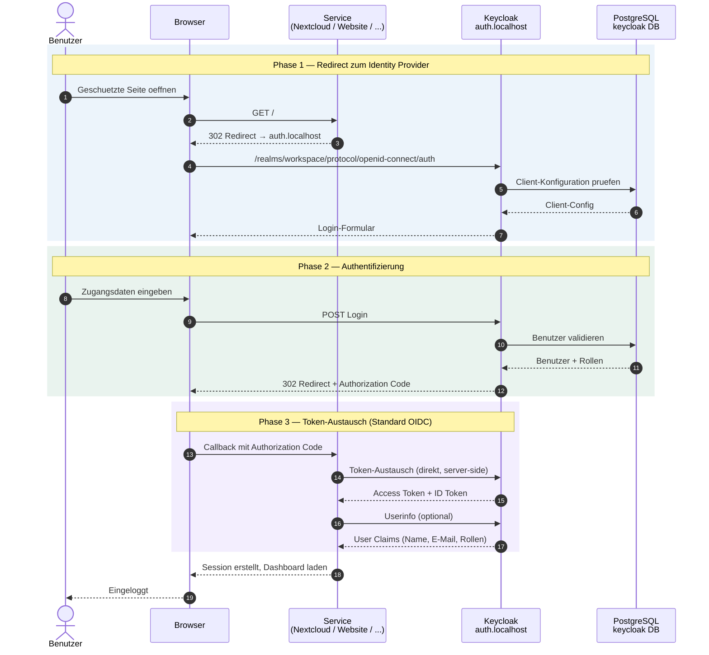
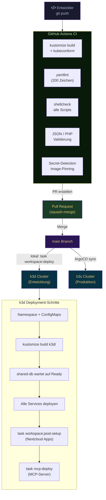

  🏗️
  

    
Systemarchitektur

    
Kubernetes-Cluster-Topologie, Service-Abhaengigkeiten, Netzwerkmodell und Infrastruktur-Design des Workspace MVP.

    

      Fuer Administratoren
      Kubernetes
      Mermaid-Diagramme
    

  

  <a href="#/" class="page-hero-back">← Uebersicht</a>

# Systemarchitektur

## Ueberblick

Workspace MVP ist eine Kubernetes-basierte Kollaborationsplattform fuer kleine Teams. Alle Services laufen als Kubernetes Deployments und werden mit Kustomize gebaut — `k3d/` ist das einzige Basis-Manifest-Verzeichnis. Lokal laeuft der Cluster in k3d (Docker-in-Docker), in Produktion auf k3s (Hetzner/Korczewski). Als Ingress Controller dient Traefik (k3s built-in), der alle eingehenden HTTP/HTTPS-Anfragen per Subdomain-Routing an die jeweiligen Services weiterleitet. Alle Nutzerdaten verbleiben vollstaendig on-premises (DSGVO by Design).

---

## Komponenten-Diagramm

> Die Service-Boxen sind klickbar und fuehren zur jeweiligen Dokumentationsseite.

---

## Namespaces

| Namespace | Services | Pod Security Standard |
|-----------|----------|-----------------------|
| `workspace` | Keycloak, Nextcloud, Collabora, Vaultwarden, Claude Code, Mailpit, Docs, Talk HPB, Whiteboard, Whisper, MCP-Server, shared-db | enforce: **baseline** / warn: restricted |
| `website` | Astro + Svelte Website (Messaging, Admin-Panel) | Standard |
| `workspace-office` | Collabora Online (eigener Namespace wegen privilegierten Containern) | Privileged |
| `coturn` | Janus Gateway, NATS, coturn (eigener Namespace, hostNetwork) | Privileged |
| `argocd` | ArgoCD GitOps Controller (Hub-Cluster, Produktion) | Standard |
| `cert-manager` | cert-manager, lego DNS-01 Webhook (Produktion, TLS) | Standard |
| `kube-system` | Traefik Ingress Controller (k3s built-in) | System |

Der `workspace`-Namespace hat Pod Security Standards konfiguriert:

- **enforce: baseline** -- Mindestanforderungen werden erzwungen (keine privilegierten Container, kein hostNetwork)
- **warn: restricted** -- Warnungen bei Verstoss gegen strengere Richtlinien (read-only Root-FS, non-root User)

Collabora und der coturn-Stack laufen in eigenen Namespaces, weil sie privilegierte Container oder `hostNetwork: true` benoetigen und nicht unter die `namespace: workspace`-Direktive von Kustomize fallen duerfen.

---

## Netzwerkarchitektur

### NetworkPolicy-Modell

Der `workspace`-Namespace setzt ein **Default-Deny-Modell** (Ingress und Egress) um. Jede Verbindung muss explizit erlaubt sein.

| Policy | Richtung | Erlaubtes |
|--------|----------|-----------|
| `default-deny-ingress` | Ingress | Alle eingehenden Verbindungen blockieren (Default) |
| `default-deny-egress` | Egress | Alle ausgehenden Verbindungen blockieren (Default) |
| `allow-dns-egress` | Egress | DNS (Port 53 UDP/TCP) zu `kube-system` |
| `allow-intra-namespace-egress` | Egress | Pod-zu-Pod innerhalb `workspace` |
| `allow-intra-namespace-ingress` | Ingress | Pod-zu-Pod innerhalb `workspace` |
| `allow-traefik-ingress` | Ingress | Traefik-Pod aus `kube-system` |
| `allow-traefik-egress` | Egress | Traefik-Pod aus `kube-system` (Port 8443/8000, fuer interne HTTPS-Calls) |
| `allow-internet-egress` | Egress | Internet (0.0.0.0/0 ausser RFC-1918) |
| `allow-website-ingress` | Ingress | Pods aus `website`/`korczewski-website` |
| `allow-collabora-egress` | Egress | Nextcloud → Collabora (Port 9980, `workspace-office` NS) |
| `allow-signaling-coturn-egress` | Egress | spreed-signaling → Janus (Port 8188, `coturn` NS + Node-IP) |
| `allow-transcriber-to-website-egress` | Egress | talk-transcriber → Website-Service (Port 80/4321) |
| `allow-mcp-external-egress` | Egress | mcp-github, mcp-stripe → externe HTTPS (Port 443) |

### Kommunikationsmatrix

---

## Ingress & Routing

Traefik ist der einzige Ingress Controller (k3s built-in, im `kube-system`-Namespace). Das Routing erfolgt ausschliesslich per **Subdomain (Host-Header)**. Alle Hostnamen sind zentral in `k3d/configmap-domains.yaml` definiert.

| Host | Service | Port |
|------|---------|------|
| `auth.localhost` | keycloak | 8080 |
| `files.localhost` | nextcloud | 80 |
| `office.localhost` | collabora | 9980 |
| `signaling.localhost` | spreed-signaling | 8080 |
| `meet.localhost` | spreed-signaling | 8080 |
| `ai.localhost` | claude-code | 8080 |
| `vault.localhost` | vaultwarden | 80 |
| `board.localhost` | whiteboard | 3002 |
| `mail.localhost` | mailpit | 8025 |
| `docs.localhost` | oauth2-proxy → docs | 80 |
| `web.localhost` | website | 4321 |

### Middlewares

In der Entwicklungsumgebung (`k3d/traefik-middlewares-dev.yaml`) ist eine einzige Middleware aktiv:

- **`basic-auth-internal`** -- HTTP Basic Auth fuer interne Dienste (Secret `traefik-basic-auth`)

In Produktion (`prod/traefik-middlewares.yaml`) kommen zusaetzlich hinzu:

- **Security-Header-Middleware** (HSTS, X-Frame-Options, CSP)
- **HTTPS-Redirect-Middleware** (HTTP → HTTPS)

---

## Datenbankmodell

Eine einzige PostgreSQL-16-Instanz (`shared-db`) bedient alle Services. Jeder Service hat eine isolierte Datenbank mit eigenem Datenbankbenutzer ohne Cross-DB-Berechtigungen.

| Datenbank | DB-User | Service | Besonderheiten |
|-----------|---------|---------|----------------|
| `keycloak` | `keycloak` | Keycloak | Realm-Config via ConfigMap importiert |
| `nextcloud` | `nextcloud` | Nextcloud | Datei-Metadaten, Kalender, Kontakte |
| `vaultwarden` | `vaultwarden` | Vaultwarden | Verschluesselte Vault-Items |
| `website` | `website` | Website (Astro) | Messaging, Meetings, Projekte, Admin-Config |
| `pentest` | `pentest` | Sicherheitstests (CTF) | Isolierte DB mit Pentest-Flag-Daten |

Init-Skripte in `shared-db` erstellen Datenbanken und User idempotent beim ersten Start und synchronisieren Passwoerter bei Neustarts aus den Kubernetes Secrets.

> Vollstaendige Tabellenstrukturen und ER-Diagramme sind in [Datenbankmodelle](database.md) dokumentiert.

---

## Konfigurationsarchitektur

### Zentrale Konfigurationspunkte

| Datei / Ressource | Inhalt | Gilt fuer |
|-------------------|--------|-----------|
| `k3d/configmap-domains.yaml` | Alle Hostnamen (KC, NC, CO, ...) | Alle Services (per ConfigMap-Ref) |
| `k3d/secrets.yaml` | Dev-Credentials (nur Entwicklung) | Lokales k3d |
| `k3d/realm-workspace-dev.json` | Keycloak Realm-Export | Keycloak-Import via Init-Container |
| `k3d/nextcloud-oidc-dev.php` | Nextcloud OIDC-Client-Config | Nextcloud |
| `.env` | `PROD_DOMAIN`, `BRAND_NAME`, `CONTACT_EMAIL` | envsubst bei Prod-Deployment |
| `prod/` | Kustomize-Overlays (TLS, Ressource-Limits, Replicas) | Produktion |
| `environments/` | Pro-Cluster-Variablen (Hetzner, Korczewski) | ArgoCD Multi-Cluster |

### Multi-Cluster mit ArgoCD

In Produktion verwaltet ArgoCD (Hub-Cluster auf Hetzner) die Deployments ueber mehrere Cluster. Ein ApplicationSet synchronisiert den Git-Zustand auf alle registrierten Ziel-Cluster. Cluster-spezifische Einstellungen (Domain, Branding) werden als Annotationen auf ArgoCD Cluster-Secrets gespeichert.

---

## SSO / OIDC-Flow

Keycloak ist der zentrale Identity Provider. Alle Services (Nextcloud, Vaultwarden, Claude Code, Website, Docs) authentifizieren ueber OpenID Connect (Authorization Code Flow). Docs wird zusaetzlich durch oauth2-proxy vorgeschaltet.

**Registrierte OIDC-Clients im Realm `workspace`:**

| Client | Service | Besonderheiten |
|--------|---------|----------------|
| `nextcloud` | Nextcloud | Groups-Claim fuer NC-Gruppen-Sync |
| `claude-code` | Claude Code | PKCE |
| `vaultwarden` | Vaultwarden | SSO-Login |
| `website` | Website (Astro) | PKCE, Messaging-Berechtigungen |
| `docs` | Docs (via oauth2-proxy) | Nur lesender Zugriff |

---

## Deployment-Pipeline

**CI-Pruefungen (`.github/workflows/ci.yml`) bei jedem Pull Request:**

- **Manifest-Validierung:** `kustomize build` + `kubeconform` (Kubernetes 1.31.0)
- **YAML-Linting:** `yamllint` (max. 200 Zeichen pro Zeile)
- **Shell-Linting:** `shellcheck` auf alle `.sh`-Scripts
- **Config-Validierung:** JSON (Realm-Export), PHP (OIDC-Config)
- **Sicherheitspruefungen:** Secret-Detection, Image-Pinning-Check

---

## Persistenter Speicher

| PVC | Groesse | Service |
|-----|---------|---------|
| `shared-db-pvc` | 25 Gi | PostgreSQL 16 |
| `nextcloud-app` | 2 Gi | Nextcloud Applikation |
| `nextcloud-data` | 50 Gi | Nextcloud Nutzerdaten |
| `vaultwarden-data` | 5 Gi | Vaultwarden Vault |
| `backup-pvc` | 1 Gi | Verschluesselte Datenbank-Backups |

### Backup-Strategie

- **Zeitplan:** Taeglich um 02:00 UTC (Kubernetes CronJob)
- **Scope:** PostgreSQL-Datenbanken (keycloak, nextcloud, website)
- **Verschluesselung:** AES-256-CBC mit PBKDF2 (openssl)
- **Rotation:** 30-Tage-Aufbewahrung, aeltere Backups werden automatisch geloescht
- **Speicher:** 1 Gi PVC (`backup-pvc`)
