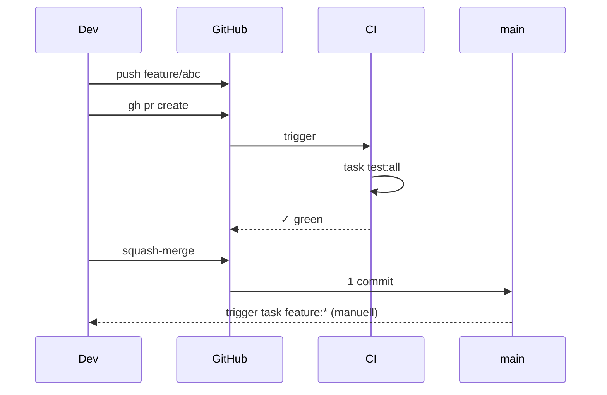

<div class="page-hero">
  <span class="page-hero-icon">🤝</span>
  <div class="page-hero-body">
    <div class="page-hero-eyebrow">Entwickler · Workflow</div>
    <div class="page-hero-title">Beitragen zum Workspace</div>
    <p class="page-hero-desc">Branch-Strategie, PR-Workflow, CI-Anforderungen und Merge-Regeln.</p>
    <div class="page-hero-meta">
      <span class="page-hero-tag">GitHub Actions</span>
      <span class="page-hero-tag">squash-merge</span>
    </div>
  </div>
  <a href="#/" class="page-hero-back">← Übersicht</a>
</div>

# Beitragen zum Workspace MVP



<div class="phase-card">
  <div class="phase-header">
    <div class="phase-num phase-num-brass">1</div>
    <span class="phase-title">Branch anlegen</span>
    <span class="phase-desc">Workflow</span>
  </div>
  <div class="phase-body">

Alle Änderungen gehen durch Pull Requests. Direkte Pushes auf `main` sind nicht erlaubt.

```
main
 └── feature/mein-feature   (git checkout -b)
      └── entwickeln + testen
           └── task workspace:validate
                └── git push → gh pr create
                     └── CI-Pipeline
                          └── grün → Squash & Merge → main
```

| Präfix | Zweck |
|--------|-------|
| `feature/*` | Neue Funktionalität |
| `fix/*` | Fehlerbehebungen |
| `chore/*` | Refactoring, Abhängigkeiten, CI/CD |

  </div>
</div>

<div class="phase-card">
  <div class="phase-header">
    <div class="phase-num phase-num-sage">2</div>
    <span class="phase-title">Lokal entwickeln & testen</span>
    <span class="phase-desc">Entwicklung</span>
  </div>
  <div class="phase-body">

```bash
task cluster:create     # k3d-Cluster erstellen
task workspace:deploy   # alle Services deployen
task workspace:status   # Pod-Gesundheit prüfen
```

Alternativ als Einzeiler:

```bash
task workspace:up   # Cluster + MVP + MCP in einem Schritt
```

Tägliche Befehle:

```bash
task workspace:status                # alles prüfen
task workspace:logs -- keycloak      # Service-Logs ansehen
task workspace:restart -- keycloak   # Service neu starten
task workspace:psql -- website       # psql-Shell zur Datenbank
task workspace:port-forward          # shared-db auf localhost:5432
```

  </div>
</div>

<div class="phase-card">
  <div class="phase-header">
    <div class="phase-num phase-num-blue">3</div>
    <span class="phase-title">CI muss grün sein</span>
    <span class="phase-desc">Vor dem Merge</span>
  </div>
  <div class="phase-body">

```bash
task workspace:validate   # K8s-Manifeste per Dry-Run validieren
shellcheck scripts/*.sh   # Shell-Skripte linten (falls geändert)
```

Die GitHub Actions-Pipeline (`.github/workflows/ci.yml`) prüft:

| Prüfung | Werkzeug |
|---------|---------|
| YAML-Linting | `yamllint` (200-Zeichen-Limit) |
| Kubernetes-Manifest-Validierung | `kustomize build` + `kubeconform` (K8s 1.31.0) |
| Shell-Linting | `shellcheck` auf alle Skripte |
| Konfigurations-Validierung | Realm-JSON, PHP-OIDC-Config |
| Security-Scan | Image-Pinning, Secret-Erkennung |

  </div>
</div>

<div class="phase-card">
  <div class="phase-header">
    <div class="phase-num phase-num-brass">4</div>
    <span class="phase-title">PR erstellen & squash-mergen</span>
    <span class="phase-desc">Merge</span>
  </div>
  <div class="phase-body">

```bash
git add k3d/mein-manifest.yaml
git commit -m "fix: kurze Beschreibung der Änderung"

gh pr create \
  --title "fix: kurze Beschreibung" \
  --body "## Änderung
- Was wurde geändert
- Warum

## Testen
- [ ] task workspace:validate
- [ ] ./tests/runner.sh local <TEST-ID>"
```

PRs werden **squash-gemergt** — ein Commit pro Feature auf `main`.

  </div>
</div>

---

## CI-Pipeline

Die GitHub Actions-Pipeline (`.github/workflows/ci.yml`) läuft bei jedem PR und prüft:

| Prüfung | Werkzeug |
|---------|---------|
| YAML-Linting | `yamllint` (200-Zeichen-Limit) |
| Kubernetes-Manifest-Validierung | `kustomize build` + `kubeconform` (K8s 1.31.0) |
| Shell-Linting | `shellcheck` auf alle Skripte |
| Konfigurations-Validierung | Realm-JSON, PHP-OIDC-Config |
| Security-Scan | Image-Pinning, Secret-Erkennung |

Die CI muss grün sein, bevor ein Merge möglich ist.

---

## Monorepo-Regeln

1. `k3d/k3s` ist der einzige Deployment-Pfad — kein docker-compose.
2. Alle Kubernetes-Manifeste liegen in `k3d/`.
3. Domains sind zentral in `k3d/configmap-domains.yaml` definiert. Keine hartkodierten Hostnamen.
4. Secrets bleiben in `k3d/secrets.yaml` (nur Dev-Werte). Niemals echte Credentials committen.
5. Nach Manifest-Änderungen testen: `./tests/runner.sh local <TEST-ID>`.
6. Vor dem Commit validieren: `task workspace:validate`.

---

## PR erstellen

```bash
# Änderungen stagen und committen
git add k3d/mein-manifest.yaml
git commit -m "fix: kurze Beschreibung der Änderung"

# PR erstellen
gh pr create \
  --title "fix: kurze Beschreibung" \
  --body "## Änderung
- Was wurde geändert
- Warum

## Testen
- [ ] task workspace:validate
- [ ] ./tests/runner.sh local <TEST-ID>"
```

---

## Merge

- Merge-Methode: **Squash-and-Merge** für eine saubere `main`-History
- CI muss grün sein
- Kein Force-Push auf `main`
- Nach dem Merge: Branch löschen

---

## Tests ausführen

```bash
./tests/runner.sh local              # Vollständige Testsuite gegen k3d
./tests/runner.sh local SA-08        # Einzelner Test
./tests/runner.sh local --verbose    # Ausführliche Ausgabe
./tests/runner.sh report             # Markdown-Report generieren
```

Test-IDs: `FA-01`–`FA-40` (funktional, mit Lücken), `SA-01`–`SA-10` (Sicherheit, mit Lücken), `NFA-01`–`NFA-09` (nicht-funktional), `AK-03`, `AK-04` (Abnahme). Lücken in der Nummerierung (FA-01..08, FA-22, FA-30, FA-38, SA-06, SA-09) spiegeln entfernte Services (Mattermost, InvoiceNinja) wider. Vollständige Liste: [Testframework](tests.md).

Weitere Details: [Testframework](tests.md)
