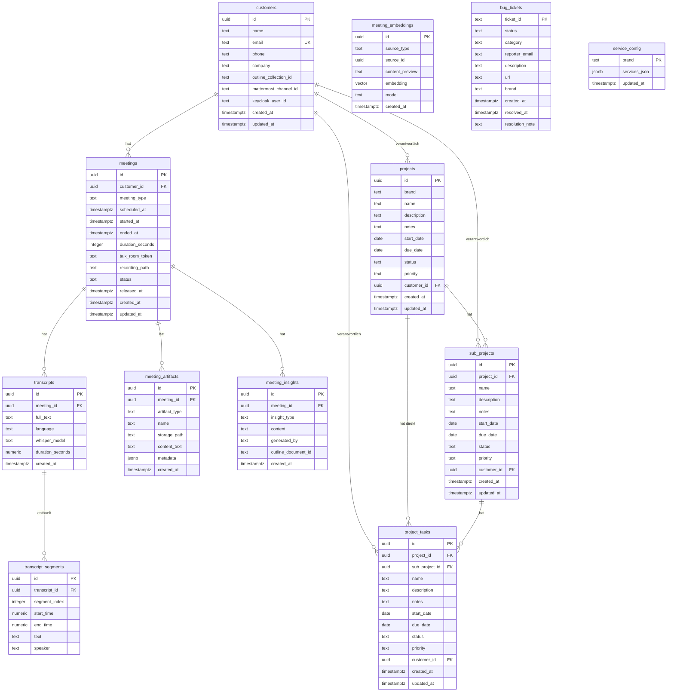
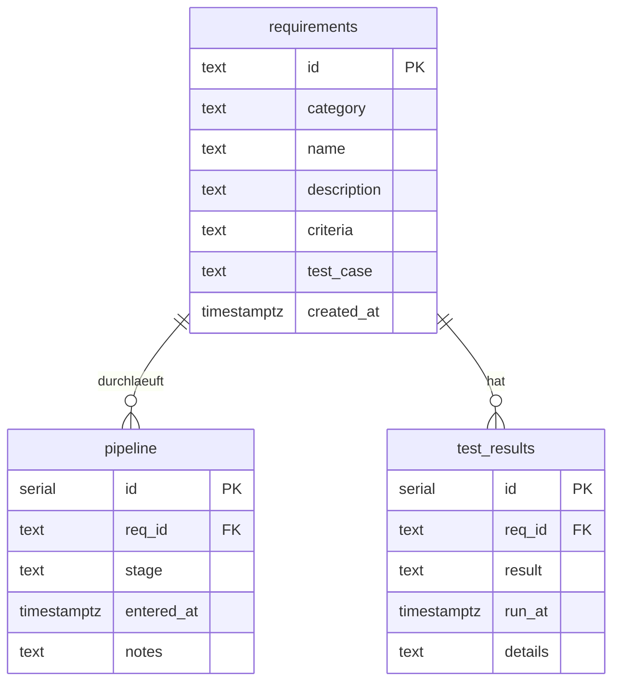

# Datenbankmodelle

Alle im Repository definierten Schemas laufen auf `shared-db` (PostgreSQL 16).
Die Tabellenstrukturen werden durch Kubernetes-Init-Skripte idempotent angelegt —
`k3d/website-schema.yaml` fuer die `website`-Datenbank,
`deploy/tracking/init.sql` fuer das `bachelorprojekt`-Schema.

---

## Website-Datenbank (`website`)

Speichert die Meeting Knowledge Pipeline: Kunden, Meeting-Verlauf, Transkripte,
Artefakte, KI-Insights, Vektor-Embeddings sowie Bug-Tickets, Service-Konfigurationen
und das Projektmanagement.

> **`meeting_embeddings`** referenziert Zeilen aus `transcripts`, `transcript_segments`,
> `meeting_artifacts` oder `meeting_insights` ueber das Tupel `(source_type, source_id)` —
> eine polymorphe Relation ohne Datenbank-FK. `source_type` nimmt einen der Werte
> `'transcript'`, `'segment'`, `'artifact'` oder `'insight'` an.

### Tabellenbeschreibungen

| Tabelle | Beschreibung |
|---------|--------------|
| `customers` | Kunden/Coachees — Referenzpunkte zu Keycloak, Mattermost-Channel und Outline-Collection |
| `meetings` | Meeting-Verlauf mit Status-Lifecycle: `scheduled → active → ended → transcribed → finalized` |
| `transcripts` | Volltext-Transkripte aus Whisper (faster-whisper-medium) |
| `transcript_segments` | Zeitgestempelte Segmente eines Transkripts mit optionalem Speaker-Label |
| `meeting_artifacts` | Artefakte (Whiteboard-Export, Datei, Screenshot, Dokument) je Meeting |
| `meeting_insights` | KI-generierte Einsichten: Zusammenfassung, Aktionspunkte, Themen, Sentiment, Coaching-Notizen |
| `meeting_embeddings` | pgvector-Einbettungen (BAAI/bge-base-en-v1.5, 768 Dim.) fuer semantische Suche |
| `bug_tickets` | Bug-Meldungen vom Website-Formular mit Status `open → resolved → archived` |
| `service_config` | Angebots-Overrides je Brand (JSON) fuer das Admin-Panel |
| `projects` | Kundenprojekte mit Status-Lifecycle `entwurf → wartend → geplant → aktiv → erledigt → archiviert` |
| `sub_projects` | Teilprojekte innerhalb eines Projekts (eine Ebene tief) mit identischen Attributen |
| `project_tasks` | Aufgaben in Projekten oder Teilprojekten — `sub_project_id` IS NULL bedeutet direkte Projektzuordnung |

---

## Bachelorprojekt-Tracking-Schema (`bachelorprojekt`)

Verfolgt den Fortschritt aller Anforderungen durch den Entwicklungsprozess.
Angelegt in der `postgres`-Standarddatenbank auf `shared-db`.

### Views

| View | Beschreibung |
|------|--------------|
| `v_pipeline_status` | Aktueller Stage je Anforderung (neuester `pipeline`-Eintrag) |
| `v_progress_summary` | Anzahl Anforderungen je Stage |
| `v_open_issues` | Alle Anforderungen ausser `archive` |
| `v_latest_tests` | Letztes Testergebnis je Anforderung |
