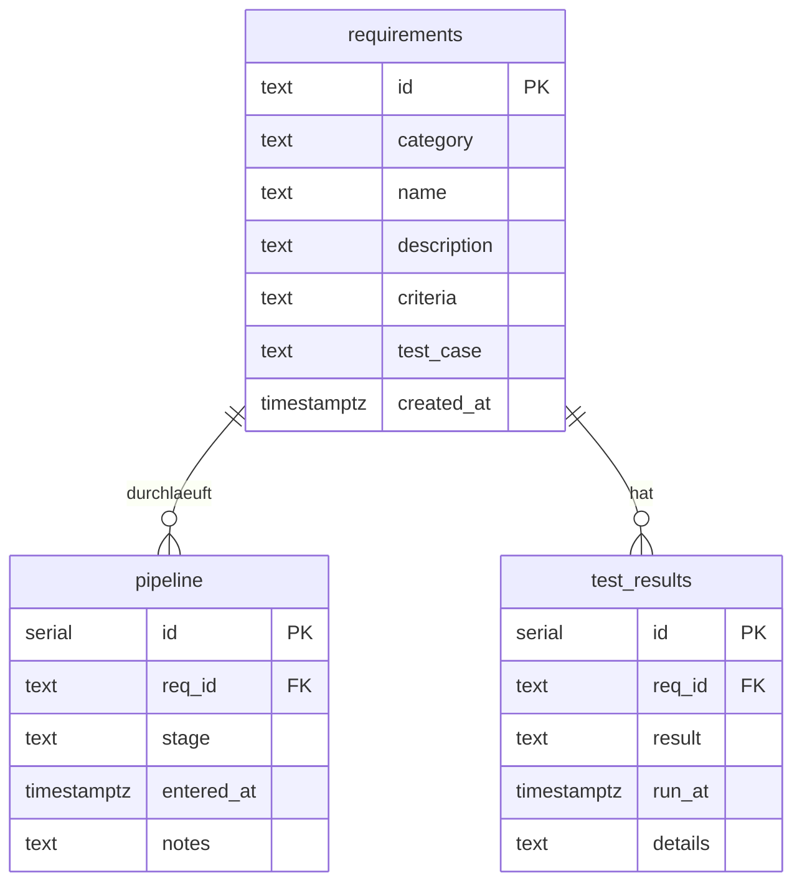

# Datenbank

> Diese Seite wurde zu **[PostgreSQL (shared-db)](shared-db.md)** verschoben.

**Datenbankmodelle und Schemas** finden Sie in den Abschnitten unten.

---

# Datenbankmodelle

Alle im Repository definierten Schemas laufen auf `shared-db` (PostgreSQL 16).
Die Tabellenstrukturen werden durch Kubernetes-Init-Skripte idempotent angelegt —
`k3d/website-schema.yaml` fuer die `website`-Datenbank,
`deploy/tracking/init.sql` fuer das `bachelorprojekt`-Schema.

---

## Website-Datenbank (`website`)

Speichert die Meeting Knowledge Pipeline, das Messaging-System sowie Website-Admin-Einstellungen: Kunden, Meeting-Verlauf, Transkripte, Artefakte, KI-Insights, Chat-Raeume, Nachrichten, Bug-Tickets (Schema `bugs`), Dokumente, Brett-Snapshots, Umfragen, Service-Konfigurationen und Projektmanagement.

```mermaid
erDiagram
    customers {
        uuid        id                  PK
        text        name
        text        email               UK
        text        phone
        text        company
        text        keycloak_user_id
        text        customer_number     UK
        boolean     is_admin
        text        admin_number        UK
        boolean     enrollment_declined
        timestamptz created_at
        timestamptz updated_at
    }

    meetings {
        uuid        id                   PK
        uuid        customer_id          FK
        text        meeting_type
        timestamptz scheduled_at
        timestamptz started_at
        timestamptz ended_at
        integer     duration_seconds
        text        talk_room_token
        text        recording_path
        text        status
        timestamptz brett_link_posted_at
        timestamptz created_at
    }

    transcripts {
        uuid        id               PK
        uuid        meeting_id       FK
        text        full_text
        text        language
        text        whisper_model
        numeric     duration_seconds
        timestamptz created_at
    }

    transcript_segments {
        uuid    id              PK
        uuid    transcript_id   FK
        integer segment_index
        numeric start_time
        numeric end_time
        text    text
        text    speaker
    }

    meeting_artifacts {
        uuid        id             PK
        uuid        meeting_id     FK
        text        artifact_type
        text        name
        text        storage_path
        text        content_text
        jsonb       metadata
        timestamptz created_at
    }

    meeting_insights {
        uuid        id           PK
        uuid        meeting_id   FK
        text        insight_type
        text        content
        text        generated_by
        timestamptz created_at
    }

    bugs_bug_tickets {
        text        ticket_id           PK
        text        status
        text        category
        text        reporter_email
        text        description
        text        url
        text        brand
        timestamptz created_at
        timestamptz resolved_at
        text        resolution_note
    }

    inbox_items {
        serial      id              PK
        text        type
        text        status
        text        reference_id
        text        reference_table
        text        bug_ticket_id   FK
        jsonb       payload
        timestamptz created_at
        timestamptz actioned_at
        text        actioned_by
    }

    message_threads {
        serial      id              PK
        uuid        customer_id     FK
        text        subject
        timestamptz created_at
        timestamptz last_message_at
    }

    messages {
        serial      id                   PK
        int         thread_id            FK
        text        sender_id
        text        sender_role
        uuid        sender_customer_id   FK
        text        body
        timestamptz created_at
        timestamptz read_at
        timestamptz notification_sent_at
    }

    chat_rooms {
        serial      id                 PK
        text        name
        text        created_by
        timestamptz created_at
        timestamptz archived_at
        boolean     is_direct
        uuid        direct_customer_id FK
    }

    chat_room_members {
        int         room_id     FK
        uuid        customer_id FK
        timestamptz joined_at
    }

    chat_messages {
        serial      id                   PK
        int         room_id              FK
        text        sender_id
        text        sender_name
        uuid        sender_customer_id   FK
        text        body
        timestamptz created_at
        timestamptz notification_sent_at
    }

    chat_message_reads {
        int         message_id  FK
        uuid        customer_id FK
        timestamptz read_at
    }

    document_templates {
        uuid        id                   PK
        text        title
        text        html_body
        integer     docuseal_template_id
        text        stand_date
        timestamptz created_at
        timestamptz updated_at
    }

    document_assignments {
        uuid        id                       PK
        uuid        customer_id              FK
        uuid        template_id              FK
        text        docuseal_submission_slug
        text        docuseal_embed_src
        integer     docuseal_template_id
        text        status
        timestamptz assigned_at
        timestamptz signed_at
    }

    brett_rooms {
        text        room_token       PK
        jsonb       state
        timestamptz last_modified_at
    }

    brett_snapshots {
        uuid        id          PK
        text        room_token
        uuid        customer_id FK
        text        name
        jsonb       state
        timestamptz created_at
    }

    polls {
        uuid        id          PK
        text        question
        text        kind
        text        options
        text        status
        text        room_tokens
        timestamptz created_at
        timestamptz locked_at
    }

    poll_answers {
        uuid        id           PK
        uuid        poll_id      FK
        text        answer
        timestamptz submitted_at
    }

    service_config {
        text        brand           PK
        jsonb       services_json
        timestamptz updated_at
    }

    leistungen_config {
        text        brand           PK
        jsonb       categories_json
        timestamptz updated_at
    }

    site_settings {
        text        brand    PK
        text        key      PK
        text        value
        timestamptz updated_at
    }

    legal_pages {
        text        brand        PK
        text        page_key     PK
        text        content_html
        timestamptz updated_at
    }

    referenzen_config {
        text        brand      PK
        jsonb       items_json
        timestamptz updated_at
    }

    projects {
        uuid        id          PK
        text        brand
        text        name
        text        description
        text        notes
        date        start_date
        date        due_date
        text        status
        text        priority
        uuid        customer_id FK
        timestamptz created_at
        timestamptz updated_at
    }

    sub_projects {
        uuid        id          PK
        uuid        project_id  FK
        text        name
        text        description
        text        notes
        date        start_date
        date        due_date
        text        status
        text        priority
        uuid        customer_id FK
        timestamptz created_at
        timestamptz updated_at
    }

    project_tasks {
        uuid        id             PK
        uuid        project_id     FK
        uuid        sub_project_id FK
        text        name
        text        description
        text        notes
        date        start_date
        date        due_date
        text        status
        text        priority
        uuid        customer_id    FK
        timestamptz created_at
        timestamptz updated_at
    }

    staleness_reports {
        serial      id          PK
        timestamptz created_at
        jsonb       report_json
        text        summary
        integer     issue_count
    }

    customers         ||--o{ meetings              : "hat"
    meetings          ||--o{ transcripts           : "hat"
    transcripts       ||--o{ transcript_segments   : "enthaelt"
    meetings          ||--o{ meeting_artifacts     : "hat"
    meetings          ||--o{ meeting_insights      : "hat"
    customers         ||--o{ projects              : "hat"
    projects          ||--o{ sub_projects          : "hat"
    projects          ||--o{ project_tasks         : "hat"
    sub_projects      ||--o{ project_tasks         : "hat"
    customers         ||--o{ message_threads       : "hat"
    message_threads   ||--o{ messages              : "enthaelt"
    chat_rooms        ||--o{ chat_messages         : "enthaelt"
    chat_rooms        ||--o{ chat_room_members     : "hat"
    customers         ||--o{ chat_room_members     : "ist in"
    chat_messages     ||--o{ chat_message_reads    : "gelesen von"
    customers         ||--o{ chat_message_reads    : "liest"
    customers         ||--o{ document_assignments  : "hat"
    document_templates ||--o{ document_assignments : "zugewiesen"
    customers         ||--o{ brett_snapshots       : "hat"
    polls             ||--o{ poll_answers          : "hat"
    bugs_bug_tickets  ||--o{ inbox_items           : "erstellt"
```

> `bugs_bug_tickets` entspricht der Tabelle `bugs.bug_tickets` im Schema `bugs`. `polls.options` und `polls.room_tokens` sind PostgreSQL-Arrays (`text[]`).

### Tabellenbeschreibungen

| Tabelle | Beschreibung |
|---------|--------------|
| `customers` | Kunden/Coachees — Referenzpunkt zu Keycloak (`keycloak_user_id`); `customer_number` (M0020+), `is_admin`/`admin_number` fuer Admin-Accounts |
| `meetings` | Meeting-Verlauf mit Status-Lifecycle: `scheduled → active → ended → transcribed → finalized`; `brett_link_posted_at` verhindert Doppel-Posts |
| `transcripts` | Volltext-Transkripte aus Whisper (faster-whisper-medium) |
| `transcript_segments` | Zeitgestempelte Segmente eines Transkripts mit optionalem Speaker-Label |
| `meeting_artifacts` | Artefakte (Whiteboard-Export, Datei, Screenshot, Dokument) je Meeting |
| `meeting_insights` | KI-generierte Einsichten: Zusammenfassung, Aktionspunkte, Themen, Sentiment, Coaching-Notizen |
| `bugs.bug_tickets` | Bug-Meldungen vom Website-Formular mit Status `open → resolved → archived`; eigenes Schema `bugs` |
| `inbox_items` | Eingehende Ereignisse (Registrierung, Buchung, Kontakt, Bug, Meeting-Finalize, Nachricht) mit `pending → actioned → archived` |
| `message_threads` | Direkt-Nachrichtenthreads zwischen Kunden und Admins; `last_message_at` fuer Sortierung |
| `messages` | Nachrichten innerhalb eines Threads; `sender_role` unterscheidet `admin`/`user` |
| `chat_rooms` | Themenbasierte Chat-Raeume; `is_direct` fuer 1:1-Raeume; `archived_at` fuer Archivierung |
| `chat_room_members` | Junction-Tabelle: welche Kunden sind in welchem Raum |
| `chat_messages` | Nachrichten in einem Chat-Raum mit `sender_name` fuer Anzeige |
| `chat_message_reads` | Read-Receipts: welcher Kunde hat welche Nachricht gelesen |
| `document_templates` | Vertragsvorlagen (HTML + optionaler DocuSeal-Template-Link); `stand_date` fuer Versionsstand |
| `document_assignments` | Zuweisung einer Vorlage an einen Kunden mit DocuSeal-Signierungsstatus |
| `brett_rooms` | Live-JSONB-Zustand des Systemischen Bretts je Talk-Raum (ueberschrieben bei Figurenbewegungen) |
| `brett_snapshots` | Benannte, unveraenderliche Brett-Snapshots (manuell oder automatisch je Meeting) |
| `polls` | Live-Umfragen in Talk-Raeumen; `kind` ist `multiple_choice` oder `text`; nur eine offene Umfrage gleichzeitig |
| `poll_answers` | Eingereichte Antworten zu einer Umfrage (anonym, max. 1000 Zeichen) |
| `service_config` | Angebots-Overrides je Brand (JSON) fuer das Admin-Panel |
| `leistungen_config` | Leistungskategorien-Overrides je Brand (Preistabelle) fuer das Admin-Panel |
| `site_settings` | Key/Value-Store fuer Website-Einstellungen je Brand (z.B. Hero-Text, Kontaktdaten) |
| `legal_pages` | Admin-editierbare Rechtstexte (AGB, Datenschutz, Impressum) je Brand als HTML |
| `referenzen_config` | Referenz-/Kundenlisten je Brand fuer den Referenzen-Bereich der Website |
| `projects` | Kundenprojekte mit Status-Lifecycle `entwurf → wartend → geplant → aktiv → erledigt → archiviert` |
| `sub_projects` | Teilprojekte innerhalb eines Projekts (eine Ebene tief) |
| `project_tasks` | Aufgaben in Projekten oder Teilprojekten — `sub_project_id` IS NULL bedeutet direkte Projektzuordnung |
| `staleness_reports` | Periodische Berichte ueber veraltete Daten (stale meetings, ungelesene Nachrichten etc.) |

---

## Bachelorprojekt-Tracking-Schema (`bachelorprojekt`)

Verfolgt den Fortschritt aller Anforderungen durch den Entwicklungsprozess.
Angelegt in der `postgres`-Standarddatenbank auf `shared-db`.

### Views

| View | Beschreibung |
|------|--------------|
| `v_pipeline_status` | Aktueller Stage je Anforderung (neuester `pipeline`-Eintrag) |
| `v_progress_summary` | Anzahl Anforderungen je Stage |
| `v_open_issues` | Alle Anforderungen ausser `archive` |
| `v_latest_tests` | Letztes Testergebnis je Anforderung |
