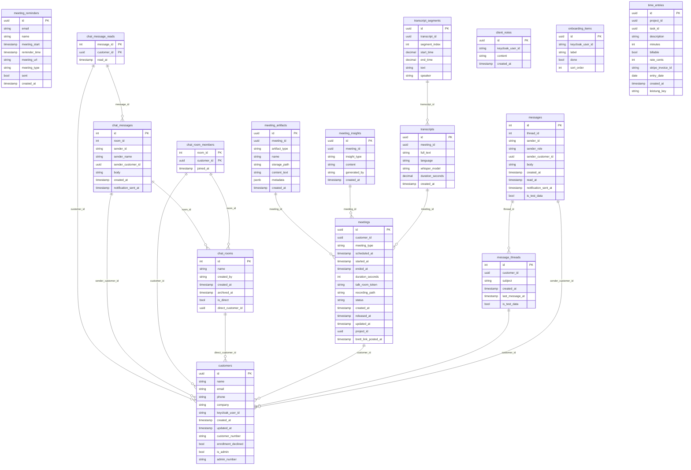
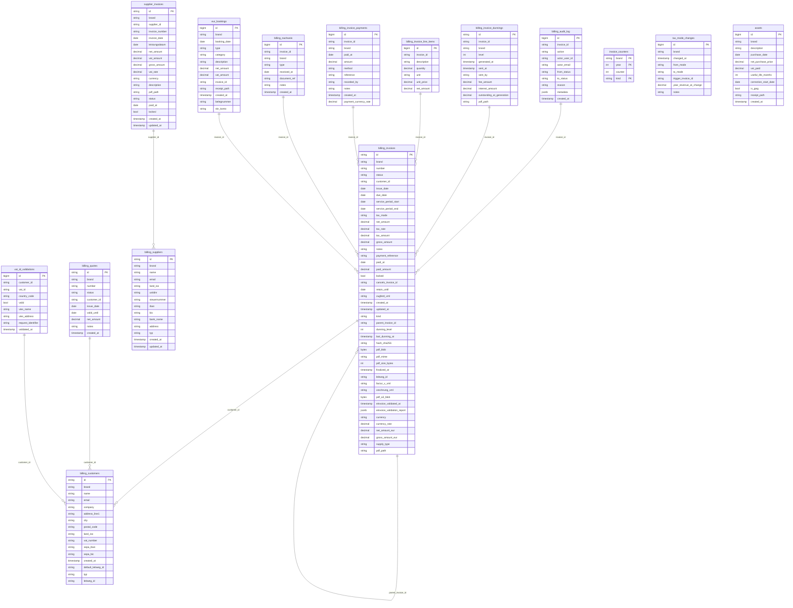
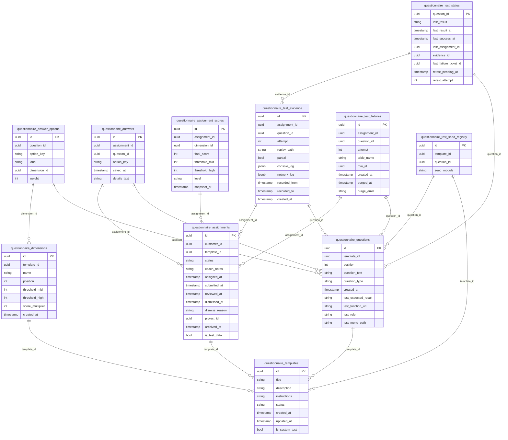
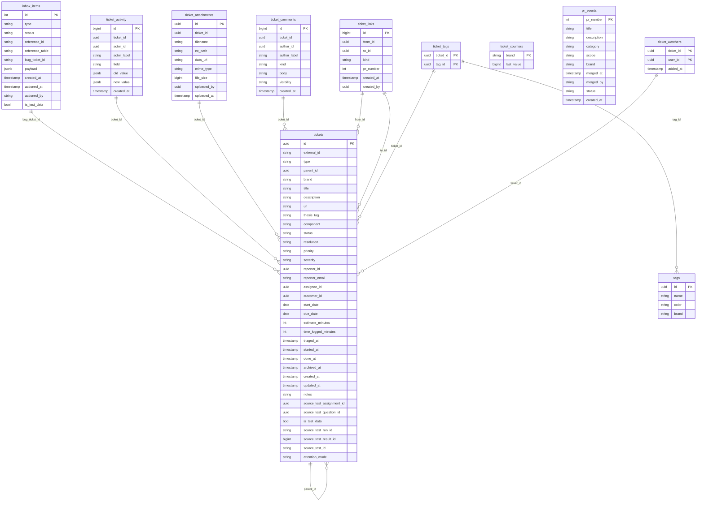
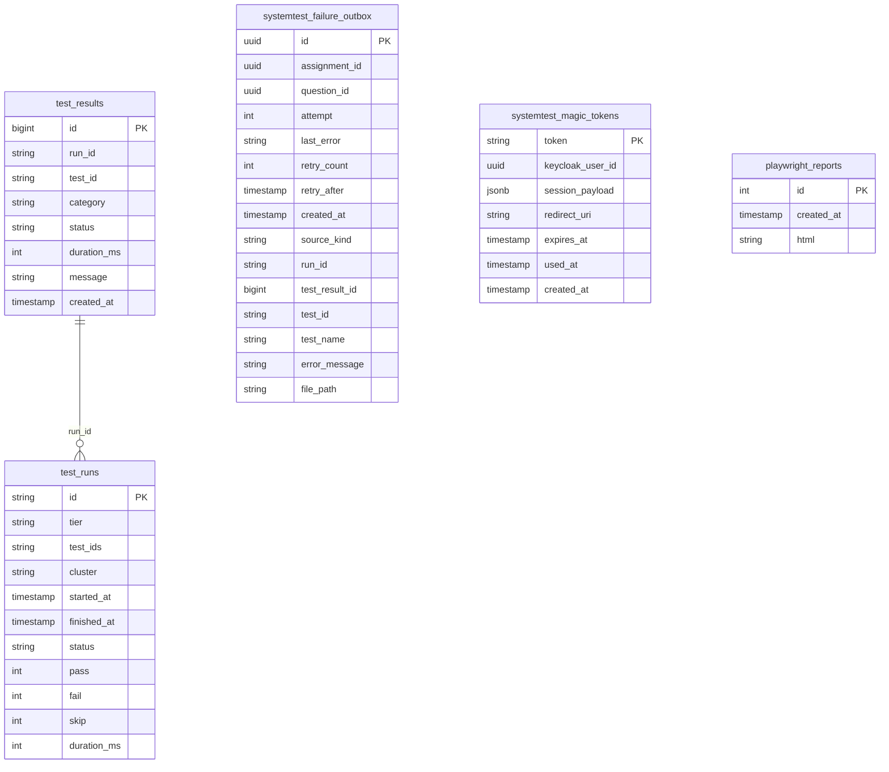
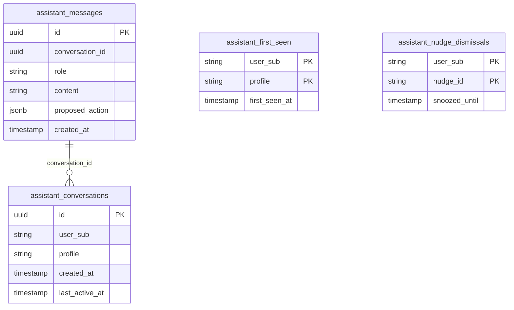
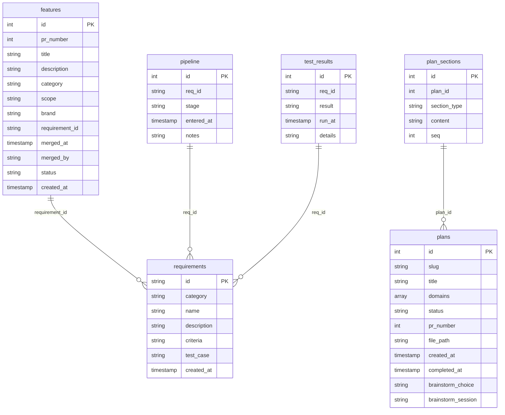

```mermaid
erDiagram
  site_settings {
    string brand PK
    string key PK
    string value
    timestamp updated_at
  }
  legal_pages {
    string brand PK
    string page_key PK
    string content_html
    timestamp updated_at
  }
  leistungen_config {
    string brand PK
    jsonb categories_json
    timestamp updated_at
  }
  referenzen_config {
    string brand PK
    jsonb items_json
    timestamp updated_at
  }
  service_config {
    string brand PK
    jsonb services_json
    timestamp updated_at
  }
  newsletter_subscribers {
    uuid id PK
    string email
    string status
    string confirm_token
    timestamp token_expires_at
    string unsubscribe_token
    string source
    timestamp confirmed_at
    timestamp created_at
  }
  newsletter_campaigns {
    uuid id PK
    string subject
    string html_body
    string status
    timestamp sent_at
    int recipient_count
    timestamp created_at
    timestamp updated_at
  }
  newsletter_send_log {
    uuid id PK
    uuid campaign_id
    uuid subscriber_id
    timestamp sent_at
    string status
  }
  website_custom_sections {
    uuid id PK
    string slug
    string title
    int sort_order
    jsonb fields
    jsonb content
    timestamp created_at
    timestamp updated_at
  }
  admin_shortcuts {
    uuid id PK
    string url
    string label
    int sort_order
    timestamp created_at
  }
  free_time_windows {
    string id PK
    string brand
    date date
    time win_start
    time win_end
    timestamp created_at
  }
  web_sessions {
    string id PK
    jsonb data
    timestamp expires_at
    timestamp created_at
  }
  polls {
    uuid id PK
    string question
    string kind
    array options
    string status
    array room_tokens
    timestamp created_at
    timestamp locked_at
  }
  poll_answers {
    uuid id PK
    uuid poll_id
    string answer
    timestamp submitted_at
  }
  brett_rooms {
    string room_token PK
    jsonb state
    timestamp last_modified_at
  }
  brett_snapshots {
    uuid id PK
    string room_token
    uuid customer_id
    string name
    jsonb state
    timestamp created_at
  }
  newsletter_send_log ||--o{ newsletter_campaigns : "campaign_id"
  newsletter_send_log ||--o{ newsletter_subscribers : "subscriber_id"
  poll_answers ||--o{ polls : "poll_id"
```

# Datamodel × Workflow

> Generated by `task datamodel:build`. Re-run after schema or workflow-map changes.

## Lifecycle
<svg viewBox="0 0 960 420" class="hero-svg" xmlns="http://www.w3.org/2000/svg" aria-label="Lifecycle pipeline">
<rect x="0" y="16" width="240" height="200" class="lane" data-family="dev-flow" style="fill:#5b9e6a1A;stroke:#5b9e6a55"/>
<text x="12" y="34" class="lane-label" style="fill:#5b9e6a;font-weight:600">Dev-Flow Skills</text>
<rect x="240" y="16" width="240" height="200" class="lane" data-family="agents" style="fill:#6b82a81A;stroke:#6b82a855"/>
<text x="252" y="34" class="lane-label" style="fill:#6b82a8;font-weight:600">Sub-Agents</text>
<rect x="480" y="16" width="240" height="200" class="lane" data-family="ci" style="fill:#c9a84c1A;stroke:#c9a84c55"/>
<text x="492" y="34" class="lane-label" style="fill:#c9a84c;font-weight:600">CI/CD Pipeline</text>
<rect x="720" y="16" width="240" height="200" class="lane" data-family="app" style="fill:#a87bc41A;stroke:#a87bc455"/>
<text x="732" y="34" class="lane-label" style="fill:#a87bc4;font-weight:600">App Workflows</text>
<rect x="16" y="48" width="208" height="32" rx="4" class="step-rect" data-step="brainstorming" data-family="dev-flow"/>
<text x="120" y="69" text-anchor="middle" class="step-label">brainstorming skill</text>
<rect x="16" y="88" width="208" height="32" rx="4" class="step-rect" data-step="writing-plans" data-family="dev-flow"/>
<text x="120" y="109" text-anchor="middle" class="step-label">writing-plans skill</text>
<rect x="16" y="128" width="208" height="32" rx="4" class="step-rect" data-step="using-git-worktrees" data-family="dev-flow"/>
<text x="120" y="149" text-anchor="middle" class="step-label">using-git-worktrees</text>
<rect x="16" y="168" width="208" height="32" rx="4" class="step-rect" data-step="dev-flow-plan" data-family="dev-flow"/>
<text x="120" y="189" text-anchor="middle" class="step-label">dev-flow-plan skill</text>
<rect x="16" y="208" width="208" height="32" rx="4" class="step-rect" data-step="dev-flow-execute" data-family="dev-flow"/>
<text x="120" y="229" text-anchor="middle" class="step-label">dev-flow-execute skill</text>
<rect x="16" y="248" width="208" height="32" rx="4" class="step-rect" data-step="plan-context-sh" data-family="dev-flow"/>
<text x="120" y="269" text-anchor="middle" class="step-label">plan-context.sh</text>
<rect x="16" y="288" width="208" height="32" rx="4" class="step-rect" data-step="plan-frontmatter-hook-sh" data-family="dev-flow"/>
<text x="120" y="309" text-anchor="middle" class="step-label">plan-frontmatter-hook.sh</text>
<rect x="16" y="328" width="208" height="32" rx="4" class="step-rect" data-step="tdd-failing-test" data-family="dev-flow"/>
<text x="120" y="349" text-anchor="middle" class="step-label">TDD skill</text>
<rect x="256" y="48" width="208" height="32" rx="4" class="step-rect" data-step="bp-db" data-family="agents"/>
<text x="360" y="69" text-anchor="middle" class="step-label">bachelorprojekt-db</text>
<rect x="256" y="88" width="208" height="32" rx="4" class="step-rect" data-step="bp-infra" data-family="agents"/>
<text x="360" y="109" text-anchor="middle" class="step-label">bachelorprojekt-infra</text>
<rect x="256" y="128" width="208" height="32" rx="4" class="step-rect" data-step="bp-ops" data-family="agents"/>
<text x="360" y="149" text-anchor="middle" class="step-label">bachelorprojekt-ops</text>
<rect x="256" y="168" width="208" height="32" rx="4" class="step-rect" data-step="bp-website" data-family="agents"/>
<text x="360" y="189" text-anchor="middle" class="step-label">bachelorprojekt-website</text>
<rect x="256" y="208" width="208" height="32" rx="4" class="step-rect" data-step="bp-test" data-family="agents"/>
<text x="360" y="229" text-anchor="middle" class="step-label">bachelorprojekt-test</text>
<rect x="256" y="248" width="208" height="32" rx="4" class="step-rect" data-step="bp-security" data-family="agents"/>
<text x="360" y="269" text-anchor="middle" class="step-label">bachelorprojekt-security</text>
<rect x="496" y="48" width="208" height="32" rx="4" class="step-rect" data-step="track-pr" data-family="ci"/>
<text x="600" y="69" text-anchor="middle" class="step-label">track-pr.yml</text>
<rect x="496" y="88" width="208" height="32" rx="4" class="step-rect" data-step="track-plans" data-family="ci"/>
<text x="600" y="109" text-anchor="middle" class="step-label">track-plans.yml</text>
<rect x="496" y="128" width="208" height="32" rx="4" class="step-rect" data-step="tracking-import-cron" data-family="ci"/>
<text x="600" y="149" text-anchor="middle" class="step-label">tracking-import CronJob</text>
<rect x="496" y="168" width="208" height="32" rx="4" class="step-rect" data-step="build-website" data-family="ci"/>
<text x="600" y="189" text-anchor="middle" class="step-label">build-website.yml</text>
<rect x="496" y="208" width="208" height="32" rx="4" class="step-rect" data-step="dev-auto-deploy" data-family="ci"/>
<text x="600" y="229" text-anchor="middle" class="step-label">dev-auto-deploy.yml</text>
<rect x="496" y="248" width="208" height="32" rx="4" class="step-rect" data-step="argocd-reconcile" data-family="ci"/>
<text x="600" y="269" text-anchor="middle" class="step-label">ArgoCD reconcile</text>
<rect x="736" y="48" width="208" height="32" rx="4" class="step-rect" data-step="keycloak-sso-login" data-family="app"/>
<text x="840" y="69" text-anchor="middle" class="step-label">Keycloak SSO login</text>
<rect x="736" y="88" width="208" height="32" rx="4" class="step-rect" data-step="nextcloud-talk-meeting" data-family="app"/>
<text x="840" y="109" text-anchor="middle" class="step-label">Nextcloud Talk meeting</text>
<rect x="736" y="128" width="208" height="32" rx="4" class="step-rect" data-step="website-chat-message" data-family="app"/>
<text x="840" y="149" text-anchor="middle" class="step-label">Website chat message</text>
<rect x="736" y="168" width="208" height="32" rx="4" class="step-rect" data-step="tickets-admin-create" data-family="app"/>
<text x="840" y="189" text-anchor="middle" class="step-label">Tickets admin create</text>
<rect x="736" y="208" width="208" height="32" rx="4" class="step-rect" data-step="bug-report-submit" data-family="app"/>
<text x="840" y="229" text-anchor="middle" class="step-label">Bug report submit</text>
<rect x="736" y="248" width="208" height="32" rx="4" class="step-rect" data-step="coaching-ingest" data-family="app"/>
<text x="840" y="269" text-anchor="middle" class="step-label">coaching:ingest task</text>
<rect x="736" y="288" width="208" height="32" rx="4" class="step-rect" data-step="arena-gameplay" data-family="app"/>
<text x="840" y="309" text-anchor="middle" class="step-label">Arena gameplay</text>
<rect x="736" y="328" width="208" height="32" rx="4" class="step-rect" data-step="brett-snapshot-save" data-family="app"/>
<text x="840" y="349" text-anchor="middle" class="step-label">Brett snapshot save</text>
<rect x="8" y="280" width="104" height="56" rx="6" class="domain-pool" data-domain="crm-communication"/>
<text x="60" y="312" text-anchor="middle" class="pool-label">CRM</text>
<rect x="128" y="280" width="104" height="56" rx="6" class="domain-pool" data-domain="billing-accounting"/>
<text x="180" y="312" text-anchor="middle" class="pool-label">Billing</text>
<rect x="248" y="280" width="104" height="56" rx="6" class="domain-pool" data-domain="questionnaire-coaching"/>
<text x="300" y="312" text-anchor="middle" class="pool-label">Questionnaire</text>
<rect x="368" y="280" width="104" height="56" rx="6" class="domain-pool" data-domain="tickets-issues"/>
<text x="420" y="312" text-anchor="middle" class="pool-label">Tickets</text>
<rect x="488" y="280" width="104" height="56" rx="6" class="domain-pool" data-domain="platform-config"/>
<text x="540" y="312" text-anchor="middle" class="pool-label">Platform</text>
<rect x="608" y="280" width="104" height="56" rx="6" class="domain-pool" data-domain="testing-ci"/>
<text x="660" y="312" text-anchor="middle" class="pool-label">Testing</text>
<rect x="728" y="280" width="104" height="56" rx="6" class="domain-pool" data-domain="ai-assistant"/>
<text x="780" y="312" text-anchor="middle" class="pool-label">AI Assistant</text>
<rect x="848" y="280" width="104" height="56" rx="6" class="domain-pool" data-domain="bachelorprojekt-superpowers"/>
<text x="900" y="312" text-anchor="middle" class="pool-label">Bachelorprojekt</text>
<line x1="120" y1="200" x2="420" y2="280" class="edge edge-write" data-from="dev-flow-plan" data-to="tickets-issues"/>
<line x1="120" y1="200" x2="420" y2="280" class="edge edge-write" data-from="dev-flow-plan" data-to="tickets-issues"/>
<line x1="120" y1="240" x2="420" y2="280" class="edge edge-write edge-gap-orange" data-from="dev-flow-execute" data-to="tickets-issues"/>
<line x1="120" y1="240" x2="420" y2="280" class="edge edge-write edge-gap-orange" data-from="dev-flow-execute" data-to="tickets-issues"/>
<line x1="120" y1="240" x2="420" y2="280" class="edge edge-write edge-gap-orange" data-from="dev-flow-execute" data-to="tickets-issues"/>
<line x1="120" y1="240" x2="900" y2="280" class="edge edge-write edge-gap-orange" data-from="dev-flow-execute" data-to="bachelorprojekt-superpowers"/>
<line x1="120" y1="360" x2="660" y2="280" class="edge edge-write" data-from="tdd-failing-test" data-to="testing-ci"/>
<line x1="120" y1="360" x2="660" y2="280" class="edge edge-write" data-from="tdd-failing-test" data-to="testing-ci"/>
<line x1="360" y1="80" x2="420" y2="280" class="edge edge-write" data-from="bp-db" data-to="tickets-issues"/>
<line x1="360" y1="80" x2="420" y2="280" class="edge edge-write" data-from="bp-db" data-to="tickets-issues"/>
<line x1="360" y1="200" x2="540" y2="280" class="edge edge-write" data-from="bp-website" data-to="platform-config"/>
<line x1="360" y1="200" x2="780" y2="280" class="edge edge-write" data-from="bp-website" data-to="ai-assistant"/>
<line x1="360" y1="240" x2="660" y2="280" class="edge edge-write" data-from="bp-test" data-to="testing-ci"/>
<line x1="360" y1="240" x2="660" y2="280" class="edge edge-write" data-from="bp-test" data-to="testing-ci"/>
<line x1="360" y1="240" x2="660" y2="280" class="edge edge-write" data-from="bp-test" data-to="testing-ci"/>
<line x1="600" y1="160" x2="900" y2="280" class="edge edge-write" data-from="tracking-import-cron" data-to="bachelorprojekt-superpowers"/>
<line x1="840" y1="80" x2="540" y2="280" class="edge edge-write" data-from="keycloak-sso-login" data-to="platform-config"/>
<line x1="840" y1="160" x2="60" y2="280" class="edge edge-write" data-from="website-chat-message" data-to="crm-communication"/>
<line x1="840" y1="160" x2="60" y2="280" class="edge edge-write" data-from="website-chat-message" data-to="crm-communication"/>
<line x1="840" y1="200" x2="420" y2="280" class="edge edge-write" data-from="tickets-admin-create" data-to="tickets-issues"/>
<line x1="840" y1="200" x2="420" y2="280" class="edge edge-write" data-from="tickets-admin-create" data-to="tickets-issues"/>
<line x1="840" y1="200" x2="420" y2="280" class="edge edge-write" data-from="tickets-admin-create" data-to="tickets-issues"/>
<line x1="840" y1="240" x2="420" y2="280" class="edge edge-write" data-from="bug-report-submit" data-to="tickets-issues"/>
<line x1="840" y1="280" x2="300" y2="280" class="edge edge-write edge-gap-orange" data-from="coaching-ingest" data-to="questionnaire-coaching"/>
<line x1="840" y1="320" x2="540" y2="280" class="edge edge-write edge-gap-orange" data-from="arena-gameplay" data-to="platform-config"/>
<line x1="840" y1="360" x2="540" y2="280" class="edge edge-write" data-from="brett-snapshot-save" data-to="platform-config"/>
<line x1="840" y1="360" x2="540" y2="280" class="edge edge-write" data-from="brett-snapshot-save" data-to="platform-config"/>
</svg>

## Matrix

<table class="matrix">
<thead><tr><th class="matrix-corner">Step ↓ / Domain →</th>
<th data-domain-header="crm-communication">CRM & Communication</th>
<th data-domain-header="billing-accounting">Billing & Accounting</th>
<th data-domain-header="questionnaire-coaching">Questionnaire & Coaching</th>
<th data-domain-header="tickets-issues">Tickets & Issues</th>
<th data-domain-header="platform-config">Platform & Config</th>
<th data-domain-header="testing-ci">Testing & CI</th>
<th data-domain-header="ai-assistant">AI Assistant</th>
<th data-domain-header="bachelorprojekt-superpowers">Bachelorprojekt & Superpowers</th>
</tr></thead><tbody>
<tr class="matrix-row" data-step-row="brainstorming"><th class="matrix-step">brainstorming skill</th>
<td class="cell"></td>
<td class="cell"></td>
<td class="cell"></td>
<td class="cell"></td>
<td class="cell"></td>
<td class="cell"></td>
<td class="cell"></td>
<td class="cell"></td>
</tr>
<tr class="matrix-row" data-step-row="writing-plans"><th class="matrix-step">writing-plans skill</th>
<td class="cell"></td>
<td class="cell"></td>
<td class="cell"></td>
<td class="cell"></td>
<td class="cell"></td>
<td class="cell"></td>
<td class="cell"></td>
<td class="cell"></td>
</tr>
<tr class="matrix-row" data-step-row="using-git-worktrees"><th class="matrix-step">using-git-worktrees</th>
<td class="cell"></td>
<td class="cell"></td>
<td class="cell"></td>
<td class="cell"></td>
<td class="cell"></td>
<td class="cell"></td>
<td class="cell"></td>
<td class="cell"></td>
</tr>
<tr class="matrix-row" data-step-row="dev-flow-plan"><th class="matrix-step">dev-flow-plan skill</th>
<td class="cell"></td>
<td class="cell"></td>
<td class="cell"></td>
<td class="cell cell-p" data-step="dev-flow-plan" data-domain="tickets-issues" onclick="dm.cellClick(this)">P</td>
<td class="cell"></td>
<td class="cell"></td>
<td class="cell"></td>
<td class="cell"></td>
</tr>
<tr class="matrix-row" data-step-row="dev-flow-execute"><th class="matrix-step">dev-flow-execute skill</th>
<td class="cell"></td>
<td class="cell"></td>
<td class="cell"></td>
<td class="cell cell-p" data-step="dev-flow-execute" data-domain="tickets-issues" onclick="dm.cellClick(this)">P</td>
<td class="cell"></td>
<td class="cell"></td>
<td class="cell"></td>
<td class="cell cell-w" data-step="dev-flow-execute" data-domain="bachelorprojekt-superpowers" onclick="dm.cellClick(this)">W</td>
</tr>
<tr class="matrix-row" data-step-row="plan-context-sh"><th class="matrix-step">plan-context.sh</th>
<td class="cell"></td>
<td class="cell"></td>
<td class="cell"></td>
<td class="cell"></td>
<td class="cell"></td>
<td class="cell"></td>
<td class="cell"></td>
<td class="cell"></td>
</tr>
<tr class="matrix-row" data-step-row="plan-frontmatter-hook-sh"><th class="matrix-step">plan-frontmatter-hook.sh</th>
<td class="cell"></td>
<td class="cell"></td>
<td class="cell"></td>
<td class="cell"></td>
<td class="cell"></td>
<td class="cell"></td>
<td class="cell"></td>
<td class="cell"></td>
</tr>
<tr class="matrix-row" data-step-row="tdd-failing-test"><th class="matrix-step">TDD skill</th>
<td class="cell"></td>
<td class="cell"></td>
<td class="cell"></td>
<td class="cell"></td>
<td class="cell"></td>
<td class="cell cell-w" data-step="tdd-failing-test" data-domain="testing-ci" onclick="dm.cellClick(this)">W</td>
<td class="cell"></td>
<td class="cell"></td>
</tr>
<tr class="matrix-row" data-step-row="bp-db"><th class="matrix-step">bachelorprojekt-db</th>
<td class="cell"></td>
<td class="cell"></td>
<td class="cell"></td>
<td class="cell cell-p" data-step="bp-db" data-domain="tickets-issues" onclick="dm.cellClick(this)">P</td>
<td class="cell"></td>
<td class="cell"></td>
<td class="cell"></td>
<td class="cell cell-r" data-step="bp-db" data-domain="bachelorprojekt-superpowers" onclick="dm.cellClick(this)">R</td>
</tr>
<tr class="matrix-row" data-step-row="bp-infra"><th class="matrix-step">bachelorprojekt-infra</th>
<td class="cell"></td>
<td class="cell"></td>
<td class="cell"></td>
<td class="cell"></td>
<td class="cell"></td>
<td class="cell"></td>
<td class="cell"></td>
<td class="cell"></td>
</tr>
<tr class="matrix-row" data-step-row="bp-ops"><th class="matrix-step">bachelorprojekt-ops</th>
<td class="cell"></td>
<td class="cell"></td>
<td class="cell"></td>
<td class="cell cell-r" data-step="bp-ops" data-domain="tickets-issues" onclick="dm.cellClick(this)">R</td>
<td class="cell"></td>
<td class="cell"></td>
<td class="cell"></td>
<td class="cell"></td>
</tr>
<tr class="matrix-row" data-step-row="bp-website"><th class="matrix-step">bachelorprojekt-website</th>
<td class="cell"></td>
<td class="cell"></td>
<td class="cell"></td>
<td class="cell"></td>
<td class="cell cell-p" data-step="bp-website" data-domain="platform-config" onclick="dm.cellClick(this)">P</td>
<td class="cell"></td>
<td class="cell cell-w" data-step="bp-website" data-domain="ai-assistant" onclick="dm.cellClick(this)">W</td>
<td class="cell cell-r" data-step="bp-website" data-domain="bachelorprojekt-superpowers" onclick="dm.cellClick(this)">R</td>
</tr>
<tr class="matrix-row" data-step-row="bp-test"><th class="matrix-step">bachelorprojekt-test</th>
<td class="cell"></td>
<td class="cell"></td>
<td class="cell"></td>
<td class="cell cell-r" data-step="bp-test" data-domain="tickets-issues" onclick="dm.cellClick(this)">R</td>
<td class="cell"></td>
<td class="cell cell-w" data-step="bp-test" data-domain="testing-ci" onclick="dm.cellClick(this)">W</td>
<td class="cell"></td>
<td class="cell"></td>
</tr>
<tr class="matrix-row" data-step-row="bp-security"><th class="matrix-step">bachelorprojekt-security</th>
<td class="cell"></td>
<td class="cell"></td>
<td class="cell"></td>
<td class="cell"></td>
<td class="cell"></td>
<td class="cell"></td>
<td class="cell"></td>
<td class="cell"></td>
</tr>
<tr class="matrix-row" data-step-row="track-pr"><th class="matrix-step">track-pr.yml</th>
<td class="cell"></td>
<td class="cell"></td>
<td class="cell"></td>
<td class="cell"></td>
<td class="cell"></td>
<td class="cell"></td>
<td class="cell"></td>
<td class="cell"></td>
</tr>
<tr class="matrix-row" data-step-row="track-plans"><th class="matrix-step">track-plans.yml</th>
<td class="cell"></td>
<td class="cell"></td>
<td class="cell"></td>
<td class="cell"></td>
<td class="cell"></td>
<td class="cell"></td>
<td class="cell"></td>
<td class="cell"></td>
</tr>
<tr class="matrix-row" data-step-row="tracking-import-cron"><th class="matrix-step">tracking-import CronJob</th>
<td class="cell"></td>
<td class="cell"></td>
<td class="cell"></td>
<td class="cell"></td>
<td class="cell"></td>
<td class="cell"></td>
<td class="cell"></td>
<td class="cell cell-w" data-step="tracking-import-cron" data-domain="bachelorprojekt-superpowers" onclick="dm.cellClick(this)">W</td>
</tr>
<tr class="matrix-row" data-step-row="build-website"><th class="matrix-step">build-website.yml</th>
<td class="cell"></td>
<td class="cell"></td>
<td class="cell"></td>
<td class="cell"></td>
<td class="cell"></td>
<td class="cell"></td>
<td class="cell"></td>
<td class="cell"></td>
</tr>
<tr class="matrix-row" data-step-row="dev-auto-deploy"><th class="matrix-step">dev-auto-deploy.yml</th>
<td class="cell"></td>
<td class="cell"></td>
<td class="cell"></td>
<td class="cell"></td>
<td class="cell"></td>
<td class="cell"></td>
<td class="cell"></td>
<td class="cell"></td>
</tr>
<tr class="matrix-row" data-step-row="argocd-reconcile"><th class="matrix-step">ArgoCD reconcile</th>
<td class="cell"></td>
<td class="cell"></td>
<td class="cell"></td>
<td class="cell"></td>
<td class="cell"></td>
<td class="cell"></td>
<td class="cell"></td>
<td class="cell"></td>
</tr>
<tr class="matrix-row" data-step-row="keycloak-sso-login"><th class="matrix-step">Keycloak SSO login</th>
<td class="cell"></td>
<td class="cell"></td>
<td class="cell"></td>
<td class="cell cell-g" data-step="keycloak-sso-login" data-domain="tickets-issues" onclick="dm.cellClick(this)">G</td>
<td class="cell cell-w" data-step="keycloak-sso-login" data-domain="platform-config" onclick="dm.cellClick(this)">W</td>
<td class="cell"></td>
<td class="cell"></td>
<td class="cell"></td>
</tr>
<tr class="matrix-row" data-step-row="nextcloud-talk-meeting"><th class="matrix-step">Nextcloud Talk meeting</th>
<td class="cell"></td>
<td class="cell"></td>
<td class="cell"></td>
<td class="cell"></td>
<td class="cell cell-r" data-step="nextcloud-talk-meeting" data-domain="platform-config" onclick="dm.cellClick(this)">R</td>
<td class="cell"></td>
<td class="cell"></td>
<td class="cell"></td>
</tr>
<tr class="matrix-row" data-step-row="website-chat-message"><th class="matrix-step">Website chat message</th>
<td class="cell cell-p" data-step="website-chat-message" data-domain="crm-communication" onclick="dm.cellClick(this)">P</td>
<td class="cell"></td>
<td class="cell"></td>
<td class="cell"></td>
<td class="cell cell-r" data-step="website-chat-message" data-domain="platform-config" onclick="dm.cellClick(this)">R</td>
<td class="cell"></td>
<td class="cell"></td>
<td class="cell"></td>
</tr>
<tr class="matrix-row" data-step-row="tickets-admin-create"><th class="matrix-step">Tickets admin create</th>
<td class="cell"></td>
<td class="cell"></td>
<td class="cell"></td>
<td class="cell cell-p" data-step="tickets-admin-create" data-domain="tickets-issues" onclick="dm.cellClick(this)">P</td>
<td class="cell"></td>
<td class="cell"></td>
<td class="cell"></td>
<td class="cell"></td>
</tr>
<tr class="matrix-row" data-step-row="bug-report-submit"><th class="matrix-step">Bug report submit</th>
<td class="cell"></td>
<td class="cell"></td>
<td class="cell"></td>
<td class="cell cell-w" data-step="bug-report-submit" data-domain="tickets-issues" onclick="dm.cellClick(this)">W</td>
<td class="cell"></td>
<td class="cell"></td>
<td class="cell"></td>
<td class="cell"></td>
</tr>
<tr class="matrix-row" data-step-row="coaching-ingest"><th class="matrix-step">coaching:ingest task</th>
<td class="cell"></td>
<td class="cell"></td>
<td class="cell cell-w" data-step="coaching-ingest" data-domain="questionnaire-coaching" onclick="dm.cellClick(this)">W</td>
<td class="cell"></td>
<td class="cell"></td>
<td class="cell"></td>
<td class="cell"></td>
<td class="cell"></td>
</tr>
<tr class="matrix-row" data-step-row="arena-gameplay"><th class="matrix-step">Arena gameplay</th>
<td class="cell"></td>
<td class="cell"></td>
<td class="cell"></td>
<td class="cell"></td>
<td class="cell cell-p" data-step="arena-gameplay" data-domain="platform-config" onclick="dm.cellClick(this)">P</td>
<td class="cell"></td>
<td class="cell"></td>
<td class="cell"></td>
</tr>
<tr class="matrix-row" data-step-row="brett-snapshot-save"><th class="matrix-step">Brett snapshot save</th>
<td class="cell"></td>
<td class="cell"></td>
<td class="cell"></td>
<td class="cell"></td>
<td class="cell cell-p" data-step="brett-snapshot-save" data-domain="platform-config" onclick="dm.cellClick(this)">P</td>
<td class="cell"></td>
<td class="cell"></td>
<td class="cell"></td>
</tr>
</tbody></table>

## Cross-skill gaps
<ul class="cross-skill-gaps">
<li class="cross-gap"><code>dev-flow-plan</code> → <code>tracking-import-cron</code> via: tickets.tickets.external_id → bachelorprojekt.features (no ticket_id column today) dev-flow-plan sets a ticket external_id on the plan, but tracking-import-cron only ingests PR metadata — it never joins ticket IDs into bachelorprojekt.features.</li>
<li class="cross-gap"><code>brainstorming</code> → <code>tracking-import-cron</code> via: .superpowers/brainstorm/*/state/events (filesystem only) Brainstorming session events stay in the local filesystem and are never ingested into any DB table, making session data invisible to all analytics queries.</li>
<li class="cross-gap"><code>bug-report-submit</code> → <code>tickets-admin-create</code> via: bugs.bug_tickets vs tickets.tickets — two separate write paths A user-submitted bug (public.bug_tickets) and a triaged ticket (tickets.tickets) are written by different flows with no automatic promotion or linking between them.</li>
</ul>

## Skills

<section class="family-group" data-family-group="dev-flow" style="--fam-color:#5b9e6a">
<h3 class="family-heading">Dev-Flow Skills</h3>
<article class="step-card" data-step-card="brainstorming"><h4>brainstorming skill</h4>

Explores user intent and design alternatives before any implementation.

<b>out (files):</b> <code>.superpowers/brainstorm/*/state/events</code>

workflow-to-db Session events are written to the local filesystem only — never ingested into any DB table.

</article>
<article class="step-card" data-step-card="writing-plans"><h4>writing-plans skill</h4>

Turns a spec into a committed, task-structured implementation plan.

<b>out (files):</b> <code>docs/superpowers/plans/*.md</code>

<b>in (files):</b> <code>docs/superpowers/specs/*.md</code>

</article>
<article class="step-card" data-step-card="using-git-worktrees"><h4>using-git-worktrees</h4>

Sets up an isolated git worktree so parallel features don't collide.

</article>
<article class="step-card" data-step-card="dev-flow-plan"><h4>dev-flow-plan skill</h4>

Orchestrates path-choice, worktree setup, brainstorming, spec and plan, then creates a ticket.

<b>out (tables):</b> <code>tickets.tickets</code>, <code>tickets.ticket_comments</code>

<b>out (files):</b> <code>docs/superpowers/plans/*.md</code>

<b>in (tables):</b> <code>tickets.tickets</code>

</article>
<article class="step-card" data-step-card="dev-flow-execute"><h4>dev-flow-execute skill</h4>

Picks up a committed plan, implements it, opens a PR, merges, and archives the plan.

<b>out (tables):</b> <code>tickets.tickets</code>, <code>tickets.ticket_comments</code>, <code>tickets.ticket_links</code>, <code>tickets.ticket_plans</code>, <code>bachelorprojekt.features</code>

<b>in (tables):</b> <code>tickets.tickets</code>

<b>in (files):</b> <code>docs/superpowers/plans/*.md</code>

workflow-to-db ticket_plans table archived only on merge — in-flight execution state is invisible to the DB.

</article>
<article class="step-card" data-step-card="plan-context-sh"><h4>plan-context.sh</h4>

Reads active plan frontmatter and injects it into sub-agent prompts.

<b>in (files):</b> <code>docs/superpowers/plans/*.md</code>

</article>
<article class="step-card" data-step-card="plan-frontmatter-hook-sh"><h4>plan-frontmatter-hook.sh</h4>

Adds required frontmatter (domains, status) to newly created plan files.

<b>out (files):</b> <code>docs/superpowers/plans/*.md</code>

<b>in (files):</b> <code>docs/superpowers/plans/*.md</code>

</article>
<article class="step-card" data-step-card="tdd-failing-test"><h4>TDD skill</h4>

Enforces red → green → refactor discipline before any feature code is written.

<b>out (tables):</b> <code>public.test_runs</code>, <code>public.test_results</code>

</article>
</section>
<section class="family-group" data-family-group="agents" style="--fam-color:#6b82a8">
<h3 class="family-heading">Sub-Agents</h3>
<article class="step-card" data-step-card="bp-db"><h4>bachelorprojekt-db</h4>

Sub-agent for PostgreSQL schema changes, queries, and backup/restore.

<b>out (tables):</b> <code>tickets.tickets</code>, <code>tickets.ticket_comments</code>

<b>in (tables):</b> <code>bachelorprojekt.features</code>, <code>tickets.tickets</code>

</article>
<article class="step-card" data-step-card="bp-infra"><h4>bachelorprojekt-infra</h4>

Sub-agent for Kubernetes manifest work, Kustomize overlays, and ArgoCD.

<b>out (files):</b> <code>k3d/**/*.yaml</code>, <code>prod*/**/*.yaml</code>

<b>in (files):</b> <code>k3d/**/*.yaml</code>, <code>Taskfile.yml</code>

</article>
<article class="step-card" data-step-card="bp-ops"><h4>bachelorprojekt-ops</h4>

Sub-agent for live cluster operations: pod status, logs, restarts.

<b>in (tables):</b> <code>tickets.tickets</code>

</article>
<article class="step-card" data-step-card="bp-website"><h4>bachelorprojekt-website</h4>

Sub-agent for Astro/Svelte frontend and /api/* backend endpoints.

<b>out (tables):</b> <code>public.site_settings</code>, <code>public.assistant_conversations</code>

<b>in (tables):</b> <code>bachelorprojekt.features</code>, <code>public.web_sessions</code>

</article>
<article class="step-card" data-step-card="bp-test"><h4>bachelorprojekt-test</h4>

Sub-agent for writing, running, and debugging BATS and Playwright tests.

<b>out (tables):</b> <code>public.test_runs</code>, <code>public.test_results</code>, <code>public.playwright_reports</code>

<b>in (tables):</b> <code>tickets.tickets</code>

</article>
<article class="step-card" data-step-card="bp-security"><h4>bachelorprojekt-security</h4>

Sub-agent for SealedSecrets, Keycloak realm config, and OIDC setup.

<b>out (files):</b> <code>environments/sealed-secrets/*.yaml</code>

<b>in (files):</b> <code>environments/.secrets/*.yaml</code>

</article>
</section>
<section class="family-group" data-family-group="ci" style="--fam-color:#c9a84c">
<h3 class="family-heading">CI/CD Pipeline</h3>
<article class="step-card" data-step-card="track-pr"><h4>track-pr.yml</h4>

GitHub Action: writes a tracking JSON for every merged PR.

<b>out (files):</b> <code>tracking/pending/*.json</code>

</article>
<article class="step-card" data-step-card="track-plans"><h4>track-plans.yml</h4>

GitHub Action: updates plan frontmatter status on merge.

<b>out (files):</b> <code>docs/superpowers/plans/*.md</code>

<b>in (files):</b> <code>docs/superpowers/plans/*.md</code>

</article>
<article class="step-card" data-step-card="tracking-import-cron"><h4>tracking-import CronJob</h4>

In-cluster CronJob: drains tracking/pending/*.json into bachelorprojekt.features every 5 minutes.

<b>out (tables):</b> <code>bachelorprojekt.features</code>

<b>in (files):</b> <code>tracking/pending/*.json</code>

</article>
<article class="step-card" data-step-card="build-website"><h4>build-website.yml</h4>

GitHub Action: builds and rolls the Astro website on website/** push to main.

<b>in (files):</b> <code>website/src/**</code>, <code>website/public/**</code>

</article>
<article class="step-card" data-step-card="dev-auto-deploy"><h4>dev-auto-deploy.yml</h4>

GitHub Action: auto-deploys to dev.mentolder.de on relevant push.

<b>in (files):</b> <code>k3d/**</code>, <code>website/**</code>, <code>brett/**</code>

</article>
<article class="step-card" data-step-card="argocd-reconcile"><h4>ArgoCD reconcile</h4>

GitOps controller: continuously syncs cluster state to git HEAD.

<b>in (files):</b> <code>k3d/**/*.yaml</code>, <code>prod-mentolder/**</code>, <code>prod-korczewski/**</code>

workflow-to-db ArgoCD sync events are not recorded in the shared-db; they are only visible in the ArgoCD UI and its own etcd.

</article>
</section>
<section class="family-group" data-family-group="app" style="--fam-color:#a87bc4">
<h3 class="family-heading">App Workflows</h3>
<article class="step-card" data-step-card="keycloak-sso-login"><h4>Keycloak SSO login</h4>

User authenticates via Keycloak OIDC; session token issued to downstream services.

<b>out (tables):</b> <code>public.web_sessions</code>

db-fk web_sessions.user_id is a plain UUID referencing the Keycloak realm — no FK to a local users table.

</article>
<article class="step-card" data-step-card="nextcloud-talk-meeting"><h4>Nextcloud Talk meeting</h4>

Users join a Talk video room; chat and recording metadata are stored by Nextcloud.

<b>in (tables):</b> <code>public.web_sessions</code>

workflow-to-db Talk meeting events are stored in Nextcloud's own MariaDB — not in shared-db.

</article>
<article class="step-card" data-step-card="website-chat-message"><h4>Website chat message</h4>

User sends a real-time message via the Astro website SSE channel.

<b>out (tables):</b> <code>public.messages</code>, <code>public.chat_messages</code>

<b>in (tables):</b> <code>public.web_sessions</code>, <code>public.chat_rooms</code>

</article>
<article class="step-card" data-step-card="tickets-admin-create"><h4>Tickets admin create</h4>

Platform admin creates a ticket via the admin web UI.

<b>out (tables):</b> <code>tickets.tickets</code>, <code>tickets.ticket_activity</code>, <code>tickets.ticket_comments</code>

<b>in (tables):</b> <code>tickets.tickets</code>

</article>
<article class="step-card" data-step-card="bug-report-submit"><h4>Bug report submit</h4>

User submits a bug report; stored in bugs.bug_tickets.

<b>out (tables):</b> <code>public.bug_tickets</code>

cross-skill bugs.bug_tickets and tickets.tickets are separate write paths — no automatic promotion from a user bug report to a triaged ticket.

</article>
<article class="step-card" data-step-card="coaching-ingest"><h4>coaching:ingest task</h4>

Ingests a PDF/EPUB into pgvector and coaching.books.

<b>out (tables):</b> <code>public.questionnaire_templates</code>

<b>in (files):</b> <code>*.pdf</code>, <code>*.epub</code>

workflow-to-db pgvector embeddings land in a separate vector DB collection — the schema mapping is external to shared-db.

</article>
<article class="step-card" data-step-card="arena-gameplay"><h4>Arena gameplay</h4>

Player joins an arena game; lobby and match state persisted by arena-server.

<b>out (tables):</b> <code>public.web_sessions</code>

<b>in (tables):</b> <code>public.web_sessions</code>

workflow-to-db Arena match state is held in-memory by arena-server and never written to shared-db.

</article>
<article class="step-card" data-step-card="brett-snapshot-save"><h4>Brett snapshot save</h4>

User saves a systemic constellation board; stored as brett_snapshots.

<b>out (tables):</b> <code>public.brett_snapshots</code>, <code>public.brett_rooms</code>

<b>in (tables):</b> <code>public.brett_rooms</code>, <code>public.web_sessions</code>

</article>
</section>

## Domain deep-dives
<section class="domain-deepdive" id="domain-crm-communication">
<h3>CRM & Communication</h3>

<b>Touched by:</b> <code>website-chat-message</code>

</section>
<section class="domain-deepdive" id="domain-billing-accounting">
<h3>Billing & Accounting</h3>

</section>
<section class="domain-deepdive" id="domain-questionnaire-coaching">
<h3>Questionnaire & Coaching</h3>

<b>Touched by:</b> <code>coaching-ingest</code>

</section>
<section class="domain-deepdive" id="domain-tickets-issues">
<h3>Tickets & Issues</h3>

<b>Touched by:</b> <code>dev-flow-plan</code>, <code>dev-flow-execute</code>, <code>bp-db</code>, <code>bp-ops</code>, <code>bp-test</code>, <code>tickets-admin-create</code>

</section>
<section class="domain-deepdive" id="domain-platform-config">
<h3>Platform & Config</h3>

<b>Touched by:</b> <code>bp-website</code>, <code>keycloak-sso-login</code>, <code>nextcloud-talk-meeting</code>, <code>website-chat-message</code>, <code>arena-gameplay</code>, <code>brett-snapshot-save</code>

</section>
<section class="domain-deepdive" id="domain-testing-ci">
<h3>Testing & CI</h3>

<b>Touched by:</b> <code>tdd-failing-test</code>, <code>bp-test</code>

</section>
<section class="domain-deepdive" id="domain-ai-assistant">
<h3>AI Assistant</h3>

<b>Touched by:</b> <code>bp-website</code>

</section>
<section class="domain-deepdive" id="domain-bachelorprojekt-superpowers">
<h3>Bachelorprojekt & Superpowers</h3>

<b>Touched by:</b> <code>dev-flow-execute</code>, <code>bp-db</code>, <code>bp-website</code>, <code>tracking-import-cron</code>

</section>

## Heuristic findings
<h4>Unbound FK candidates (heuristic)</h4><ul>
<li><code>arena.match_players.character_id</code></li>
<li><code>coaching.template_assignments.client_id</code></li>
<li><code>coaching.template_assignments.surface_specific_id</code></li>
<li><code>public.billing_audit_log.actor_user_id</code></li>
<li><code>public.billing_customers.default_leitweg_id</code></li>
<li><code>public.billing_customers.leitweg_id</code></li>
<li><code>public.billing_invoices.cancels_invoice_id</code></li>
<li><code>public.billing_invoices.leitweg_id</code></li>
<li><code>public.chat_messages.sender_id</code></li>
<li><code>public.client_notes.keycloak_user_id</code></li>
<li><code>public.customers.keycloak_user_id</code></li>
<li><code>public.document_assignments.docuseal_template_id</code></li>
<li><code>public.document_templates.docuseal_template_id</code></li>
<li><code>public.inbox_items.reference_id</code></li>
<li><code>public.messages.sender_id</code></li>
<li><code>public.onboarding_items.keycloak_user_id</code></li>
<li><code>public.questionnaire_assignment_scores.dimension_id</code></li>
<li><code>public.questionnaire_assignments.customer_id</code></li>
<li><code>public.questionnaire_test_fixtures.row_id</code></li>
<li><code>public.questionnaire_test_status.last_assignment_id</code></li>
<li><code>public.systemtest_failure_outbox.assignment_id</code></li>
<li><code>public.systemtest_failure_outbox.question_id</code></li>
<li><code>public.systemtest_failure_outbox.run_id</code></li>
<li><code>public.systemtest_failure_outbox.test_result_id</code></li>
<li><code>public.systemtest_failure_outbox.test_id</code></li>
<li><code>public.systemtest_magic_tokens.keycloak_user_id</code></li>
<li><code>public.tax_mode_changes.trigger_invoice_id</code></li>
<li><code>public.test_results.test_id</code></li>
<li><code>public.time_entries.stripe_invoice_id</code></li>
<li><code>public.vat_id_validations.vat_id</code></li>
<li><code>tickets.tickets.external_id</code></li>
<li><code>tickets.tickets.source_test_id</code></li>
</ul>
<h4>Tables with no declared writer (heuristic)</h4><ul>
<li><code>arena._migrations</code></li>
<li><code>arena.lobbies</code></li>
<li><code>arena.match_players</code></li>
<li><code>arena.matches</code></li>
<li><code>bachelorprojekt.pipeline</code></li>
<li><code>bachelorprojekt.requirements</code></li>
<li><code>bachelorprojekt.test_results</code></li>
<li><code>bugs.bug_tickets</code></li>
<li><code>coaching.books</code></li>
<li><code>coaching.drafts</code></li>
<li><code>coaching.session_steps</code></li>
<li><code>coaching.sessions</code></li>
<li><code>coaching.snippet_clusters</code></li>
<li><code>coaching.snippets</code></li>
<li><code>coaching.template_assignments</code></li>
<li><code>coaching.templates</code></li>
<li><code>knowledge.chunks</code></li>
<li><code>knowledge.collections</code></li>
<li><code>knowledge.documents</code></li>
<li><code>public.admin_shortcuts</code></li>
<li><code>public.assets</code></li>
<li><code>public.assistant_first_seen</code></li>
<li><code>public.assistant_messages</code></li>
<li><code>public.assistant_nudge_dismissals</code></li>
<li><code>public.billing_audit_log</code></li>
<li><code>public.billing_customers</code></li>
<li><code>public.billing_invoice_dunnings</code></li>
<li><code>public.billing_invoice_line_items</code></li>
<li><code>public.billing_invoice_payments</code></li>
<li><code>public.billing_invoices</code></li>
<li><code>public.billing_nachweis</code></li>
<li><code>public.billing_quotes</code></li>
<li><code>public.billing_suppliers</code></li>
<li><code>public.chat_message_reads</code></li>
<li><code>public.chat_room_members</code></li>
<li><code>public.chat_rooms</code></li>
<li><code>public.client_notes</code></li>
<li><code>public.customers</code></li>
<li><code>public.document_assignments</code></li>
<li><code>public.document_templates</code></li>
<li><i>… and 46 more</i></li>
</ul>

## Coverage
<aside class="coverage-footer">
<b>17/103</b> documented tables have at least one declared writer.

<b>32</b> columns flagged by the unbound-FK heuristic.

<b>3</b> declared cross-skill gaps.
</aside>

