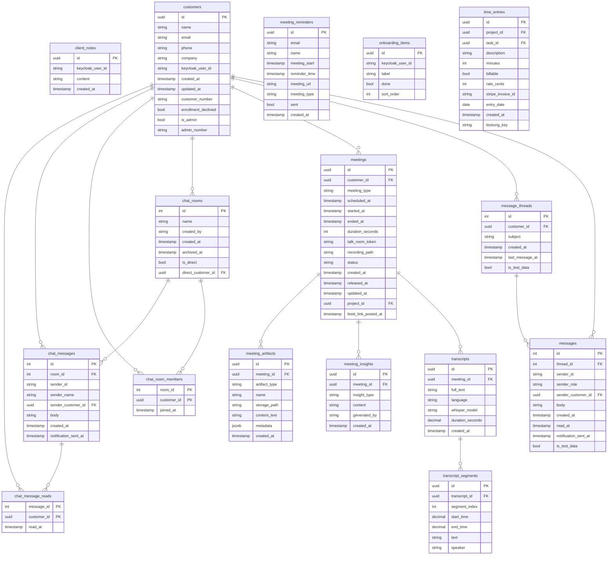
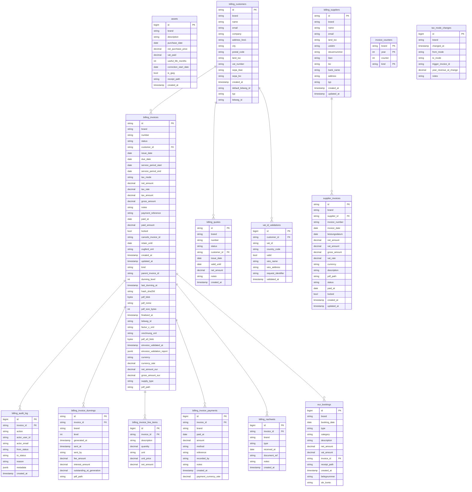
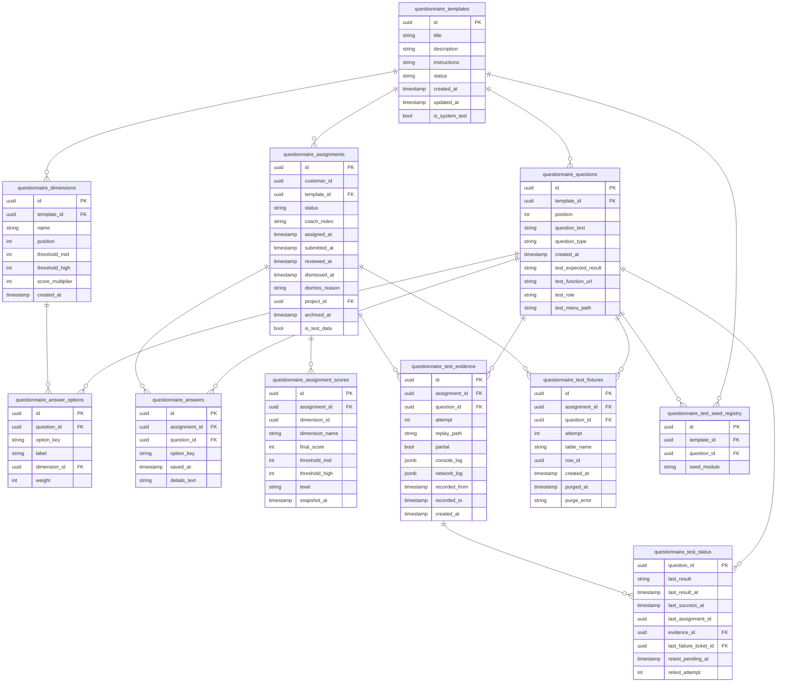
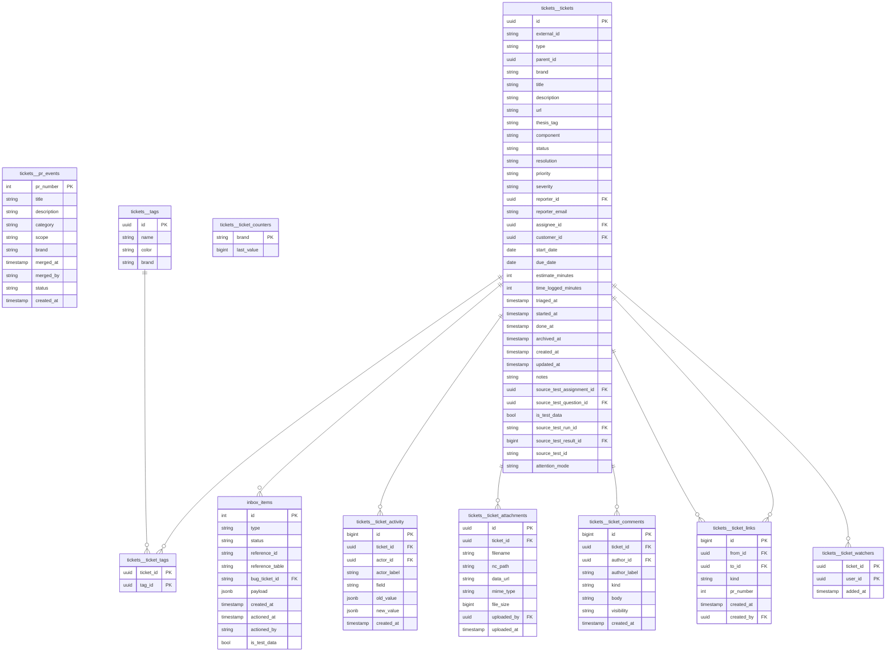
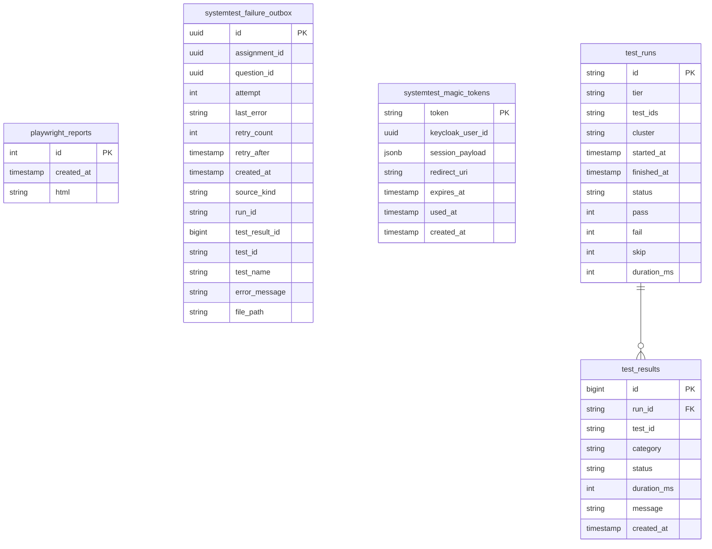
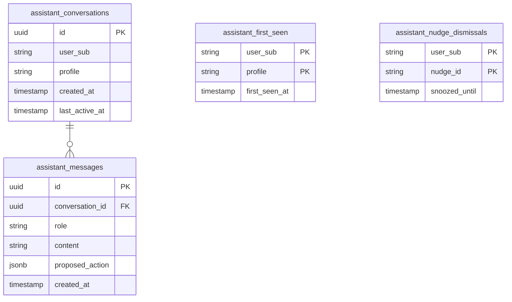
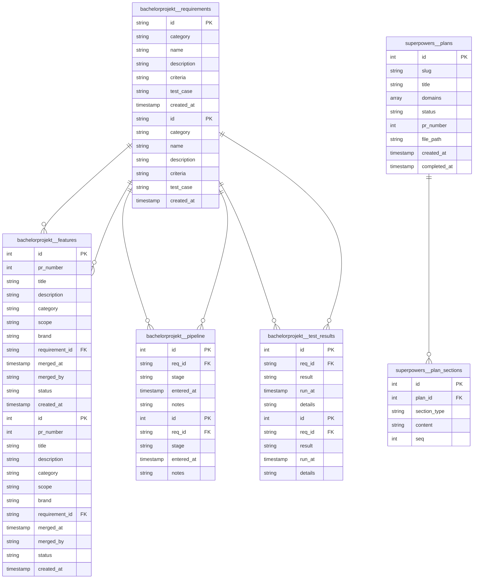

# Shared DB — Schema Reference & Normalization Audit

> Generated by `scripts/db-schema-diagram.py`.
> Re-run: `task db:diagram ENV=mentolder`

**104 tables** across `website` and `postgres` databases, organized into 8 domains.

**Jump to domain:**
- [CRM & Communication](#crm-communication)
- [Billing & Accounting](#billing-accounting)
- [Questionnaire & Coaching](#questionnaire-coaching)
- [Tickets & Issues](#tickets-issues)
- [Platform & Config](#platform-config)
- [Testing & CI](#testing-ci)
- [AI Assistant](#ai-assistant)
- [Bachelorprojekt & Superpowers](#bachelorprojekt-superpowers)

## CRM & Communication

## Billing & Accounting

## Questionnaire & Coaching

## Tickets & Issues

## Platform & Config

```mermaid
erDiagram
  admin_shortcuts {
    uuid id PK
    string url
    string label
    int sort_order
    timestamp created_at
  }
  brett_rooms {
    string room_token PK
    jsonb state
    timestamp last_modified_at
  }
  brett_snapshots {
    uuid id PK
    string room_token
    uuid customer_id FK
    string name
    jsonb state
    timestamp created_at
  }
  free_time_windows {
    string id PK
    string brand
    date date
    time win_start
    time win_end
    timestamp created_at
  }
  legal_pages {
    string brand PK
    string page_key PK
    string content_html
    timestamp updated_at
  }
  leistungen_config {
    string brand PK
    jsonb categories_json
    timestamp updated_at
  }
  newsletter_campaigns {
    uuid id PK
    string subject
    string html_body
    string status
    timestamp sent_at
    int recipient_count
    timestamp created_at
    timestamp updated_at
  }
  newsletter_send_log {
    uuid id PK
    uuid campaign_id FK
    uuid subscriber_id FK
    timestamp sent_at
    string status
  }
  newsletter_subscribers {
    uuid id PK
    string email
    string status
    string confirm_token
    timestamp token_expires_at
    string unsubscribe_token
    string source
    timestamp confirmed_at
    timestamp created_at
  }
  poll_answers {
    uuid id PK
    uuid poll_id FK
    string answer
    timestamp submitted_at
  }
  polls {
    uuid id PK
    string question
    string kind
    array options
    string status
    array room_tokens
    timestamp created_at
    timestamp locked_at
  }
  referenzen_config {
    string brand PK
    jsonb items_json
    timestamp updated_at
  }
  service_config {
    string brand PK
    jsonb services_json
    timestamp updated_at
  }
  site_settings {
    string brand PK
    string key PK
    string value
    timestamp updated_at
  }
  web_sessions {
    string id PK
    jsonb data
    timestamp expires_at
    timestamp created_at
  }
  website_custom_sections {
    uuid id PK
    string slug
    string title
    int sort_order
    jsonb fields
    jsonb content
    timestamp created_at
    timestamp updated_at
  }
  newsletter_campaigns ||--o{ newsletter_send_log : ""
  newsletter_subscribers ||--o{ newsletter_send_log : ""
  polls ||--o{ poll_answers : ""
```

## Testing & CI

## AI Assistant

## Bachelorprojekt & Superpowers

## Normalization Findings

| # | Severity | Table(s) | Issue | Recommendation |
|---|----------|----------|-------|----------------|
| 1 | **HIGH** | 20+ tables | `brand text` column with no FK — multi-tenant discriminator stored as raw text in every table (billing_invoices, tickets.tickets, bug_tickets, eur_bookings, assets, …) | Add a `brands` table; add `brand_id FK` or at minimum a CHECK constraint against known values |
| 2 | **HIGH** | `billing_invoices` | `paid_at`, `paid_amount` duplicated — payment state already tracked per-row in `billing_invoice_payments` | Remove `paid_at`/`paid_amount` from `billing_invoices`; derive via view from `billing_invoice_payments` |
| 3 | **MEDIUM** | `billing_invoices` | `dunning_level`, `last_dunning_at` duplicated — dunning state already in `billing_invoice_dunnings` | Remove denormalized dunning fields; derive `MAX(level)` from `billing_invoice_dunnings` |
| 4 | **MEDIUM** | `billing_invoices` | Five large blobs inline: `zugferd_xml`, `factur_x_xml`, `xrechnung_xml`, `pdf_blob`, `pdf_a3_blob` — bloats every row scan | Extract to `billing_invoice_documents(invoice_id, format text, blob bytea)` |
| 5 | **HIGH** | `meetings`, `questionnaire_assignments`, `time_entries` | `project_id uuid FK` declared but target `projects` table does not exist anywhere in the DB | Create a `projects` table, or drop the dangling FK constraint |
| 7 | **MEDIUM** | `billing_customers` vs `customers` | Two customer tables with no FK link — a CRM customer who becomes a billing customer is not connected | Add `customers_id uuid FK → customers.id` to `billing_customers`, nullable for pure-billing entities |
| 8 | **HIGH** | `bachelorprojekt.features` vs `tickets.pr_events` | Near-duplicate tables — both store GitHub PR merge events with almost identical columns (pr_number, title, description, category, scope, brand, merged_at, merged_by, status) | Designate one as canonical source and drop or make the other a view |
| 10 | **MEDIUM** | `inbox_items` | `reference_table text` + `reference_id text` — polymorphic FK not enforced by the DB | Replace with typed FK columns per entity type, or add a CHECK on `reference_table` |
| 12 | **MEDIUM** | `public.bug_tickets` vs `tickets.tickets` | Same concept (ticket), separate tables, incompatible PK types (`text` vs `uuid`), no cross-reference | Migrate `bug_tickets` into `tickets.tickets` with `type = 'bug'`, or add a `tickets_id uuid FK` |
| 13 | **LOW** | `meeting_reminders` | No FK to `meetings`; `meeting_start` is a bare timestamp copy — can drift | Add `meeting_id uuid FK → meetings.id` |
| 14 | **LOW** | `ticket_activity.actor_id`, `ticket_attachments.uploaded_by`, `messages.sender_id` | Polymorphic UUID fields pointing at users with no FK — referential integrity not enforced | Add a `users` view or table as FK target, or document the convention |

