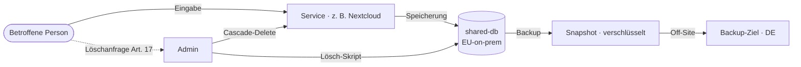

<div class="page-hero">
  <span class="page-hero-icon">🛡️</span>
  <div class="page-hero-body">
    <div class="page-hero-title">DSGVO / Datenschutz</div>
    <p class="page-hero-desc">Datenschutz by Design: Alle Daten bleiben on-premises. Keine Cloud-Abhängigkeiten, keine Telemetrie.</p>
    <div class="page-hero-meta">
      <span class="page-hero-tag">DSGVO Art. 25, 32</span>
      <span class="page-hero-tag">Für Administratoren</span>
    </div>
  </div>
  <a href="#/" class="page-hero-back">← Übersicht</a>
</div>

# DSGVO / Datenschutz

## Datenschutz by Design (Art. 25 DSGVO)

Das Workspace MVP setzt Datenschutz als Grundprinzip der Architektur um — nicht als nachträgliche Maßnahme.

**On-Premises-Ansatz:**
- Alle Daten bleiben vollständig im k3d/k3s-Cluster auf eigenem Hardware
- Keine Cloud-Abhängigkeiten für Nutzerdaten (weder Speicherung noch Verarbeitung)
- Keine Telemetrie, kein Tracking, keine externen CDNs in Anwendungen
- Container-Images ausschließlich von vertrauenswürdigen, europäischen oder FOSS-Quellen (quay.io, docker.io/library, lscr.io) — keine US-Cloud-Registries (gcr.io, amazonaws, azurecr, mcr.microsoft.com)



---

## Technische Maßnahmen (Art. 32 DSGVO)

### Schutzmaßnahmen im Überblick

| Maßnahme | Implementierung | Nachweis |
|----------|----------------|---------|
| **Verschlüsselung in Transit** | TLS 1.2/1.3 für alle externen Verbindungen (Produktion), HSTS | `prod/traefik-middlewares.yaml` |
| **Verschlüsselung at Rest** | AES-256-CBC + PBKDF2 (Backup-CronJob, täglich, 30-Tage-Retention) | `k3d/backup-cronjob.yaml` |
| **Verschlüsselung im Cluster** | Opportunistisches TLS PostgreSQL (selbst-signiert, cluster-intern) | `k3d/shared-db.yaml` |
| **Zugangskontrolle** | Keycloak OIDC SSO für alle Services; Basic Auth für interne Tools | `k3d/ingress.yaml` |
| **Passwort-Policy** | ≥12 Zeichen, Groß-/Kleinbuchstaben, Ziffern, Sonderzeichen; PBKDF2-SHA512 | Keycloak Realm-Config |
| **Brute-Force-Schutz** | Keycloak Detection + Traefik Rate-Limiting | `prod/traefik-middlewares.yaml` |
| **Netzwerk-Isolierung** | Kubernetes NetworkPolicies Default-Deny (Ingress + Egress) | `k3d/network-policies.yaml` |
| **Container-Härtung** | Non-Root-Container, `allowPrivilegeEscalation: false`, `capabilities: drop: ALL`, `seccompProfile: RuntimeDefault` | Alle Deployment-YAMLs |
| **Pod Security Standards** | `baseline` (erzwungen), `restricted` (Warnung) im workspace-Namespace | `k3d/namespace.yaml` |
| **Audit-Logs** | Keycloak Events (Login, Logout, Passwort-Änderung); Kubernetes Audit-Log | Keycloak Admin-Console |
| **Secrets-Management** | Dev: `k3d/secrets.yaml` (nur Dev-Werte); Prod: Sealed Secrets (bitnami/sealed-secrets) | `environments/sealed-secrets/` |
| **Backup & Recovery** | Tägliche verschlüsselte Backups (keycloak, nextcloud, website) | `k3d/backup-cronjob.yaml` |

---

## Verarbeitete Daten

### Datenkategorien im Überblick

| Dienst | Datenkategorie | Speicherort |
|--------|---------------|-------------|
| **Keycloak** | E-Mail, Passwort-Hash (PBKDF2-SHA512), TOTP-Secret, Rollen/Berechtigungen, letzte Anmeldezeit | PostgreSQL `keycloak`-DB |
| **Nextcloud** | Dateien (beliebige Inhalte), Dateinamen, Metadaten, Freigabe-Links, Kalender-/Kontaktdaten | Nextcloud PVC + PostgreSQL `nextcloud`-DB |
| **Website/Chat** | Chat-Nachrichten, Zeitstempel, Absender-ID, Buchungsanfragen, Kontaktformular-Anfragen | PostgreSQL `website`-DB |
| **Vaultwarden** | Verschlüsselte Passwort-Einträge (Ende-zu-Ende-verschlüsselt durch Bitwarden-Client), Organisations-Metadaten | PostgreSQL `vaultwarden`-DB |
| **Claude Code** | Prompts und Antworten (innerhalb Session, kein persistentes Logging), Anthropic API-Key | Cluster-intern (kein persistenter Speicher) |
| **Whiteboard** | Whiteboard-Zeichendaten (Session-basiert) | PostgreSQL (session-gebunden) |
| **Mailpit** | Interne E-Mails (Transactional Mails des Systems, kein öffentlicher E-Mail-Dienst) | In-Memory (kein persistenter Speicher) |

Details zu Rechtsgrundlagen, Empfängern und Löschfristen: [verarbeitungsverzeichnis.md](verarbeitungsverzeichnis.md)

---

## Automatisierter Compliance-Check (NFA-01)

Das Skript `scripts/dsgvo-compliance-check.sh` prüft automatisch die technischen Datenschutzmaßnahmen:

```bash
# Menschenlesbare Ausgabe
task workspace:dsgvo-check

# Oder direkt:
scripts/dsgvo-compliance-check.sh

# JSON-Ausgabe (für Grafana-Dashboard)
scripts/dsgvo-compliance-check.sh --json
```

### Geprüfte Aspekte

| Check-ID | Beschreibung | DSGVO-Artikel |
|----------|-------------|---------------|
| D01 | Keine Container-Images von US-Cloud-Anbietern (gcr.io, amazonaws, azurecr, mcr.microsoft) | Art. 25, 44 ff. |
| D02 | Keine DNS-Auflösung externer Tracking-Domains (google-analytics, sentry.io) | Art. 25 |
| D03 | Alle PersistentVolumes nutzen lokalen Storage (keine Cloud-StorageClasses) | Art. 25 |
| D04 | Keycloak Audit-Events aktiviert | Art. 32 |
| D05 | Website-API erreichbar (Health-Check) | Art. 32 (Verfügbarkeit) |
| D06 | Keine proprietären Telemetrie-Dienste (datadog, newrelic, splunk, segment, mixpanel) | Art. 25 |
| D07 | Alle Container-Images sind Open-Source-Projekte | Art. 25 |
| D08 | SMTP-Server ist cluster-intern (Mailpit, kein externer Mail-Relay) | Art. 25, 44 ff. |
| D09 | TLS-Zertifikat vorhanden (workspace-wildcard-tls) | Art. 32 |
| D10 | Passwort-Policy in Keycloak-Realm konfiguriert | Art. 32 |
| D11 | Backup-CronJob aktiv | Art. 32 (Wiederherstellbarkeit) |
| D12 | NetworkPolicy Default-Deny-Ingress aktiv | Art. 32 |

### Test NFA-01

Der Test NFA-01 der Testsuite prüft DSGVO-Compliance automatisch:

```bash
./tests/runner.sh local NFA-01
```

NFA-01 prüft unter anderem:
- Keine Images von US-Cloud-Registries (`gcr.io`, `amazonaws.com`, `azurecr.io`, `mcr.microsoft.com`)
- Kein Amazon S3 / Azure Storage-Backend in Nextcloud
- Keine privilegierten Container (`privileged: true`)
- Pod Security Standards im workspace-Namespace aktiv

---

## DSGVO-Monitoring-Dashboard

Ein Grafana-Dashboard visualisiert DSGVO-Compliance-Metriken in Echtzeit. Das Dashboard nutzt die JSON-Ausgabe von `dsgvo-compliance-check.sh --json` als Datenquelle.

```bash
# Monitoring-Stack installieren (Grafana + Prometheus)
task workspace:monitoring
```

Das Dashboard zeigt:
- Status aller D01–D12 Compliance-Checks
- Zeitreihe der Backup-Erfolge/-Fehler
- Anzahl aktiver Keycloak-Sessions
- NetworkPolicy-Verletzungen (falls Kubernetes Audit-Log aktiviert)

---

## Datenlöschung

### Benutzer vollständig löschen (Art. 17 DSGVO)

Bei einer Löschanfrage sind alle Services manuell zu bereinigen:

**1. Keycloak** (löscht Account und beendet SSO-Session für alle Services):
```
Keycloak Admin-Console → Users → [Benutzer auswählen] → Delete
```

**2. Nextcloud** (löscht Dateien und Nutzer-Account):
```
Nextcloud Admin → Users → [Benutzer auswählen] → Delete user
```
Oder per CLI:
```bash
kubectl exec -n workspace deploy/nextcloud -c nextcloud -- \
  setpriv --reuid=999 --regid=999 --clear-groups \
  php occ user:delete <username>
```

**3. Vaultwarden** (löscht verschlüsselte Passwort-Einträge):
```
Vaultwarden Admin-Panel → Users → [Benutzer auswählen] → Delete
```

**4. PostgreSQL** (residuale Datensätze):
Beim Löschen in den Services werden zugehörige Datensätze in der Datenbank automatisch entfernt (Cascade-Delete).
Für manuelle Bereinigung:
```bash
task workspace:psql -- website
# DELETE FROM chat_messages WHERE user_id = '<id>';
# DELETE FROM bookings WHERE user_email = '<email>';
```

**5. Backup-Bereinigung:**
Backups werden nach 30 Tagen automatisch gelöscht (Retention-Policy im CronJob). Für sofortige Löschung:
```bash
kubectl exec -n workspace deploy/backup-cronjob -- \
  find /backups -name "*.enc" -mtime +0 -delete
```

---

## Auskunft & Datenportabilität (Art. 15, 20 DSGVO)

### Auskunft (Art. 15)

Alle gespeicherten Daten zu einem Nutzer können wie folgt abgerufen werden:

| Service | Methode |
|---------|---------|
| **Keycloak** | Admin-Console → Users → [Benutzer] → Attribute; oder Keycloak Admin REST API: `GET /admin/realms/workspace/users/<id>` |
| **Nextcloud** | Admin-Panel → Users → Benutzerdetails; oder `occ user:info <username>` |
| **Website/Chat** | PostgreSQL-Abfrage über `task workspace:psql -- website` |
| **Vaultwarden** | Vaultwarden Admin-Panel → Users |

### Datenportabilität (Art. 20)

Nutzer können ihre Daten in maschinenlesbaren Formaten exportieren:

| Service | Export-Methode |
|---------|---------------|
| **Nextcloud** | Admin-Panel → Users → Export; WebDAV-Export; `occ user:export <username>` |
| **Keycloak** | Benutzerattribute über Admin REST API exportierbar (JSON) |
| **Chat/Buchungen** | Export über Admin-Inbox-API: `/api/admin/export?user=<id>` |
| **Vaultwarden** | Bitwarden-Client: Datei → Export Vault (verschlüsselt oder unverschlüsselt) |

---

## Keine Drittlandübermittlung

Es findet **keine Übermittlung personenbezogener Daten in Drittländer** (außerhalb der EU/EWR) statt. Die gesamte Plattform wird vollständig on-premises betrieben. Alle Komponenten sind Open-Source-Software, die ohne externe Datenübertragung betrieben wird.

> **Hinweis:** Die Anthropic Claude API (Claude Code) wird für KI-Assistenz genutzt. Prompts werden an Anthropic (USA) übertragen. Claude Code ist ein internes Werkzeug für Administratoren — keine Nutzerdaten werden automatisch übermittelt. Anthropic bietet EU-Standardvertragsklauseln (SCC) an.

---

## Weiterführende Dokumente

- [Verarbeitungsverzeichnis (Art. 30)](verarbeitungsverzeichnis.md) — Vollständige Dokumentation aller Verarbeitungstätigkeiten
- [Sicherheitsarchitektur](security.md) — Technische Schutzmaßnahmen im Detail
- [Sicherheitsbericht](security-report.md) — Penetrationstest-Grundlagen und SA-Testergebnisse
