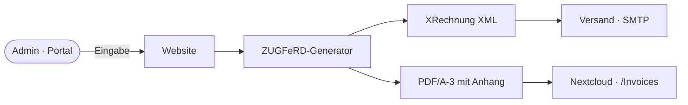

# E-Invoice (ZUGFeRD & XRechnung)

Workspace MVP supports generating electronic invoices according to the EN 16931 standard.



## Architecture

The invoice generation relies on two main components:
1. **CII XML Generator (`website/src/lib/einvoice`)**: Generates a standard Cross-Industry Invoice (CII) XML. This XML satisfies the requirements for both ZUGFeRD (Factur-X) and XRechnung.
2. **E-Invoice Sidecar (`docker/einvoice-sidecar`)**: A Spring Boot application using Mustangproject to embed the `factur-x.xml` into a PDF to create a PDF/A-3 document, and to validate the resulting PDF.

## Workflows

- **Standard Invoices**: Generates a ZUGFeRD PDF/A-3 (Factur-X EN 16931 profile).
- **XRechnung (B2G)**: If the buyer has a `Leitweg-ID`, a standalone XRechnung 3.0 XML is additionally generated and attached to the email.

## Enabling in Environments

The sidecar is enabled via the `EINVOICE_SIDECAR_ENABLED` feature flag in the environment configuration (`environments/<env>.yaml`).

```yaml
env_vars:
  EINVOICE_SIDECAR_ENABLED: "true"
```

## Troubleshooting

If PDF generation fails, check the sidecar logs:

```bash
task einvoice-sidecar:logs
```

You can validate invoices manually using the admin endpoint `POST /api/admin/billing/:id/validate`.
