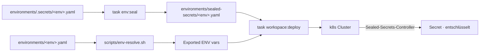

# Umgebungen

## Uberblick



Das Projekt unterstutzt drei Deployment-Umgebungen:

- **dev** -- Lokaler k3d-Cluster fur Entwicklung und Tests. Keine TLS, Mailpit statt echtem SMTP, Klartext-Secrets.
- **mentolder** -- Hetzner k3s-Produktionscluster fur mentolder.de. Let's Encrypt TLS, DDNS fur dynamische IP, echter SMTP.
- **korczewski** -- Hetzner k3s-Produktionscluster fur korczewski.de. Gleiche Infrastruktur wie mentolder, andere Domain und Branding.

Die gesamte Konfiguration liegt im Verzeichnis `environments/` als YAML-Dateien.

---

## Umgebungsvergleich

| Merkmal | dev (k3d) | mentolder | korczewski |
|---------|-----------|-----------|------------|
| Domain | localhost | mentolder.de | korczewski.de |
| TLS | Kein TLS (HTTP) | Let's Encrypt Wildcard | Let's Encrypt Wildcard |
| Cluster-Typ | k3d (lokal) | k3s auf Hetzner | k3s auf Hetzner |
| Sealed Secrets | Nein (Klartext) | Ja | Ja |
| DDNS | Nein | Ja (ipv64) | Nein (statische IP) |
| E-Mail | Mailpit (lokal, kein Versand) | smtp.mailbox.org | smtp.mailbox.org |
| Secrets-Modus | `plaintext` | Sealed Secrets | Sealed Secrets |
| Kustomize-Overlay | `k3d/` | `prod-mentolder/` | `prod-korczewski/` |

---

## Env-Registry (environments/)

Das `environments/`-Verzeichnis ist die zentrale Konfigurationsquelle fur alle Umgebungen:

| Datei | Beschreibung |
|-------|-------------|
| `environments/schema.yaml` | Konfigurations-Schema: alle erlaubten Variablen mit Typen, Default-Werten und Validierungsregeln |
| `environments/dev.yaml` | Konfiguration fur lokale Entwicklung (verwendet schema-Defaults) |
| `environments/mentolder.yaml` | Produktionskonfiguration fur mentolder.de |
| `environments/korczewski.yaml` | Produktionskonfiguration fur korczewski.de |
| `environments/sealed-secrets/` | Verschlusselte Secrets pro Umgebung (sicher in Git) |
| `environments/certs/` | TLS-Zertifikatsreferenzen pro Umgebung |

Jede Umgebungsdatei definiert mindestens:

- `environment` -- Name der Umgebung
- `context` -- kubectl-Kontext
- `domain` -- Basis-Domain
- `env_vars` -- Umgebungsspezifische Variablen (Domain, Brand, SMTP, TURN, externe URLs usw.)
- `secrets_mode` -- `plaintext` (dev) oder `sealed` (Produktion)
- `overlay` -- Kustomize-Overlay-Pfad

**Schlusselvariablen aus schema.yaml:**

| Variable | Bedeutung | Dev-Default |
|----------|-----------|-------------|
| `PROD_DOMAIN` | Basis-Domain | `localhost` |
| `BRAND_NAME` | Anzeigename der Plattform | `Workspace` |
| `BRAND_ID` | Interner Bezeichner | `mentolder` |
| `CONTACT_EMAIL` | Kontakt-E-Mail-Adresse | `dev@localhost` |
| `CONTACT_NAME` | Vollstandiger Kontaktname | `Dev User` |
| `LEGAL_STREET` / `LEGAL_ZIP` | Impressum-Adresse | Platzhalter |
| `SMTP_HOST` / `SMTP_PORT` | E-Mail-Relay | -- (Mailpit in dev) |
| `TURN_PUBLIC_IP` | TURN-Server IP fur Nextcloud Talk | -- |

---

## Secrets-Management: Sealed Secrets

In Produktionsumgebungen werden keine Klartext-Secrets verwendet.

**Funktionsweise:**

1. Der **Sealed Secrets Controller** (bitnami) lauft als Deployment im Cluster.
2. Er besitzt ein asymmetrisches Schlusselparar -- der private Schlussel verlasst den Cluster nie.
3. Secrets werden mit dem offentlichen Schlussel verschlusselt (`kubeseal`).
4. Die verschlusselten YAML-Dateien (`SealedSecret`) konnen sicher in Git gespeichert werden.
5. Nur der Controller im jeweiligen Cluster kann sie entschlusseln.

**Wichtig:** Ein SealedSecret ist cluster- und namespace-spezifisch. Eine fur `mentolder` verschlusselte Datei funktioniert nicht auf `korczewski`.

**Sealed Secrets installieren:**

```bash
task sealed-secrets:install    # Controller per Helm installieren
task sealed-secrets:status     # Status pruefen
```

---

## Env-Skripte

| Skript | Beschreibung |
|--------|-------------|
| `scripts/env-generate.sh --env <name>` | Secrets aus schema.yaml generieren (Zufallspassworter oder interaktiv). Ausgabe: `environments/.secrets/<name>.yaml` |
| `scripts/env-seal.sh --env <name>` | Klartext-Secrets als SealedSecret verschlusseln. Liest `.secrets/<name>.yaml`, Ausgabe: `environments/sealed-secrets/<name>.yaml` |
| `scripts/env-resolve.sh <env>` | Secrets fur eine Umgebung auflosen (nur mit Cluster-Zugriff moglich) |
| `scripts/env-validate.sh` | Env-Konfiguration gegen schema.yaml validieren |

**Typischer Workflow fur neue Secrets:**

```bash
# 1. Secrets generieren (erstellt environments/.secrets/mentolder.yaml)
bash scripts/env-generate.sh --env mentolder

# 2. Als SealedSecret verschlusseln (erstellt environments/sealed-secrets/mentolder.yaml)
bash scripts/env-seal.sh --env mentolder

# 3. Verschlusselte Datei committen (sicher fur Git)
git add environments/sealed-secrets/mentolder.yaml
```

---

## Neue Umgebung einrichten

Schritt-fur-Schritt-Anleitung fur eine neue Produktionsumgebung:

**1. Umgebungsdatei anlegen**

```bash
# environments/schema.yaml als Vorlage verwenden
cp environments/korczewski.yaml environments/meinecluster.yaml
# Werte anpassen: domain, env_vars, overlay, etc.
```

**2. Kustomize-Overlay erstellen**

```bash
# prod/ oder prod-korczewski/ als Vorlage kopieren
cp -r prod-korczewski prod-meinecluster
# Overlay-spezifische Patches anpassen
```

**3. Secrets generieren und verschlusseln**

```bash
bash scripts/env-generate.sh --env meinecluster
bash scripts/env-seal.sh --env meinecluster
git add environments/sealed-secrets/meinecluster.yaml
```

**4. Sealed Secrets Controller auf Ziel-Cluster installieren**

```bash
task sealed-secrets:install  # (kubeconfig auf Ziel-Cluster zeigen)
```

**5. Workspace deployen**

```bash
task workspace:deploy ENV=<neue-umgebung>
```
