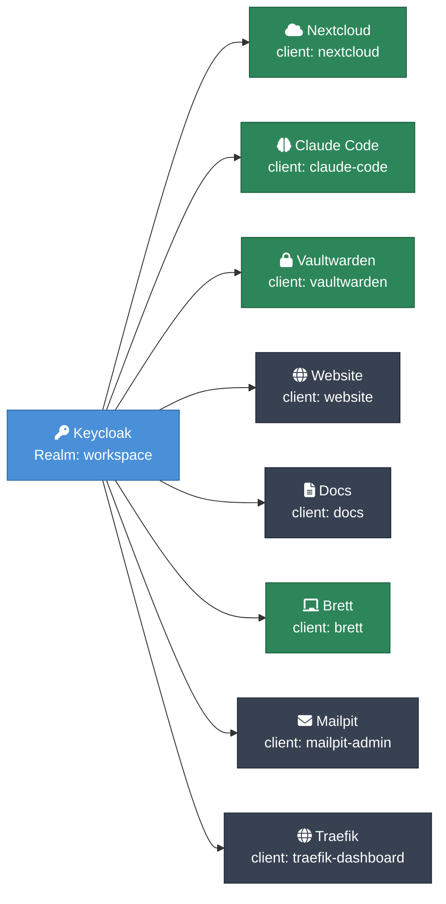
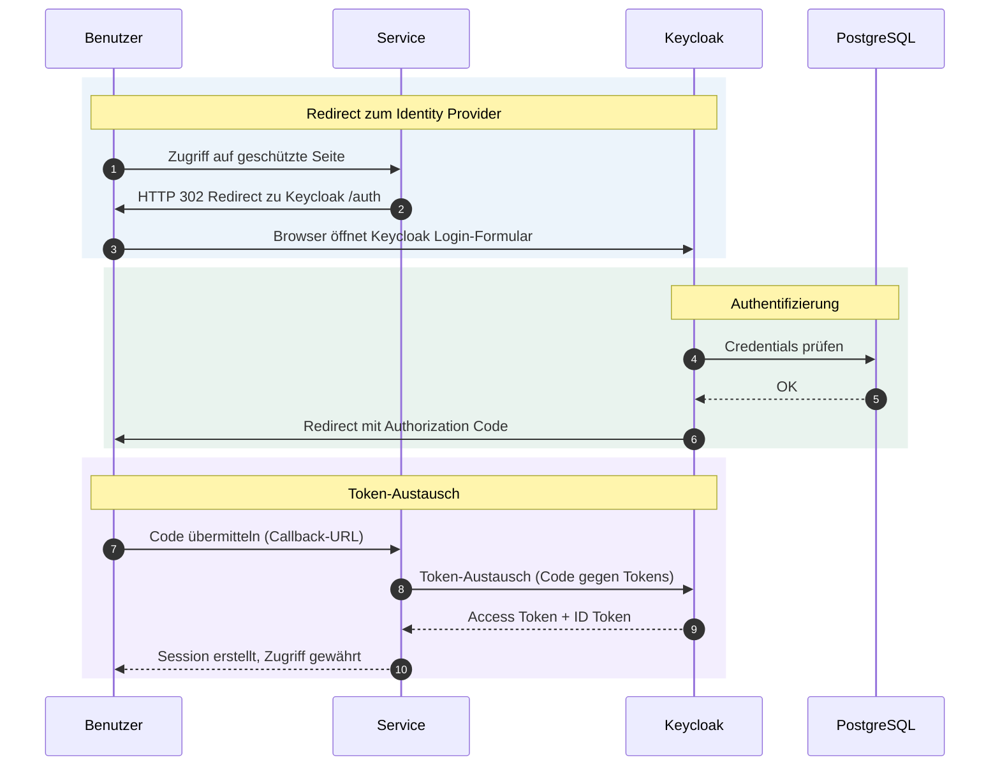

# Keycloak — Identity Provider & SSO

## Übersicht

Keycloak ist der zentrale Identity Provider des Workspace MVP. Alle Services authentifizieren ausschließlich über OpenID Connect (OIDC) gegen den Realm `workspace`. Es gibt keinen separaten Login pro Service — ein einziges Keycloak-Konto genügt für den gesamten Workspace (Single Sign-On).

| Parameter | Dev | Prod |
|-----------|-----|------|
| URL | `http://auth.localhost` | `https://auth.korczewski.de` |
| Image | `quay.io/keycloak/keycloak:26.6` | gleich |
| Realm | `workspace` | `workspace` |
| Admin-User | `admin` | aus Sealed Secret |
| Admin-Passwort | `devadmin` | aus Sealed Secret |
| SSL-Modus | `none` | `external` |

## Realm-Konfiguration

Der Realm `workspace` wird beim Keycloak-Start automatisch aus dem Template `realm-workspace.json` importiert (ConfigMap `realm-template`). Das Script `realm-import-entrypoint.sh` ersetzt vor dem Import alle `${VAR}`-Platzhalter per `sed` durch die aktuellen Umgebungsvariablen aus Kubernetes Secrets und ConfigMaps.

Schlägt die Variablen-Substitution fehl (fehlende Variable), bricht das Script mit Fehler ab — der Pod startet nicht. Dadurch wird ein kaputt importierter Realm verhindert.

**Realm-Einstellungen:**

| Einstellung | Wert |
|-------------|------|
| Anzeigename | Workspace MVP (Dev) |
| SSL-Modus | `none` (Dev) / `external` (Prod) |
| Registrierung | deaktiviert |
| Login mit E-Mail | aktiviert |
| Brute-Force-Schutz | aktiviert |
| Passwort-Richtlinie | min. 12 Zeichen, Groß-/Kleinbuchstaben, Ziffern, Sonderzeichen, PBKDF2-SHA512 |

## OIDC-Clients



| Client-ID | Service | Redirect-URI | Secret-Variable | Besonderheiten |
|-----------|---------|--------------|-----------------|----------------|
| `nextcloud` | Nextcloud | `http://{NC_DOMAIN}/apps/oidc_login/oidc` | `NEXTCLOUD_OIDC_SECRET` | Attribut-Mapping: preferred_username, name, email |
| `vaultwarden` | Vaultwarden | `http://{VAULT_DOMAIN}/identity/connect/oidc-signin` | `VAULTWARDEN_OIDC_SECRET` | SSO optional, Passwort-Login bleibt Fallback |
| `website` | Astro-Website / Chat | `http://{WEB_DOMAIN}/*` | `WEBSITE_OIDC_SECRET` | Authorization Code + PKCE |
| `docs` | Docs (ueber oauth2-proxy) | `http://{DOCS_DOMAIN}/oauth2/callback` | `DOCS_OIDC_SECRET` | PKCE S256, Zugriff nur fuer eingeloggte User |
| `brett` | Systemisches Brett | `http://{BRETT_DOMAIN}/*` | `BRETT_OIDC_SECRET` | Coaching-Board, Authorization Code Flow |
| `mailpit-admin` | Mailpit (Dev-Mail) | `http://{MAIL_DOMAIN}/oauth2/callback` | `MAILPIT_OIDC_SECRET` | oauth2-proxy, nur Dev |
| `traefik-dashboard` | Traefik Dashboard | `http://traefik.localhost/oauth2/callback` | `TRAEFIK_OIDC_SECRET` | oauth2-proxy, Admin-Zugriff |
| `claude-code` | Claude Code MCP | intern | `CLAUDE_CODE_OIDC_SECRET` | Service-Account fuer MCP-Server |

Alle Clients verwenden `client_secret_basic` als Authenticator und den Standard Authorization Code Flow. Scopes: `openid email profile`.

## SSO-Ablauf



## Admin-Zugang

**Dev:**

- URL: `http://auth.localhost`
- Benutzername: `admin`
- Passwort: `devadmin`

**Prod:**

- URL: `https://auth.korczewski.de`
- Credentials in Sealed Secret `workspace-secrets` (Key: `KEYCLOAK_ADMIN_PASSWORD`)

## Benutzerverwaltung

Benutzer werden ausschließlich über die Keycloak Admin-UI oder die Admin-REST-API verwaltet. Selbstregistrierung ist im Realm deaktiviert.

**Benutzer anlegen:**

1. Admin-UI öffnen → Realm `workspace` → Users → Add user
2. Username, E-Mail, Vorname, Nachname eintragen
3. Nach dem Speichern: Tab "Credentials" → Passwort setzen (Temporary = nein für permanentes Passwort)

**Rollen zuweisen:**

Unter "Role mappings" können Realm-Rollen oder Client-spezifische Rollen vergeben werden.

**Massenimport:**

```bash
scripts/import-users.sh    # CSV-basierter Benutzerimport via Keycloak Admin-API
```

**Passwort zurücksetzen:**

1. Admin-UI → Users → Benutzer wählen → Credentials → Reset password
2. Oder: User in Admin-UI entsperren, falls Brute-Force-Schutz greift (siehe Abschnitt "Fehlerbehebung")

## Realm-Import & Konfiguration

Das Realm-Template `realm-workspace.json` wird als ConfigMap `realm-template` in den Pod gemountet. Das Entrypoint-Script `realm-import-entrypoint.sh` führt folgende Schritte aus:

1. Template nach `/opt/keycloak/data/import/realm-workspace.json` kopieren
2. Alle `${VAR}`-Platzhalter per `sed` ersetzen (OIDC-Secrets, Domain-Namen)
3. Sanity-Check: verbleibende unaufgelöste Platzhalter führen zu einem Pod-Fehler
4. Keycloak starten mit `kc.sh start --import-realm`

Keycloak importiert den Realm nur einmalig (beim ersten Start mit leerer Datenbank). Bei bestehender Datenbank wird der Import übersprungen. Für eine Neukonfiguration muss der Realm in der Admin-UI manuell gelöscht werden.

**Substituierte Variablen:**

| Variable | Quelle |
|----------|--------|
| `NEXTCLOUD_OIDC_SECRET` | Secret `workspace-secrets` |
| `VAULTWARDEN_OIDC_SECRET` | Secret `workspace-secrets` |
| `WEBSITE_OIDC_SECRET` | Secret `workspace-secrets` |
| `CLAUDE_CODE_OIDC_SECRET` | Secret `workspace-secrets` |
| `DOCS_OIDC_SECRET` | Secret `workspace-secrets` |
| `NC_DOMAIN` | ConfigMap `domain-config` |
| `WEB_DOMAIN` | ConfigMap `domain-config` |
| `VAULT_DOMAIN` | ConfigMap `domain-config` |
| `DOCS_DOMAIN` | ConfigMap `domain-config` |

## Betrieb

```bash
task workspace:logs -- keycloak      # Logs ansehen
task workspace:restart -- keycloak   # Pod neu starten
task workspace:psql -- keycloak      # PostgreSQL-Shell für Keycloak-DB öffnen
```

Pod-Status prüfen:

```bash
kubectl get pods -n workspace -l app=keycloak
kubectl describe pod -n workspace -l app=keycloak
```

## Fehlerbehebung

**Realm wurde nicht importiert**

Logs prüfen:

```bash
task workspace:logs -- keycloak
```

Typische Ursache: Pod beim ersten Start abgebrochen, bevor der Import abgeschlossen war. Lösung: Pod neu starten (`task workspace:restart -- keycloak`). Falls die DB bereits einen Realm enthält, wird der Import übersprungen — in dem Fall muss der Realm in der Admin-UI manuell gelöscht werden.

**Unaufgelöste Platzhalter im Realm-JSON**

Der Pod startet nicht und zeigt:

```
[import-entrypoint] FEHLER: Unaufgelöste Platzhalter im Realm-JSON
```

Ursache: Ein Secret oder ConfigMap-Wert fehlt. Prüfen, ob alle in `realm-import-entrypoint.sh` genannten Variablen im Secret `workspace-secrets` und der ConfigMap `domain-config` vorhanden sind.

**OIDC-Redirect schlägt fehl**

Fehlermeldung im Browser: `Invalid redirect_uri` oder `Invalid client credentials`.

Prüfpunkte:

- Client-ID in der Anwendungskonfiguration stimmt mit dem Realm überein
- Redirect-URI ist exakt im Client registriert (inkl. Protokoll und Pfad)
- OIDC-Secret der Anwendung stimmt mit dem Wert im Keycloak-Client überein
- Im Log der Anwendung und im Keycloak-Log nach Details suchen

**Admin-Passwort unbekannt (Dev)**

Pod neu starten — das Passwort wird aus dem Secret `workspace-secrets` (Key: `KEYCLOAK_ADMIN_PASSWORD`) beim Start gesetzt. Dev-Standardwert: `devadmin`.

**Benutzer durch Brute-Force gesperrt**

1. Admin-UI öffnen: `http://auth.localhost`
2. Realm `workspace` → Users → Benutzer suchen
3. Tab "Details" → "User enabled" prüfen, ggf. aktivieren
4. Oder: Tab "Credentials" → "Brute Force" zurücksetzen

## Relevante Dateien

| Datei | Zweck |
|-------|-------|
| `k3d/keycloak.yaml` | Deployment + Service |
| `k3d/realm-workspace-dev.json` | Realm-Template (Dev) mit `${VAR}`-Platzhaltern |
| `k3d/realm-import-entrypoint.sh` | Variablen-Substitution + Keycloak-Start |
| `k3d/oauth2-proxy-docs.yaml` | OAuth2-Proxy als SSO-Gateway für Docs |
| `k3d/nextcloud-oidc-dev.php` | Nextcloud OIDC-Konfiguration (Dev) |
| `prod/nextcloud-oidc-prod.php` | Nextcloud OIDC-Konfiguration (Prod) |
| `scripts/import-users.sh` | Massenimport von Benutzern via Admin-API |
