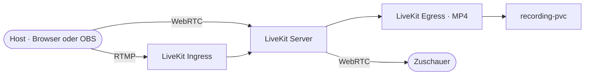

# Livestream — LiveKit (WebRTC + OBS)

## Übersicht

Der **Livestream** ermöglicht Admins, eine Live-Übertragung an alle eingeloggten Workspace-Nutzer zu senden — entweder direkt aus dem Browser (Kamera/Mikro/Bildschirm) oder per OBS über RTMP. Die Verteilung an Zuschauer läuft in beiden Fällen über WebRTC, sodass die Latenz unter einer Sekunde bleibt.

| Parameter | Dev | Prod |
|-----------|-----|------|
| Admin-Steuerseite | `http://web.localhost/admin/stream` | `https://web.${PROD_DOMAIN}/admin/stream` |
| Zuschauer-Seite | `http://web.localhost/portal/stream` | `https://web.${PROD_DOMAIN}/portal/stream` |
| LiveKit WebSocket | `ws://livekit.localhost` | `wss://livekit.${PROD_DOMAIN}` |
| RTMP-Eingang (OBS) | `rtmp://stream.localhost/live` | `rtmp://stream.${PROD_DOMAIN}/live` |
| Raumname (fix) | `main-stream` | `main-stream` |
| RTC-Medienports | UDP 50000-60000 | UDP 50000-60000 |
| RTC-TCP-Fallback | TCP 7881 | TCP 7881 |

**Namespace:** `workspace`
**Pod-Pinning:** `livekit-server` läuft mit `hostNetwork: true`, gepinnt auf `gekko-hetzner-3` (mentolder).

---

## Architektur



**Datenfluss — Browser-Publishing (Default):**

1. Admin öffnet `/admin/stream`, klickt **▶ Live-Studio öffnen**.
2. Website-Backend signiert ein Publisher-JWT (`canPublish: true`, `roomAdmin: true`) und gibt es zurück (`POST /api/stream/token`).
3. `livekit-client` öffnet `wss://livekit.<domain>/rtc/v1?access_token=<JWT>` über Traefik.
4. Klick auf **📹 Kamera an** → Browser-Permission-Prompt → Track wird publiziert.
5. ICE-Negotiation: Browser sendet UDP-Pakete an `46.225.125.59:50000-60000`. LiveKit forwarded sie als WebRTC-Tracks an alle Zuschauer im Raum.

**Datenfluss — OBS/RTMP:**

1. Admin öffnet `/admin/stream`, wählt Tab **🎬 Mit OBS (RTMP)**.
2. OBS pusht Video an `rtmp://stream.<domain>/live` mit dem `LIVEKIT_RTMP_KEY` aus `website-secrets`.
3. `livekit-ingress` empfängt den RTMP-Stream, transkodiert zu WebRTC-Tracks, publiziert in den Raum `main-stream`.
4. Zuschauer empfangen die Tracks identisch zum Browser-Publishing.

---

## Komponenten

### livekit-server (Signal + SFU)

**Image:** `livekit/livekit-server:v1.8.3`
**Ports:** `7880/tcp` (HTTP/WS), `7881/tcp` (RTC TCP), `50000-60000/udp` (RTC media), `30000-40000/udp` (TURN relay), `3478/udp` (TURN/STUN)
**hostNetwork:** `true` — gepinnt via `nodeAffinity` auf `gekko-hetzner-3`
**dnsPolicy:** `ClusterFirstWithHostNet` (damit Cluster-DNS für `livekit-redis` aus dem Host-Net-Pod funktioniert)

**Warum hostNetwork?** Die WebRTC-Medienports (50000-60000/udp) lassen sich nicht über einen Service publizieren — kube-proxy iptables kann den Range nicht abbilden, und ein 10000-Port-NodePort-Block wäre unpraktikabel. Mit `hostNetwork` bindet LiveKit direkt auf die Node-IP und antwortet mit dieser als srflx-Kandidat im ICE-Verfahren.

**Konfiguration (`livekit-server-config` ConfigMap):**

```yaml
port: 7880
rtc:
  tcp_port: 7881
  port_range_start: 50000
  port_range_end: 60000
  use_external_ip: true        # Fallback auf STUN, falls Node hinter NAT
turn:
  enabled: true
  udp_port: 3478
redis:
  address: livekit-redis:6379
```

API-Schlüssel werden über `LIVEKIT_KEYS` Env aus `workspace-secrets` (`LIVEKIT_API_KEY` + `LIVEKIT_API_SECRET`) zusammengesetzt.

---

### livekit-ingress (RTMP → WebRTC)

**Image:** `livekit/ingress:latest`
**Service:** `livekit-ingress-rtmp` (LoadBalancer, `1935:nodePort/tcp`)
**Konfig:** wird über `INGRESS_CONFIG_BODY` Env eingespeist (PR #458) und enthält die LiveKit-API-Coordinaten plus den fixen Stream-Key `main-stream-key`.

OBS-Einstellungen (auf der Admin-Seite sichtbar):

```
Server URL: rtmp://stream.${PROD_DOMAIN}/live
Stream Key: <LIVEKIT_RTMP_KEY aus website-secrets>
```

---

### livekit-egress (Recording)

**Image:** `livekit/egress:latest`
**PVC:** `livekit-recordings-pvc` (mounted unter `/recordings/`, Filename-Pattern: `main-stream-<timestamp>.mp4`)

Aufnahme starten/stoppen erfolgt über `POST /api/stream/recording` (JSON-Body `{"action": "start"|"stop", "egressId"?: string}`). Der Admin-UI-Button **● Aufzeichnung starten** ruft das Endpoint auf.

---

### livekit-redis (Room State)

**Image:** `redis:7-alpine`
Hält den Raum-Zustand, sodass `livekit-server` problemlos neu gestartet werden kann, ohne dass aktive Sessions verloren gehen. Beim Skalieren auf mehrere LiveKit-Pods (Roadmap, siehe „Bekannte Einschränkungen") ist Redis Pflicht.

---

### Edge — Traefik IngressRoute + CORS Middleware

**Plain HTTP Ingress (`livekit-server-ingress`)** läuft auf der `web` Entrypoint (Port 80) für Cluster-internes/legacy-Routing.

**HTTPS via IngressRoute (`livekit-server`)** auf `websecure` (Port 443) plus Middleware **`livekit-cors`** (PR #463). Beides liegt im `workspace`-Namespace und nutzt das Wildcard-TLS-Cert `workspace-wildcard-tls`.

Die CORS-Middleware ist nötig, weil `livekit-client` im Browser zuerst `GET /rtc/v1/validate` von `web.<domain>` aus aufruft, bevor er die WebSocket öffnet. Erlaubt sind nur `https://web.${PROD_DOMAIN}` als Origin.

---

## Konfiguration & Secrets

### Secrets (`workspace-secrets` + `website-secrets`)

| Key | Pod | Zweck |
|-----|-----|-------|
| `LIVEKIT_API_KEY` | livekit-server, livekit-ingress, livekit-egress, **website** | API-Identifier für JWT-Signing & Server-APIs |
| `LIVEKIT_API_SECRET` | gleiche wie oben | Symmetrischer Schlüssel für JWT-Signing |
| `LIVEKIT_RTMP_KEY` | website (Anzeige), livekit-ingress (Validierung) | Stream-Key für OBS-Einstellungen |

In Prod stammen alle Werte aus den Sealed Secrets (`environments/sealed-secrets/<env>.yaml`) — siehe PR #457 für die Injektion in `website-secrets`.

### Domain-Variablen (`website-config` ConfigMap)

| Variable | Beispiel (mentolder) | Quelle |
|----------|----------------------|--------|
| `LIVEKIT_DOMAIN` | `livekit.mentolder.de` | Berechnet via `livekit.${PROD_DOMAIN}` (PR #461) |
| `STREAM_DOMAIN` | `stream.mentolder.de` | Berechnet via `stream.${PROD_DOMAIN}` (PR #460/#461) |

Beide werden zur Deploy-Zeit von der envsubst-Variablenliste in `task website:deploy` gesetzt.

---

## Bedienung

### Admin: Live gehen aus dem Browser

1. `https://web.${PROD_DOMAIN}/admin/stream` öffnen.
2. **▶ Live-Studio öffnen** klicken (User-Geste ist Pflicht — Chrome blockiert sonst den `AudioContext`, siehe PR #465).
3. Tab **📹 Im Browser senden** ist Default. **📹 Kamera an** / **🎤 Mikro an** / **🖥️ Bildschirm teilen** sind unabhängig schaltbar.
4. Lokales Vorschau-Video erscheint, sobald die Kamera publiziert wird.

### Admin: Live gehen mit OBS

1. Tab **🎬 Mit OBS (RTMP)** wählen — RTMP-URL und Stream-Key werden angezeigt.
2. In OBS: Einstellungen → Stream → **Benutzerdefinierter RTMP-Server**, beide Werte einfügen.
3. **Übertragung starten** in OBS.
4. Auf der Admin-Seite erscheint die Übertragung im Live-Bereich (gleicher Player wie Zuschauer sehen).

### Admin: Aufzeichnung

Im Block **Aufzeichnung** auf `/admin/stream`:

- **● Aufzeichnung starten** → ruft `POST /api/stream/recording` mit `{"action":"start"}`, LiveKit-Egress legt MP4 unter `/recordings/main-stream-<ts>.mp4` an.
- **⏹ Aufzeichnung stoppen** → `{"action":"stop","egressId":"<id>"}`.

### Konkurrierende Streams

Wenn bereits ein Publisher (OBS oder ein anderer Browser-Host) im Raum ist, blockt die UI das Starten eines neuen Streams mit einem amber Banner: **„Es läuft bereits ein Livestream"**. Die Schaltfläche **„Aktuellen Stream beenden"** ruft `POST /api/stream/end` auf und entfernt sowohl alle aktiven Ingresses als auch publizierende Teilnehmer (siehe PR #462).

### Zuschauer

Eingeloggte Workspace-Nutzer öffnen `/portal/stream`, klicken **▶ Stream verbinden** und sehen den Live-Stream plus den Stream-Chat in der Seitenleiste. Reaktionen (Emoji) und Wortmeldungen sind über die Steuerleiste verfügbar.

---

## Betrieb

### Status & Logs

```bash
task livekit:status ENV=mentolder         # Pods, Service, Ingress, Recordings
task livekit:logs ENV=mentolder           # livekit-server logs (folgen)
task livekit:logs ENV=mentolder -- ingress  # livekit-ingress (RTMP)
task livekit:logs ENV=mentolder -- egress   # livekit-egress (Recording)

# Direkt:
kubectl --context=mentolder -n workspace get pods -l 'app in (livekit-server,livekit-ingress,livekit-egress,livekit-redis)' -o wide
```

### Aktiven Stream beenden (CLI)

Wenn die Admin-UI nicht erreichbar ist, kann ein Stream auch direkt beendet werden:

```bash
task livekit:end-stream ENV=mentolder       # ruft /api/stream/end serverseitig auf
# Alternativ ohne Web-Layer:
kubectl --context=mentolder -n workspace exec deployment/livekit-server -- \
  livekit-cli list-participants --room main-stream
```

### Aufnahmen abrufen

```bash
task livekit:recordings ENV=mentolder    # listet MP4s im PVC
# oder:
kubectl --context=mentolder -n workspace exec deployment/livekit-egress -- ls -lh /recordings/
```

### DNS auf eine Node pinnen

LiveKit ist auf eine Node gepinnt. Damit Browser garantiert die richtige IP treffen, sollte `livekit.<domain>` und `stream.<domain>` ausschließlich auf die Pin-Node-IP zeigen. ipv64 ist der DNS-Provider:

```bash
task livekit:dns-pin ENV=mentolder       # setzt livekit/stream auf 46.225.125.59
```

### Pod neu starten

```bash
task workspace:restart -- livekit-server ENV=mentolder
task workspace:restart -- livekit-ingress ENV=mentolder
task workspace:restart -- livekit-egress ENV=mentolder
```

---

## Fehlerbehebung

### „WebSocket connection failed" + `/rtc/v1/validate` blockiert

**Ursache:** CORS-Header fehlen — die Middleware `livekit-cors` ist nicht aktiv oder die Origin in der Anfrage stimmt nicht mit `https://web.${PROD_DOMAIN}` überein.

```bash
# Preflight prüfen — sollte HTTP 200 + access-control-allow-origin geben:
curl -sS -i --resolve livekit.${PROD_DOMAIN}:443:<node-ip> \
  -H "Origin: https://web.${PROD_DOMAIN}" \
  -H "Access-Control-Request-Method: GET" \
  -X OPTIONS "https://livekit.${PROD_DOMAIN}/rtc/v1/validate"
```

### „WebSocket closed before connection established" (kurz nach Klick)

**Ursache 1:** `AudioContext` von Chrome blockiert (vor PR #465). Stelle sicher, dass die Verbindung erst nach Klick auf **▶ Live-Studio öffnen** gestartet wird.

**Ursache 2:** WebSocket erreicht LiveKit nicht. Prüfe:
- Reagiert `https://livekit.<domain>/` mit HTTP 200/404 von LiveKit (nicht 502/504 von Traefik)?
- Sind die ufw-Regeln auf der Pin-Node offen (`7880/tcp`, `7881/tcp`, `50000:60000/udp`, `30000:40000/udp`)?

```bash
# Alle drei Public-IPs durchprobieren — alle sollten HTTP 200 liefern:
for ip in $(getent hosts livekit.${PROD_DOMAIN} | awk '{print $1}'); do
  echo -n "$ip → "; curl -sS -o /dev/null -w "%{http_code}\n" \
    --resolve livekit.${PROD_DOMAIN}:443:$ip \
    "https://livekit.${PROD_DOMAIN}/" --max-time 5
done
```

Wenn einzelne IPs `000`/timeout liefern: ufw auf der Ziel-Node fehlt die LiveKit-Range. Reparieren via:

```bash
task livekit:firewall-open NODE=<ip>
# oder dauerhaft:
ssh -i ~/.ssh/id_ed25519_hetzner root@<ip> 'ufw allow 7880/tcp && ufw allow 7881/tcp && ufw allow 50000:60000/udp && ufw allow 30000:40000/udp'
```

(`prod/cloud-init.yaml` enthält die Regeln seit PR #466 dauerhaft — neue Nodes sind out-of-the-box korrekt.)

### „removing participant without connection" im LiveKit-Log

**Ursache:** ICE-Negotiation gescheitert. Browser konnte LiveKit-Medienports nicht erreichen.

```bash
kubectl --context=mentolder -n workspace logs deployment/livekit-server | grep -A5 "participant closing"
```

Schau auf die `publisherCandidates` / `subscriberCandidates` im Log:

- Wenn nur `[remote][filtered]` Kandidaten vom Browser ankommen → Browser-Netz blockiert STUN, kein TURN-Fallback verfügbar. LiveKit eigenes TURN auf `udp/3478` muss erreichbar sein.
- Wenn LiveKit korrekte srflx-Kandidaten advertised (`46.x.y.z:5xxxx`), aber keine Verbindung zustande kommt → Host-Firewall der Pin-Node blockiert UDP-Range. Siehe ufw-Reparatur oben.

### Recording lässt sich nicht starten

```bash
kubectl --context=mentolder -n workspace logs deployment/livekit-egress | tail -30
kubectl --context=mentolder -n workspace describe pvc livekit-recordings-pvc
```

Häufigste Ursache: PVC nicht bound (StorageClass-Problem) oder kein Schreibrecht auf `/recordings/`.

### Stream-Page zeigt „Es läuft bereits ein Livestream", obwohl niemand sendet

**Ursache:** Eine alte Browser-Publisher-Session ist im Raum geblieben (kein sauberer Disconnect). Die UI bietet **„Aktuellen Stream beenden"** — der Klick ruft `POST /api/stream/end`, das alle Ingresses löscht und alle publizierenden Teilnehmer entfernt. Sollte das nicht reichen:

```bash
# Komplett: Server neu starten — beendet jeden Raum
task workspace:restart -- livekit-server ENV=mentolder
```

---

## Bekannte Einschränkungen

- **Single-Node-SPOF:** `livekit-server` läuft nur auf einer Node (`gekko-hetzner-3` für mentolder). Fällt diese Node aus, ist der Livestream offline. Workspace + alle anderen Services bleiben verfügbar. Roadmap: DaemonSet + `internalTrafficPolicy: Local` für echte HA.
- **Hetzner-Inter-Node-Filter:** Cross-Node-Traffic ist auf Ports 80/443 limitiert. Deshalb ist Pod-Pinning + DNS-Pinning notwendig (siehe PR #466 für die Host-Firewall-Regeln).
- **Browser-Publishing-Qualität:** Direkt aus dem Browser kein Scene-Mixing, keine Overlays, kein Chroma-Key. Für produktionswürdige Streams OBS verwenden.
- **Kein Multi-Stream:** Nur ein Raum (`main-stream`); kein paralleler Stream möglich. Reicht für die aktuelle „eine Veranstaltung gleichzeitig"-Anforderung.

---

## Relevante Dateien

| Datei | Zweck |
|-------|-------|
| `k3d/livekit.yaml` | Komplette LiveKit-Stack-Manifeste (Server, Ingress, Egress, Redis, Routing) |
| `k3d/namespace.yaml` | `workspace`-NS mit `pod-security: privileged` (für hostNetwork) |
| `prod/cloud-init.yaml` | ufw-Regeln für die LiveKit-Ports auf jedem Node |
| `website/src/components/LiveStream/StreamPlayer.svelte` | Hauptkomponente — Connect, Publish-Controls, Active-Stream-Guard |
| `website/src/components/LiveStream/{StreamChat,StreamReactions,StreamHandRaise,StreamOffline}.svelte` | Sidebar + Reaktionen + Wortmeldungen |
| `website/src/pages/admin/stream.astro` | Admin-Seite mit Tab-Switch (Browser ↔ OBS) + Aufzeichnungs-UI |
| `website/src/pages/portal/stream.astro` | Zuschauer-Seite |
| `website/src/lib/livekit-token.ts` | JWT-Signing (`createViewerToken` / `createPublisherToken`) |
| `website/src/pages/api/stream/token.ts` | Endpoint: liefert Viewer- oder Publisher-JWT je nach `isAdmin(session)` |
| `website/src/pages/api/stream/recording.ts` | Egress-Aufnahme starten/stoppen |
| `website/src/pages/api/stream/end.ts` | Aktiven Stream beenden — löscht Ingresses + entfernt Publisher |
| `environments/.secrets/<env>.yaml` | Quelle für `LIVEKIT_API_KEY`, `LIVEKIT_API_SECRET`, `LIVEKIT_RTMP_KEY` |

---

## Weitere Ressourcen

- [LiveKit Server-Dokumentation](https://docs.livekit.io/home/self-hosting/deployment/)
- [livekit-client SDK (JS)](https://docs.livekit.io/client-sdk-js/)
- [Ingress (RTMP/WHIP) Dokumentation](https://docs.livekit.io/home/ingress/overview/)
- [Egress (Recording) Dokumentation](https://docs.livekit.io/home/egress/overview/)
- [WebRTC ICE/STUN/TURN — RFC 5245](https://tools.ietf.org/html/rfc5245)
