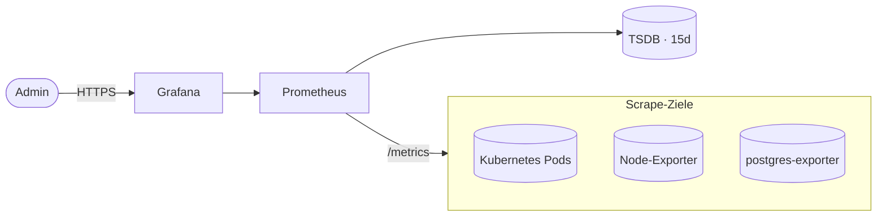

# Monitoring — Prometheus und Grafana

## Übersicht

Prometheus und Grafana bilden das Observability-Stack des Workspace MVP. 

- **Prometheus:** Zeit-Reihen-Datenbank für Metriken (Scraping, Speicherung, Queries)
- **Grafana:** Visualisierung von Metriken, Dashboards, Alerting
- **Optional** — wird separat installiert und nicht standardmäßig deployt
- **Namespace:** `monitoring` (isoliert vom `workspace`-Namespace)
- **URLs:** 
  - Dev: http://prometheus.localhost, http://grafana.localhost
  - Prod: https://prometheus.korczewski.de, https://grafana.korczewski.de



---

## Architektur

### Komponenten

**1. Prometheus (Metriken-Server)**
- Scrapet Metriken von Kubernetes-Nodes, Pods, Services
- Zeit-Reihen-DB mit 15-Tage-Retention (standard)
- PersistentVolume: `prometheus-pvc` (25 GB standard)
- HTTP-API für Queries (PromQL)

**2. Grafana (Dashboards)**
- Web-UI für Datenvisualisierung
- Pre-built Dashboards:
  - **Kubernetes Overview:** Pod-Status, Ressourcen-Nutzung, Netzwerk
  - **Node Metrics:** CPU, RAM, Disk per Node
  - **DSGVO Compliance:** Image-Herkunft, Egress, privilegierte Container
- User Management, Data Sources, Alerts konfigurierbar

**3. ServiceMonitor (Prometheus Operator)**
- Kubernetes Custom Resources für automatisches Service-Scraping
- Prometheus entdeckt Targets über Labels
- Pro Service: einfaches `serviceMonitorSelector` in Prometheus-Config

---

## Deployment

### Installation

```bash
# Prometheus + Grafana Stack installieren
kubectl create namespace monitoring
kubectl apply -f monitoring/            # oder: task observability:install
```

### Status überprüfen

```bash
kubectl get pods -n monitoring
kubectl get pvc -n monitoring
kubectl get svc -n monitoring
```

### Logs

```bash
kubectl logs -n monitoring deployment/prometheus
kubectl logs -n monitoring deployment/grafana
```

---

## DSGVO-Compliance-Dashboard (NFA-01)

Ein spezialisiertes Grafana-Dashboard visualisiert Compliance-Anforderungen:

### Zweck

Das Dashboard überprüft folgende Punkte **automatisch**:

1. **Image-Herkunft (NFA-01)**
   - Nur `registry.localhost:5000/*` (lokale Registry)
   - Keine Cloud-Registries: `gcr.io`, `amazonaws.com`, `docker.io`
   - Zeigt verdächtige Images auf

2. **Netzwerk-Egress-Überwachung**
   - Welche Pods kommunizieren nach außen?
   - Whitelist vs. tatsächliche Verbindungen vergleichen
   - Potenzielle Datenverlust-Vektoren identifizieren

3. **Privilegierte Container**
   - `securityContext.privileged: true` muss 0 sein
   - Alert bei Violation

4. **Ressourcen-Anforderungen**
   - Alle Pods müssen CPU/RAM-Requests + Limits haben
   - Verhindert unkontrollierte Ressourcen-Nutzung

### Import

1. **Grafana öffnen:** http://grafana.localhost
2. **Admin-Passwort:** Aus `workspace-secrets` (Default: `admin/admin` für Dev)
3. **Dashboard importieren:**
   - Grafana UI → "+" → "Import"
   - JSON-Datei hochladen: `grafana/dashboards/compliance.json`
   - Oder: Prometheus als Data Source auswählen und manuell Queries einfügen

### Dashboard-Panels

| Panel | Query | Schwellwert |
|-------|-------|-------------|
| **Non-Compliant Images** | `count(kube_pod_container_image{image!~"registry\\.localhost.*"})` | = 0 |
| **Egress Connections** | `sum by (pod_name) (rate(container_network_transmit_bytes[5m]))` | < Whitelist |
| **Privileged Containers** | `kube_pod_container_security_context_privileged == 1` | = 0 |
| **Missing Resource Limits** | `count(kube_pod_container_resource_limits_memory_bytes == 0)` | = 0 |

---

## Gescrapte Services / Metriken

Prometheus scrapet automatisch von:

### Kubernetes-Metriken
- **kube-state-metrics:** Pod-Status, Deployment-Replicas, Job-Status
- **kubelet:** Node-Ressourcen, Container-Runtime-Metriken
- **kube-proxy:** Netzwerk-Performance

### Application-Metriken (Services im `workspace`-Namespace)
- **Keycloak:** Authentifizierungen, Session-Duration
- **Nextcloud:** Datei-Operationen, WebDAV-Requests
- **PostgreSQL (shared-db):** Query-Performance, Connections, Transaction-Rate
- **Traefik:** HTTP-Request-Rate, Error-Rate (5xx, 4xx)
- **Custom Apps:** Über Annotations oder ServiceMonitor definieren

### Eigene Metriken hinzufügen

Für einen Service in `workspace`:

```yaml
# k3d/kustomization.yaml oder deploy/
apiVersion: v1
kind: Service
metadata:
  name: my-service
  labels:
    app: my-service
spec:
  ports:
    - name: metrics
      port: 9090
      targetPort: 9090
  selector:
    app: my-service

---
apiVersion: monitoring.coreos.com/v1
kind: ServiceMonitor
metadata:
  name: my-service
spec:
  selector:
    matchLabels:
      app: my-service
  endpoints:
    - port: metrics
      interval: 30s
```

---

## Zugriff & Authentifizierung

### Development (k3d)

```bash
# Prometheus
kubectl port-forward -n monitoring svc/prometheus 9090:9090
# Öffnen: http://localhost:9090

# Grafana
kubectl port-forward -n monitoring svc/grafana 3000:3000
# Öffnen: http://localhost:3000
# Login: admin / admin (oder aus workspace-secrets)
```

### Production

- **Prometheus:** https://prometheus.korczewski.de (hinter Ingress)
  - Authentifizierung: OAuth2-Proxy + Keycloak (nur Admin-Rolle)
- **Grafana:** https://grafana.korczewski.de
  - Authentifizierung: Keycloak OIDC (auto-provisioned users)
  - Admin-Passwort: Sealed Secret in `prod/`

---

## Betrieb & Wartung

### Pod-Status überprüfen

```bash
kubectl get pods -n monitoring
kubectl describe pod -n monitoring <pod-name>
```

### Logs

```bash
# Prometheus Scrape-Fehler
kubectl logs -n monitoring statefulset/prometheus | grep "error"

# Grafana User-Login-Fehler
kubectl logs -n monitoring deployment/grafana | grep "auth"
```

### Neustart

```bash
# Ganzer Stack
kubectl rollout restart deployment -n monitoring

# Nur Prometheus
kubectl rollout restart statefulset/prometheus -n monitoring

# Nur Grafana
kubectl rollout restart deployment/grafana -n monitoring
```

### Speicher-Management

```bash
# PVC-Nutzung prüfen
kubectl get pvc -n monitoring
df -h /var/lib/kubelet/plugins/kubernetes.io/local-static-provisioner/pv/pv-prometheus-storage/

# Alte Metriken löschen (wenn > 25GB)
# Prometheus stoppt automatisch bei PVC-Überlauf
# Lösung: PVC-Größe erhöhen oder Retention verkürzen
```

**Retention konfigurieren:**

In der Prometheus-Konfiguration (`k3d/prometheus.yaml` oder `prometheus-config.yaml`):
```yaml
global:
  scrape_interval: 30s
  retention: 15d        # Standard: 15 Tage
  # retention: 7d       # Kürzer für kleinere Disks
```

---

## Alerting

Prometheus kann Alerts auslösen, wenn Bedingungen erfüllt sind:

### Beispiel: Node-Speicher > 85%

```yaml
groups:
  - name: kubernetes
    rules:
      - alert: NodeMemoryHighUsage
        expr: (1 - (node_memory_MemAvailable_bytes / node_memory_MemTotal_bytes)) * 100 > 85
        for: 5m
        annotations:
          summary: "High memory usage on {{ $labels.node }}"
```

Integration mit Slack/Email/PagerDuty über Alertmanager (optional).

---

## Fehlerbehebung

### Prometheus scrapet keine Metriken

**Symptom:** Keine Daten in Grafana-Dashboards

**Behebung:**
```bash
# 1. Status überprüfen
kubectl get targets -n monitoring
# oder: http://prometheus.localhost/targets

# 2. Service ist erreichbar?
kubectl get svc -n workspace
# Sollte: keycloak, nextcloud, website, shared-db, etc.

# 3. ServiceMonitor ist korrekt?
kubectl get servicemonitor -n monitoring
```

### Grafana zeigt "Data source offline"

**Behebung:**
```bash
# 1. Prometheus ist erreichbar?
kubectl logs -n monitoring deployment/grafana | grep "prometheus"

# 2. DNS korrekt?
kubectl exec -n monitoring deployment/grafana -- nslookup prometheus.monitoring.svc.cluster.local
```

### Dashboard lässt sich nicht importieren

**Behebung:**
- JSON-Datei ist valide? `jq . < compliance.json`
- Prometheus als Data Source bereits vorhanden?
- Grafana Version kompatibel? (Dashboard-Syntax kann zwischen Versionen variieren)

---

## Weitere Ressourcen

- **Prometheus Query Language (PromQL):** https://prometheus.io/docs/prometheus/latest/querying/basics/
- **Grafana Dokumentation:** https://grafana.com/docs/grafana/latest/
- **DSGVO-Compliance:** [Sicherheit](security.md), [Anforderungen](requirements.md)
- **Services-Übersicht:** [Services](services.md)
