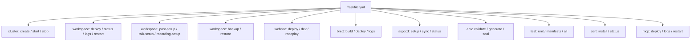

# Deployment & Betrieb



## Erstmalige Einrichtung

**Voraussetzungen:** Docker, k3d, kubectl, `task` (go-task)

**Schnellstart (alles auf einmal):**

```bash
task workspace:up
```

Dieser Befehl führt automatisch alle Schritte aus: Cluster erstellen, alle Workspace-Services deployen, Office-Stack, MCP-Server, Post-Setup, Talk-Konfiguration, Admin-Benutzer und Recording.

**Oder manuell Schritt für Schritt:**

```bash
task cluster:create       # 1. k3d-Cluster mit lokalem Registry erstellen
task workspace:deploy     # 2. Alle Kubernetes-Manifeste deployen
task workspace:post-setup # 3. Nextcloud-Apps aktivieren und konfigurieren
task workspace:vaultwarden:seed  # 4. Vaultwarden mit Secret-Vorlagen befüllen
task mcp:deploy           # 5. MCP-Server für Claude Code deployen
task website:deploy       # 6. Astro-Website bauen und deployen
```

---

## Cluster-Lifecycle

| Befehl | Beschreibung |
|--------|-------------|
| `task cluster:create` | k3d-Dev-Cluster mit lokalem Registry erstellen |
| `task cluster:delete` | k3d-Dev-Cluster löschen und aufräumen |
| `task cluster:start` | Gestoppten Cluster starten |
| `task cluster:stop` | Cluster stoppen (Zustand bleibt erhalten, Ressourcen freigeben) |
| `task cluster:status` | Cluster-Status, Nodes und Ressourcenauslastung anzeigen |

---

## Workspace-Deployment

| Befehl | Beschreibung |
|--------|-------------|
| `task workspace:up` | Vollautomatisches Setup: Cluster → MVP → Office → MCP → Billing |
| `task workspace:deploy` | Workspace in beliebige Umgebung deployen (`ENV=dev\|mentolder\|korczewski`) |
| `task workspace:status` | Workspace-MVP Deployment-Status anzeigen |
| `task workspace:validate` | k3d-Manifeste mit Kustomize Dry-Run validieren |
| `task workspace:teardown` | Alle Workspace-MVP Ressourcen entfernen |
| `task workspace:post-setup` | Nextcloud-Apps aktivieren, WOPI konfigurieren, Hardening (Indices, MIME, notify_push) |
| `task workspace:logs -- <svc>` | Logs eines Workspace-Service tailen |
| `task workspace:restart -- <svc>` | Einen Workspace-Service neu starten |
| `task workspace:psql -- <db>` | psql-Shell zur shared-db öffnen |
| `task workspace:port-forward` | shared-db auf localhost:5432 weiterleiten |
| `task workspace:dsgvo-check` | DSGVO-Konformitätsprüfung ausführen (NFA-01 Datensouveränitätsnachweis) |
| `task workspace:theme` | Dunkles Gold-Theme auf Nextcloud anwenden (idempotent, nach post-setup) |
| `task workspace:check-connectivity` | HTTPS-Erreichbarkeit aller Workspace-Services testen |
| `task workspace:check-updates` | Laufende Container-Images mit Registry auf Updates vergleichen |

---

## MCP-Server (Claude Code)

| Befehl | Beschreibung |
|--------|-------------|
| `task mcp:deploy` | Alle MCP-Pods deployen (core + apps + auth) |
| `task mcp:status` | MCP-Pod- und Container-Status anzeigen |
| `task mcp:logs -- <pod>/<ctr>` | MCP-Container-Logs tailen |
| `task mcp:restart -- core\|apps\|auth` | Einen MCP-Pod neu starten |
| `task mcp:select` | Interaktiver MCP-Server-Selektor |
| `task mcp:set-github-pat -- <token>` | GitHub PAT in claude-code-secrets aktualisieren |
| `task claude-code:setup` | Claude Code settings.json generieren (`-- cluster\|business`) |

---

## Vaultwarden

| Befehl | Beschreibung |
|--------|-------------|
| `task workspace:vaultwarden:seed` | Vaultwarden mit Produktions-Secret-Vorlagen befüllen (einmalig nach erstem Login) |
| `task workspace:vaultwarden:seed-logs` | Logs des letzten Vaultwarden-Seed-Jobs anzeigen |

---

## Website (Astro + Svelte)

| Befehl | Beschreibung |
|--------|-------------|
| `task website:build` | Astro-Website Docker-Image bauen (`ENV=dev\|mentolder\|...`) |
| `task website:build:import` | Website-Image bauen und in k3d-Cluster importieren |
| `task website:deploy` | Astro-Website in Website-Namespace deployen (`ENV=dev\|mentolder\|...`) |
| `task website:dev` | Astro Dev-Server lokal starten (Hot-Reload) |
| `task website:redeploy` | Image neu bauen, importieren und Website neu starten |
| `task website:status` | Website-Deployment-Status anzeigen |
| `task website:logs` | Website-Logs tailen |
| `task website:restart` | Website-Pod neu starten |
| `task website:teardown` | Website-Namespace und alle Ressourcen entfernen |

---

## ArgoCD (GitOps)

| Befehl | Beschreibung |
|--------|-------------|
| `task argocd:setup` | Vollständiges Setup: install → login → cluster:register → apps:apply (einmalig) |
| `task argocd:install` | ArgoCD auf Hub-Cluster (Hetzner) mit CMP-Sidecar installieren |
| `task argocd:password` | Initiales Admin-Passwort ausgeben |
| `task argocd:ui` | ArgoCD UI auf http://localhost:8090 weiterleiten |
| `task argocd:login` | Mit ArgoCD CLI einloggen |
| `task argocd:cluster:register` | Alle Produktions-Cluster bei ArgoCD registrieren und Labels setzen |
| `task argocd:apps:apply` | AppProject und ApplicationSet anwenden |
| `task argocd:status` | Sync/Health-Status aller Apps über alle Cluster anzeigen |
| `task argocd:sync -- <app>` | Sync für eine App manuell auslösen (z.B. `workspace-hetzner`) |
| `task argocd:diff -- <app>` | Diff zwischen Git- und Live-Zustand anzeigen |

---

## Whisper (optional)

| Befehl | Beschreibung |
|--------|-------------|
| `task whisper:deploy` | Faster-Whisper Transkriptionsdienst deployen (medium-Modell, CPU-only) |
| `task whisper:status` | Whisper-Deployment-Status anzeigen |
| `task whisper:logs` | Whisper-Logs tailen |

---

## TLS & DNS (Produktion)

| Befehl | Beschreibung |
|--------|-------------|
| `task cert:install` | cert-manager + lego DNS-01 Webhook für Wildcard-Zertifikate installieren |
| `task cert:secret -- <API_KEY>` | ipv64-API-Key als Secret speichern |
| `task cert:status` | Wildcard-Zertifikat und ClusterIssuer-Status anzeigen |


---

## Konfiguration

| Befehl | Beschreibung |
|--------|-------------|
| `task config:show` | Aufgelöste Konfiguration für eine Umgebung anzeigen (`ENV=mentolder`) |

---

## Tägliche Befehle (Kurzreferenz)

Die wichtigsten Befehle für den täglichen Betrieb:

```bash
task workspace:status                  # Alles auf einmal prüfen (Pods, Services, Ingress, PVCs)
task workspace:logs -- <service>       # Logs eines Service anzeigen (z.B. keycloak, nextcloud)
task workspace:restart -- <service>    # Service neu starten
task workspace:psql -- <db>            # Datenbankshell öffnen (z.B. postgres, nextcloud)
task workspace:port-forward            # shared-db auf localhost:5432 weiterleiten
task workspace:check-connectivity      # Alle Services auf Erreichbarkeit prüfen
```
