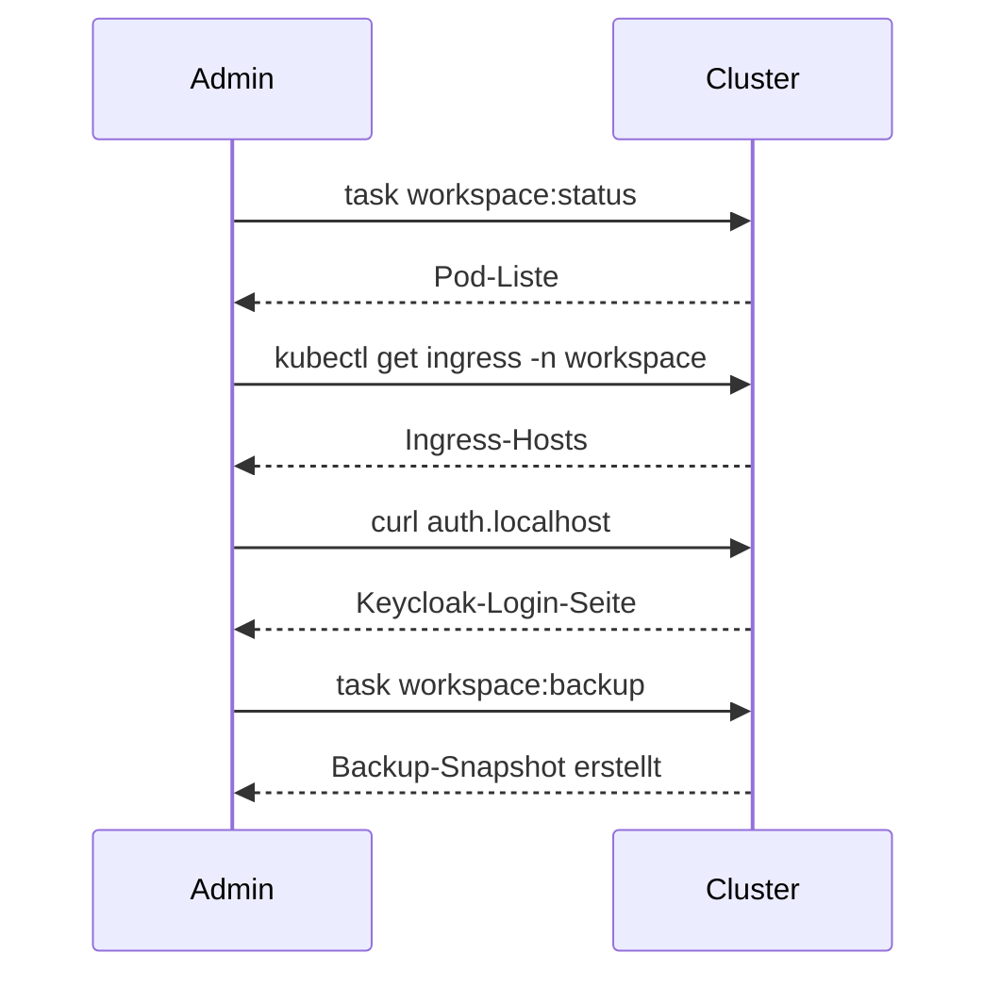

<div class="page-hero">
  <span class="page-hero-icon">🛠️</span>
  <div class="page-hero-body">
    <div class="page-hero-title">Quickstart — Admin</div>
    <p class="page-hero-desc">Vom leeren Server zum laufenden Workspace.</p>
    <div class="page-hero-meta">
      <span class="page-hero-tag">~30 Minuten</span>
      <span class="page-hero-tag">Kubernetes</span>
    </div>
  </div>
  <a href="#/" class="page-hero-back">← Übersicht</a>
</div>

# Admin-Quickstart

<p class="kicker">Admin · Erstinstallation</p>

Diese Seite bringt einen leeren k3d-Cluster auf einen funktionierenden Workspace. Für Produktiv-Deployments siehe [Deployment & Taskfile](operations) und [Umgebungen & Secrets](environments).

## Was du brauchst

| Werkzeug | Zweck |
|----------|-------|
| Docker | Container-Runtime |
| k3d | k3s in Docker — lokaler Cluster |
| kubectl | Kubernetes-CLI |
| task | Task-Runner (siehe `taskfile.dev`) |
| git | Quellcode |

## 1. Cluster anlegen

```bash
git clone https://github.com/Paddione/Bachelorprojekt.git
cd Bachelorprojekt
task cluster:create
```

Die Konfiguration steht in `k3d-config.yaml`. Wenn der Befehl durchläuft, gibt `kubectl get nodes` einen Eintrag mit Status `Ready` aus.

## 2. Workspace deployen

```bash
task workspace:deploy
```

Dies wendet alle Manifeste aus `k3d/` per Kustomize an: Keycloak, Nextcloud, Vaultwarden, Talk-HPB, Whiteboard, Website, Postgres und mehr. Erwarte eine Wartezeit von zwei bis drei Minuten beim ersten Mal — Container-Images werden gepullt.

## 3. Post-Setup ausführen

```bash
task workspace:post-setup
task workspace:talk-setup
```

Dies aktiviert Nextcloud-Apps (Calendar, Contacts, OIDC, Collabora) und konfiguriert Talk-HPB-Signaling.

## 4. Erste Validierung



Vier Health-Checks:

1. `task workspace:status` — alle Pods im Status `Running`?
2. `auth.localhost` öffnen — Keycloak-Login lädt?
3. `files.localhost` öffnen — Nextcloud-Login lädt, OIDC-Redirect funktioniert?
4. `task workspace:backup` — Snapshot wird angelegt?

## 5. Admin-User anlegen

```bash
task workspace:admin-users-setup
```

Damit werden Default-Admins in Keycloak und Nextcloud erstellt. Passwörter siehe `environments/.secrets/dev.yaml`.

## Weiter geht's

- [Adminhandbuch](adminhandbuch) — täglicher Betrieb
- [Backup & Wiederherstellung](backup) — Backup-Strategien
- [Sicherheitsarchitektur](security) — was wo verschlüsselt ist
