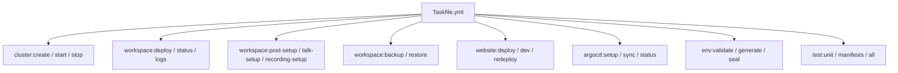

<div class="page-hero">
  <span class="page-hero-icon">🧭</span>
  <div class="page-hero-body">
    <div class="page-hero-title">Quickstart — Entwickler</div>
    <p class="page-hero-desc">Codebase-Tour für neue Beitragende.</p>
    <div class="page-hero-meta">
      <span class="page-hero-tag">Codebase</span>
      <span class="page-hero-tag">Workflow</span>
    </div>
  </div>
  <a href="#/" class="page-hero-back">← Übersicht</a>
</div>

# Entwickler-Quickstart

<p class="kicker">Entwickler · Codebase-Tour</p>

Diese Seite ist die Karte. Jede ausführliche Erklärung steht woanders — hier findest du den Einstieg.

## Repo-Layout

| Verzeichnis | Inhalt |
|-------------|--------|
| `k3d/` | Alle Kubernetes-Manifeste (Kustomize) — der einzige Deploy-Pfad |
| `prod/` | Gemeinsame Prod-Patches (TLS, Limits, Replicas) |
| `prod-mentolder/`, `prod-korczewski/` | Per-Env-Overlays |
| `environments/` | Per-Env-Config (`<env>.yaml`), SealedSecrets, Schema |
| `argocd/` | GitOps-Konfiguration für Multi-Cluster-Federation |
| `website/` | Astro + Svelte Portal |
| `brett/` | 3D Systembrett-Service |
| `scripts/` | Bash-Utilities (env-resolve, talk-hpb-setup, …) |
| `tests/` | BATS + Playwright Test-Suite |
| `Taskfile.yml` | Alle Build-/Deploy-/Ops-Befehle |

## Drei Beispiel-Workflows

### Eine Website-Änderung

```bash
cd website
npm run dev                  # Lokaler Astro-Dev-Server
# Edit src/components/...
git checkout -b feature/abc
# Commit + push
gh pr create
# CI grün → merge (squash) → task feature:website
```

### Eine Manifest-Änderung

```bash
# Edit k3d/<service>.yaml
task workspace:validate      # Dry-run
task workspace:deploy        # Lokal anwenden
./tests/runner.sh local FA-03   # Relevanten Test fahren
```

### Einen Test schreiben

```bash
# Edit tests/integration/sa-08.bats
./tests/runner.sh local SA-08 --verbose
task test:unit               # BATS-Unit-Tests
task test:manifests          # Kustomize-Output-Validierung
```

## Taskfile-Tour



## CI/CD

GitHub Actions (`.github/workflows/ci.yml`) läuft auf jeder PR:

- Offline-Tests: `task test:all` (BATS + Manifest-Struktur + Taskfile-Dry-Run)
- Image-Pin-Advisory + Hardcoded-Secret-Detection in `k3d/*.yaml`

PRs werden squash-gemergt. Branch-Naming: `feature/*`, `fix/*`, `chore/*`.

## Weiter geht's

- [Beitragen & CI/CD](contributing) — vollständiger PR-Workflow
- [Tests](tests) — Test-IDs (FA-/SA-/NFA-) und Kategorien
- [Architektur](architecture) — System-Diagramm und Komponenten
- [Migration](migration) — wie Migrations laufen
