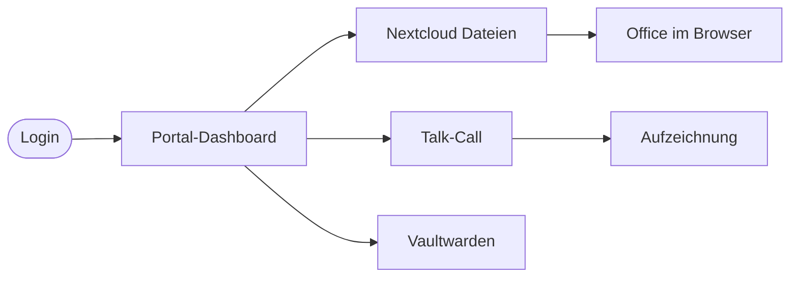

  🚀
  

    
Endnutzer · Erste Schritte

    
In fünf Minuten startklar

    
In fünf Minuten vom ersten Login zum ersten Talk-Call.

    

      5 Minuten
      Kein Setup
    

  

  <a href="#/" class="page-hero-back">← Übersicht</a>

# In fünf Minuten startklar

Endnutzer · Erste Schritte

Du hast einen Account von deiner Plattform-Administration erhalten. Diese Seite führt dich durch deinen ersten produktiven Tag.

  

    
1

    Portal öffnen
    ~1 min
  

  

Rufe `https://web.{DOMAIN}/portal` auf. Es wird dich automatisch zum Single Sign-On weiterleiten.

  

  

    
2

    Anmelden
    ~1 min
  

  

Gib Benutzername und Initial-Passwort ein. Beim ersten Login wirst du gebeten, ein neues Passwort zu setzen — wähl mindestens zwölf Zeichen.

  

  

    
3

    Dashboard kennenlernen
    ~2 min
  

  

Nach dem Login landest du im Portal-Dashboard. Du siehst:

- **Eigene Termine** — direkt mit Talk-Call verknüpft
- **Letzte Dateien** — synchronisiert aus Nextcloud
- **Kontakt** — Chat mit anderen Workspace-Nutzern

  

  

    
4

    Datei hochladen
    ~1 min
  

  

Klick auf **Dateien** in der Seitenleiste. Du landest in Nextcloud. Zieh eine Datei in den Browser — fertig.

  

  

    
5

    Talk-Call starten
    ~1 min
  

  

Zurück im Portal: **Talk** öffnen → **Neuer Call**. Sende den Link an Teilnehmer per Chat oder Mail.

  

## Tiefer einsteigen

- **Whiteboard** — kollaboratives Zeichnen, mit Systembrett-Vorlage für systemische Aufstellungen.
- **Vaultwarden** — Passwort-Tresor, geteilt mit Teamkollegen.
- **Office** — Word/Excel/PowerPoint im Browser, öffnet aus Nextcloud.

> **Mehr erfahren:** Vollständiges [Benutzerhandbuch](benutzerhandbuch) für alle Funktionen.
