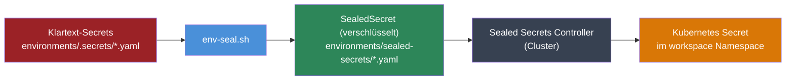

<div class="page-hero">
  <span class="page-hero-icon">🔒</span>
  <div class="page-hero-body">
    <div class="page-hero-title">Sicherheitsarchitektur</div>
    <p class="page-hero-desc">Defense-in-Depth: Mehrschichtiger Sicherheitsansatz vom Netzwerk bis zum Container.</p>
    <div class="page-hero-meta">
      <span class="page-hero-tag">Für Administratoren</span>
      <span class="page-hero-tag">SA-01–SA-10</span>
    </div>
  </div>
  <a href="#/" class="page-hero-back">← Übersicht</a>
</div>

# Sicherheitsarchitektur

## Überblick

Das Workspace MVP folgt dem Defense-in-Depth-Prinzip: Sicherheit wird auf mehreren unabhängigen Ebenen durchgesetzt. Der Ausfall einer einzelnen Ebene führt nicht zum vollständigen Sicherheitsverlust.

```
Ebene 1: Netzwerk           — Kubernetes NetworkPolicies (Default-Deny)
Ebene 2: Transport          — TLS für alle externen Verbindungen (Produktion)
Ebene 3: Authentifizierung  — Keycloak OIDC / Single Sign-On
Ebene 4: Autorisierung      — Traefik-Middlewares, oauth2-proxy, RBAC
Ebene 5: Container          — Pod Security Standards, SecurityContexts
Ebene 6: Daten              — Sealed Secrets, verschlüsselte Backups
```

## Authentifizierung & Autorisierung

### Single Sign-On (Keycloak OIDC)

Alle Services authentifizieren über Keycloak als zentralen OIDC-Provider. Es existiert kein Service mit eigenem Login-Formular (Ausnahme: Vaultwarden nutzt die native Bitwarden-API als Second-Factor-Manager, kann aber ebenfalls per OIDC angebunden werden).

**Passwort-Richtlinie (Keycloak Realm `workspace`):**

| Anforderung | Wert |
|-------------|------|
| Mindestlänge | 12 Zeichen |
| Großbuchstaben | mind. 1 |
| Kleinbuchstaben | mind. 1 |
| Ziffern | mind. 1 |
| Sonderzeichen | mind. 1 |
| Passwort-Hashing | PBKDF2-SHA512 |
| Brute-Force-Schutz | Aktiviert (Keycloak Detection) |

### Traefik-Middlewares als erste Verteidigungslinie

Bevor eine Anfrage den eigentlichen Service erreicht, durchläuft sie Traefik-Middlewares:

| Middleware | Anwendung | Funktion |
|------------|-----------|----------|
| `https-redirect` | Alle Services (Produktion) | HTTP → HTTPS erzwingen |
| `security-headers` | Alle Services | OWASP-Security-Header setzen |
| `oauth2-proxy` | Docs, Mailpit, Traefik Dashboard | Keycloak SSO-Gateway |
| `rate-limit-*` | Keycloak, Nextcloud, Website | Anfragen-Drosselung |

## Netzwerksicherheit

### NetworkPolicies (Kubernetes L3)

Alle Namespaces (`workspace`, `website`) haben Default-Deny für Ingress **und** Egress. Nur explizit freigegebene Verbindungen sind erlaubt.

**Kommunikationsmatrix (aus `k3d/network-policies.yaml`):**

| Policy | Richtung | Erlaubte Verbindung |
|--------|----------|---------------------|
| `default-deny-ingress` | Eingehend | Alles blockiert (Default) |
| `default-deny-egress` | Ausgehend | Alles blockiert (Default) |
| `allow-dns-egress` | Ausgehend | Alle Pods → kube-dns (Port 53 UDP/TCP) |
| `allow-intra-namespace-egress` | Ausgehend | Pods → Pods im selben Namespace |
| `allow-intra-namespace-ingress` | Eingehend | Pods ← Pods im selben Namespace |
| `allow-traefik-ingress` | Eingehend | Alle Pods ← Traefik (kube-system) |
| `allow-website-ingress` | Eingehend | workspace-Pods ← website-Namespace |
| `allow-collabora-egress` | Ausgehend | Nextcloud → Collabora (Port 9980, WOPI) |
| `allow-mcp-external-egress` | Ausgehend | mcp-github, mcp-stripe → Internet (Port 443) |
| `allow-traefik-egress` | Ausgehend | Alle Pods → Traefik intern (Port 8443/8000) |
| `allow-signaling-coturn-egress` | Ausgehend | spreed-signaling → Janus MCU (Port 8188) |
| `allow-transcriber-to-website-egress` | Ausgehend | talk-transcriber → website (Port 80/4321) |

> **Wichtig:** Internet-Egress ist nur für dedizierte MCP-Server (`mcp-github`, `claude-code-mcp-stripe`) auf Port 443 erlaubt. Alle übrigen Pods sind vom öffentlichen Internet isoliert.

```bash
# NetworkPolicies anzeigen
kubectl get networkpolicies -n workspace
kubectl describe networkpolicy default-deny-egress -n workspace
```

## Traefik-Middlewares (HTTP-Schicht)

Die Middleware-Definitionen befinden sich in `k3d/traefik-middlewares-dev.yaml` (Entwicklung) und `prod/traefik-middlewares.yaml` (Produktion).

### Security-Header

Alle externen Services erhalten folgende HTTP-Security-Header:

| Header | Wert |
|--------|------|
| `X-Frame-Options` | `SAMEORIGIN` |
| `X-Content-Type-Options` | `nosniff` |
| `X-XSS-Protection` | `1; mode=block` |
| `Referrer-Policy` | `strict-origin-when-cross-origin` |
| `Permissions-Policy` | `camera=(), microphone=(), geolocation=(), payment=()` |

### Zugriffsschutz interner Dienste

- **Mailpit** (`mail.*`): Keycloak OIDC über `oauth2-proxy-mailpit` (ForwardAuth), Zugang auf Admin-E-Mail-Adressen beschränkt
- **Docs** (`docs.*`): Keycloak SSO via oauth2-proxy — nur authentifizierte Nutzer können die Dokumentation lesen

### Rate-Limiting (Produktion)

| Service | Ø Anfragen/s | Burst |
|---------|-------------|-------|
| Keycloak | 20 | 40 |
| Vaultwarden | 20 | 40 |
| Nextcloud | 50 | 100 |
| Website | 200 | 400 |

## Container-Härtung

### Pod Security Standards

Der `workspace`-Namespace erzwingt folgende Pod Security Standards (aus `k3d/namespace.yaml`):

```yaml
pod-security.kubernetes.io/enforce: baseline
pod-security.kubernetes.io/warn: restricted
```

- **baseline** (erzwungen): Verhindert bekannte Privilege-Escalation-Vektoren
- **restricted** (Warnung): Zeigt Verstöße gegen strengere Richtlinien an

### SecurityContexts pro Container

Alle Deployments setzen mindestens:

```yaml
securityContext:
  allowPrivilegeEscalation: false
  capabilities:
    drop: [ALL]
  seccompProfile:
    type: RuntimeDefault
```

**Vollständige Härtung** (`readOnlyRootFilesystem: true`, `runAsNonRoot: true`):
`mailpit`, `oauth2-proxy-docs`, `docs`, `nextcloud-redis`, `website`

**Partielle Härtung** (`readOnlyRootFilesystem: false` — Applikation schreibt Laufzeitdaten):
`keycloak`, `nextcloud`, `vaultwarden`, `whiteboard`

**Sonderfälle:**
- `collabora`: benötigt `SYS_ADMIN` (LibreOffice-Kern) — isoliert im eigenen Namespace `workspace-office`
- `nextcloud`: initContainers laufen als root für Berechtigungs-Setup

## TLS & Zertifikate

### Entwicklung (k3d)

Kein TLS — der k3d-Cluster läuft lokal (`*.localhost`), HTTP reicht für die Entwicklung.

### Produktion

cert-manager + lego-Webhook stellen automatisch ein Wildcard-TLS-Zertifikat via DNS-01-Challenge aus:

```
Let's Encrypt ACME v2
  → cert-manager
    → lego DNS-01 Webhook
      → ipv64.net DNS API
        → TXT-Record _acme-challenge.korczewski.de
          → Wildcard-Zertifikat *.korczewski.de
```

```bash
task cert:install               # cert-manager + lego Webhook installieren
task cert:secret -- <api-key>   # ipv64 API-Key speichern
task cert:status                # Zertifikat-Status anzeigen
```

### PostgreSQL (cluster-intern)

Opportunistisches TLS mit selbst-signierten Zertifikaten — nur cluster-intern genutzt, bei jedem Pod-Restart neu generiert.

## Secrets-Management

### Entwicklung

`k3d/secrets.yaml` enthält ausschließlich Entwicklungswerte (Base64-kodiert). **Niemals echte Credentials in diese Datei committen.**

### Produktion (Sealed Secrets)

Produktions-Secrets werden mit dem Sealed Secrets Controller (bitnami/sealed-secrets) asymmetrisch verschlüsselt und können sicher im Git-Repository versioniert werden.



**Workflow:**
1. Klartext-Secrets in `environments/.secrets/<umgebung>.yaml` pflegen (`.gitignore`d)
2. `scripts/env-seal.sh` verschlüsselt mit dem Cluster-Zertifikat
3. Verschlüsselte `SealedSecret`-Ressourcen in `environments/sealed-secrets/` committen
4. Der Sealed Secrets Controller im Cluster entschlüsselt automatisch

## Backup-Verschlüsselung

Tägliche Backups der PostgreSQL-Datenbanken:
- **Verschlüsselung:** AES-256-CBC mit PBKDF2 (openssl)
- **Rotation:** 30-Tage-Aufbewahrung
- **Scope:** keycloak, nextcloud, website

## Sicherheitstest-Suite

Die Tests SA-01 bis SA-10 decken alle Sicherheitsebenen ab:

| Test-ID | Bereich | Beschreibung |
|---------|---------|-------------|
| SA-01 | Transport | TLS-Verschlüsselung aller externen Verbindungen |
| SA-02 | Authentifizierung | Login-Flow, Brute-Force-Lockout |
| SA-03 | Passwort-Sicherheit | PBKDF2-SHA512 Hashing verifizieren |
| SA-04 | Injection | SQL-Injection-Schutz |
| SA-05 | Netzwerk | NetworkPolicy Default-Deny aktiv |
| SA-06 | Container | Keine privilegierten Container |
| SA-07 | Secrets | Keine Klartext-Credentials in ConfigMaps |
| SA-08 | Header | Security-Header auf allen Services |
| SA-09 | Zugangskontrolle | Unauthentifizierter Zugriff blockiert |
| SA-10 | Backups | Verschlüsselte Backups vorhanden |

```bash
# Einzelnen Test ausführen:
./tests/runner.sh local SA-05

# Alle Sicherheitstests:
./tests/runner.sh local SA-01
./tests/runner.sh local SA-02
# ...
```

Vollständige Testabläufe und Acceptance-Kriterien: [tests.md](tests.md)

## CI-Sicherheitsprüfungen

GitHub Actions prüft bei jedem Pull Request automatisch:

| Prüfung | Werkzeug | Beschreibung |
|---------|---------|-------------|
| Image Pinning | custom check | Alle Container-Images auf spezifische Version gepinnt |
| Secret Detection | git-secrets | Scan nach versehentlich committeten Credentials |
| Manifest-Validierung | kustomize + kubeconform | K8s-Manifeste gegen API-Schema validieren |
| YAML-Linting | yamllint | 200-Zeichen-Zeilenlimit, konsistente Formatierung |
| Shell-Linting | shellcheck | Alle Bash-Skripte auf häufige Fehler prüfen |
