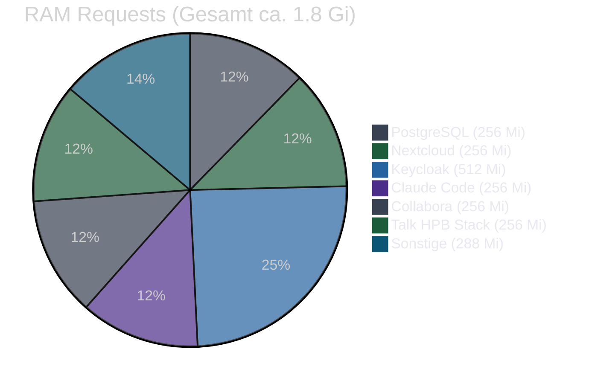

# Services

> **Hinweis für Mitarbeiter:** Eine verständliche Erklärung aller Dienste mit konkreten Anwendungsbeispielen findest Du im [Benutzerhandbuch](benutzerhandbuch.md). Diese Seite enthält die technischen Details für Administratoren.

Alle Services laufen als Kubernetes Deployments. Jeder Service hat definierte Resource Requests/Limits und Health Checks.

## Kern-Services

### Keycloak (SSO)

**Für Mitarbeiter:** Keycloak ist der zentrale Login-Dienst. Du loggst Dich einmal ein und bist danach automatisch in allen anderen Diensten angemeldet (Single Sign-On). Keycloak verwaltet auch Passwort-Regeln und Benutzerkonten.

| Eigenschaft | Wert |
|-------------|------|
| Image | `quay.io/keycloak/keycloak:26.6` |
| Port | 8080 |
| URL | http://auth.localhost |
| Datenbank | PostgreSQL (shared-db/keycloak) |
| Resources | 250m--1 CPU, 512Mi--1Gi RAM |
| Manifest | `k3d/keycloak.yaml` |

OIDC-Provider fuer alle Services. Realm `workspace` wird beim Start automatisch importiert. Siehe [Keycloak & SSO](keycloak.md) fuer Details.

### Nextcloud (Dateien + Talk)

**Für Mitarbeiter:** Nextcloud ist Dein interner Cloud-Speicher. Hier lädst Du Dateien hoch, teilst Ordner mit Kollegen, führst Kalender und startest Videokonferenzen (über Nextcloud Talk). Dokumente lassen sich direkt im Browser bearbeiten.

| Eigenschaft | Wert |
|-------------|------|
| Image | `nextcloud:33-apache` |
| Port | 80 |
| URL | http://files.localhost |
| Datenbank | PostgreSQL (shared-db/nextcloud) |
| Storage | 2 Gi (App) + 50 Gi (Daten) |
| Resources | 200m CPU, 256Mi--1Gi RAM |
| Manifest | `k3d/nextcloud.yaml` |

Dateiverwaltung mit Kalender, Kontakte, Talk (Video), Collabora-Integration. OIDC ueber `nextcloud-oidc-dev.php` ConfigMap. Apps werden nach Deploy per `task workspace:post-setup` aktiviert:
- calendar, contacts, oidc_login, richdocuments, spreed

### Collabora Online (Office)

**Für Mitarbeiter:** Collabora ist das integrierte Büroprogramm. Du kannst Word-, Excel- und PowerPoint-Dateien direkt im Browser öffnen und bearbeiten – ohne zusätzliche Software. Mehrere Personen können gleichzeitig am selben Dokument arbeiten. Collabora öffnet sich automatisch aus Nextcloud heraus, Du musst es nicht separat aufrufen.

| Eigenschaft | Wert |
|-------------|------|
| Image | `collabora/code:25.04.9.4.1` |
| Port | 9980 |
| URL | http://office.localhost (antwortet mit "OK" — kein eigenstaendiges UI) |
| Resources | 200m CPU, 256Mi--1Gi RAM |
| Manifest | `k3d/collabora.yaml` |

LibreOffice-basiertes Online-Office. Verbunden mit Nextcloud ueber WOPI — Dokumente werden direkt aus Nextcloud heraus geoeffnet, nicht ueber die Collabora-URL. Woerterbuecher: Deutsch + Englisch.

### Talk HPB (Signaling)

**Für Mitarbeiter:** Dieser Dienst arbeitet unsichtbar im Hintergrund und sorgt dafür, dass Videokonferenzen in Nextcloud Talk stabil funktionieren. Du interagierst nicht direkt damit – er wird automatisch genutzt, wenn Du einen Videoanruf startest.

Drei Deployments fuer WebRTC-Videokonferenzen:

| Komponente | Image | Port |
|------------|-------|------|
| spreed-signaling | `strukturag/nextcloud-spreed-signaling:2.1.1` | 8080 |
| Janus Gateway | `canyan/janus-gateway:master` | 8188 |
| NATS | `nats:2.10-alpine` | 4222 |
| coturn | `coturn/coturn:4.6-alpine` | 3478 |

**Manifest:** `k3d/talk-hpb.yaml` (signaling + Janus + NATS), `k3d/coturn.yaml`

Janus konfiguriert mit STUN/TURN ueber coturn. RTP-Port-Range: 20000--40000. Alle Konfigurationen ueber ConfigMaps inline im Manifest.

## AI

### Claude Code (KI-Assistent)

**Für Mitarbeiter:** Claude ist Dein interner KI-Assistent. Du kannst ihm Fragen stellen, Texte schreiben lassen, Zusammenfassungen anfordern oder Dir bei Aufgaben helfen lassen. Zugriff über die KI-Seite in Deinem Browser. Gib keine sensiblen Kundendaten in die KI ein.

Claude Code ist ein lokaler KI-Client (CLI/Desktop/IDE), der ueber MCP-Server (Model Context Protocol) mit dem Kubernetes-Cluster interagiert. Es gibt kein Web-UI im Cluster -- stattdessen zeigt `ai.localhost` eine MCP-Status-Seite mit Health-Checks aller MCP-Server.

| Eigenschaft | Wert |
|-------------|------|
| Status-Seite | http://ai.localhost (MCP-Status-Dashboard) |
| MCP-Server | 9 Server in separaten Pods |
| Backend | Anthropic API (Claude Sonnet 4) |
| Manifest | `k3d/claude-code-config.yaml`, `k3d/claude-code-rbac.yaml` |

**MCP-Server (k3d/):**

| Pod / Manifest | Container | Funktion |
|----------------|-----------|----------|
| `claude-code-mcp-ops.yaml` | mcp-kubernetes, mcp-postgres, mcp-meetings | Cluster-Management, DB-Abfragen, Meeting-Daten |
| `claude-code-mcp-browser.yaml` | mcp-browser | Playwright Browser-Automatisierung |
| `claude-code-mcp-apps.yaml` | mcp-nextcloud | Dateien, Kalender, Kontakte |
| `claude-code-mcp-auth.yaml` | mcp-keycloak | Benutzer-/Rollenverwaltung |
| `claude-code-mcp-github.yaml` | mcp-github | GitHub Repos, Issues, PRs (PAT erforderlich) |
| `claude-code-mcp-stripe.yaml` | mcp-stripe | Stripe-Zahlungen, Produkte, Abonnements |

**Produktion (deploy/mcp/):**
- `mcp-status.yaml` -- Health-Dashboard (nginx + healthcheck sidecar)
- `mcp-auth-proxy.yaml` -- ForwardAuth-Proxy fuer Token-Validierung (RBAC)
- Konsolidierte Pods: `claude-code-mcp-core.yaml`, `claude-code-mcp-apps.yaml`, `claude-code-mcp-auth.yaml`

**Zugehoerige Manifeste:**
- `k3d/claude-code-config.yaml` -- Umgebungskonfiguration (MCP-URLs, API-Keys)
- `k3d/claude-code-rbac.yaml` -- Kubernetes RBAC fuer MCP-Zugriff (ClusterRole + ServiceAccount)
- `claude-code/system-prompt.md` -- System-Prompt fuer Claude Code
- `claude-code/cluster.settings.json` -- MCP-Konfiguration fuer Cluster-Admin-Rolle
- `claude-code/business.settings.json` -- MCP-Konfiguration fuer Business-Benutzer-Rolle

### Whisper (Transkription, optional)

**Für Mitarbeiter:** Whisper wandelt gesprochene Sprache automatisch in Text um (Spracherkennung). Dieser Dienst ist optional und wird nicht standardmäßig aktiviert.

| Eigenschaft | Wert |
|-------------|------|
| Image | `fedirz/faster-whisper-server:latest-cpu` |
| Port | 8000 |
| Resources | 1--4 CPU, 2--4Gi RAM |
| Manifest | `k3d/whisper.yaml` |

CPU-basierte Spracherkennung mit dem Medium-Modell. GPU-Variante: `k3d/whisper-gpu.yaml`. Deploy: `task whisper:deploy`.

### Talk Recording (Anruf-Aufzeichnung)

| Eigenschaft | Wert |
|-------------|------|
| Image | `nextcloud/aio-talk-recording` |
| Port | 1234 |
| Manifest | `k3d/talk-recording.yaml` |

Firefox/geckodriver-basierter Aufzeichnungsservice fuer Nextcloud Talk. Tritt Anrufen ueber spreed-signaling bei und zeichnet Audio/Video auf. Aufnahmen werden im Nextcloud-Dateiverzeichnis des Anruf-Erstellers gespeichert.

### Talk Transcriber (Live-Transkription)

**Für Mitarbeiter:** Der Talk Transcriber transkribiert laufende Nextcloud-Talk-Videokonferenzen in Echtzeit und stellt das Transkript als Textdatei bereit.

| Eigenschaft | Wert |
|-------------|------|
| Image | `ghcr.io/paddione/talk-transcriber:latest` |
| Port | intern |
| Resources | nach Konfiguration |
| Manifest | `k3d/talk-transcriber.yaml` |

Verbindet sich mit dem spreed-signaling-Server, nimmt am Anruf teil und uebertraegt Audio an den Whisper-Dienst zur Transkription.

## Business-Services

### Stripe-Checkout

**Für Mitarbeiter:** Zahlungen werden direkt ueber Stripe abgewickelt. Kunden bezahlen Leistungen per Kreditkarte oder SEPA auf der Leistungen-Seite oder ueber den CTA der Homepage. Es gibt keine separate Rechnungssoftware mehr — alle Zahlungsvorgaenge laufen ueber die Website-Stripe-Integration. Weitere Details: [Stripe-Integration](stripe.md).

| Eigenschaft | Wert |
|-------------|------|
| Keys | `STRIPE_SECRET_KEY`, `STRIPE_PUBLISHABLE_KEY` (workspace-secrets) |
| Checkout | Stripe-hosted Checkout Page |
| Webhook | `/api/stripe/webhook` (checkout.session.completed) |
| Konfiguration | Brand-Konfig (`mentolder.config.ts` / `korczewski.config.ts`) |

### Vaultwarden (Passwoerter)

**Für Mitarbeiter:** Vaultwarden ist der sichere Passwort-Safe des Teams. Hier speicherst Du Zugangsdaten und kannst sie sicher mit Kollegen teilen – alles verschlüsselt auf Deinen eigenen Servern. Du kannst auch das Bitwarden-Browser-Plugin nutzen, um Passwörter automatisch ausfüllen zu lassen. Achtung: Du benötigst ein eigenes Master-Passwort, das Du Dir gut merken musst.

| Eigenschaft | Wert |
|-------------|------|
| Image | `vaultwarden/server:1.35.3-alpine` |
| Port | 80 |
| URL | http://vault.localhost |
| Datenbank | PostgreSQL (shared-db/vaultwarden) |
| Storage | 5 Gi PVC |
| Resources | 50m CPU, 64--256Mi RAM |
| Manifest | `k3d/vaultwarden.yaml` |

Bitwarden-kompatibler Passwort-Manager mit SSO-Login ueber Keycloak. Seed-Job fuer initiale Ordnerstruktur: `task workspace:vaultwarden:seed`.

## Kollaboration

### Whiteboard

**Für Mitarbeiter:** Das digitale Whiteboard dient zum gemeinsamen Skizzieren, Brainstormen und Visualisieren – wie ein echtes Whiteboard in einem Besprechungsraum, nur online. Mehrere Personen können gleichzeitig zeichnen und schreiben.

| Eigenschaft | Wert |
|-------------|------|
| Image | `ghcr.io/nextcloud-releases/whiteboard:v1.5.7` |
| Port | 3002 |
| URL | http://board.localhost |
| Resources | 100m CPU, 128--256Mi RAM |
| Manifest | `k3d/whiteboard.yaml` |

Nextcloud-integriertes kollaboratives Whiteboard mit JWT-Authentifizierung.

## Infrastruktur-Services

### shared-db (PostgreSQL)

**Für Mitarbeiter:** Die zentrale Datenbank. Du interagierst nicht direkt damit — sie laeuft im Hintergrund und speichert Daten aller Dienste sicher auf dem eigenen Server.

| Eigenschaft | Wert |
|-------------|------|
| Image | `pgvector/pgvector:0.8.0-pg16` |
| Port | 5432 |
| Storage | 25 Gi PVC |
| Resources | 100m CPU, 256Mi RAM |
| Manifest | `k3d/shared-db.yaml` |

Gemeinsame PostgreSQL-16-Instanz fuer alle Services. Beherbergt separate Datenbanken und User fuer keycloak, nextcloud, vaultwarden und website. Zugriff per `task workspace:psql -- <db>` oder Port-Forward via `task workspace:port-forward`.

### Mailpit (Dev-Mail)

**Für Mitarbeiter:** Mailpit wird nur in der Entwicklungsumgebung verwendet und ist kein normaler E-Mail-Dienst. Es fängt alle ausgehenden E-Mails ab, damit sie nicht versehentlich echte Empfänger erreichen. In der Produktivumgebung wird ein normaler E-Mail-Server eingesetzt.

| Eigenschaft | Wert |
|-------------|------|
| Image | `axllent/mailpit:v1.29` |
| Ports | 1025 (SMTP), 8025 (Web UI) |
| URL | http://mail.localhost |
| Resources | 25m CPU, 32--128Mi RAM |
| Manifest | `k3d/mailpit.yaml` |

SMTP-Server fuer Entwicklung. Alle Services senden E-Mails an Mailpit.

### Docs (Docsify)

| Eigenschaft | Wert |
|-------------|------|
| Image | `joseluisq/static-web-server:2.36-alpine` |
| Port | 80 |
| URL | http://docs.localhost (SSO-geschuetzt) |
| Resources | 10m CPU, 16--64Mi RAM |
| Manifest | `k3d/docs.yaml` |

Static-Web-Server serviert die Docsify-Dokumentation aus einem Kubernetes ConfigMap. Kein Git-Sync -- Inhalte sind direkt im ConfigMap eingebettet. Zugriff ist per Keycloak-Login geschuetzt (oauth2-proxy-docs vorgelagert).

### oauth2-proxy-docs (Docs SSO-Gateway)

| Eigenschaft | Wert |
|-------------|------|
| Image | `quay.io/oauth2-proxy/oauth2-proxy:v7.9.0` |
| Port | 4180 |
| Upstream | `http://docs:80` |
| Resources | 50m CPU, 64--128Mi RAM |
| Manifest | `k3d/oauth2-proxy-docs.yaml` |

Keycloak-OIDC-Proxy vor dem Docs-Dienst. Benutzer werden zur Keycloak-Anmeldeseite weitergeleitet; nach erfolgreicher Authentifizierung wird die Anfrage an `docs:80` weitergeleitet.

### Messaging (Chat + Inbox)

**Für Mitarbeiter:** Das integrierte Messaging-System der Website bietet Chat-Raeume (themenbasierte Gruppen), Direktnachrichten zwischen Kunden und Admins sowie eine zentrale Inbox fuer eingehende Anfragen (Kontaktformulare, Buchungen, Bug-Reports). Erreichbar ueber das Benutzer-Portal nach dem Login.

| Eigenschaft | Wert |
|-------------|------|
| Tabellen | `chat_rooms`, `chat_messages`, `message_threads`, `messages`, `inbox_items` |
| Datenbank | PostgreSQL (shared-db/website) |
| Ungelesen-Benachrichtigungen | `notify-unread-cronjob` (K8s CronJob) |
| Manifest | Eingebettet in `k3d/website-schema.yaml` |

### Website (Astro + Svelte)

**Für Mitarbeiter:** Die öffentliche Unternehmenswebsite, die Besucher von außen sehen. Das Kontaktformular leitet Anfragen in die Admin-Inbox weiter. Auf der Leistungen-Seite kann direkt per Stripe bezahlt werden.

| Eigenschaft | Wert |
|-------------|------|
| URL | http://web.localhost |
| Namespace | `website` (eigener Namespace) |
| Manifest | `k3d/website.yaml` |
| Datenbank | PostgreSQL (shared-db/website) |
| Deploy | `task website:deploy` |

Multi-Brand-Unternehmenswebsite (mentolder / korczewski) mit:
- **Kontaktformular** — leitet Anfragen in die Admin-Inbox
- **Leistungen-Seite** — Preistabelle mit Stripe-Checkout
- **Homepage-CTA** — Stripe-Checkout-Button fuer das Haupt-Angebot
- **OIDC-Login** — Keycloak SSO fuer Kunden und Administratoren
- **Messaging** — Chat-Raeume, DMs, Inbox fuer eingehende Anfragen
- **Admin-Panel** (`/admin`) — Brand-Konfiguration: Services, Leistungen, Site-Einstellungen, Rechtstexte, Referenzen
- **Projektmanagement** (`/admin/projekte`) — Projekte, Teilprojekte und Aufgaben je Kunde; Gantt-Diagramm
- **Bug-Reporting** — Formular (`/admin/bugs`) mit Ticket-Tracking in der `website`-Datenbank
- **Monitoring** (`/admin/monitoring`) — Live-Uebersicht Pod-Status, Ressourcen und Events

Stripe-Keys werden als Kubernetes Secret injiziert. Setup: `task workspace:stripe-setup`. Siehe [Stripe-Integration](stripe.md).
Admin: Siehe [Projektmanagement-Admin](admin-projekte.md).

## Ressourcen-Uebersicht

