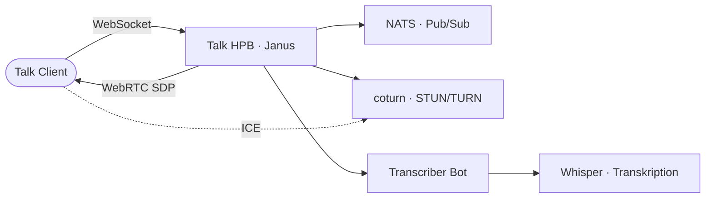

# Talk HPB — Signaling & WebRTC

## Übersicht

Die **High-Performance Backend (HPB)** Komponenten ermöglichen Video- und Audioanrufe mit mehreren Teilnehmern in Nextcloud Talk. Das HPB besteht aus mehreren Komponenten, die zusammen die Signalisierung und das Streaming von Echtzeit-Mediendaten verwalten.

| Parameter | Dev | Prod |
|-----------|-----|------|
| HPB-Signaling URL | `http://signaling.localhost` | `https://signaling.korczewski.de` |
| TURN-Server | `turn.localhost` | `turn.korczewski.de` |
| Protokoll | WebSocket (8080) | WebSocket Secure (443) |
| TURN-Ports | 3478 (UDP/TCP) | 3478 (UDP/TCP) |
| Janus WebSocket | `ws://janus.coturn:8188` (intern) | intern nur |
| NATS Message Bus | `nats://nats:4222` (intern) | intern nur |

**Namespaces:**
- `workspace`: Signaling Server (spreed-signaling), NATS Message Broker
- `coturn`: Janus Gateway (WebRTC Media Server), coturn (TURN/STUN Server)

---

## Architektur



**Datenfluss bei einem Videoanruf:**

1. **Signalisierung**: Nextcloud-Client verbindet sich via WebSocket zu spreed-signaling
2. **Session-Koordination**: spreed-signaling nutzt NATS, um Session-Informationen mit Janus auszutauschen
3. **Media Server**: Janus empfängt Audio/Video-Streams von den Clients, multiplext diese und leitet sie weiter
4. **NAT-Traversal**: Falls Client hinter NAT/Firewall sitzt, verwendet er TURN-Server (coturn) zur Erreichbarkeit

---

## Komponenten

### spreed-signaling (Signaling Server)

Der spreed-signaling Server ist das **Herzstück des HPB**. Er verwaltet alle aktiven Sitzungen und koordiniert die WebRTC-Verbindungen zwischen Clients.

**Image:** `strukturag/nextcloud-spreed-signaling:2.1.1`

**Port:** 8080 (HTTP/WebSocket)

**Verantwortlichkeiten:**
- WebSocket-Verbindungen zu Nextcloud-Clients akzeptieren
- Signalisierungsmeldungen (Offer/Answer/ICE Candidates) zwischen Clients weitergeben
- Session-Secrets für die HMAC-basierte Authentifizierung verwalten
- TURN-Anmeldedaten an Clients verteilen

**Konfiguration:**

Die Konfiguration ist in `server.conf.template` als ConfigMap hinterlegt. Ein Init-Container (`render-config`) ersetzt zur Laufzeit alle `@@VAR@@`-Platzhalter durch Werte aus dem Secret `workspace-secrets`:

| Variable | Geheim? | Quelle |
|----------|---------|--------|
| `SIGNALING_SECRET` | Ja | Secret `workspace-secrets` |
| `TURN_SECRET` | Ja | Secret `workspace-secrets` |
| `TURN_APIKEY` | Ja | Secret `workspace-secrets` |
| `SESSION_HASHKEY` | Nein | Dev-Hardcoded (stabil pro Pod) |
| `SESSION_BLOCKKEY` | Nein | Dev-Hardcoded (stabil pro Pod) |
| `CLIENTS_INTERNALSECRET` | Nein | Dev-Hardcoded (stabil pro Pod) |

**Backend-Verbindung:**

```
[backend]
allowall = true                    # Überspringt URL-Matching für Dev
secret = ${SIGNALING_SECRET}       # HMAC-Signatur zwischen Nextcloud und HPB
backends = backend-1
timeout = 10

[backend-1]
url = http://files.localhost       # Nextcloud URL
secret = ${SIGNALING_SECRET}
```

Der `allowall`-Flag ist notwendig in Dev, da Nextcloud-Überschreib-URL (`overwrite.cli.url = http://localhost`) nicht mit `files.localhost` übereinstimmt.

---

### NATS (Message Broker)

NATS ist ein **leichtgewichtiger Message Broker** für die interne Kommunikation zwischen spreed-signaling und Janus Gateway.

**Image:** `nats:2.10-alpine`

**Port:** 4222 (TCP)

**Zweck:**
- Dient als Pub/Sub-System für Signalisierungsmeldungen
- Entkoppelt Signaling-Server von Media-Server
- Ermöglicht Skalierung auf mehrere Janus/Signaling-Instanzen

**Ressourcen (Dev):**
- Memory Request: 64 Mi / Limit: 256 Mi
- CPU Request: 100m / Limit: 500m

NATS hat keinen Ingress und läuft rein intern. Weder Clients noch externe Services verbinden sich direkt.

---

### Janus Gateway (SFU — Selective Forwarding Unit)

Janus ist der **WebRTC Media Server**, der Audio- und Videostreams verwaltet und weiterleitet.

**Image:** `canyan/janus-gateway:master_cefca79700bdadd32d759ce65ba3805552a4d312`

**Port:** 8188 (WebSocket)

**Namespace:** `coturn` (mit `hostNetwork: true`)

**Architektur-Besonderheiten:**
- Läuft auf `hostNetwork` auf dem gleichen Node wie coturn
- Verwendet `ICE-Lite` (vereinachte ICE-Verhandlung)
- `nat_1_1_mapping`: Advertiert die öffentliche IP des Knotens in ICE-Kandidaten
- Verbindung zu spreed-signaling über NATS (interne Kommunikation)

**Konfigurationsdateien (ConfigMap `janus-config`):**

```
janus.jcfg                        # Hauptkonfiguration (NAT, RTP-Portbereich, Admin-Secret)
janus.transport.websockets.jcfg   # WebSocket-Transport (Port 8188)
janus.plugin.videoroom.jcfg       # Videoroom-Plugin (für Group-Calls)
```

**RTP/RTCP Port-Range:** 20000–20200 (UDP, auf hostNetwork direkt erreichbar)

---

### coturn (TURN/STUN Server)

coturn ist der **NAT-Traversal-Server** und ermöglicht Browser den Zugriff auf Janus, falls sie hinter NAT/Firewall stecken.

**Image:** `coturn/coturn:4.9-alpine`

**Ports:**
- 3478 (UDP + TCP) — STUN/TURN Standard
- 5349 (UDP + TCP) — TLS-TURN (optional, nicht aktiviert in diesem Setup)

**Namespace:** `coturn` (mit `hostNetwork: true`, pinned auf bestimmten Public Node)

**Authentifizierung:**
- REST-API-Methode (Nextcloud Talk Standard)
- Shared Secret zwischen coturn und Nextcloud Talk
- Dynamische Anmeldedaten: Jede Session bekommt kurzlebige TURN-Credentials

**Konfiguration:**

```bash
turnserver \
  --realm=turn.${PROD_DOMAIN}           # TURN-Realm (z. B. turn.korczewski.de)
  --use-auth-secret                     # REST-API-Auth
  --static-auth-secret=$(TURN_SECRET)   # Shared Secret
  --external-ip=${TURN_PUBLIC_IP}       # Öffentliche IP advertieren
  --listening-port=3478
  --min-port=49152
  --max-port=49252                      # Dynamische Port-Range für Media
```

**Warum separate Node?**

coturn und Janus müssen auf einem öffentlich erreichbaren Node laufen, da Browser direkt Verbindungen initiieren. `hostNetwork: true` ermöglicht das.

---

## Talk Recording

Die **Talk Recording**-Komponente zeichnet Video- und Audioanrufe auf.

**Image:** `nextcloud/aio-talk-recording:20260409_094910` (Firefox/geckodriver-basiert)

**Namespace:** `workspace`

**Ports:** 1234 (intern)

**Voraussetzungen:**

Nextcloud muss die folgenden Konfigurationen haben:

```bash
occ config:app:set spreed recording_servers \
  --value='[{"server":"http://talk-recording:1234","secret":"<RECORDING_SECRET>"}]'

occ config:app:set spreed call_recording --value='yes'
```

Beide werden automatisch via `task workspace:post-setup` gesetzt.

**Funktionsweise:**

1. Talk-Benutzer startet im Interface eine Aufnahme ("Aufnahme starten")
2. talk-recording-Service empfängt Webhook und öffnet Nextcloud Talk im Browser (geckodriver)
3. Der Browser simuliert einen Teilnehmer, der sich einwählt
4. Audio/Video werden erfasst und als Datei gespeichert
5. Aufzeichnung wird im Nextcloud-Dateiverwaltung des Anrufers gespeichert

**Einschränkungen:**
- Läuft nur auf amd64-Knoten (`nodeSelector: kubernetes.io/arch: amd64`)
- Eine Aufnahme nach der anderen (keine gleichzeitigen Aufnahmen)
- Benötigt Shared Memory (`/dev/shm`) für geckodriver

---

## Konfiguration & Secrets

### Secrets

Alle sensiblen Werte sind im Secret `workspace-secrets` zentralisiert:

| Key | Zweck | Länge | Dev-Wert |
|-----|-------|-------|----------|
| `SIGNALING_SECRET` | HMAC zwischen Nextcloud und HPB | 32 bytes | `devsignalingsecret1234567890` |
| `TURN_SECRET` | Shared Secret zwischen coturn und Nextcloud | 32 bytes | `devturnsecret1234567890abcdef` |
| `TURN_APIKEY` | Nicht verwendet (REST-API nutzt Secret) | - | `devturnapikey1234567890` |
| `RECORDING_SECRET` | Authentifizierung für Aufnahme-Webhooks | 32 bytes | `devrecordingsecret1234567890` |

**In Produktion:** Alle Secrets stammen aus Sealed Secrets (`prod/workspace-secrets-sealed.yaml`). In Dev: Literal-Werte aus `k3d/secrets.yaml`.

### Umgebungsvariablen (Kustomize-Substitution)

| Variable | Genutzt von | Beispiel |
|----------|-------------|----------|
| `${PROD_DOMAIN}` | coturn, Janus, spreed-signaling | `korczewski.de` |
| `${TURN_NODE}` | coturn, Janus (nodeSelector) | `k3d-dev-agent-0` |
| `${TURN_PUBLIC_IP}` | coturn, Janus (nat_1_1_mapping) | `192.168.1.100` |

---

## Betrieb

### Logs ansehen

```bash
# Signaling Server
task workspace:logs -- spreed-signaling

# NATS Message Bus
task workspace:logs -- nats

# Janus Gateway (in coturn namespace)
kubectl logs -n coturn -l app=janus -f

# coturn TURN Server (in coturn namespace)
kubectl logs -n coturn -l app=coturn -f

# Talk Recording
task workspace:logs -- talk-recording
```

### Pods neu starten

```bash
# Signaling Server
task workspace:restart -- spreed-signaling

# NATS
task workspace:restart -- nats

# Janus + coturn (Kubernetes)
kubectl rollout restart deployment/janus -n coturn
kubectl rollout restart deployment/coturn -n coturn
```

### Pod-Status prüfen

```bash
# Workspace Namespace
kubectl get pods -n workspace -l app=spreed-signaling
kubectl get pods -n workspace -l app=nats

# coturn Namespace
kubectl get pods -n coturn
kubectl describe pod -n coturn -l app=janus
```

### Manuelle Tests

**WebSocket-Verbindung zum Signaling Server prüfen:**

```bash
# Aus einem Test-Pod (oder localhost mit Port-Forward)
wscat -c ws://signaling.localhost/
```

**TURN-Server-Erreichbarkeit testen:**

```bash
# STUN-Test (mit turnutils_stunclient aus coturn-Paket)
stunclient localhost 3478
```

**Nextcloud Talk HPB verbunden?**

1. Nextcloud Admin → Einstellungen → Talk
2. Unter "High-Performance Backend" sollte ein grüner Status angezeigt werden
3. Falls rot: spreed-signaling nicht erreichbar oder Secret falsch

---

## Fehlerbehebung

### Video-Anrufe funktionieren nicht

**Symptom:** 1:1-Anrufe OK, aber Gruppen-Calls scheitern

**Ursachen:**
- spreed-signaling nicht erreichbar (Port 8080)
- `SIGNALING_SECRET` stimmt zwischen Nextcloud und HPB nicht überein
- NATS-Pod läuft nicht oder ist nicht erreichbar

**Debugging:**

```bash
# Signaling-Logs prüfen
task workspace:logs -- spreed-signaling | grep -i error

# NATS-Status prüfen
kubectl logs -n workspace -l app=nats

# Nextcloud Talk Fehler (Nextcloud-Admin-UI)
Einstellungen → Talk → "Debug-Modus aktivieren"
```

### "ICE failed" — Keine Audio/Video-Verbindung

**Symptom:** Browser-Fehler "ICE failed", Verbindung wird sofort beendet

**Ursachen:**
- coturn nicht erreichbar (Port 3478 blockiert)
- `TURN_SECRET` stimmt nicht überein
- Öffentliche IP von coturn nicht richtig advertiert

**Debugging:**

```bash
# coturn-Logs
kubectl logs -n coturn -l app=coturn | tail -50

# TURN-Erreichbarkeit prüfen
# Von außerhalb des Clusters:
timeout 2 nc -zu turn.korczewski.de 3478 && echo "Port offen" || echo "Port zu"

# Janus logs prüfen
kubectl logs -n coturn -l app=janus | grep -i ice
```

### NATS-Verbindungsfehler

**Symptom:** spreed-signaling startet nicht, Fehler: `nats: connect failed`

**Ursachen:**
- NATS-Pod läuft nicht
- Netzwerk-Policy blockiert Verbindung
- NATS nicht richtig deployed

**Debugging:**

```bash
# NATS-Pod-Status
kubectl get pod -n workspace -l app=nats

# Service erreichbar?
kubectl exec -n workspace -it deployment/spreed-signaling -- \
  nc -zv nats 4222

# NATS neu deployen
kubectl delete pod -n workspace -l app=nats
```

### Talk Recording startet nicht

**Symptom:** "Aufnahme starten" ist im Interface grau/deaktiviert

**Ursachen:**
- talk-recording Pod läuft nicht
- `RECORDING_SECRET` stimmt nicht mit Nextcloud überein
- Shared Memory `/dev/shm` voll oder nicht gemountet

**Debugging:**

```bash
# Talk-Recording-Status
kubectl get pod -n workspace -l app=talk-recording
kubectl logs -n workspace -l app=talk-recording

# Nextcloud-Konfiguration prüfen
kubectl exec -n workspace deployment/nextcloud -- \
  occ config:app:get spreed recording_servers
```

**Neustart:**

```bash
task workspace:restart -- talk-recording
```

### Affinity-Probleme bei spreed-signaling

**Symptom:** spreed-signaling bleibt in `Pending`, Nachricht: `0/N nodes are available: X Insufficient ... Y node(s) matched node selector`

**Hintergrund:** spreed-signaling bevorzugt, **nicht** auf `k3d-dev-agent-4` zu laufen (dort gibt es Janus-Netzwerkprobleme). Falls nur dieser Node verfügbar ist, wird trotzdem dort deployed.

**Debugging:**

```bash
# Pod-Status und Events
kubectl describe pod -n workspace -l app=spreed-signaling | tail -30
```

---

## Relevante Dateien

| Datei | Zweck |
|-------|-------|
| `k3d/talk-hpb.yaml` | Deployment: spreed-signaling, NATS, Konfiguration |
| `k3d/coturn-stack/coturn.yaml` | coturn TURN/STUN Server |
| `k3d/coturn-stack/janus.yaml` | Janus WebRTC Gateway + ConfigMap |
| `k3d/talk-recording.yaml` | Nextcloud Talk Recording Service |
| `k3d/secrets.yaml` | Secrets für HPB (SIGNALING_SECRET, TURN_SECRET, RECORDING_SECRET) |
| `prod/coturn-stack/` | Produktion-Overlays für coturn + Janus |
| `scripts/` | Utility-Scripts für HPB-Debugging |

---

## Weitere Ressourcen

- [Nextcloud Talk HPB Dokumentation](https://github.com/nextcloud/spreed/wiki/HPB)
- [Janus WebRTC Gateway](https://janus.conf.meetecho.com/)
- [coturn STUN/TURN Server](https://github.com/coturn/coturn)
- [ICE (Interactive Connectivity Establishment) RFC 5245](https://tools.ietf.org/html/rfc5245)
