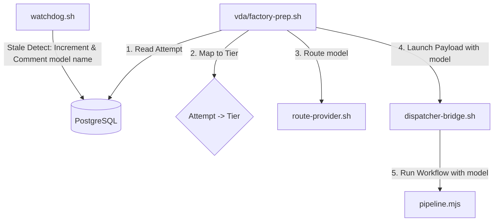

# Design Spec: factory-escalation-ladder

## Abstract

Implement a progressive model escalation ladder for the Software Factory. When a ticket fails or times out in the pipeline, the watchdog increments the attempt counter. The factory-prep step reads this counter and maps it to a progressively more capable model tier using `route-provider.sh`. This ensures the factory doesn't get stuck in a livelock using a weaker model and can escalate to DeepSeek models as needed.

## Architectural Changes



### 1. Attempt to Tier Mapping
In `scripts/vda/factory-prep.sh`:
- Query `tickets.factory_control` for `key = 'factory_attempt:<external_id>' AND brand = :brand`.
- If the value is empty or not an integer, default `attempt = 1`.
- Map:
  - `attempt == 1` -> tier `flash`
  - `attempt == 2` -> tier `haiku`
  - `attempt >= 3` -> tier `sonnet`
- Execute:
  `bash scripts/factory/route-provider.sh factory-implement <tier>`
  to get the model JSON:
  `{"provider":"...","modelId":"...","baseUrl":"...","slotId":...}`
- Inject this JSON under the key `"model"` in the launch object.

### 2. Passing the Model Payload
In `scripts/factory/dispatcher-bridge.sh`:
- Extract the `model` object from the prep launch JSON.
- Add it to the JSON arguments of the `Workflow` invocation.

In `scripts/factory/pipeline.mjs`:
- Define `FACTORY_MODEL` dynamically:
  ```javascript
  const FACTORY_MODEL = A.model || {
    provider: 'lmstudio',
    modelId: 'qwythos-9b-v2',
    baseUrl: 'http://127.0.0.1:1234',
  }
  ```
  This is used by `agentFn` across all phases.

### 3. Visibility in watchdog comments
In `scripts/factory/watchdog.sh`:
- When the attempt count is updated, determine the *next* tier based on the new attempt counter value.
- Map the next attempt count to the tier name and target model (e.g. `Tier: haiku (deepseek-v4-flash)`).
- Include this information in the comment posted to the ticket (e.g. "Escalating to Tier: haiku (deepseek-v4-flash) for next run").

## Scenarios

### Scenario: First attempt starts on Gemma-4-12b
- **GIVEN** a ticket has no previous attempts (`factory_attempt` count not set)
- **WHEN** `factory-prep.sh` runs
- **THEN** it resolves the tier to `flash` (`gemma-4-12b`), claims the slot, and sets `model` payload in launch args.

### Scenario: Reset/Retry escalates to DeepSeek Haiku
- **GIVEN** a ticket has failed once (`factory_attempt` = 2 in `factory_control`)
- **WHEN** `factory-prep.sh` runs
- **THEN** it resolves the tier to `haiku` (`deepseek-v4-flash`) and launches the pipeline with this model configuration.

### Scenario: Third attempt escalates to DeepSeek Sonnet
- **GIVEN** a ticket has failed twice (`factory_attempt` = 3 in `factory_control`)
- **WHEN** `factory-prep.sh` runs
- **THEN** it resolves the tier to `sonnet` (`deepseek-v4-pro`) and launches the pipeline with this model configuration.
